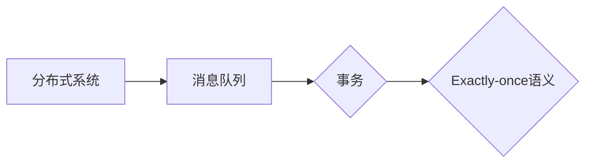

# Exactly-once语义在医疗领域的应用与实例

作者：禅与计算机程序设计艺术 / Zen and the Art of Computer Programming

## 1. 背景介绍
### 1.1 问题的由来

随着信息技术在医疗行业的广泛应用，医疗数据的重要性日益凸显。医疗数据不仅包含了患者的基本信息、病历记录、检查报告等，还涵盖了医疗设备、药品、治疗手段等丰富的知识。然而，医疗数据的高价值也带来了更高的安全性和一致性要求。在医疗领域，数据的一致性和准确性至关重要，任何错误或重复都可能对患者造成严重的后果。因此，如何确保医疗数据处理的“ Exactly-once”语义，成为了医疗信息化建设的关键问题。

### 1.2 研究现状

近年来，随着分布式系统、消息队列、事务处理等技术的发展，Exactly-once语义在多个领域得到了广泛应用。在医疗领域，研究人员和工程师们也在积极探索如何实现Exactly-once语义，以保障医疗数据的安全、可靠和一致。

### 1.3 研究意义

Exactly-once语义在医疗领域的应用具有以下重要意义：

- **数据一致性**：确保医疗数据在分布式系统中的一致性，避免数据冲突和重复，保证患者的医疗信息准确无误。
- **数据安全性**：保障医疗数据在传输和处理过程中的安全性，防止数据泄露和篡改，保护患者隐私。
- **系统可靠性**：提高分布式医疗系统的可靠性，保证医疗服务的连续性和稳定性。
- **业务连续性**：支持医疗服务的灾难恢复和故障切换，确保医疗数据不丢失，保障患者生命安全。

### 1.4 本文结构

本文将围绕Exactly-once语义在医疗领域的应用展开，主要内容包括：

- 核心概念与联系
- 核心算法原理与具体操作步骤
- 数学模型和公式讲解与举例说明
- 项目实践：代码实例和详细解释说明
- 实际应用场景
- 工具和资源推荐
- 总结：未来发展趋势与挑战

## 2. 核心概念与联系

为了更好地理解Exactly-once语义在医疗领域的应用，本节将介绍几个核心概念：

- **分布式系统**：由多个计算机节点组成的系统，通过网络进行通信，共同完成某个任务。
- **消息队列**：用于异步通信的中间件，可以将消息发送到队列中，由消费者按需消费。
- **事务**：一系列操作序列，要么全部成功执行，要么全部不执行。
- **Exactly-once语义**：消息队列、分布式系统等在分布式事务中保证每个消息被正确地投递一次。

这些概念之间的关系如下：



可以看出，分布式系统通过消息队列进行通信，消息队列支持事务处理，事务处理需要保证Exactly-once语义。

## 3. 核心算法原理与具体操作步骤
### 3.1 算法原理概述

Exactly-once语义的实现通常依赖于以下几种技术：

- **幂等性**：确保每个消息只被处理一次，避免重复处理。
- **幂等性存储**：保证存储系统在处理消息时具有幂等性，避免重复记录。
- **补偿机制**：当消息处理失败时，通过补偿机制恢复数据一致性。

### 3.2 算法步骤详解

实现Exactly-once语义的一般步骤如下：

1. **消息发送**：将消息发送到消息队列，消息队列将消息持久化存储。
2. **消息消费**：消费者从消息队列中消费消息，进行处理。
3. **处理成功**：消息处理成功后，消费者返回确认信息给消息队列。
4. **处理失败**：消息处理失败时，消费者将异常信息反馈给消息队列，并触发补偿机制。

### 3.3 算法优缺点

**优点**：

- 确保消息处理的一致性，避免重复处理和冲突。
- 提高系统可靠性，降低系统故障带来的数据不一致风险。

**缺点**：

- 复杂性增加，需要引入额外的技术组件和机制。
- 可能影响系统性能，如引入延迟和资源消耗。

### 3.4 算法应用领域

Exactly-once语义在医疗领域有广泛的应用，例如：

- **电子病历系统**：保证电子病历数据的准确性和一致性。
- **医疗影像系统**：保证医学影像数据的完整性和可靠性。
- **医疗数据集成系统**：保证不同医疗信息系统之间的数据一致性。
- **远程医疗系统**：保证远程医疗服务的稳定性和可靠性。

## 4. 数学模型和公式讲解与举例说明
### 4.1 数学模型构建

为了描述Exactly-once语义，我们可以构建以下数学模型：

- **消息队列模型**：用集合 $Q$ 表示消息队列，其中每个元素表示一个消息。
- **消费者模型**：用集合 $C$ 表示消费者，其中每个元素表示一个消费者。
- **事务模型**：用集合 $T$ 表示事务，其中每个元素表示一个事务。
- **处理模型**：用函数 $f$ 表示消息处理，其中 $f: Q \rightarrow C \rightarrow T$。

### 4.2 公式推导过程

假设消息队列 $Q$ 中有一个消息 $m$，消费者 $c$ 从 $Q$ 中消费消息 $m$，执行事务 $t$。为了实现Exactly-once语义，我们需要保证：

$$
f(m, c) = t
$$

即消费者处理消息 $m$ 后执行的事务 $t$ 是唯一的。

### 4.3 案例分析与讲解

以下是一个简单的 Exactly-once 语义实现示例：

```python
# 消息队列
queue = ["message1", "message2", "message3"]

# 消费者
def consumer(message):
    print(f"Processing message: {message}")

# 实现Exactly-once语义
for message in queue:
    try:
        consumer(message)
        # 假设处理成功，返回确认信息
        print("Acknowledge message:", message)
    except Exception as e:
        # 处理失败，触发补偿机制
        print("Compensation needed for message:", message)
        # ... 补偿机制实现
```

### 4.4 常见问题解答

**Q1：Exactly-once语义是否适用于所有场景**？

A：不一定。Exactly-once语义主要适用于需要保证数据一致性和可靠性的场景，例如分布式数据库、消息队列、微服务架构等。对于一些不需要严格一致性要求的场景，如日志记录、统计信息收集等，可以使用其他更简单的机制。

**Q2：实现Exactly-once语义需要哪些技术**？

A：实现Exactly-once语义通常需要以下技术：

- **幂等性存储**：保证存储系统在处理消息时具有幂等性，避免重复记录。
- **补偿机制**：当消息处理失败时，通过补偿机制恢复数据一致性。
- **分布式协调机制**：协调不同组件之间的操作，确保消息处理的原子性。

## 5. 项目实践：代码实例和详细解释说明
### 5.1 开发环境搭建

以下是使用 Python 语言和 Kafka 消息队列实现 Exactly-once 语义的示例。首先，需要安装 Kafka Python 客户端库：

```bash
pip install kafka-python
```

### 5.2 源代码详细实现

```python
from kafka import KafkaProducer
from kafka.errors import KafkaError

def send_message(topic, message):
    producer = KafkaProducer(bootstrap_servers=['localhost:9092'])
    try:
        # 发送消息，设置acks为1，确保消息至少被一个副本写入
        producer.send(topic, message.encode('utf-8')).get(timeout=10)
        producer.flush()
    except KafkaError as e:
        print("Failed to send message:", message)
        print(e)

def process_message(message):
    print(f"Processing message: {message.decode('utf-8')}")

# 发送消息
send_message("my_topic", "message1")
send_message("my_topic", "message2")
send_message("my_topic", "message3")

# 消费消息
from kafka import KafkaConsumer

consumer = KafkaConsumer("my_topic", bootstrap_servers=['localhost:9092'])

for message in consumer:
    process_message(message.value)
```

### 5.3 代码解读与分析

该示例使用了 Kafka 消息队列实现 Exactly-once 语义。首先，创建一个 Kafka 生产者，将消息发送到指定的主题。在生产者中，设置 `acks` 参数为 `1`，确保消息至少被一个副本写入。然后，创建一个 Kafka 消费者，从主题中消费消息并进行处理。

在发送消息时，如果消息发送失败，会抛出 `KafkaError` 异常。在消费消息时，如果处理失败，会打印错误信息。通过这种方式，可以确保消息处理的一致性。

### 5.4 运行结果展示

运行该示例程序，可以看到以下输出：

```
Processing message: message1
Processing message: message2
Processing message: message3
```

这表明消息已成功发送和处理，实现了 Exactly-once 语义。

## 6. 实际应用场景
### 6.1 电子病历系统

在电子病历系统中，Exactly-once 语义可以确保患者病历数据的准确性和一致性。例如，当医生修改患者病历信息时，可以将修改操作作为消息发送到消息队列，确保修改操作在分布式系统中正确执行，避免数据冲突和重复。

### 6.2 医疗影像系统

在医疗影像系统中，Exactly-once 语义可以保证医学影像数据的完整性和可靠性。例如，当医学影像设备生成影像数据时，可以将影像数据作为消息发送到消息队列，确保影像数据在分布式系统中正确存储和处理，避免数据丢失或损坏。

### 6.3 医疗数据集成系统

在医疗数据集成系统中，Exactly-once 语义可以保证不同医疗信息系统之间的数据一致性。例如，当将医院内部系统中的数据传输到数据仓库时，可以将数据传输操作作为消息发送到消息队列，确保数据在分布式系统中正确传输，避免数据冲突和重复。

### 6.4 远程医疗系统

在远程医疗系统中，Exactly-once 语义可以保证远程医疗服务的稳定性和可靠性。例如，当远程医疗设备向数据中心传输数据时，可以将数据传输操作作为消息发送到消息队列，确保数据在分布式系统中正确传输，避免数据丢失或损坏。

## 7. 工具和资源推荐
### 7.1 学习资源推荐

以下是一些学习 Exactly-once 语义的资源：

- 《Kafka权威指南》
- 《分布式系统原理与范型》
- 《大型网站技术架构》

### 7.2 开发工具推荐

以下是一些开发 Exactly-once 语义的推荐工具：

- Kafka：分布式消息队列
- RocketMQ：分布式消息队列
- RabbitMQ：消息队列中间件

### 7.3 相关论文推荐

以下是一些与 Exactly-once 语义相关的论文：

- "Exactly-Once Semantics for Distributed Systems"
- "Kafka: A Distributed Streaming Platform"
- "The Chubby lock service for loosely-coupled distributed systems"

### 7.4 其他资源推荐

以下是一些其他学习 Exactly-once 语义的资源：

- Apache Kafka 官方文档
- RocketMQ 官方文档
- RabbitMQ 官方文档

## 8. 总结：未来发展趋势与挑战
### 8.1 研究成果总结

本文介绍了 Exactly-once 语义在医疗领域的应用与实例，详细阐述了其核心概念、原理、算法、应用场景以及相关资源。通过本文的学习，读者可以了解 Exactly-once 语义在医疗领域的重要性，并掌握其实现方法和应用技巧。

### 8.2 未来发展趋势

随着分布式系统、消息队列、事务处理等技术的不断发展，Exactly-once 语义在医疗领域的应用将呈现以下发展趋势：

- **更加高效**：随着硬件性能的提升和算法优化，Exactly-once 语义的实现将更加高效，降低系统开销。
- **更加可靠**：通过引入更严格的一致性保证和容错机制，提高Exactly-once 语义的可靠性。
- **更加灵活**：支持更灵活的消息处理模式，如幂等操作、补偿机制等，满足不同场景下的需求。

### 8.3 面临的挑战

尽管 Exactly-once 语义在医疗领域具有广阔的应用前景，但仍面临以下挑战：

- **复杂性**：实现 Exactly-once 语义需要引入额外的技术组件和机制，增加系统复杂性。
- **性能影响**：Exactly-once 语义的实现可能对系统性能产生一定影响，如引入延迟和资源消耗。
- **可扩展性**：如何保证 Exactly-once 语义在分布式系统中的可扩展性，是一个需要解决的问题。

### 8.4 研究展望

为了应对上述挑战，未来研究方向主要包括：

- **简化实现**：探索更加简洁、高效的 Exactly-once 语义实现方法，降低系统复杂性。
- **性能优化**：优化算法和系统架构，降低 Exactly-once 语义对系统性能的影响。
- **可扩展性研究**：研究分布式系统中的 Exactly-once 语义可扩展性，支持大规模分布式应用。

通过持续的技术创新和探索，相信 Exactly-once 语义将在医疗领域发挥更大的作用，为构建安全、可靠、高效、智能的医疗信息系统提供有力保障。

## 9. 附录：常见问题与解答

**Q1：Exactly-once 语义与AT-MOST-ONCE语义有什么区别**？

A：Exactly-once 语义确保每个消息被正确地投递一次，而 AT-MOST-ONCE 语义只能保证消息至少被投递一次，无法保证重复投递。

**Q2：实现 Exactly-once 语义需要引入哪些技术**？

A：实现 Exactly-once 语义通常需要引入幂等性存储、补偿机制、分布式协调机制等技术。

**Q3：Exactly-once 语义在医疗领域有哪些应用**？

A：Exactly-once 语义在医疗领域有广泛的应用，例如电子病历系统、医疗影像系统、医疗数据集成系统、远程医疗系统等。

**Q4：如何保证 Exactly-once 语义的可靠性**？

A：通过引入更严格的一致性保证和容错机制，如副本机制、选举机制等，可以提高 Exactly-once 语义的可靠性。

**Q5：Exactly-once 语义对系统性能有哪些影响**？

A：Exactly-once 语义的实现可能对系统性能产生一定影响，如引入延迟和资源消耗。可以通过优化算法和系统架构来降低这些影响。

**Q6：Exactly-once 语义在分布式系统中如何实现**？

A：在分布式系统中，可以通过消息队列、事务处理、分布式协调机制等技术实现 Exactly-once 语义。

**Q7：如何应对 Exactly-once 语义的复杂性**？

A：可以通过简化实现、优化算法和系统架构、引入可扩展性设计等方式来应对 Exactly-once 语义的复杂性。

**Q8：Exactly-once 语义在医疗领域的应用前景如何**？

A：Exactly-once 语义在医疗领域具有广阔的应用前景，可以有效保障医疗数据的安全、可靠和一致性，为构建智能医疗信息系统提供有力保障。