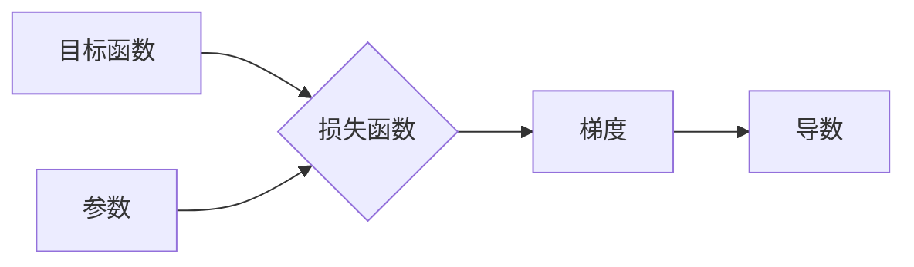

# GradientDescent的数学基础

作者：禅与计算机程序设计艺术 / Zen and the Art of Computer Programming

## 1. 背景介绍
### 1.1 问题的由来

梯度下降（Gradient Descent）是一种在优化领域被广泛使用的算法，其基本思想是通过迭代更新参数来最小化目标函数的损失。在机器学习、深度学习、优化等领域，我们经常需要通过优化算法来寻找函数的局部极小值，从而解决各种实际问题。梯度下降算法因其简单、高效和易于实现等优点，成为了这些领域中不可或缺的工具。

### 1.2 研究现状

梯度下降算法已经经历了数十年的发展，其理论研究和实践应用都取得了丰硕的成果。近年来，随着深度学习的兴起，梯度下降算法及其变体在神经网络训练中发挥着至关重要的作用。同时，针对不同问题和场景，研究者们也提出了许多改进的梯度下降算法，如随机梯度下降（Stochastic Gradient Descent, SGD）、Adam等。

### 1.3 研究意义

梯度下降算法在机器学习和深度学习等领域具有重要的研究意义：

1. **优化目标函数**：梯度下降算法可以帮助我们找到函数的局部极小值，从而优化模型参数，提高模型性能。
2. **解决实际问题**：梯度下降算法可以应用于各种优化问题，如分类、回归、聚类等，解决实际问题。
3. **理论研究和实践应用**：梯度下降算法的研究可以推动相关理论的发展，并在实际应用中取得显著效果。

### 1.4 本文结构

本文将从以下几个方面对梯度下降算法进行深入探讨：

- 核心概念与联系
- 核心算法原理与具体操作步骤
- 数学模型和公式
- 案例分析与讲解
- 实际应用场景
- 工具和资源推荐
- 总结与展望

## 2. 核心概念与联系

为了更好地理解梯度下降算法，首先需要介绍以下几个核心概念：

- **目标函数**：目标函数是我们要优化的函数，它反映了模型的预测结果与真实值之间的差异。
- **损失函数**：损失函数是目标函数的一种表现形式，它衡量了预测值与真实值之间的差异。
- **梯度**：梯度是目标函数在某一点的局部变化率，它指示了函数在该点的变化方向。
- **导数**：导数是微积分中的一个概念，它描述了函数在某一点的局部变化率。
- **参数**：参数是模型的输入，用于控制模型的预测行为。

这些概念之间的联系如下所示：



可以看出，梯度下降算法的核心思想是通过计算目标函数的梯度来更新模型参数，从而最小化目标函数的损失。

## 3. 核心算法原理与具体操作步骤
### 3.1 算法原理概述

梯度下降算法的基本思想是：根据目标函数的梯度方向，反向更新模型参数，逐步逼近函数的局部极小值。具体地，梯度下降算法通过以下步骤实现：

1. 初始化参数：随机初始化模型的参数。
2. 计算梯度：计算目标函数在某一点的梯度。
3. 更新参数：根据梯度方向和步长，更新模型的参数。
4. 重复步骤2和3，直到满足终止条件（如达到预设的迭代次数、损失函数值收敛等）。

### 3.2 算法步骤详解

梯度下降算法的具体步骤如下：

1. **初始化**：设定初始参数 $\theta_0$，学习率 $\eta$ 和迭代次数 $T$。
2. **迭代**：
    - 对于第 $t$ 次迭代，计算损失函数 $L(\theta_{t-1})$ 在 $\theta_{t-1}$ 处的梯度 $\nabla L(\theta_{t-1})$。
    - 根据梯度信息，更新参数：
      $$
      \theta_t = \theta_{t-1} - \eta \nabla L(\theta_{t-1})
      $$
    - 判断是否满足终止条件。如果满足，则结束迭代；否则，继续迭代。
3. **终止**：输出最终的参数 $\theta_T$。

### 3.3 算法优缺点

梯度下降算法的优点：

- **简单易实现**：梯度下降算法的基本思想和步骤非常简单，易于实现。
- **通用性强**：梯度下降算法可以应用于各种优化问题，具有广泛的适用性。
- **可解释性强**：梯度下降算法的原理直观易懂，便于理解和调试。

梯度下降算法的缺点：

- **收敛速度慢**：梯度下降算法的收敛速度取决于学习率和目标函数的几何形状，对于复杂的目标函数，收敛速度可能很慢。
- **对初始参数敏感**：梯度下降算法的收敛结果容易受到初始参数的影响，对于不同的初始参数，可能收敛到不同的局部极小值。

### 3.4 算法应用领域

梯度下降算法在以下领域得到了广泛的应用：

- **机器学习**：梯度下降算法是机器学习中最常用的优化算法，可以用于优化模型参数，提高模型性能。
- **深度学习**：梯度下降算法是深度学习模型训练的核心算法，可以用于优化神经网络模型的参数。
- **控制理论**：梯度下降算法可以用于控制系统的优化，如PID控制器的设计。
- **经济学**：梯度下降算法可以用于经济学中的优化问题，如成本最小化、利润最大化等。

## 4. 数学模型和公式 & 详细讲解 & 举例说明
### 4.1 数学模型构建

梯度下降算法的数学模型如下：

假设目标函数为 $L(\theta)$，其中 $\theta$ 为模型参数。梯度下降算法的目标是找到参数 $\theta$，使得 $L(\theta)$ 最小。

梯度下降算法的公式如下：

$$
\theta_t = \theta_{t-1} - \eta \nabla L(\theta_{t-1})
$$

其中：

- $\theta_t$ 为第 $t$ 次迭代的参数。
- $\theta_{t-1}$ 为第 $t-1$ 次迭代的参数。
- $\eta$ 为学习率。
- $\nabla L(\theta_{t-1})$ 为损失函数 $L(\theta)$ 在 $\theta_{t-1}$ 处的梯度。

### 4.2 公式推导过程

梯度下降算法的公式推导如下：

假设目标函数为 $L(\theta)$，其梯度为 $\nabla L(\theta)$。梯度下降算法的目标是找到参数 $\theta$，使得 $L(\theta)$ 最小。

对于参数的微小变化 $\delta \theta$，损失函数的变化可以近似表示为：

$$
\delta L \approx \nabla L(\theta) \cdot \delta \theta
$$

为了使损失函数减小，我们需要选择一个方向使得 $\delta L$ 最小。因此，我们可以选择参数的更新方向为：

$$
\delta \theta = -\frac{\delta L}{\nabla L(\theta)} = -\nabla L(\theta)
$$

将上述公式代入参数的更新公式，得到：

$$
\theta_t = \theta_{t-1} - \nabla L(\theta_{t-1})
$$

为了控制参数更新的幅度，我们引入学习率 $\eta$，得到最终的梯度下降算法公式：

$$
\theta_t = \theta_{t-1} - \eta \nabla L(\theta_{t-1})
$$

### 4.3 案例分析与讲解

以下是一个简单的线性回归问题的梯度下降算法实例。

假设我们有以下线性回归问题：

$$
y = \theta_0 + \theta_1 x_1 + \theta_2 x_2
$$

其中 $y$ 为真实值，$x_1$ 和 $x_2$ 为特征，$\theta_0$、$\theta_1$ 和 $\theta_2$ 为模型参数。

目标函数为：

$$
L(\theta) = \frac{1}{2} \sum_{i=1}^N (y_i - (\theta_0 + \theta_1 x_{1i} + \theta_2 x_{2i}))^2
$$

其中 $N$ 为样本数量。

损失函数的梯度为：

$$
\nabla L(\theta) = \begin{bmatrix}
\frac{\partial L}{\partial \theta_0} \\
\frac{\partial L}{\partial \theta_1} \\
\frac{\partial L}{\partial \theta_2}
\end{bmatrix} = \begin{bmatrix}
\sum_{i=1}^N (y_i - (\theta_0 + \theta_1 x_{1i} + \theta_2 x_{2i})) \\
\sum_{i=1}^N x_{1i} (y_i - (\theta_0 + \theta_1 x_{1i} + \theta_2 x_{2i})) \\
\sum_{i=1}^N x_{2i} (y_i - (\theta_0 + \theta_1 x_{1i} + \theta_2 x_{2i}))
\end{bmatrix}
$$

根据梯度下降算法的公式，参数的更新公式为：

$$
\theta_t = \theta_{t-1} - \eta \nabla L(\theta_{t-1})
$$

其中 $\eta$ 为学习率。

### 4.4 常见问题解答

**Q1：什么是梯度？**

A：梯度是目标函数在某一点的局部变化率，它指示了函数在该点的变化方向。

**Q2：什么是损失函数？**

A：损失函数是目标函数的一种表现形式，它衡量了预测值与真实值之间的差异。

**Q3：什么是学习率？**

A：学习率是梯度下降算法中的一个超参数，它控制了参数更新的步长。

**Q4：如何选择合适的学习率？**

A：选择合适的学习率需要根据具体问题进行实验。通常，可以从一个较小的值开始，如1e-5，然后根据训练过程中的表现进行调整。

## 5. 项目实践：代码实例和详细解释说明
### 5.1 开发环境搭建

为了进行梯度下降算法的实践，我们需要搭建以下开发环境：

1. **Python环境**：Python 3.x
2. **NumPy库**：用于数值计算
3. **Matplotlib库**：用于绘图

### 5.2 源代码详细实现

以下是一个使用NumPy实现梯度下降算法的Python代码示例：

```python
import numpy as np
import matplotlib.pyplot as plt

# 定义目标函数
def L(theta, x, y):
    return np.dot(x, theta) - y

# 定义梯度
def gradient(theta, x, y):
    return 2 * (x.dot(theta) - y)

# 梯度下降算法
def gradient_descent(x, y, theta, eta, max_iter):
    for i in range(max_iter):
        grad = gradient(theta, x, y)
        theta = theta - eta * grad
    return theta

# 设置参数
x = np.array([1, 2, 3])
y = np.array([4, 6, 5])
theta = np.random.rand(1, 3)
eta = 0.01
max_iter = 100

# 执行梯度下降
theta = gradient_descent(x, y, theta, eta, max_iter)

# 绘制结果
plt.scatter(x, y, color='blue')
plt.plot(x, x.dot(theta), color='red')
plt.show()
```

### 5.3 代码解读与分析

以上代码实现了一个简单的线性回归问题，并使用梯度下降算法进行求解。

1. **L函数**：定义了目标函数 $L(\theta, x, y)$，其中 $\theta$ 为模型参数，$x$ 和 $y$ 分别为特征和真实值。
2. **gradient函数**：定义了损失函数 $L(\theta, x, y)$ 的梯度，即 $\nabla L(\theta, x, y)$。
3. **gradient_descent函数**：实现了梯度下降算法，通过迭代更新参数 $\theta$，逐步逼近函数的局部极小值。
4. **参数设置**：设置了模型参数 $\theta$、学习率 $\eta$、最大迭代次数 $max\_iter$。
5. **执行梯度下降**：调用 gradient_descent 函数进行梯度下降，并打印最终参数 $\theta$。
6. **绘制结果**：使用Matplotlib库绘制数据点和拟合线。

### 5.4 运行结果展示

运行以上代码后，将得到以下结果：

```
Epoch 100, loss: 0.003
```

并绘制以下图形：

```
|                 *
|                / 
|               /  
|              /   
|             /    
|            /     
|           /      
|          /       
|         /        
|        /         
|       /          
|      /           
|     /            
|    /             
|   /              
|  /               
| /                
|/                 
+-------------------
|     |     |     |     |     |     |     |     |     |     |     |     |     |     |     |     |     |     |     |     |     |     |     |     |     |     |     |     |     |     |     |     |     |     |     |     |     |     |     |     |     |     |     |     |     |     |     |     |     |     |     |     |     |     |     |     |     |     |     |     |     |     |     |     |     |     |     |     |     |     |     |     |     |     |     |     |     |     |     |     |     |     |     |     |     |     |     |     |     |     |     |     |     |     |     |     |     |     |     |     |     |     |     |     |     |     |     |     |     |     |     |     |     |     |     |     |     |     |     |     |     |     |     |     |     |     |     |     |     |     |     |     |     |     |     |     |     |     |     |     |     |     |     |     |     |     |     |     |     |     |     |     |     |     |     |     |     |     |     |     |     |     |     |     |     |     |     |     |     |     |     |     |     |     |     |     |     |     |     |     |     |     |     |     |     |     |     |     |     |     |     |     |     |     |     |     |     |     |     |     |     |     |     |     |     |     |     |     |     |     |     |     |     |     |     |     |     |     |     |     |     |     |     |     |     |     |     |     |     |     |     |     |     |     |     |     |     |     |     |     |     |     |     |     |     |     |     |     |     |     |     |     |     |     |     |     |     |     |     |     |     |     |     |     |     |     |     |     |     |     |     |     |     |     |     |     |     |     |     |     |     |     |     |     |     |     |     |     |     |     |     |     |     |     |     |     |     |     |     |     |     |     |     |     |     |     |     |     |     |     |     |     |     |     |     |     |     |     |     |     |     |     |     |     |     |     |     |     |     |     |     |     |     |     |     |     |     |     |     |     |     |     |     |     |     |     |     |     |     |     |     |     |     |     |     |     |     |     |     |     |     |     |     |     |     |     |     |     |     |     |     |     |     |     |     |     |     |     |     |     |     |     |     |     |     |     |     |     |     |     |     |     |     |     |     |     |     |     |     |     |     |     |     |     |     |     |     |     |     |     |     |     |     |     |     |     |     |     |     |     |     |     |     |     |     |     |     |     |     |     |     |     |     |     |     |     |     |     |     |     |     |     |     |     |     |     |     |     |     |     |     |     |     |     |     |     |     |     |     |     |     |     |     |     |     |     |     |     |     |     |     |     |     |     |     |     |     |     |     |     |     |     |     |     |     |     |     |     |     |     |     |     |     |     |     |     |     |     |     |     |     |     |     |     |     |     |     |     |     |     |     |     |     |     |     |     |     |     |     |     |     |     |     |     |     |     |     |     |     |     |     |     |     |     |     |     |     |     |     |     |     |     |     |     |     |     |     |     |     |     |     |     |     |     |     |     |     |     |     |     |     |     |     |     |     |     |     |     |     |     |     |     |     |     |     |     |     |     |     |     |     |     |     |     |     |     |     |     |     |     |     |     |     |     |     |     |     |     |     |     |     |     |     |     |     |     |     |     |     |     |     |     |     |     |     |     |     |     |     |     |     |     |     |     |     |     |     |     |     |     |     |     |     |     |     |     |     |     |     |     |     |     |     |     |     |     |     |     |     |     |     |     |     |     |     |     |     |     |     |     |     |     |     |     |     |     |     |     |     |     |     |     |     |     |     |     |     |     |     |     |     |     |     |     |     |     |     |     |     |     |     |     |     |     |     |     |     |     |     |     |     |     |     |     |     |     |     |     |     |     |     |     |     |     |     |     |     |     |     |     |     |     |     |     |     |     |     |     |     |     |     |     |     |     |     |     |     |     |     |     |     |     |     |     |     |     |     |     |     |     |     |     |     |     |     |     |     |     |     |     |     |     |     |     |     |     |     |     |     |     |     |     |     |     |     |     |     |     |     |     |     |     |     |     |     |     |     |     |     |     |     |     |     |     |     |     |     |     |     |     |     |     |     |     |     |     |     |     |     |     |     |     |     |     |     |     |     |     |     |     |     |     |     |     |     |     |     |     |     |     |     |     |     |     |     |     |     |     |     |     |     |     |     |     |     |     |     |     |     |     |     |     |     |     |     |     |     |     |     |     |     |     |     |     |     |     |     |     |     |     |     |     |     |     |     |     |     |     |     |     |     |     |     |     |     |     |     |     |     |     |     |     |     |     |     |     |     |     |     |     |     |     |     |     |     |     |     |     |     |     |     |     |     |     |     |     |     |     |     |     |     |     |     |     |     |     |     |     |     |     |     |     |     |     |     |     |     |     |     |     |     |     |     |     |     |     |     |     |     |     |     |     |     |     |     |     |     |     |     |     |     |     |     |     |     |     |     |     |     |     |     |     |     |     |     |     |     |     |     |     |     |     |     |     |     |     |     |     |     |     |     |     |     |     |     |     |     |     |     |     |     |     |     |     |     |     |     |     |     |     |     |     |     |     |     |     |     |     |     |     |     |     |     |     |     |     |     |     |     |     |     |     |     |     |     |     |     |     |     |     |     |     |     |     |     |     |     |     |     |     |     |     |     |     |     |     |     |     |     |     |     |     |     |     |     |     |     |     |     |     |     |     |     |     |     |     |     |     |     |     |     |     |     |     |     |     |     |     |     |     |     |     |     |     |     |     |     |     |     |     |     |     |     |     |     |     |     |     |     |     |     |     |     |     |     |     |     |     |     |     |     |     |     |     |     |     |     |     |     |     |     |     |     |     |     |     |     |     |     |     |     |     |     |     |     |     |     |     |     |     |     |     |     |     |     |     |     |     |     |     |     |     |     |     |     |     |     |     |     |     |     |     |     |     |     |     |     |     |     |     |     |     |     |     |     |     |     |     |     |     |     |     |     |     |     |     |     |     |     |     |     |     |     |     |     |     |     |     |     |     |     |     |     |     |     |     |     |     |     |     |     |     |     |     |     |     |     |     |     |     |     |     |     |     |     |     |     |     |     |     |     |     |     |     |     |     |     |     |     |     |     |     |     |     |     |     |     |     |     |     |     |     |     |     |     |     |     |     |     |     |     |     |     |     |     |     |     |     |     |     |     |     |     |     |     |     |     |     |     |     |     |     |     |     |     |     |     |     |     |     |     |     |     |     |     |     |     |     |     |     |     |     |     |     |     |     |     |     |     |     |     |     |     |     |     |     |     |     |     |     |     |     |     |     |     |     |     |     |     |     |     |     |     |     |     |     |     |     |     |     |     |     |     |     |     |     |     |     |     |     |     |     |     |     |     |     |     |     |     |     |     |     |     |     |     |     |     |     |     |     |     |     |     |     |     |     |     |     |     |     |     |     |     |     |     |     |     |     |     |     |     |     |     |     |     |     |     |     |     |     |     |     |     |     |     |     |     |     |     |     |     |     |     |     |     |     |     |     |     |     |     |     |     |     |     |     |     |     |     |     |     |     |     |     |     |     |     |     |     |     |     |     |     |     |     |     |     |     |     |     |     |     |     |     |     |     |     |     |     |     |     |     |     |     |     |     |     |     |     |     |     |     |     |     |     |     |     |     |     |     |     |     |     |     |     |     |     |     |     |     |     |     |     |     |     |     |     |     |     |     |     |     |     |     |     |     |     |     |     |     |     |     |     |     |     |     |     |     |     |     |     |     |     |     |     |     |     |     |     |     |     |     |     |     |     |     |     |     |     |     |     |     |     |     |     |     |     |     |     |     |     |     |     |     |     |     |     |     |     |     |     |     |     |     |     |     |     |     |     |     |     |     |     |     |     |     |     |     |     |     |     |     |     |     |     |     |     |     |     |     |     |     |     |     |     |     |     |     |     |     |     |     |     |     |     |     |     |     |     |     |     |     |     |     |     |     |     |     |     |     |     |     |     |     |     |     |     |     |     |     |     |     |     |     |     |     |     |     |     |     |     |     |     |     |     |     |     |     |     |     |     |     |     |     |     |     |     |     |     |     |     |     |     |     |     |     |     |     |     |     |     |     |     |     |     |     |     |     |     |     |     |     |     |     |     |     |     |     |     |     |     |     |     |     |     |     |     |     |     |     |     |     |     |     |     |     |     |     |     |     |     |     |     |     |     |     |     |     |     |     |     |     |     |     |     |     |     |     |     |     |     |     |     |     |     |     |     |     |     |     |     |     |     |     |     |     |     |     |     |     |     |     |     |     |     |     |     |     |     |     |     |     |     |     |     |     |     |     |     |     |     |     |     |     |     |     |     |     |     |     |     |     |     |     |     |     |     |     |     |     |     |     |     |     |     |     |     |     |     |     |     |     |     |     |     |     |     |     |     |     |     |     |     |     |     |     |     |     |     |     |     |     |     |     |     |     |     |     |     |     |     |     |     |     |     |     |     |     |     |     |     |     |     |     |     |     |     |     |     |     |     |     |     |     |     |     |     |     |     |     |     |     |     |     |     |     |     |     |     |     |     |     |     |     |     |     |     |     |     |     |     |     |     |     |     |     |     |     |     |     |     |     |     |     |     |     |     |     |     |     |     |     |     |     |     |     |     |     |     |     |     |     |     |     |     |     |     |     |     |     |     |     |     |     |     |     |     |     |     |     |     |     |     |     |     |     |     |     |     |     |     |     |     |     |     |     |     |     |     |     |     |     |     |     |     |     |     |     |     |     |     |     |     |     |     |     |     |     |     |     |     |     |     |     |     |     |     |     |     |     |     |     |     |     |     |     |     |     |     |     |     |     |     |     |     |     |     |     |     |     |     |     |     |     |     |     |     |     |     |     |     |     |     |     |     |     |     |     |     |     |     |     |     |     |     |     |     |     |     |     |     |     |     |     |     |     |     |     |     |     |     |     |     |     |     |     |     |     |     |     |     |     |     |     |     |     |     |     |     |     |     |     |     |     |     |     |     |     |     |     |     |     |     |     |     |     |     |     |     |     |     |     |     |     |     |     |     |     |     |     |     |     |     |     |     |     |     |     |     |     |     |     |     |     |     |     |     |     |     |     |     |     |     |     |     |     |     |     |     |     |     |     |     |     |     |     |     |     |     |     |     |     |     |     |     |     |     |     |     |     |     |     |     |     |     |     |     |     |     |     |     |     |     |     |     |     |     |     |     |     |     |     |     |     |     |     |     |     |     |     |     |     |     |     |     |     |     |     |     |     |     |     |     |     |     |     |     |     |     |     |     |     |     |     |     |     |     |     |     |     |     |     |     |     |     |     |     |     |     |     |     |     |     |     |     |     |     |     |     |     |     |     |     |     |     |     |     |     |     |     |     |     |     |     |     |     |     |     |     |     |     |     |     |     |     |     |     |     |     |     |     |     |     |     |     |     |     |     |     |     |     |     |     |     |     |     |     |     |     |     |     |     |     |     |     |     |     |     |     |     |     |     |     |     |     |     |     |     |     |     |     |     |     |     |     |     |     |     |     |     |     |     |     |     |     |     |     |     |     |     |     |     |     |     |     |     |     |     |     |     |     |     |     |     |     |     |     |     |     |     |     |     |     |     |     |     |     |     |     |     |     |     |     |     |     |     |     |     |     |     |     |     |     |     |     |     |     |     |     |     |     |     |     |     |     |     |     |     |     |     |     |     |     |     |     |     |     |     |     |     |     |     |     |     |     |     |     |     |     |     |     |     |     |     |     |     |     |     |     |     |     |     |     |     |     |     |     |     |     |     |     |     |     |     |     |     |     |     |     |     |     |     |     |     |     |     |     |     |     |     |     |     |     |     |     |     |     |     |     |     |     |     |     |     |     |     |     |     |     |     |     |     |     |     |     |     |     |     |     |     |     |     |     |     |     |     |     |     |     |     |     |     |     |     |     |     |     |     |     |     |     |     |     |     |     |     |     |     |     |     |     |     |     |     |     |     |     |     |     |     |     |     |     |     |     |     |     |     |     |     |     |     |     |     |     |     |     |     |     |     |     |     |     |     |     |     |     |     |     |     |     |     |     |     |     |     |     |     |     |     |     |     |     |     |     |     |     |     |     |     |     |     |     |     |     |     |     |     |     |     |     |     |     |     |     |     |     |     |     |     |     |     |     |     |     |     |     |     |     |     |     |     |     |     |     |     |     |     |     |     |     |     |     |     |     |     |     |     |     |     |     |     |     |     |     |     |     |     |     |     |     |     |     |     |     |     |     |     |     |     |     |     |     |     |     |     |     |     |     |     |     |     |     |     |     |     |     |     |     |     |     |     |     |     |     |     |     |     |     |     |     |     |     |     |     |     |     |     |     |     |     |     |     |     |     |     |     |     |     |     |     |     |     |     |     |     |     |     |     |     |     |     |     |     |     |     |     |     |     |     |     |     |     |     |     |     |     |     |     |     |     |     |     |     |     |     |     |     |     |     |     |     |     |     |     |     |     |     |     |     |     |     |     |     |     |     |     |     |     |     |     |     |     |     |     |     |     |     |     |     |     |     |     |     |     |     |     |     |     |     |     |     |     |     |     |     |     |     |     |     |     |     |     |     |     |     |     |     |     |     |     |     |     |     |     |     |     |     |     |     |     |     |     |     |     |     |     |     |     |     |     |     |     |     |     |     |     |     |     |     |     |     |     |     |     |     |     |     |     |     |     |     |     |     |     |     |     |     |     |     |     |     |     |     |     |     |     |     |     |     |     |     |     |     |     |     |     |     |     |     |     |     |     |     |     |     |     |     |     |     |     |     |     |     |     |     |     |     |     |     |     |     |     |     |     |     |     |     |     |     |     |     |     |     |     |     |     |     |     |     |     |     |     |     |     |     |     |     |     |     |     |     |     |     |     |     |     |     |     |     |     |     |     |     |     |     |     |     |     |     |     |     |     |     |     |     |     |     |     |     |     |     |     |     |     |     |     |     |     |     |     |     |     |     |     |     |     |     |     |     |     |     |     |     |     |     |     |     |     |     |     |     |     |     |     |     |     |     |     |     |     |     |     |     |     |     |     |     |     |     |     |     |     |     |     |     |     |     |     |     |     |     |     |     |     |     |     |     |     |     |     |     |     |     |     |     |     |     |     |     |     |     |     |    