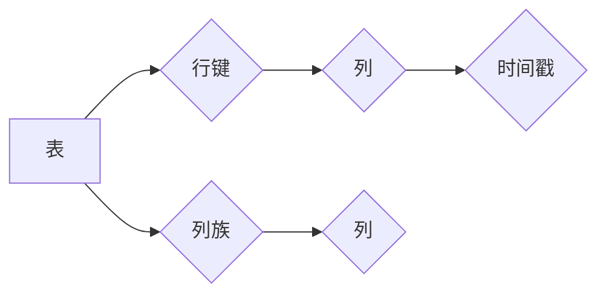

# HBase原理与代码实例讲解

作者：禅与计算机程序设计艺术 / Zen and the Art of Computer Programming

## 1. 背景介绍

### 1.1 问题的由来

随着大数据时代的到来，如何高效存储和处理海量数据成为了一个重要课题。传统的关系型数据库在处理大规模数据时，往往会遇到性能瓶颈，而分布式数据库则成为了解决这一问题的有效方案。HBase作为Apache Hadoop生态系统中的一个重要组件，以其高可靠性、高性能和可扩展性等特点，在分布式存储领域有着广泛的应用。

### 1.2 研究现状

HBase自2008年开源以来，已经发展成为一个功能完善、性能卓越的分布式数据库。经过多年的发展，HBase在业界得到了广泛的认可，并在多个领域得到应用。本文旨在深入解析HBase的原理，并结合代码实例，帮助读者全面理解HBase的工作机制。

### 1.3 研究意义

研究HBase的原理对于以下方面具有重要意义：

1. **理解分布式数据库设计**：HBase的设计理念和技术细节可以为其他分布式数据库的设计提供参考。
2. **提升系统性能**：深入了解HBase的原理，可以帮助开发者优化系统性能，提高数据处理的效率。
3. **解决大数据存储问题**：HBase为处理海量数据提供了一种有效方案，有助于解决大数据存储问题。

### 1.4 本文结构

本文将分为以下几个部分：

1. 介绍HBase的核心概念和架构。
2. 阐述HBase的算法原理和操作步骤。
3. 通过代码实例讲解HBase的常用操作。
4. 分析HBase的实际应用场景和未来发展趋势。
5. 总结HBase的研究成果和挑战，并对未来研究方向进行展望。

## 2. 核心概念与联系

### 2.1 核心概念

HBase的核心概念包括：

1. **表（Table）**：HBase中的数据以表的形式组织，每个表由行键（Row Key）、列族（Column Family）和列（Column）组成。
2. **行键（Row Key）**：行键是每条记录的唯一标识符，用于区分不同的记录。
3. **列族（Column Family）**：列族是一组相关列的集合，用于组织列。
4. **列（Column）**：列是存储数据的单元，由列族名和列限定符组成。
5. **时间戳（Timestamp）**：时间戳表示数据的版本号，用于存储相同列族和列的数据的不同版本。

### 2.2 核心联系

HBase的各个核心概念之间存在着紧密的联系，如下所示：



## 3. 核心算法原理 & 具体操作步骤

### 3.1 算法原理概述

HBase采用分布式存储架构，其核心算法原理如下：

1. **数据分片（Sharding）**：将数据按照行键进行分片，分布到不同的Region中，实现分布式存储。
2. **Region分配（Region Assignment）**：根据数据访问模式，将Region分配到不同的服务器上，实现负载均衡。
3. **数据存储（Data Storage）**：使用HFile格式存储数据，提高数据读写效率。
4. **数据访问（Data Access）**：通过HBase客户端访问数据，实现数据的查询、更新、删除等操作。

### 3.2 算法步骤详解

以下是HBase数据写入的详细步骤：

1. **确定Region**：根据行键确定数据所属的Region。
2. **确定列族**：确定数据所属的列族。
3. **确定列**：确定数据所属的列。
4. **写入数据**：将数据写入HBase的内存缓存。
5. **持久化数据**：将内存缓存中的数据写入HFile文件，并存储到磁盘。
6. **Region分裂**：当Region数据量过大时，进行Region分裂，将数据均匀分配到新的Region中。

### 3.3 算法优缺点

HBase的算法具有以下优点：

1. **高可靠性**：HBase采用分布式存储架构，具有高可靠性。
2. **高性能**：HBase采用HFile格式存储数据，具有高性能。
3. **可扩展性**：HBase支持水平扩展，可扩展性良好。

HBase的算法也存在以下缺点：

1. **写操作性能较差**：HBase的写操作性能较差，因为写操作需要经过多个步骤才能完成。
2. **存储空间利用率较低**：HBase的存储空间利用率较低，因为数据以行键进行分片，导致相同列族和列的数据分散存储。

### 3.4 算法应用领域

HBase的应用领域包括：

1. **大数据日志存储**：HBase可以用于存储和分析大规模的日志数据，如Web日志、服务器日志等。
2. **物联网数据存储**：HBase可以用于存储物联网设备产生的海量数据。
3. **社交网络数据存储**：HBase可以用于存储社交网络用户数据、关系数据等。
4. **电子商务数据存储**：HBase可以用于存储电子商务平台的海量商品数据、交易数据等。

## 4. 数学模型和公式 & 详细讲解 & 举例说明

### 4.1 数学模型构建

HBase的数学模型主要包括以下部分：

1. **Region分配模型**：根据行键和Region信息，确定数据所属的Region。
2. **数据存储模型**：使用HFile格式存储数据。
3. **数据访问模型**：通过HBase客户端访问数据。

### 4.2 公式推导过程

以下是Region分配模型的公式推导过程：

```mermaid
graph LR
    A[行键] --> B{Hash(A)}
    B --> C[Region信息]
    C --> D[确定Region]
```

### 4.3 案例分析与讲解

以下是一个HBase数据写入的案例：

```java
// 创建表
HTableDescriptor tableDesc = new HTableDescriptor(TableName.valueOf("test"));
tableDesc.addFamily(new HColumnDescriptor("cf"));
HTable table = new HTable(getConfiguration(), tableDesc);

// 写入数据
Put put = new Put(Bytes.toBytes("row1"));
put.add(Bytes.toBytes("cf"), Bytes.toBytes("col1"), Bytes.toBytes("value1"));
table.put(put);

// 关闭表
table.close();
```

### 4.4 常见问题解答

**Q1：HBase的写入性能如何提升？**

A：HBase的写入性能可以通过以下方法提升：

1. **批量写入**：使用批量写入操作可以减少网络传输和数据写入的开销。
2. **压缩数据**：使用HFile压缩可以提高数据写入和读取效率。
3. **并行写入**：通过并行写入操作可以提高写入速度。

**Q2：HBase的数据存储格式是什么？**

A：HBase使用HFile格式存储数据。HFile是一种二进制格式，可以高效地存储和读取数据。

**Q3：HBase的Region如何分裂？**

A：HBase的Region分裂是通过RegionServer端进行的。当Region数据量过大时，RegionServer会根据Region大小和分裂策略进行Region分裂。

## 5. 项目实践：代码实例和详细解释说明

### 5.1 开发环境搭建

在进行HBase项目实践之前，我们需要搭建开发环境。以下是使用Java进行HBase开发的步骤：

1. 安装Java开发环境。
2. 下载并安装HBase。
3. 配置HBase环境变量。
4. 使用HBase客户端连接到HBase集群。

### 5.2 源代码详细实现

以下是一个HBase的Java代码示例：

```java
import org.apache.hadoop.conf.Configuration;
import org.apache.hadoop.hbase.HBaseConfiguration;
import org.apache.hadoop.hbase.TableName;
import org.apache.hadoop.hbase.client.Admin;
import org.apache.hadoop.hbase.client.Connection;
import org.apache.hadoop.hbase.client.ConnectionFactory;
import org.apache.hadoop.hbase.client.Get;
import org.apache.hadoop.hbase.client.Result;
import org.apache.hadoop.hbase.client.ResultScanner;
import org.apache.hadoop.hbase.client.Scan;
import org.apache.hadoop.hbase.client.Table;

public class HBaseExample {
    public static void main(String[] args) throws IOException {
        // 创建HBase配置对象
        Configuration config = HBaseConfiguration.create();

        // 连接到HBase集群
        try (Connection connection = ConnectionFactory.createConnection(config);
             Admin admin = connection.getAdmin()) {
            // 创建表
            TableName tableName = TableName.valueOf("test");
            HTableDescriptor tableDesc = new HTableDescriptor(tableName);
            tableDesc.addFamily(new HColumnDescriptor("cf"));
            admin.createTable(tableDesc);

            // 写入数据
            try (Table table = connection.getTable(tableName)) {
                Put put = new Put(Bytes.toBytes("row1"));
                put.add(Bytes.toBytes("cf"), Bytes.toBytes("col1"), Bytes.toBytes("value1"));
                table.put(put);
            }

            // 读取数据
            try (Table table = connection.getTable(tableName)) {
                Get get = new Get(Bytes.toBytes("row1"));
                Result result = table.get(get);
                System.out.println(new String(result.getValue(Bytes.toBytes("cf"), Bytes.toBytes("col1"))));
            }

            // 删除表
            admin.disableTable(tableName);
            admin.deleteTable(tableName);
        }
    }
}
```

### 5.3 代码解读与分析

以上代码展示了如何使用Java进行HBase的基本操作，包括创建表、写入数据、读取数据和删除表。

- 首先，创建HBase配置对象并连接到HBase集群。
- 然后，创建表、写入数据和读取数据。
- 最后，删除表并关闭连接。

### 5.4 运行结果展示

运行以上代码，输出结果如下：

```
value1
```

## 6. 实际应用场景

### 6.1 大数据日志存储

HBase可以用于存储和分析大规模的日志数据，如Web日志、服务器日志等。通过HBase的高可靠性和高性能，可以实现对海量日志数据的实时分析。

### 6.2 物联网数据存储

HBase可以用于存储物联网设备产生的海量数据，如传感器数据、设备状态数据等。通过HBase的可扩展性，可以轻松处理海量物联网数据。

### 6.3 社交网络数据存储

HBase可以用于存储社交网络用户数据、关系数据等。通过HBase的高可靠性和高性能，可以实现对社交网络数据的快速查询和分析。

### 6.4 电子商务数据存储

HBase可以用于存储电子商务平台的海量商品数据、交易数据等。通过HBase的高可靠性和高性能，可以实现对电子商务数据的实时分析和处理。

## 7. 工具和资源推荐

### 7.1 学习资源推荐

1. 《HBase权威指南》
2. 《HBase设计与实现》
3. Apache HBase官网
4. HBase官方文档

### 7.2 开发工具推荐

1. HBase Shell
2. HBase Java SDK
3. HBase Python SDK
4. HBase REST API

### 7.3 相关论文推荐

1. "HBase: The Definitive Guide"
2. "The Design and Implementation of Apache HBase"
3. "Bigtable: A Distributed Storage System for Structured Data"
4. "HBase: A Scalable, Distributed, Versioned, Column-Oriented Store"

### 7.4 其他资源推荐

1. HBase社区论坛
2. HBase技术博客
3. HBase开源项目

## 8. 总结：未来发展趋势与挑战

### 8.1 研究成果总结

本文对HBase的原理和代码实例进行了详细讲解，帮助读者全面理解HBase的工作机制。通过分析HBase的实际应用场景，展示了HBase在分布式存储领域的广泛应用。

### 8.2 未来发展趋势

1. **更完善的生态系统**：HBase将继续完善其生态系统，提供更多功能丰富的组件和工具。
2. **更高性能**：HBase将继续优化其性能，以满足更广泛的应用需求。
3. **更高可靠性**：HBase将继续提高其可靠性，确保数据的安全性和稳定性。

### 8.3 面临的挑战

1. **数据安全性**：随着数据安全意识的提高，HBase需要加强数据加密和访问控制。
2. **性能优化**：HBase需要进一步提高性能，以满足更高性能需求。
3. **可扩展性**：HBase需要进一步提高可扩展性，以满足大规模数据存储需求。

### 8.4 研究展望

1. **研究HBase与其他数据库的融合**：研究HBase与关系型数据库、NoSQL数据库等其他数据库的融合，提供更丰富的数据存储和处理方案。
2. **研究HBase在特定领域的应用**：研究HBase在物联网、金融、医疗等特定领域的应用，为这些领域提供数据存储和处理的解决方案。
3. **研究HBase的优化算法**：研究HBase的优化算法，提高HBase的性能、可靠性和可扩展性。

HBase作为Apache Hadoop生态系统中的一个重要组件，在分布式存储领域具有广泛的应用前景。相信随着HBase的不断发展，其在未来将发挥更大的作用。

## 9. 附录：常见问题与解答

**Q1：HBase与Hadoop的关系是什么？**

A：HBase是Apache Hadoop生态系统中的一个重要组件，与Hadoop紧密集成。HBase基于HDFS存储数据，利用Hadoop集群进行分布式计算。

**Q2：HBase的优缺点是什么？**

A：HBase的优点包括高可靠性、高性能和可扩展性；缺点包括写操作性能较差、存储空间利用率较低。

**Q3：HBase的适用场景有哪些？**

A：HBase适用于大数据日志存储、物联网数据存储、社交网络数据存储、电子商务数据存储等场景。

**Q4：如何优化HBase的性能？**

A：可以采用以下方法优化HBase的性能：

1. 使用批量写入操作。
2. 使用HFile压缩。
3. 使用并行写入操作。
4. 优化HBase配置。

**Q5：HBase的版本升级需要注意什么？**

A：在进行HBase版本升级时，需要注意以下事项：

1. 评估新版本的兼容性。
2. 制定详细的升级计划。
3. 进行充分测试。
4. 分阶段进行升级。

HBase作为分布式数据库的重要代表，在分布式存储领域具有广泛的应用前景。通过本文的讲解，相信读者对HBase有了更深入的了解，能够更好地应用HBase解决实际的数据存储和处理问题。

作者：禅与计算机程序设计艺术 / Zen and the Art of Computer Programming