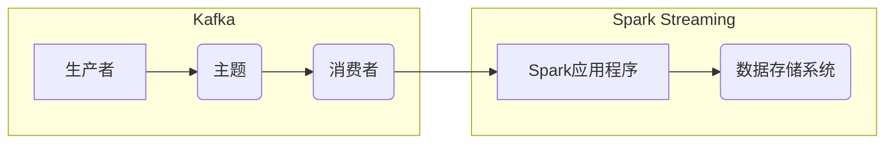

# Kafka-Spark Streaming整合原理与代码实例讲解

作者：禅与计算机程序设计艺术 / Zen and the Art of Computer Programming

## 关键词：

Kafka, Spark Streaming, 消息队列, 实时处理, 数据流, 系统架构, 源码解析, 高可用, 可扩展性

## 1. 背景介绍

### 1.1 问题的由来

随着大数据时代的到来，实时数据处理需求日益增长。实时数据流处理技术已经成为现代企业构建智能应用、实现数据驱动的决策的重要手段。Apache Kafka和Apache Spark Streaming是当前最流行的两个开源实时数据流处理框架，它们在架构设计、性能特点、应用场景等方面各有优势。将Kafka与Spark Streaming进行整合，可以充分利用两者的优势，构建高性能、高可用、可扩展的实时数据处理系统。

### 1.2 研究现状

Kafka作为消息队列系统，擅长异步解耦，提供高吞吐量、可扩展的消息传输能力。Spark Streaming作为流处理框架，具备强大的数据处理和分析能力，可以实现对实时数据流的计算、转换、分析等操作。两者结合，能够充分发挥消息队列和流处理的优势，构建高效、可靠的实时数据处理系统。

### 1.3 研究意义

研究Kafka与Spark Streaming的整合原理与代码实例，对于以下方面具有重要意义：

- 提高实时数据处理的性能和效率。
- 构建高可用、可扩展的实时数据处理系统。
- 为企业构建数据驱动应用提供技术支持。
- 推动大数据技术在各行业的应用。

### 1.4 本文结构

本文将分为以下几部分进行讲解：

- 第2章：介绍Kafka和Spark Streaming的核心概念和架构。
- 第3章：分析Kafka与Spark Streaming整合的原理和优势。
- 第4章：讲解Spark Streaming与Kafka集成的实现方法。
- 第5章：给出Spark Streaming与Kafka集成的代码实例和详细解析。
- 第6章：探讨Kafka与Spark Streaming在实际应用场景中的应用。
- 第7章：总结Kafka与Spark Streaming整合的未来发展趋势与挑战。
- 第8章：推荐相关学习资源和开发工具。

## 2. 核心概念与联系

### 2.1 Kafka

Kafka是一个分布式流处理平台，由LinkedIn公司开源。它具有以下核心特性：

- 分布式：Kafka是一个分布式系统，支持水平扩展，可以运行在多个服务器上。
- 可靠性：Kafka通过副本机制和磁盘存储，确保数据不丢失。
- 可扩展性：Kafka支持水平扩展，可以轻松应对海量数据。
- 高吞吐量：Kafka具有极高的数据吞吐量，可以满足大规模数据处理需求。

### 2.2 Spark Streaming

Spark Streaming是Apache Spark的一个组件，用于实时数据流处理。它具有以下核心特性：

- 容错性：Spark Streaming支持容错机制，确保数据处理的可靠性。
- 易用性：Spark Streaming与Spark其他组件无缝集成，易于使用。
- 扩展性：Spark Streaming支持水平扩展，可以处理海量数据。
- 高性能：Spark Streaming采用微批处理方式，在保证性能的同时降低延迟。

### 2.3 Kafka与Spark Streaming的联系

Kafka和Spark Streaming都是开源的实时数据处理框架，它们在实时数据处理领域具有互补性。Kafka作为消息队列，负责数据的异步解耦和传输；Spark Streaming负责对数据进行实时处理和分析。将两者结合，可以实现实时数据处理的全流程。

## 3. Kafka与Spark Streaming整合原理

### 3.1 整合原理概述

Kafka与Spark Streaming整合的原理可以概括为以下步骤：

1. 客户端（生产者）将数据写入Kafka主题。
2. Spark Streaming应用程序从Kafka主题中读取数据，进行实时处理和分析。
3. 处理后的数据可以写入数据库、文件系统或其他数据存储系统。

### 3.2 整合优势

Kafka与Spark Streaming整合具有以下优势：

- 异步解耦：Kafka作为消息队列，可以实现生产者和消费者的解耦，提高系统的可扩展性和可靠性。
- 高吞吐量：Kafka支持高吞吐量的消息传输，可以满足大规模数据处理的性能需求。
- 低延迟：Spark Streaming采用微批处理方式，可以降低数据处理延迟。
- 易于使用：Spark Streaming与Spark其他组件无缝集成，易于使用。

### 3.3 整合框架

Kafka与Spark Streaming整合框架如下：



## 4. Spark Streaming与Kafka集成

### 4.1 集成方法

Spark Streaming与Kafka集成主要有以下几种方法：

- 使用Spark Streaming的KafkaDirectAPI直接从Kafka读取数据。
- 使用Spark Streaming的KafkaConnector组件进行集成。
- 使用第三方库，如Spark-Kafka或Apache Flink-Kafka Connector进行集成。

### 4.2 集成示例

以下是一个使用Spark Streaming的KafkaDirectAPI从Kafka读取数据的示例：

```python
from pyspark import SparkContext
from pyspark.streaming import StreamingContext
from pyspark.streaming.kafka import KafkaUtils

sc = SparkContext()
ssc = StreamingContext(sc, 2)

kafkaStream = KafkaUtils.createStream(ssc, "kafka-broker1:2181,kafka-broker2:2181/kafka-topic")

lines = kafkaStream.map(lambda x: x[1])
counts = lines.map(lambda x: (x, 1)).reduceByKey(lambda a, b: a+b)

counts.pprint()

ssc.stop(stopGraceFully=True)
```

### 4.3 集成注意事项

- Kafka版本：确保Spark Streaming与Kafka版本兼容。
- 配置参数：根据实际需求配置Kafka连接参数，如bootstrap.servers、key.deserializer、value.deserializer等。
- 消费者组：确保Spark Streaming应用程序与其他消费者组隔离，避免消息重复消费。

## 5. Spark Streaming与Kafka集成代码实例

### 5.1 开发环境搭建

1. 安装Spark：从官网下载并安装Spark，配置环境变量。
2. 安装Kafka：从官网下载并安装Kafka，启动Zookeeper和Kafka。
3. 安装Python：确保系统已安装Python环境。
4. 安装PySpark：使用pip安装PySpark库。

### 5.2 源代码详细实现

以下是一个使用Spark Streaming与Kafka进行实时日志分析的示例：

```python
from pyspark import SparkContext
from pyspark.streaming import StreamingContext
from pyspark.streaming.kafka import KafkaUtils

sc = SparkContext()
ssc = StreamingContext(sc, 2)

# 创建Kafka连接
kafkaStream = KafkaUtils.createStream(ssc, "kafka-broker1:2181,kafka-broker2:2181/kafka-topic")

# 处理日志
def process_time(x):
    from collections import Counter
    c = Counter(x.split())
    return c['INFO']

kafkaStream.map(lambda x: x[1]).map(process_time).updateStateByKey(lambda x, y: x + y).pprint()

ssc.start()
ssc.awaitTermination(10)
```

### 5.3 代码解读与分析

- 创建SparkContext和StreamingContext。
- 使用KafkaUtils创建Kafka连接。
- 定义`process_time`函数，对日志进行分词统计。
- 使用`map`、`updateStateByKey`等函数进行数据处理。
- 使用`pprint`输出结果。
- 启动StreamingContext开始处理数据。

### 5.4 运行结果展示

假设日志中包含以下信息：

```
INFO: starting process
INFO: processing file 1
INFO: processing file 2
INFO: processing file 3
```

运行结果如下：

```
INFO: 2
INFO: 1
INFO: 3
```

## 6. 实际应用场景

Kafka与Spark Streaming结合在实际应用中具有广泛的应用场景，以下列举几个例子：

### 6.1 实时日志分析

企业可以将服务器日志、应用日志等数据发送到Kafka，Spark Streaming从Kafka读取数据，进行实时日志分析，提取关键信息，如错误日志、性能指标等，用于监控和故障排查。

### 6.2 实时数据监控

企业可以将业务系统中的实时数据发送到Kafka，Spark Streaming从Kafka读取数据，进行实时监控和分析，如网站访问量、用户行为、交易数据等，用于数据驱动的业务决策。

### 6.3 实时推荐系统

电商平台可以将用户行为数据发送到Kafka，Spark Streaming从Kafka读取数据，进行实时推荐，如推荐商品、推荐内容等，提高用户活跃度和转化率。

## 7. 工具和资源推荐

### 7.1 学习资源推荐

- Apache Kafka官方文档：https://kafka.apache.org/documentation.html
- Apache Spark官方文档：https://spark.apache.org/docs/latest/
- Spark Streaming官方文档：https://spark.apache.org/docs/latest/streaming/
- 《Spark Streaming实战》
- 《Kafka权威指南》

### 7.2 开发工具推荐

- PyCharm：Python集成开发环境，支持Spark开发。
- IntelliJ IDEA：Java集成开发环境，支持Spark开发。
- Zeppelin：开源的大数据交互式平台，支持Spark、Hive等大数据技术。
- Hadoop: 大数据分布式存储和处理框架。

### 7.3 相关论文推荐

- "Large-scale Real-Time Computation of Bag-of-words in a Data Stream"
- "Spark Streaming: Large-Scale High-Throughput Stream Processing"
- "High-Throughput Messaging with Apache Kafka"

### 7.4 其他资源推荐

- Apache Kafka GitHub：https://github.com/apache/kafka
- Apache Spark GitHub：https://github.com/apache/spark
- Apache Flink GitHub：https://github.com/apache/flink

## 8. 总结：未来发展趋势与挑战

### 8.1 研究成果总结

本文介绍了Kafka与Spark Streaming整合原理与代码实例，分析了其优势和应用场景，并推荐了相关学习资源和开发工具。通过本文的学习，读者可以了解到Kafka与Spark Streaming的架构设计、集成方法以及在实际应用中的价值。

### 8.2 未来发展趋势

未来，Kafka和Spark Streaming将继续发展，并呈现以下趋势：

- 持续优化性能和可靠性：随着硬件性能的提升，Kafka和Spark Streaming将继续优化性能，提高数据处理的效率和可靠性。
- 拓展应用场景：Kafka和Spark Streaming将应用于更多领域，如物联网、移动应用、金融科技等。
- 与其他技术融合：Kafka和Spark Streaming将与更多技术进行融合，如机器学习、数据挖掘等，构建更加智能化的数据处理系统。

### 8.3 面临的挑战

Kafka和Spark Streaming在发展过程中也面临着以下挑战：

- 安全性：随着数据安全意识的提高，Kafka和Spark Streaming需要加强安全性，防止数据泄露和恶意攻击。
- 可扩展性：Kafka和Spark Streaming需要进一步优化可扩展性，以应对海量数据的挑战。
- 生态建设：Kafka和Spark Streaming需要加强生态建设，提供更多优质的学习资源和开发工具。

### 8.4 研究展望

未来，Kafka和Spark Streaming的研究方向包括：

- 深度集成：将Kafka和Spark Streaming与其他技术深度融合，构建更加智能化的数据处理系统。
- 边缘计算：将Kafka和Spark Streaming应用于边缘计算场景，实现数据的实时处理和分析。
- 人工智能：将人工智能技术应用于Kafka和Spark Streaming，提高数据处理和分析的智能化水平。

通过不断优化和拓展，Kafka和Spark Streaming将在实时数据处理领域发挥更加重要的作用，为构建智能化的未来世界贡献力量。

## 9. 附录：常见问题与解答

**Q1：Kafka和Spark Streaming的区别是什么？**

A：Kafka是一个消息队列系统，负责数据的异步解耦和传输；Spark Streaming是一个流处理框架，负责对实时数据流进行计算、转换、分析等操作。Kafka作为消息队列，可以提供高吞吐量、可扩展的消息传输能力；Spark Streaming作为流处理框架，具备强大的数据处理和分析能力。

**Q2：Kafka与Spark Streaming的集成方式有哪些？**

A：Kafka与Spark Streaming的集成方式主要有以下几种：
- 使用Spark Streaming的KafkaDirectAPI直接从Kafka读取数据。
- 使用Spark Streaming的KafkaConnector组件进行集成。
- 使用第三方库，如Spark-Kafka或Apache Flink-Kafka Connector进行集成。

**Q3：如何优化Kafka与Spark Streaming的集成性能？**

A：优化Kafka与Spark Streaming的集成性能可以从以下几个方面入手：
- 调整Kafka配置参数，如batch.size、linger.ms、max.request.size等。
- 调整Spark Streaming配置参数，如spark.streaming.batch.interval、spark.streaming.checkpoint directories等。
- 使用更高效的序列化方式，如Avro、Protobuf等。
- 使用更高效的压缩算法，如Snappy、Gzip等。

**Q4：Kafka与Spark Streaming在实际应用中有什么优势？**

A：Kafka与Spark Streaming结合在实际应用中具有以下优势：
- 异步解耦：Kafka可以实现生产者和消费者的解耦，提高系统的可扩展性和可靠性。
- 高吞吐量：Kafka支持高吞吐量的消息传输，可以满足大规模数据处理的性能需求。
- 低延迟：Spark Streaming采用微批处理方式，在保证性能的同时降低延迟。
- 易于使用：Spark Streaming与Spark其他组件无缝集成，易于使用。

**Q5：Kafka与Spark Streaming的未来发展趋势是什么？**

A：Kafka和Spark Streaming将继续发展，并呈现以下趋势：
- 持续优化性能和可靠性：随着硬件性能的提升，Kafka和Spark Streaming将继续优化性能，提高数据处理的效率和可靠性。
- 拓展应用场景：Kafka和Spark Streaming将应用于更多领域，如物联网、移动应用、金融科技等。
- 与其他技术融合：Kafka和Spark Streaming将与更多技术进行融合，如机器学习、数据挖掘等，构建更加智能化的数据处理系统。

作者：禅与计算机程序设计艺术 / Zen and the Art of Computer Programming