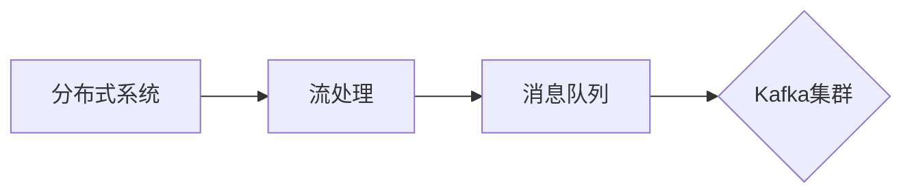

# Kafka的架构与组件

作者：禅与计算机程序设计艺术 / Zen and the Art of Computer Programming

## 1. 背景介绍

### 1.1 问题的由来

随着互联网和大数据技术的发展，数据量呈爆炸式增长。如何高效地处理海量数据，成为了大数据领域面临的重要挑战。Apache Kafka作为一款高吞吐量的分布式流处理平台，能够处理高并发的数据写入和读取，逐渐成为了大数据生态中的重要组成部分。

### 1.2 研究现状

Kafka自2008年由LinkedIn开源以来，经过多年的发展，已经成为一个成熟的开源项目，拥有庞大的社区支持。目前，Kafka已经在多个领域得到广泛应用，如实时数据处理、流式计算、数据集成等。

### 1.3 研究意义

深入研究Kafka的架构与组件，有助于我们更好地理解其工作原理，掌握其设计思想，从而在实际项目中更好地应用Kafka，解决数据存储和处理问题。

### 1.4 本文结构

本文将围绕Kafka的架构与组件展开，内容安排如下：

- 第2部分，介绍Kafka的核心概念与联系。
- 第3部分，详细阐述Kafka的架构原理与组件。
- 第4部分，分析Kafka的性能特点与优化策略。
- 第5部分，探讨Kafka在实际应用中的常见问题与解决方案。
- 第6部分，推荐Kafka相关的学习资源、开发工具和参考文献。
- 第7部分，总结全文，展望Kafka的未来发展趋势与挑战。

## 2. 核心概念与联系

为了更好地理解Kafka的架构与组件，本节将介绍几个密切相关的核心概念：

- 分布式系统：由多个节点组成，通过网络进行通信的系统。
- 流处理：对实时数据流进行收集、存储、处理和分析的过程。
- 消息队列：一种数据结构，用于存储待处理的消息。
- Kafka集群：由多个Kafka节点组成的集群，共同处理海量数据。

这些概念的逻辑关系如下图所示：

可以看出，Kafka作为一个分布式系统，主要用于处理流数据，其内部采用消息队列架构，由多个Kafka节点组成集群共同工作。

## 3. 核心架构与组件

### 3.1 架构原理概述

Kafka集群由多个Kafka节点组成，每个节点称为一个broker。Kafka使用ZooKeeper进行集群管理，保证集群的稳定性和一致性。Kafka的主要组件包括：

- Producer：生产者，负责将数据写入Kafka集群。
- Consumer：消费者，负责从Kafka集群中读取数据。
- Broker：Kafka节点，负责存储消息、处理客户端请求等。
- Topic：主题，Kafka中的消息分类，类似数据库中的表。
- Partition：分区， Topic的一个分区，消息被分配到不同的分区中。
- Replication：副本，Partition的备份，用于提高数据可靠性和可用性。
- Controller：控制器，负责管理集群状态和分区分配等。

### 3.2 架构步骤详解

1. **数据写入**：生产者将消息写入Kafka集群，消息首先写入到本地的缓冲区，然后发送到对应的broker。
2. **数据存储**：broker接收到消息后，将其存储到对应分区的日志文件中，并同步到副本节点。
3. **数据读取**：消费者从Kafka集群中读取数据，首先从本地的缓存中获取数据，然后从broker中拉取数据。
4. **数据复制**：Kafka使用副本机制提高数据可靠性和可用性，副本节点之间会定期同步数据。
5. **分区分配**：控制器负责管理集群状态和分区分配，保证分区均匀分布在broker上。

### 3.3 架构优缺点

Kafka架构的优点：

- 高吞吐量：Kafka采用消息队列架构，能够高效地处理高并发的数据写入和读取。
- 可靠性高：Kafka采用副本机制，保证数据不丢失，提高系统的可用性。
- 可伸缩性强：Kafka集群可以水平扩展，轻松应对海量数据。
- 易于集成：Kafka与多种数据源和数据处理工具集成方便。

Kafka架构的缺点：

- 数据处理能力有限：Kafka主要针对消息的存储和传输，对数据处理能力有限。
- 资源消耗大：Kafka集群需要大量的存储和计算资源。
- 复杂性较高：Kafka集群管理和维护较为复杂。

### 3.4 应用领域

Kafka在以下领域得到广泛应用：

- 实时数据处理：如日志收集、点击流分析、用户行为分析等。
- 流式计算：如Spark Streaming、Flink等流式计算框架。
- 数据集成：如Flume、Kettle等数据集成工具。
- 实时监控：如Prometheus、Grafana等监控工具。

## 4. 性能特点与优化策略

### 4.1 性能特点

Kafka具有以下性能特点：

- 高吞吐量：Kafka采用多线程、异步IO等技术，能够高效地处理高并发的数据写入和读取。
- 可靠性高：Kafka采用副本机制，保证数据不丢失，提高系统的可用性。
- 低延迟：Kafka采用异步IO、批处理等技术，降低数据处理延迟。
- 可伸缩性强：Kafka集群可以水平扩展，轻松应对海量数据。

### 4.2 优化策略

为了提高Kafka的性能，可以采取以下优化策略：

- 调整配置参数：如batch.size、linger.ms、compression.type等。
- 调整分区数：根据数据量、并发量和硬件资源等因素，合理分配分区数。
- 优化数据格式：使用高效的数据格式，如Protobuf、Avro等。
- 调整副本因子：根据数据重要性和硬件资源，合理设置副本因子。
- 使用负载均衡器：如Nginx、HAProxy等，实现负载均衡。

## 5. 常见问题与解决方案

### 5.1 问题1：Kafka数据丢失怎么办？

解决方案：确保副本因子大于1，并开启数据同步机制。同时，定期检查集群状态和副本同步情况。

### 5.2 问题2：Kafka性能瓶颈怎么办？

解决方案：分析瓶颈原因，如硬件资源不足、配置参数不合理等，并采取相应的优化措施。

### 5.3 问题3：Kafka集群管理复杂怎么办？

解决方案：使用Kafka Manager、Kafka Monitor等第三方工具进行集群管理和监控。

## 6. 工具和资源推荐

### 6.1 学习资源推荐

- Apache Kafka官方文档：https://kafka.apache.org/Documentation/
- Kafka权威指南：https://kafka-eagle.github.io/
- 《Kafka权威指南》书籍：https://book.douban.com/subject/26658654/

### 6.2 开发工具推荐

- Kafka Manager：https://github.com/yahoo/kafka-manager
- Kafka Monitor：https://github.com/anshul136/kafka-monitor

### 6.3 相关论文推荐

- Kafka: A Distributed Streaming Platform

### 6.4 其他资源推荐

- Apache Kafka社区：https://www.apache.org/community/licenses.html

## 7. 总结：未来发展趋势与挑战

### 7.1 研究成果总结

本文对Kafka的架构与组件进行了详细介绍，分析了其性能特点、优化策略以及在实际应用中的常见问题与解决方案。通过学习本文，读者可以更好地理解Kafka的工作原理，掌握其设计思想，为实际项目中的应用提供参考。

### 7.2 未来发展趋势

Kafka在未来将朝着以下方向发展：

- 支持更多数据格式和协议。
- 提高集群管理自动化水平。
- 加强与人工智能、大数据等领域的融合。
- 优化性能和资源消耗。

### 7.3 面临的挑战

Kafka在未来将面临以下挑战：

- 持续优化性能和资源消耗。
- 加强集群管理自动化和智能化。
- 提高安全性，保障数据安全。
- 拓展应用场景，满足更多领域需求。

### 7.4 研究展望

Kafka作为大数据领域的重要技术，将继续发挥其重要作用。未来，随着技术的不断发展，Kafka将更好地服务于大数据生态，推动大数据技术的进步。

## 8. 附录：常见问题与解答

**Q1：Kafka与消息队列的区别是什么？**

A：Kafka是一种分布式流处理平台，不仅具备消息队列的功能，还支持流式数据处理、数据持久化、高吞吐量等特性。而传统的消息队列主要关注消息的传输和存储，对数据处理能力有限。

**Q2：Kafka如何保证数据不丢失？**

A：Kafka采用副本机制，将消息复制到多个节点，以保证数据不丢失。当某个节点出现故障时，可以从副本节点中恢复数据。

**Q3：Kafka如何提高性能？**

A：Kafka通过以下方式提高性能：
1. 使用高效的序列化库，如Protobuf、Avro等。
2. 调整配置参数，如batch.size、linger.ms、compression.type等。
3. 使用负载均衡器，如Nginx、HAProxy等，实现负载均衡。

**Q4：Kafka如何实现水平扩展？**

A：Kafka通过增加broker节点实现水平扩展。当数据量或并发量增加时，可以添加新的broker节点，提高集群处理能力。

**Q5：Kafka如何保证数据一致性？**

A：Kafka通过以下方式保证数据一致性：
1. 采用副本机制，保证数据不丢失。
2. 使用ZooKeeper进行集群管理，保证集群状态和分区分配的一致性。
3. 设置合适的副本因子，提高数据可靠性。

---

作者：禅与计算机程序设计艺术 / Zen and the Art of Computer Programming