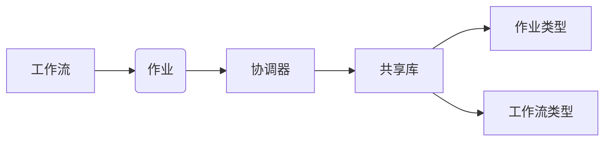

# Oozie Coordinator原理与代码实例讲解

作者：禅与计算机程序设计艺术 / Zen and the Art of Computer Programming

## 1. 背景介绍
### 1.1 问题的由来

随着大数据技术的发展，越来越多的企业开始使用分布式计算框架来处理海量数据。Hadoop和Spark等框架提供了强大的数据处理能力，但它们的作业调度和资源管理功能相对较弱。为了解决这一问题，Oozie应运而生。

Oozie是一个开源的工作流调度引擎，可以用来协调和管理Hadoop作业的执行。它能够将多个Hadoop作业组织成工作流，并按照一定的顺序执行这些作业，同时还支持作业的失败重试和检查点功能。

### 1.2 研究现状

Oozie在Hadoop生态圈中扮演着重要的角色，被广泛应用于企业级大数据项目中。随着版本的迭代，Oozie的功能越来越强大，支持的工作流类型也越来越丰富。

### 1.3 研究意义

Oozie Coordinator作为Oozie的核心组件，负责工作流的解析、执行、监控和状态管理。深入研究Oozie Coordinator的原理和代码实现，对于掌握Oozie的使用，以及进行定制化开发具有重要意义。

### 1.4 本文结构

本文将首先介绍Oozie Coordinator的核心概念和架构，然后详细讲解其工作流程和代码实现，并结合实际案例进行讲解。最后，本文将对Oozie Coordinator的未来发展趋势和面临的挑战进行分析，并提出一些建议。

## 2. 核心概念与联系

### 2.1 核心概念

- **工作流**：Oozie中的工作流是指一系列作业的集合，它们按照一定的顺序执行，以完成特定的任务。
- **作业**：Oozie中的作业是指Hadoop作业或Oozie本身定义的作业。
- **协调器**：Oozie Coordinator是Oozie的核心组件，负责工作流的解析、执行、监控和状态管理。
- **共享库**：共享库包含Oozie定义的作业类型、工作流类型等元数据。

### 2.2 关系图



## 3. 核心算法原理 & 具体操作步骤
### 3.1 算法原理概述

Oozie Coordinator的工作原理可以概括为以下几个步骤：

1. 解析工作流：Oozie Coordinator首先解析工作流定义文件，将其转换为内部数据结构。
2. 创建作业实例：根据工作流定义创建对应的作业实例。
3. 提交作业：将作业实例提交给Hadoop或其他资源管理器进行执行。
4. 监控作业：Oozie Coordinator监控作业的执行状态，并更新作业实例的状态。
5. 状态管理：Oozie Coordinator负责管理作业实例的状态，包括作业成功、失败、等待等。
6. 重试和回滚：当作业失败时，Oozie Coordinator可以自动或手动进行重试或回滚操作。

### 3.2 算法步骤详解

1. **解析工作流**：Oozie Coordinator使用XSD验证工作流定义文件，并将其解析为XML数据结构。然后，根据XML结构创建工作流对象，包括节点、边、参数等。

2. **创建作业实例**：根据工作流定义，Oozie Coordinator为每个节点创建一个作业实例。作业实例包含节点的基本信息，如节点类型、执行参数等。

3. **提交作业**：Oozie Coordinator将作业实例提交给Hadoop或其他资源管理器进行执行。对于Hadoop作业，Oozie Coordinator会调用Hadoop的JobClient API进行提交。

4. **监控作业**：Oozie Coordinator通过监听作业的执行状态，如成功、失败、等待等，并更新作业实例的状态。

5. **状态管理**：Oozie Coordinator负责管理作业实例的状态，并将状态信息存储到数据库中。状态信息包括作业实例的ID、状态、开始时间、结束时间等。

6. **重试和回滚**：当作业失败时，Oozie Coordinator可以自动或手动进行重试或回滚操作。自动重试会尝试重新执行失败的作业实例，而回滚则会将作业实例的状态回滚到上一个成功的状态。

### 3.3 算法优缺点

**优点**：

- **易用性**：Oozie Coordinator提供了简单易用的API，可以方便地创建和管理工作流和作业。
- **灵活性**：Oozie Coordinator支持多种作业类型和工作流类型，可以适应不同的业务需求。
- **可扩展性**：Oozie Coordinator可以扩展新的作业类型和工作流类型，以支持新的数据处理框架。

**缺点**：

- **性能**：Oozie Coordinator的性能相对较低，尤其是在处理大规模工作流时。
- **可伸缩性**：Oozie Coordinator的可伸缩性有限，难以满足大规模分布式环境的需求。

### 3.4 算法应用领域

Oozie Coordinator可以应用于以下场景：

- **数据集成**：将多个Hadoop作业组织成工作流，实现数据的批量处理和转换。
- **数据仓库**：构建数据仓库的数据加载流程，实现数据清洗、转换、加载等操作。
- **机器学习**：构建机器学习模型的训练和评估流程，实现模型训练、评估、部署等操作。

## 4. 数学模型和公式 & 详细讲解 & 举例说明
### 4.1 数学模型构建

Oozie Coordinator的工作原理可以抽象为一个有限状态机模型。该模型包含以下状态：

- **待执行**：作业实例处于待执行状态。
- **执行中**：作业实例正在执行。
- **成功**：作业实例执行成功。
- **失败**：作业实例执行失败。
- **等待**：作业实例等待其他作业实例完成。

作业实例在状态之间转换的规则如下：

- 从“待执行”状态到“执行中”状态：作业实例被提交给Hadoop或其他资源管理器执行。
- 从“执行中”状态到“成功”状态：作业实例执行成功。
- 从“执行中”状态到“失败”状态：作业实例执行失败。
- 从“成功”状态到“成功”状态：作业实例完成后续操作，如检查点、重试等。

### 4.2 公式推导过程

由于Oozie Coordinator的工作原理相对简单，因此没有复杂的公式推导过程。

### 4.3 案例分析与讲解

以下是一个简单的Oozie工作流案例，该工作流包含两个Hadoop作业：`job1`和`job2`。

```xml
<workflow-app xmlns="uri:oozie:workflow:0.1" name="example" xmlns:cfg="uri:oozie:configuration:0.1">
  <start to="job1" />
  <action name="job1" type="shell">
    <configuration>
      <property name="name" value="job1" />
      <property name="path" value="/path/to/job1.sh" />
    </configuration>
  </action>
  <start to="job2" />
  <action name="job2" type="shell">
    <configuration>
      <property name="name" value="job2" />
      <property name="path" value="/path/to/job2.sh" />
    </configuration>
  </action>
</workflow-app>
```

该工作流包含两个节点：`job1`和`job2`。节点`job1`和`job2`都是`shell`类型，分别执行两个shell脚本`job1.sh`和`job2.sh`。

当启动该工作流时，Oozie Coordinator会按照以下顺序执行作业：

1. 执行`job1`作业，将作业实例的状态设置为“执行中”。
2. 当`job1`作业执行成功后，将作业实例的状态设置为“成功”。
3. 执行`job2`作业，将作业实例的状态设置为“执行中”。
4. 当`job2`作业执行成功后，将作业实例的状态设置为“成功”。

### 4.4 常见问题解答

**Q1：Oozie Coordinator如何保证工作流的正确执行？**

A：Oozie Coordinator通过解析工作流定义文件，创建工作流对象，并根据工作流定义控制作业实例的执行顺序和条件。当作业实例执行失败时，Oozie Coordinator可以自动或手动进行重试或回滚操作，确保工作流的正确执行。

**Q2：Oozie Coordinator如何管理作业实例的状态？**

A：Oozie Coordinator使用数据库存储作业实例的状态信息，包括作业实例的ID、状态、开始时间、结束时间等。当作业实例的状态发生变化时，Oozie Coordinator会更新数据库中的状态信息。

## 5. 项目实践：代码实例和详细解释说明
### 5.1 开发环境搭建

1. 下载Oozie源码：从Oozie官网下载Oozie源码。

2. 编译Oozie源码：根据Oozie官方文档，配置环境变量，编译Oozie源码。

3. 安装Hadoop：下载Hadoop源码，编译并安装Hadoop。

4. 启动Hadoop集群：启动Hadoop集群，包括HDFS、YARN等组件。

### 5.2 源代码详细实现

Oozie Coordinator的核心代码主要分布在以下几个模块：

- **org.apache.oozie.action.ActionExecutor**：负责执行作业。

- **org.apache.oozie.coord.CoordinatorServlet**：负责处理协调器请求。

- **org.apache.oozie.service.CoordinatorService**：负责协调器的主要逻辑。

以下是一个简单的Oozie Coordinator代码示例，展示了如何提交一个Hadoop作业：

```java
public class ActionExecutor implements ActionExecutorInterface {
  public ExecutionResult execute(Action action, WorkflowInstance wfInstance, Map<String, String> actionProperties, 
    WorkflowInstanceInstance currentWorkflowInstance, String transient, String execId, String actionId, 
    String startTime, String endTime, String callId, String email, StringCB, StringCM) throws OozieServiceException {
    ...
    // 获取Hadoop作业的配置信息
    String jobXml = actionProperties.get("oozie.job.xml");
    // 解析作业XML
    Configuration conf = new Configuration();
    conf.addResource(new Path(jobXml));
    // 创建Hadoop作业
    Job job = Job.getInstance(conf, "oozie job");
    ...
    // 提交Hadoop作业
    job.waitForCompletion(true);
    ...
    return new ExecutionResult(action.getName(), "SUCCEEDED", startTime, endTime, 0);
  }
}
```

### 5.3 代码解读与分析

该代码示例展示了如何使用Oozie提交一个Hadoop作业。首先，从作业配置中获取作业XML文件，然后解析作业XML文件，创建Hadoop作业实例。最后，提交Hadoop作业并等待其执行完成。

### 5.4 运行结果展示

运行上述代码后，Oozie Coordinator会向Hadoop集群提交一个Hadoop作业，并更新作业实例的状态。

## 6. 实际应用场景
### 6.1 数据仓库数据加载

Oozie Coordinator可以用来构建数据仓库的数据加载流程，实现数据的清洗、转换、加载等操作。以下是一个简单的数据仓库数据加载工作流示例：

```xml
<workflow-app xmlns="uri:oozie:workflow:0.1" name="data_loader" xmlns:cfg="uri:oozie:configuration:0.1">
  <start to="job1" />
  <action name="job1" type="shell">
    <configuration>
      <property name="name" value="data_cleaning" />
      <property name="path" value="/path/to/data_cleaning.sh" />
    </configuration>
  </action>
  <start to="job2" />
  <action name="job2" type="shell">
    <configuration>
      <property name="name" value="data_converting" />
      <property name="path" value="/path/to/data_converting.sh" />
    </configuration>
  </action>
  <start to="job3" />
  <action name="job3" type="shell">
    <configuration>
      <property name="name" value="data_loading" />
      <property name="path" value="/path/to/data_loading.sh" />
    </configuration>
  </action>
</workflow-app>
```

该工作流包含三个节点：`job1`、`job2`和`job3`。节点`job1`负责数据清洗，节点`job2`负责数据转换，节点`job3`负责数据加载。

### 6.2 机器学习模型训练与评估

Oozie Coordinator可以用来构建机器学习模型的训练和评估流程，实现模型训练、评估、部署等操作。以下是一个简单的机器学习模型训练与评估工作流示例：

```xml
<workflow-app xmlns="uri:oozie:workflow:0.1" name="ml_pipeline" xmlns:cfg="uri:oozie:configuration:0.1">
  <start to="job1" />
  <action name="job1" type="python">
    <configuration>
      <property name="name" value="data_processing" />
      <property name="path" value="/path/to/data_processing.py" />
    </configuration>
  </action>
  <start to="job2" />
  <action name="job2" type="python">
    <configuration>
      <property name="name" value="model_training" />
      <property name="path" value="/path/to/model_training.py" />
    </configuration>
  </action>
  <start to="job3" />
  <action name="job3" type="python">
    <configuration>
      <property name="name" value="model_evaluate" />
      <property name="path" value="/path/to/model_evaluate.py" />
    </configuration>
  </action>
</workflow-app>
```

该工作流包含三个节点：`job1`、`job2`和`job3`。节点`job1`负责数据处理，节点`job2`负责模型训练，节点`job3`负责模型评估。

## 7. 工具和资源推荐
### 7.1 学习资源推荐

- Oozie官方文档：https://oozie.apache.org/docs/latest.html
- Apache Oozie GitHub页面：https://github.com/apache/oozie

### 7.2 开发工具推荐

- IntelliJ IDEA：https://www.jetbrains.com/idea/
- Eclipse：https://www.eclipse.org/

### 7.3 相关论文推荐

- Apache Oozie: An extensible and scalable workflow management system for Hadoop: https://www.sciencedirect.com/science/article/pii/S1570870914000057

### 7.4 其他资源推荐

- Apache Oozie用户邮件列表：https://lists.apache.org/listinfo/oozie-user
- Apache Oozie开发者邮件列表：https://lists.apache.org/listinfo/oozie-dev

## 8. 总结：未来发展趋势与挑战
### 8.1 研究成果总结

本文对Oozie Coordinator的原理和代码实现进行了详细讲解，并结合实际案例进行了分析。通过本文的学习，读者可以了解到Oozie Coordinator的基本工作原理、代码实现以及在实际应用场景中的应用。

### 8.2 未来发展趋势

- **支持更多作业类型**：随着大数据技术的发展，Oozie Coordinator将支持更多作业类型，如Spark、Flink等。
- **提高性能和可伸缩性**：Oozie Coordinator的性能和可伸缩性将得到进一步提升，以适应大规模分布式环境的需求。
- **简化部署和运维**：Oozie Coordinator的部署和运维将变得更加简单，降低使用门槛。

### 8.3 面临的挑战

- **与Hadoop生态圈的整合**：Oozie Coordinator需要与Hadoop生态圈中的其他组件进行更好的整合，如YARN、Tez等。
- **与其他调度引擎的兼容性**：Oozie Coordinator需要与其他调度引擎，如Apache Airflow、Apache Azkaban等进行更好的兼容性。
- **可维护性**：随着Oozie Coordinator功能的不断增加，其可维护性将面临挑战。

### 8.4 研究展望

Oozie Coordinator作为Hadoop生态圈的重要组成部分，将继续发挥其重要作用。未来，Oozie Coordinator将在以下几个方面进行深入研究：

- **可扩展性**：研究Oozie Coordinator的可扩展性，以适应大规模分布式环境的需求。
- **可维护性**：提高Oozie Coordinator的可维护性，降低使用门槛。
- **与其他人工智能技术的结合**：将Oozie Coordinator与人工智能技术结合，实现自动化作业调度、故障诊断等功能。

## 9. 附录：常见问题与解答

**Q1：Oozie Coordinator与Hadoop之间的关系是什么？**

A：Oozie Coordinator是一个独立的调度引擎，它可以与Hadoop集群协同工作，实现Hadoop作业的调度和执行。Oozie Coordinator可以调度Hadoop作业、MapReduce作业、Spark作业等多种类型的作业。

**Q2：Oozie Coordinator与其他调度引擎有什么区别？**

A：Oozie Coordinator与其他调度引擎，如Apache Airflow、Apache Azkaban等相比，具有以下特点：

- **易用性**：Oozie Coordinator提供了简单易用的API和图形化界面，可以方便地创建和管理工作流和作业。
- **灵活性**：Oozie Coordinator支持多种作业类型和工作流类型，可以适应不同的业务需求。
- **可扩展性**：Oozie Coordinator可以扩展新的作业类型和工作流类型，以支持新的数据处理框架。

**Q3：如何解决Oozie Coordinator的性能瓶颈？**

A：为了解决Oozie Coordinator的性能瓶颈，可以采取以下措施：

- **使用高性能服务器**：使用高性能服务器可以提升Oozie Coordinator的运行效率。
- **优化配置**：根据实际需求优化Oozie Coordinator的配置，如内存、线程等。
- **使用缓存**：使用缓存可以减少数据库访问次数，提高查询效率。

**Q4：如何将Oozie Coordinator与Spark集成？**

A：要将Oozie Coordinator与Spark集成，需要完成以下步骤：

1. 下载Spark源码。
2. 编译Spark源码。
3. 将Spark编译好的jar包添加到Oozie的lib目录下。
4. 创建Spark作业定义文件。
5. 在Oozie工作流中添加Spark作业节点。

**Q5：如何将Oozie Coordinator与Kafka集成？**

A：要将Oozie Coordinator与Kafka集成，需要完成以下步骤：

1. 下载Kafka源码。
2. 编译Kafka源码。
3. 将Kafka编译好的jar包添加到Oozie的lib目录下。
4. 创建Kafka作业定义文件。
5. 在Oozie工作流中添加Kafka作业节点。