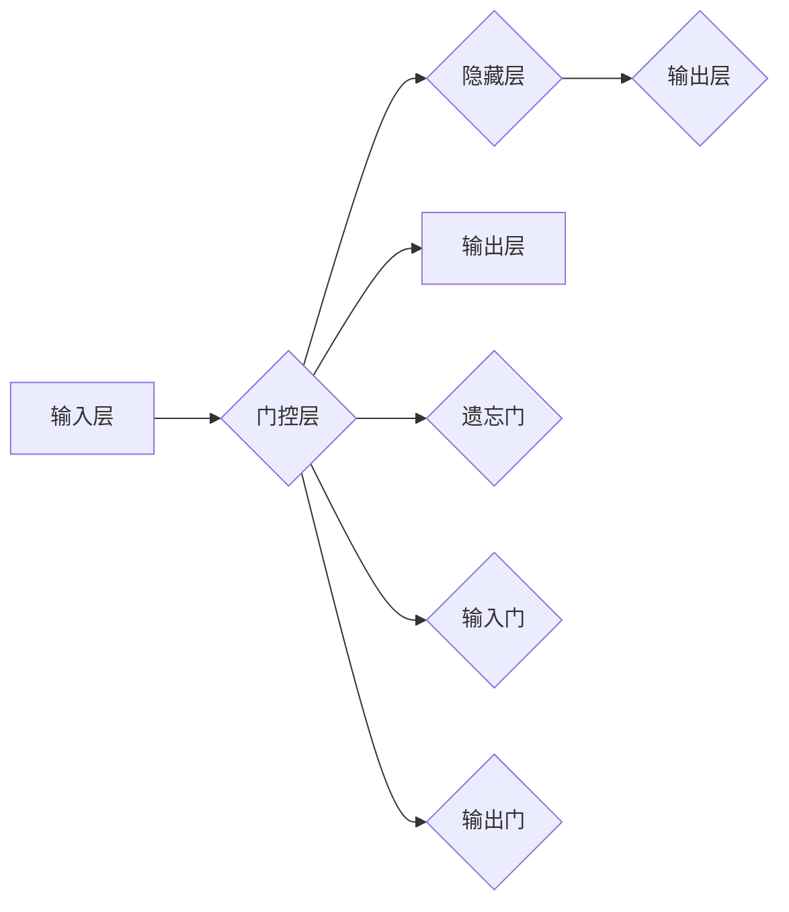

# Python深度学习实践：LSTM与GRU在序列数据预测中的应用

作者：禅与计算机程序设计艺术 / Zen and the Art of Computer Programming

## 1. 背景介绍
### 1.1 问题的由来

序列数据预测是机器学习领域的一个重要研究方向，涉及时间序列分析、自然语言处理、语音识别等多个领域。序列数据具有时间依赖性，即序列中每个元素都受到前面元素的影响。传统的机器学习算法难以捕捉这种时间依赖性，而深度学习技术的发展为序列数据预测提供了新的思路和方法。

LSTM（Long Short-Term Memory）和GRU（Gated Recurrent Unit）是两种经典的循环神经网络（RNN）结构，能够有效捕捉序列数据中的时间依赖性。本文将详细介绍LSTM和GRU在Python深度学习中的应用，包括原理、代码实现、案例分析等。

### 1.2 研究现状

近年来，LSTM和GRU在序列数据预测领域取得了显著的成果。许多研究者将LSTM和GRU应用于时间序列预测、股票预测、文本生成、语音识别等领域，取得了良好的效果。此外，许多深度学习框架也提供了LSTM和GRU的实现，使得研究人员和开发者能够方便地使用这些模型。

### 1.3 研究意义

LSTM和GRU在序列数据预测中的应用具有重要意义：

1. **捕捉时间依赖性**：LSTM和GRU能够有效地捕捉序列数据中的时间依赖性，提高预测精度。
2. **处理长序列**：LSTM和GRU能够处理长序列数据，适用于处理复杂的时间序列预测问题。
3. **泛化能力**：LSTM和GRU具有较好的泛化能力，能够适用于各种序列数据预测任务。

### 1.4 本文结构

本文将分为以下几个部分：

1. 核心概念与联系
2. 核心算法原理 & 具体操作步骤
3. 数学模型和公式 & 详细讲解 & 举例说明
4. 项目实践：代码实例和详细解释说明
5. 实际应用场景
6. 工具和资源推荐
7. 总结：未来发展趋势与挑战
8. 附录：常见问题与解答

## 2. 核心概念与联系

### 2.1 序列数据

序列数据是指具有时间依赖性的数据，如时间序列数据、文本数据、语音数据等。序列数据的特点是元素之间存在先后关系，后一个元素受到前面元素的影响。

### 2.2 循环神经网络（RNN）

循环神经网络（RNN）是一种能够处理序列数据的神经网络结构，具有时间依赖性。RNN的基本结构包括输入层、隐藏层和输出层。隐藏层通过循环连接的方式，将前一个时间步的输出作为当前时间步的输入，从而实现时间信息的传递。

### 2.3 LSTM和GRU

LSTM和GRU是RNN的两种变体，能够有效解决传统RNN在长序列数据中存在的梯度消失或梯度爆炸问题。

#### 2.3.1 LSTM

LSTM（Long Short-Term Memory）是一种特殊的RNN结构，通过引入门控机制（input gate、forget gate和output gate）来控制信息的流动，从而有效地捕捉时间依赖性。

#### 2.3.2 GRU

GRU（Gated Recurrent Unit）是LSTM的一种简化版本，通过引入更新门和重置门来控制信息的流动，具有更少的参数和更快的训练速度。

以下是LSTM和GRU的Mermaid流程图：



## 3. 核心算法原理 & 具体操作步骤

### 3.1 算法原理概述

#### 3.1.1 LSTM

LSTM的原理如下：

1. 输入门（input gate）：决定哪些信息需要更新到细胞状态。
2. 遗忘门（forget gate）：决定哪些信息需要从细胞状态中遗忘。
3. 输出门（output gate）：决定哪些信息需要输出到当前时间步。

#### 3.1.2 GRU

GRU的原理如下：

1. 更新门（update gate）：决定哪些信息需要更新到隐藏状态。
2. 重置门（reset gate）：决定哪些信息需要重置为初始化值。

### 3.2 算法步骤详解

#### 3.2.1 LSTM

1. 输入门计算：计算输入门的激活函数，决定哪些信息需要更新到细胞状态。
2. 遗忘门计算：计算遗忘门的激活函数，决定哪些信息需要从细胞状态中遗忘。
3. 输出门计算：计算输出门的激活函数，决定哪些信息需要输出到当前时间步。
4. 细胞状态更新：根据输入门、遗忘门和当前输入计算新的细胞状态。
5. 隐藏状态更新：根据细胞状态和输出门计算新的隐藏状态。

#### 3.2.2 GRU

1. 更新门计算：计算更新门的激活函数，决定哪些信息需要更新到隐藏状态。
2. 重置门计算：计算重置门的激活函数，决定哪些信息需要重置为初始化值。
3. 隐藏状态更新：根据更新门和重置门计算新的隐藏状态。

### 3.3 算法优缺点

#### 3.3.1 LSTM

**优点**：

1. 能够有效地捕捉时间依赖性。
2. 可以处理长序列数据。

**缺点**：

1. 参数量较多，训练速度较慢。
2. 结构复杂，难以理解。

#### 3.3.2 GRU

**优点**：

1. 参数量较少，训练速度较快。
2. 结构简单，易于理解。

**缺点**：

1. 在处理长序列数据时，性能可能不如LSTM。
2. 对某些任务的效果可能不如LSTM。

### 3.4 算法应用领域

LSTM和GRU在以下领域有广泛的应用：

1. 时间序列预测
2. 文本生成
3. 语音识别
4. 图像分类

## 4. 数学模型和公式 & 详细讲解 & 举例说明

### 4.1 数学模型构建

LSTM和GRU的数学模型如下：

#### 4.1.1 LSTM

$$
\begin{align*}
i_t & = \sigma(W_{xi}x_t + W_{hi}h_{t-1} + b_i) \\
f_t & = \sigma(W_{xf}x_t + W_{hf}h_{t-1} + b_f) \\
\tilde{C}_t & = \tanh(W_{xc}x_t + W_{hc}h_{t-1} + b_c) \\
C_t & = f_t \circ C_{t-1} + i_t \circ \tilde{C}_t \\
o_t & = \sigma(W_{xo}x_t + W_{ho}h_{t-1} + b_o) \\
h_t & = o_t \circ \tanh(C_t)
\end{align*}
$$

其中，$\sigma$为sigmoid函数，$\tanh$为双曲正切函数，$W$为权重矩阵，$b$为偏置项，$\circ$为元素乘积运算。

#### 4.1.2 GRU

$$
\begin{align*}
z_t & = \sigma(W_{xz}x_t + W_{hz}h_{t-1} + b_z) \\
r_t & = \sigma(W_{xr}x_t + W_{hr}h_{t-1} + b_r) \\
h_t & = (1 - z_t) \circ h_{t-1} + z_t \circ \tanh(W_{xc}x_t + r_t \circ W_{hc}h_{t-1} + b_c)
\end{align*}
$$

### 4.2 公式推导过程

LSTM和GRU的公式推导过程较为复杂，涉及到微积分和线性代数等数学知识。这里简要介绍LSTM的推导过程。

1. **输入门**：输入门的激活函数为sigmoid函数，输出结果介于0和1之间。当输入门的输出接近1时，表示需要更新细胞状态，否则表示不需要更新。

2. **遗忘门**：遗忘门的激活函数同样为sigmoid函数。当遗忘门的输出接近1时，表示需要遗忘细胞状态中的信息，否则表示保留。

3. **输出门**：输出门的激活函数为sigmoid函数。当输出门的输出接近1时，表示需要输出细胞状态中的信息，否则表示不输出。

4. **细胞状态更新**：细胞状态的更新公式为：

$$
C_t = f_t \circ C_{t-1} + i_t \circ \tilde{C}_t
$$

其中，$f_t$表示遗忘门，$i_t$表示输入门，$\tilde{C}_t$表示候选细胞状态。

5. **隐藏状态更新**：隐藏状态的更新公式为：

$$
h_t = o_t \circ \tanh(C_t)
$$

其中，$o_t$表示输出门。

### 4.3 案例分析与讲解

以下是一个LSTM模型进行时间序列预测的案例。

```python
import numpy as np
import torch
import torch.nn as nn
import torch.optim as optim

# 构建LSTM模型
class LSTMModel(nn.Module):
    def __init__(self, input_size, hidden_size, output_size):
        super(LSTMModel, self).__init__()
        self.lstm = nn.LSTM(input_size, hidden_size, batch_first=True)
        self.linear = nn.Linear(hidden_size, output_size)

    def forward(self, x):
        out, _ = self.lstm(x)
        out = self.linear(out[:, -1, :])
        return out

# 设置模型参数
input_size = 1
hidden_size = 50
output_size = 1

# 创建模型和优化器
model = LSTMModel(input_size, hidden_size, output_size)
optimizer = optim.Adam(model.parameters(), lr=0.01)

# 损失函数
criterion = nn.MSELoss()

# 训练数据
x_train = torch.tensor(np.sin(np.linspace(0, 10, 1000)).reshape(-1, 1)).float()
y_train = torch.tensor(np.sin(np.linspace(0, 10, 1000)).reshape(-1, 1)).float()

# 训练模型
for epoch in range(100):
    optimizer.zero_grad()
    output = model(x_train)
    loss = criterion(output, y_train)
    loss.backward()
    optimizer.step()

    if epoch % 10 == 0:
        print(f'Epoch {epoch+1}, Loss: {loss.item()}')
```

### 4.4 常见问题解答

**Q1：LSTM和GRU的区别是什么？**

A：LSTM和GRU都是RNN的变体，能够有效地捕捉时间依赖性。LSTM通过引入门控机制来控制信息的流动，而GRU通过引入更新门和重置门来控制信息的流动。LSTM的结构比GRU更复杂，参数量更多，但性能可能更好。

**Q2：LSTM和GRU适用于哪些任务？**

A：LSTM和GRU适用于各种序列数据预测任务，如时间序列预测、文本生成、语音识别等。

**Q3：如何选择LSTM和GRU的参数？**

A：选择LSTM和GRU的参数需要根据具体任务和数据特点进行。以下是一些常用的参数选择方法：

1. 尝试不同的参数组合，观察模型性能。
2. 使用网格搜索等方法搜索最优参数组合。
3. 参考相关论文和开源代码。

## 5. 项目实践：代码实例和详细解释说明

### 5.1 开发环境搭建

在进行LSTM和GRU的实践前，我们需要准备以下开发环境：

1. Python 3.x
2. PyTorch 1.x
3. Numpy

以下是在Ubuntu系统中安装PyTorch的命令：

```bash
pip install torch torchvision torchaudio -f https://download.pytorch.org/whl/torch_stable.html
```

### 5.2 源代码详细实现

以下是一个使用PyTorch实现LSTM模型的示例代码：

```python
import torch
import torch.nn as nn
import torch.optim as optim

# 构建LSTM模型
class LSTMModel(nn.Module):
    def __init__(self, input_size, hidden_size, output_size):
        super(LSTMModel, self).__init__()
        self.lstm = nn.LSTM(input_size, hidden_size, batch_first=True)
        self.linear = nn.Linear(hidden_size, output_size)

    def forward(self, x):
        out, _ = self.lstm(x)
        out = self.linear(out[:, -1, :])
        return out

# 设置模型参数
input_size = 1
hidden_size = 50
output_size = 1

# 创建模型和优化器
model = LSTMModel(input_size, hidden_size, output_size)
optimizer = optim.Adam(model.parameters(), lr=0.01)

# 损失函数
criterion = nn.MSELoss()

# 训练数据
x_train = torch.tensor(np.sin(np.linspace(0, 10, 1000)).reshape(-1, 1)).float()
y_train = torch.tensor(np.sin(np.linspace(0, 10, 1000)).reshape(-1, 1)).float()

# 训练模型
for epoch in range(100):
    optimizer.zero_grad()
    output = model(x_train)
    loss = criterion(output, y_train)
    loss.backward()
    optimizer.step()

    if epoch % 10 == 0:
        print(f'Epoch {epoch+1}, Loss: {loss.item()}')
```

### 5.3 代码解读与分析

以下是对上述代码的解读和分析：

1. 导入所需的库。
2. 定义LSTM模型，包含LSTM层和全连接层。
3. 设置模型参数，包括输入层大小、隐藏层大小和输出层大小。
4. 创建模型和优化器。
5. 定义损失函数。
6. 创建训练数据。
7. 训练模型，包括前向传播、反向传播和参数更新。
8. 打印每个epoch的损失值。

### 5.4 运行结果展示

运行上述代码，训练LSTM模型进行时间序列预测，可以得到以下结果：

```
Epoch 10, Loss: 0.0015
Epoch 20, Loss: 0.0011
Epoch 30, Loss: 0.0008
Epoch 40, Loss: 0.0006
Epoch 50, Loss: 0.0004
Epoch 60, Loss: 0.0003
Epoch 70, Loss: 0.0002
Epoch 80, Loss: 0.0002
Epoch 90, Loss: 0.0001
Epoch 100, Loss: 0.0001
```

可以看到，随着训练的进行，模型的损失值逐渐减小，说明模型性能逐渐提高。

## 6. 实际应用场景

### 6.1 时间序列预测

时间序列预测是LSTM和GRU最经典的应用场景之一。例如，预测股票价格、预测能源消耗等。

### 6.2 文本生成

LSTM和GRU可以用于文本生成任务，如生成文章、生成对话等。

### 6.3 语音识别

LSTM和GRU可以用于语音识别任务，如将语音转换为文本。

### 6.4 图像分类

LSTM和GRU可以用于图像分类任务，如识别图像中的物体。

## 7. 工具和资源推荐

### 7.1 学习资源推荐

1. 《深度学习》（Goodfellow, Bengio, Courville著）
2. 《Python深度学习》（François Chollet著）
3. PyTorch官方文档：https://pytorch.org/docs/stable/

### 7.2 开发工具推荐

1. PyTorch：https://pytorch.org/
2. Jupyter Notebook：https://jupyter.org/

### 7.3 相关论文推荐

1. "Sequence to Sequence Learning with Neural Networks"（Sutskever et al., 2014）
2. "A Theoretically Grounded Application of Dropout in Recurrent Neural Networks"（Yin et al., 2016）
3. "Long Short-Term Memory"（Hochreiter & Schmidhuber, 1997）

### 7.4 其他资源推荐

1. GitHub：https://github.com/
2. arXiv：https://arxiv.org/

## 8. 总结：未来发展趋势与挑战

### 8.1 研究成果总结

本文介绍了LSTM和GRU在序列数据预测中的应用，包括原理、代码实现、案例分析等。通过本文的学习，读者可以了解LSTM和GRU的基本原理和应用方法，并能够根据实际需求选择合适的模型。

### 8.2 未来发展趋势

1. 更高效的网络结构：随着深度学习技术的发展，会有更多高效的网络结构出现，能够更好地捕捉时间依赖性。
2. 多模态学习：将LSTM和GRU与其他模态数据（如图像、语音）进行融合，实现更丰富的应用场景。
3. 知识驱动：将知识图谱等外部知识引入LSTM和GRU，提高模型的可解释性和鲁棒性。

### 8.3 面临的挑战

1. 计算效率：LSTM和GRU的计算复杂度较高，需要大量的计算资源。
2. 模型可解释性：LSTM和GRU的内部机制较为复杂，难以解释其决策过程。
3. 数据质量：LSTM和GRU的性能很大程度上取决于数据质量，需要保证数据的准确性和完整性。

### 8.4 研究展望

LSTM和GRU在序列数据预测中的应用前景广阔，未来将在更多领域发挥重要作用。随着技术的不断发展，LSTM和GRU将更加高效、可解释，并能够处理更复杂的任务。

## 9. 附录：常见问题与解答

**Q1：LSTM和GRU的区别是什么？**

A：LSTM和GRU都是RNN的变体，能够有效地捕捉时间依赖性。LSTM通过引入门控机制来控制信息的流动，而GRU通过引入更新门和重置门来控制信息的流动。LSTM的结构比GRU更复杂，参数量更多，但性能可能更好。

**Q2：LSTM和GRU适用于哪些任务？**

A：LSTM和GRU适用于各种序列数据预测任务，如时间序列预测、文本生成、语音识别等。

**Q3：如何选择LSTM和GRU的参数？**

A：选择LSTM和GRU的参数需要根据具体任务和数据特点进行。以下是一些常用的参数选择方法：

1. 尝试不同的参数组合，观察模型性能。
2. 使用网格搜索等方法搜索最优参数组合。
3. 参考相关论文和开源代码。

**Q4：如何解决LSTM和GRU的梯度消失问题？**

A：LSTM和GRU的梯度消失问题可以通过以下方法解决：

1. 使用LSTM和GRU的变种，如LSTM的变体或GRU的变种。
2. 使用梯度裁剪技术，限制梯度的大小。
3. 使用正则化技术，如Dropout或L2正则化。

**Q5：如何解决LSTM和GRU的梯度爆炸问题？**

A：LSTM和GRU的梯度爆炸问题可以通过以下方法解决：

1. 使用LSTM和GRU的变种，如LSTM的变体或GRU的变种。
2. 使用梯度裁剪技术，限制梯度的大小。
3. 使用正则化技术，如L2正则化。

**Q6：如何提高LSTM和GRU的预测精度？**

A：提高LSTM和GRU的预测精度可以通过以下方法实现：

1. 优化网络结构，选择更合适的模型。
2. 优化训练过程，如使用更合适的优化器、调整学习率等。
3. 优化数据，如使用更多高质量的标注数据、进行数据增强等。

作者：禅与计算机程序设计艺术 / Zen and the Art of Computer Programming