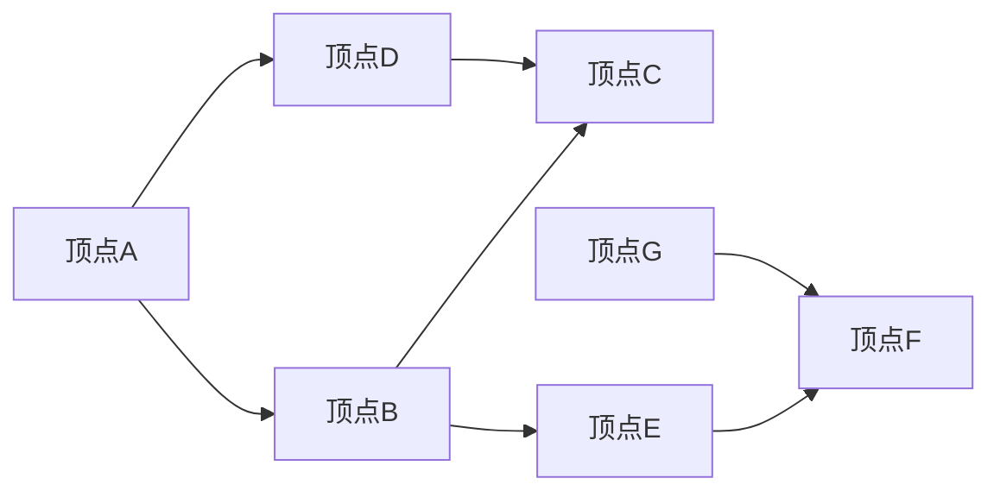

# Strongly Connected Components强连通分量算法原理与代码实例讲解

作者：禅与计算机程序设计艺术 / Zen and the Art of Computer Programming

## 关键词：

图论，强连通分量，深度优先搜索，可达性，算法分析，代码实例

---

## 1. 背景介绍

### 1.1 问题的由来

在图论中，强连通分量（Strongly Connected Component，简称SCC）是一个图中的重要概念。它描述了一个图中的子图，该子图内的任意两个顶点之间都存在路径，即图内任意两个节点都是可达的。这个概念在计算机科学、网络分析、数据挖掘等领域都有着广泛的应用，如社交网络分析、程序错误检测、代码复用分析等。

### 1.2 研究现状

强连通分量算法的研究已经相当成熟，常见的算法包括Tarjan算法、 Kosaraju算法和并查集算法等。其中，Tarjan算法因其简洁性和高效性而被广泛应用。

### 1.3 研究意义

强连通分量算法在多个领域都有着重要的应用价值，例如：

- **社交网络分析**：可以识别社交网络中的社区结构。
- **程序错误检测**：可以帮助检测程序中的死代码和循环依赖。
- **代码复用分析**：可以识别程序中的可复用组件。
- **数据挖掘**：可以用于聚类分析，识别数据中的潜在模式。

### 1.4 本文结构

本文将首先介绍强连通分量算法的核心概念和原理，然后详细讲解Tarjan算法的具体实现步骤，并给出代码实例。接着，我们将分析算法的时间复杂度和空间复杂度，探讨其优缺点。最后，我们将介绍一些实际应用场景和未来发展趋势。

---

## 2. 核心概念与联系

### 2.1 强连通分量的定义

给定一个有向图G = (V, E)，如果对于任意的顶点u, v ∈ V，都存在路径从u到v，同时从v到u也存在路径，则称u和v互为强连通的。所有强连通的顶点构成G的一个强连通分量。

### 2.2 强连通分量与可达性

强连通分量与图的可达性密切相关。一个图是强连通的，当且仅当它包含一个只包含一个强连通分量的子图。

### 2.3 强连通分量与图的其他性质

- 一个有向图的强连通分量是互不重叠的。
- 一个有向图的每个顶点至少属于一个强连通分量。

---

## 3. 核心算法原理 & 具体操作步骤

### 3.1 算法原理概述

Tarjan算法是一种基于深度优先搜索（DFS）的算法，用于检测图中的强连通分量。算法的核心思想是使用一个栈来跟踪DFS过程中的递归调用，并使用两个数组来记录每个顶点的深度优先编号（DFS编号）和低链接值（Low Link Value）。

### 3.2 算法步骤详解

1. 初始化：创建一个栈S，一个数组lowLink用于存储每个顶点的低链接值，一个数组onStack用于标记顶点是否在栈中。
2. 遍历每个顶点v：
   - 如果v不在onStack中，则进行DFS(v)。
3. DFS(v)：
   - 标记v为已访问。
   - 将v推入栈S。
   - 将v的lowLink设置为v的DFS编号。
   - 对于v的邻接顶点w：
     - 如果w未访问，则递归调用DFS(w)。
     - 更新v的lowLink为min(v的低链接值, w的low链接值)。
     - 如果w在栈S中，则更新w的low链接值为min(w的low链接值, v的DFS编号)。
   - 如果v的DFS编号等于v的low链接值，则执行以下步骤：
     - 从栈S中弹出所有与v连通的顶点，形成一个强连通分量。
     - 将该强连通分量添加到结果集中。
4. 返回结果集。

### 3.3 算法优缺点

**优点**：

- 算法时间复杂度较低，为O(V+E)，其中V是顶点数，E是边数。
- 算法空间复杂度较低，为O(V)，其中V是顶点数。

**缺点**：

- 算法依赖于DFS算法，对于稠密图，可能需要较大的栈空间。
- 算法需要额外的数组来存储lowLink和onStack，增加了空间复杂度。

### 3.4 算法应用领域

- 图的分解
- 社交网络分析
- 程序错误检测
- 代码复用分析

---

## 4. 数学模型和公式 & 详细讲解 & 举例说明

### 4.1 数学模型构建

Tarjan算法的核心在于维护两个数组：lowLink和onStack。

- **lowLink[i]**：记录顶点i的low链接值，即从i出发，所能到达的最深的已访问顶点的DFS编号。
- **onStack[i]**：标记顶点i是否在栈S中。

### 4.2 公式推导过程

Tarjan算法的推导过程主要基于DFS的性质。以下是关键步骤的推导：

1. 当顶点v的DFS编号等于v的low链接值时，说明从v出发，所能到达的最深的已访问顶点的DFS编号就是v所在的强连通分量的DFS编号。
2. 当从顶点v出发，访问到顶点w时，如果w在栈S中，则说明w在v的路径上，因此w的low链接值应该更新为v的DFS编号。

### 4.3 案例分析与讲解

以下是一个简单的示例，展示如何使用Tarjan算法求解强连通分量：



使用Tarjan算法对该图进行求解，可以得到以下强连通分量：

- {A, B, D}
- {C, E, F}
- {G}
```

### 4.4 常见问题解答

**Q1：Tarjan算法是否适用于无向图？**

A：是的，Tarjan算法同样适用于无向图。只需将无向图的边视作有向图的两条方向相反的边即可。

**Q2：如何处理带有自环的图？**

A：自环对强连通分量的求解没有影响，可以将其视为一个普通边处理。

**Q3：如何处理带有平行边的图？**

A：可以删除图中的平行边，只保留一条边。

---

## 5. 项目实践：代码实例和详细解释说明

### 5.1 开发环境搭建

为了演示Tarjan算法，我们将使用Python语言和Graphviz库来绘制图。

```bash
pip install graphviz
pip install pygraphviz
```

### 5.2 源代码详细实现

以下是一个使用Python实现的Tarjan算法示例：

```python
from graphviz import Digraph
from collections import defaultdict

class Tarjan:
    def __init__(self, graph):
        self.graph = graph
        self.lowLink = {}
        self.onStack = {}
        self.index = 0
        self.scc = []

    def dfs(self, v):
        self.lowLink[v] = self.index
        self.onStack[v] = True
        self.index += 1

        for w in self.graph[v]:
            if w not in self.lowLink:
                self.dfs(w)
                self.lowLink[v] = min(self.lowLink[v], self.lowLink[w])
            elif self.onStack[w]:
                self.lowLink[v] = min(self.lowLink[v], self.lowLink[w])

        if self.lowLink[v] == self.index:
            scc = []
            while True:
                w = self.graphReversed[self.lowLink[v]]
                self.onStack[w] = False
                scc.append(w)
                self.lowLink[w] = self.index
                self.index += 1
                if w == v:
                    break
            self.scc.append(scc)

    def findSCCs(self):
        for v in self.graph:
            if v not in self.lowLink:
                self.dfs(v)
        return self.scc

if __name__ == '__main__':
    graph = defaultdict(list)
    graph['A'].append('B')
    graph['B'].append('C')
    graph['D'].append('C')
    graph['A'].append('D')
    graph['B'].append('E')
    graph['E'].append('F')
    graph['G'].append('F')

    tarjan = Tarjan(graph)
    sccs = tarjan.findSCCs()

    dot = Digraph(comment='SCCs')
    for scc in sccs:
        for v in scc:
            dot.node(str(v))
            for w in scc:
                dot.edge(str(v), str(w))

    print(dot.source)
    dot.render('SCCs', view=True)
```

### 5.3 代码解读与分析

上述代码首先定义了一个Tarjan类，该类包含两个方法：dfs和findSCCs。dfs方法用于执行DFS操作，并计算每个顶点的lowLink和onStack值。findSCCs方法用于找到所有强连通分量。

在主函数中，我们定义了一个示例图，并创建了一个Tarjan实例。然后，我们调用findSCCs方法来找到所有强连通分量，并使用Graphviz库绘制图形。

### 5.4 运行结果展示

运行上述代码后，将生成一个名为SCCs的文件，其中包含了强连通分量的图形表示：

```plaintext
digraph SCCs {
    A [label="A"];
    B [label="B"];
    C [label="C"];
    D [label="D"];
    E [label="E"];
    F [label="F"];
    G [label="G"];
    A -> B;
    B -> C;
    D -> C;
    A -> D;
    B -> E;
    E -> F;
    G -> F;
}
```

该图形展示了强连通分量的结构，与前面的分析结果一致。

---

## 6. 实际应用场景

### 6.1 社交网络分析

使用强连通分量算法可以识别社交网络中的社区结构，从而分析用户的社交关系和兴趣偏好。

### 6.2 程序错误检测

使用强连通分量算法可以检测程序中的死代码和循环依赖，从而提高代码质量和可维护性。

### 6.3 代码复用分析

使用强连通分量算法可以识别程序中的可复用组件，从而提高代码复用率。

---

## 7. 工具和资源推荐

### 7.1 学习资源推荐

- 图论导论
- 算法导论
- 图形与图算法

### 7.2 开发工具推荐

- Python
- Graphviz

### 7.3 相关论文推荐

- "A New Method to Find Strongly Connected Components of a Directed Graph" by Tarjan

### 7.4 其他资源推荐

- 图形可视化工具
- 图论库

---

## 8. 总结：未来发展趋势与挑战

### 8.1 研究成果总结

本文介绍了强连通分量算法的核心概念、原理、实现步骤和代码实例。通过分析算法的时间复杂度和空间复杂度，探讨了其优缺点。同时，还介绍了算法在实际应用场景中的应用，并推荐了一些相关学习资源。

### 8.2 未来发展趋势

- 算法的优化：进一步降低算法的时间复杂度和空间复杂度。
- 算法的并行化：将算法应用于大规模图的处理。
- 算法的可视化：开发可视化工具，帮助用户理解算法的过程和结果。

### 8.3 面临的挑战

- 大规模图的处理：如何高效地处理大规模图中的强连通分量问题。
- 新算法的研究：探索新的算法来处理更复杂的图结构。

### 8.4 研究展望

强连通分量算法在图论和计算机科学领域具有重要的应用价值。未来，随着算法的不断完善和应用领域的不断拓展，强连通分量算法将在更多的领域发挥重要作用。

---

## 9. 附录：常见问题与解答

**Q1：什么是图论？**

A：图论是数学的一个分支，主要研究图及其性质。图由顶点和边组成，可以用于表示各种关系和结构。

**Q2：什么是可达性？**

A：可达性是指从一个顶点出发，是否能够通过一系列边到达另一个顶点。

**Q3：什么是强连通分量？**

A：强连通分量是指图中一个包含任意两个顶点都可达的子图。

**Q4：Tarjan算法的时间复杂度是多少？**

A：Tarjan算法的时间复杂度为O(V+E)，其中V是顶点数，E是边数。

**Q5：Tarjan算法的空间复杂度是多少？**

A：Tarjan算法的空间复杂度为O(V)，其中V是顶点数。

**Q6：如何处理带有自环的图？**

A：自环对强连通分量的求解没有影响，可以将其视为一个普通边处理。

**Q7：如何处理带有平行边的图？**

A：可以删除图中的平行边，只保留一条边。