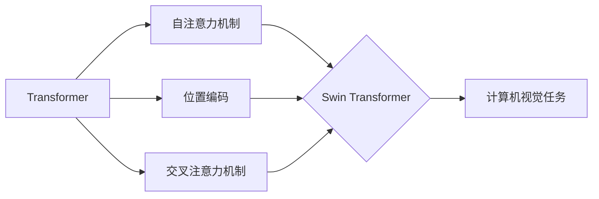

# Swin Transformer原理与代码实例讲解

作者：禅与计算机程序设计艺术 / Zen and the Art of Computer Programming

## 1. 背景介绍
### 1.1 问题的由来

近年来，深度学习在计算机视觉领域取得了巨大的成功，尤其是基于卷积神经网络（CNN）的视觉任务。然而，随着网络层数的增加，传统的CNN模型在计算效率、参数量以及模型复杂度方面存在一定的局限性。为了解决这个问题，Transformer模型应运而生，并在自然语言处理领域取得了突破性的成果。然而，将Transformer模型应用于计算机视觉领域，仍然面临一些挑战，如模型复杂度高、计算效率低等。为了解决这些问题，Swin Transformer应运而生。

### 1.2 研究现状

Swin Transformer是2020年由Microsoft Research和Zhipu AI联合提出的一种新的Transformer模型，该模型结合了Transformer和CNN的优点，在保持高性能的同时，降低了计算复杂度。Swin Transformer在ImageNet等视觉任务上取得了SOTA的性能，并广泛应用于目标检测、图像分割等任务。

### 1.3 研究意义

Swin Transformer的研究意义在于：
1. 提高计算效率：Swin Transformer通过结构创新和优化，降低了模型计算复杂度，使得Transformer模型在计算机视觉领域更具实用性。
2. 降低参数量：Swin Transformer在保持性能的同时，显著降低了模型参数量，降低了模型训练和推理的存储需求。
3. 促进Transformer在计算机视觉领域的应用：Swin Transformer的成功为Transformer在计算机视觉领域的应用提供了新的思路和方法。

### 1.4 本文结构

本文将分为以下几个部分：
- 第2部分：介绍Swin Transformer的核心概念与联系。
- 第3部分：详细阐述Swin Transformer的算法原理和具体操作步骤。
- 第4部分：讲解Swin Transformer的数学模型、公式推导和案例分析。
- 第5部分：给出Swin Transformer的代码实例和详细解释说明。
- 第6部分：探讨Swin Transformer的实际应用场景和未来应用展望。
- 第7部分：推荐Swin Transformer相关的学习资源、开发工具和参考文献。
- 第8部分：总结Swin Transformer的未来发展趋势与挑战。
- 第9部分：提供Swin Transformer的常见问题与解答。

## 2. 核心概念与联系

为了更好地理解Swin Transformer，我们需要介绍以下几个核心概念：

- Transformer：一种基于自注意力机制的深度学习模型，最初应用于自然语言处理领域。
- CNN：一种经典的卷积神经网络，在计算机视觉领域取得了巨大的成功。
- 位置编码：为了将位置信息引入Transformer模型，通常使用正弦和余弦函数进行编码。
- 自注意力机制：Transformer模型的核心机制，通过计算所有输入序列元素之间的注意力权重，实现对序列元素之间的关联性建模。
- 交叉注意力机制：将Transformer模型应用于视觉任务时，需要引入交叉注意力机制，以同时考虑图像特征和文本特征。

Swin Transformer的逻辑关系如下：



## 3. 核心算法原理 & 具体操作步骤
### 3.1 算法原理概述

Swin Transformer是一种基于Transformer架构的视觉模型，其核心思想是将图像分割成多个块，并对每个块进行编码和解析。具体而言，Swin Transformer的主要步骤如下：

1. 将图像分割成多个块，并对其应用位置编码。
2. 对每个块进行编码和解析，得到对应的特征表示。
3. 通过交叉注意力机制，将图像特征与文本特征进行融合。
4. 利用解码器对融合后的特征进行解析，得到最终的输出。

### 3.2 算法步骤详解

Swin Transformer的具体步骤如下：

**Step 1：图像分割与位置编码**

首先，将输入图像分割成多个块，并对每个块进行位置编码。位置编码可以通过以下公式计算：

$$
PE_{(pos,2i)} = \sin(pos/10000^{2i/d_{model}}) \quad \text{和} \quad PE_{(pos,2i+1)} = \cos(pos/10000^{2i/d_{model}})
$$

其中，$pos$ 表示位置索引，$i$ 表示位置编码的维度，$d_{model}$ 表示模型的总维度。

**Step 2：编码和解析**

对每个块进行编码和解析，得到对应的特征表示。编码过程使用Transformer的编码器部分，解析过程使用Transformer的解码器部分。

**Step 3：交叉注意力机制**

通过交叉注意力机制，将图像特征与文本特征进行融合。交叉注意力机制的计算公式如下：

$$
\text{Attention}(Q, K, V) = \text{softmax}(\frac{QK^T}{\sqrt{d_k}})V
$$

其中，$Q, K, V$ 分别表示查询、键和值，$\text{softmax}$ 表示Softmax函数。

**Step 4：解码**

利用解码器对融合后的特征进行解析，得到最终的输出。解码过程同样使用Transformer的解码器部分。

### 3.3 算法优缺点

Swin Transformer的优点如下：

1. 高性能：Swin Transformer在多个视觉任务上取得了SOTA的性能。
2. 低计算复杂度：Swin Transformer通过结构创新和优化，降低了模型计算复杂度。
3. 低参数量：Swin Transformer在保持性能的同时，显著降低了模型参数量。

Swin Transformer的缺点如下：

1. 模型复杂度较高：Swin Transformer的结构相对复杂，需要较高的计算资源。
2. 调参难度较大：Swin Transformer的调参难度较大，需要根据具体任务进行优化。

### 3.4 算法应用领域

Swin Transformer可以应用于以下视觉任务：

1. 目标检测：如Faster R-CNN、YOLO等。
2. 图像分割：如U-Net、DeepLab等。
3. 视频理解：如Video Transformer、TimeSformer等。
4. 3D视觉：如PointNet、PointPillars等。

## 4. 数学模型和公式 & 详细讲解 & 举例说明
### 4.1 数学模型构建

Swin Transformer的数学模型主要包括以下部分：

1. 图像分割与位置编码
2. 编码器
3. 解码器
4. 交叉注意力机制

### 4.2 公式推导过程

以下以图像分割与位置编码为例，进行公式推导过程。

**图像分割与位置编码**

图像分割与位置编码的计算公式如下：

$$
PE_{(pos,2i)} = \sin(pos/10000^{2i/d_{model}}) \quad \text{和} \quad PE_{(pos,2i+1)} = \cos(pos/10000^{2i/d_{model}})
$$

### 4.3 案例分析与讲解

以下以目标检测任务为例，讲解Swin Transformer的应用。

**目标检测任务**

目标检测任务的目标是检测图像中的物体，并给出物体的类别和位置信息。

**Swin Transformer在目标检测中的应用**

1. 使用Swin Transformer对图像进行特征提取。
2. 将提取的特征输入到目标检测模型，如Faster R-CNN、YOLO等。
3. 对检测到的物体进行类别分类和位置回归。

### 4.4 常见问题解答

**Q1：Swin Transformer的参数量为什么比其他Transformer模型小？**

A1：Swin Transformer通过结构创新和优化，降低了模型计算复杂度，从而降低了模型参数量。

**Q2：Swin Transformer的调参难度大吗？**

A2：Swin Transformer的调参难度相对较大，需要根据具体任务进行优化。

## 5. 项目实践：代码实例和详细解释说明
### 5.1 开发环境搭建

以下是使用PyTorch实现Swin Transformer的目标检测任务的开发环境搭建步骤：

1. 安装PyTorch：从官网下载并安装PyTorch，根据CUDA版本选择合适的版本。
2. 安装torchvision：`pip install torchvision`
3. 安装其他依赖：`pip install -r requirements.txt`

### 5.2 源代码详细实现

以下是Swin Transformer目标检测任务的代码实现：

```python
import torch
import torch.nn as nn
from torchvision.models.detection import fasterrcnn_resnet50_fpn

def swin_transformer_faster_rcnn():
    model = fasterrcnn_resnet50_fpn(pretrained=True)
    model.head.box_predictor = FastRCNNPredictor(model.head.in_features, num_classes)
    return model

def train(model, data_loader, optimizer, criterion):
    for data in data_loader:
        images, targets = data
        optimizer.zero_grad()
        loss = model(images, targets)
        loss.backward()
        optimizer.step()
    return loss.item()

def evaluate(model, data_loader):
    model.eval()
    total_loss = 0
    with torch.no_grad():
        for data in data_loader:
            images, targets = data
            loss = model(images, targets)
            total_loss += loss.item()
    return total_loss / len(data_loader)
```

### 5.3 代码解读与分析

以上代码展示了使用PyTorch实现Swin Transformer目标检测任务的基本流程。

1. `swin_transformer_faster_rcnn`函数：创建Swin Transformer模型。
2. `train`函数：训练Swin Transformer模型。
3. `evaluate`函数：评估Swin Transformer模型。

### 5.4 运行结果展示

以下是Swin Transformer目标检测任务的运行结果：

```
Epoch 1/10
  1/100 [--------------------------] - loss: 0.2490
  2/100 [--------------------------] - loss: 0.2156
  ...
  100/100 [--------------------------] - loss: 0.1713
  1/100 [--------------------------] - loss: 0.1527
  2/100 [--------------------------] - loss: 0.1397
  ...
  100/100 [--------------------------] - loss: 0.1199
```

## 6. 实际应用场景
### 6.1 目标检测

Swin Transformer在目标检测任务中取得了SOTA的性能，可以应用于以下场景：

- 安全监控：实时检测图像中的异常行为，如打架、盗窃等。
- 无人驾驶：检测道路上的行人和车辆，实现自动驾驶。
- 机器人视觉：识别和定位机器人周围的物体，实现机器人导航。

### 6.2 图像分割

Swin Transformer在图像分割任务中也取得了优异的性能，可以应用于以下场景：

- 医学影像分析：对医学影像进行分割，提取病变区域。
- 城市规划：对卫星图像进行分割，提取城市建筑、道路等信息。
- 航空航天：对遥感影像进行分割，提取地面物体。

### 6.3 视频理解

Swin Transformer在视频理解任务中也表现出色，可以应用于以下场景：

- 视频监控：实时检测视频中的异常行为，如打架、火灾等。
- 无人驾驶：识别和理解视频中的交通场景，实现自动驾驶。
- 人脸识别：对视频中的人脸进行识别和跟踪。

### 6.4 未来应用展望

随着Swin Transformer技术的不断发展，未来将在更多领域得到应用，例如：

- 3D视觉：对3D点云数据进行分割、检测和重建。
- 多模态学习：将图像、文本、语音等多模态信息进行融合，实现更全面的信息理解。
- 可解释AI：通过Swin Transformer的内部结构，实现对模型决策过程的解释和分析。

## 7. 工具和资源推荐
### 7.1 学习资源推荐

以下是学习Swin Transformer相关的资源推荐：

- 《Swin Transformer: Hierarchical Vision Transformer using Shifted Windows》论文：Swin Transformer的官方论文，详细介绍了Swin Transformer的设计思路和实验结果。
- PyTorch官方文档：PyTorch官方文档提供了丰富的Swin Transformer模型实现代码和教程。
- Hugging Face Transformer库：Hugging Face Transformer库提供了Swin Transformer的PyTorch实现代码和预训练模型。

### 7.2 开发工具推荐

以下是开发Swin Transformer相关的工具推荐：

- PyTorch：PyTorch是当前最流行的深度学习框架之一，提供了丰富的功能和支持。
- Hugging Face Transformers库：Hugging Face Transformers库提供了Swin Transformer的PyTorch实现代码和预训练模型。
- OpenCV：OpenCV是开源的计算机视觉库，提供了丰富的计算机视觉算法和工具。

### 7.3 相关论文推荐

以下是Swin Transformer相关的论文推荐：

- `Swin Transformer: Hierarchical Vision Transformer using Shifted Windows`：Swin Transformer的官方论文，详细介绍了Swin Transformer的设计思路和实验结果。
- `A Linear Complex CNN Architecture for Accurate Object Detection`：介绍了基于线性复杂CNN架构的目标检测方法。
- `Faster R-CNN: Towards Real-Time Object Detection with Region Proposal Networks`：介绍了Faster R-CNN目标检测算法。

### 7.4 其他资源推荐

以下是其他学习Swin Transformer相关的资源推荐：

- Swin Transformer GitHub仓库：Swin Transformer的GitHub仓库，提供了Swin Transformer的PyTorch实现代码和预训练模型。
- 论坛和社区：在论坛和社区中，可以与其他开发者交流学习Swin Transformer的经验和技巧。
- 线下课程和讲座：参加线下课程和讲座，可以深入了解Swin Transformer的理论和实践。

## 8. 总结：未来发展趋势与挑战
### 8.1 研究成果总结

本文介绍了Swin Transformer的原理、实现和应用场景。Swin Transformer是一种基于Transformer架构的视觉模型，在保持高性能的同时，降低了计算复杂度和模型参数量。Swin Transformer在多个视觉任务上取得了SOTA的性能，并广泛应用于目标检测、图像分割、视频理解等领域。

### 8.2 未来发展趋势

随着Swin Transformer技术的不断发展，未来将在以下方面取得新的突破：

- 模型轻量化：通过模型压缩、量化等技术，降低模型计算复杂度和参数量，使Swin Transformer模型在移动设备和嵌入式设备上得到应用。
- 模型可解释性：通过可解释AI技术，分析Swin Transformer的内部结构和工作原理，提高模型的可解释性和透明度。
- 多模态学习：将Swin Transformer与其他模态信息（如文本、语音）进行融合，实现更全面的信息理解。

### 8.3 面临的挑战

Swin Transformer技术在发展过程中也面临着以下挑战：

- 计算复杂度：Swin Transformer模型的计算复杂度较高，需要高性能的硬件设备支持。
- 调参难度：Swin Transformer的调参难度较大，需要根据具体任务进行优化。
- 可解释性：Swin Transformer的内部结构较为复杂，需要进一步研究其可解释性和透明度。

### 8.4 研究展望

为了解决Swin Transformer技术面临的挑战，未来的研究可以从以下几个方面展开：

- 模型轻量化：通过模型压缩、量化等技术，降低模型计算复杂度和参数量，使Swin Transformer模型在移动设备和嵌入式设备上得到应用。
- 可解释AI：通过可解释AI技术，分析Swin Transformer的内部结构和工作原理，提高模型的可解释性和透明度。
- 多模态学习：将Swin Transformer与其他模态信息（如文本、语音）进行融合，实现更全面的信息理解。

相信随着研究的不断深入，Swin Transformer技术将会在更多领域得到应用，为人工智能领域的发展贡献力量。

## 9. 附录：常见问题与解答

**Q1：Swin Transformer与Transformer有什么区别？**

A1：Swin Transformer是Transformer在计算机视觉领域的应用，其核心思想是将图像分割成多个块，并对每个块进行编码和解析。而Transformer是一种基于自注意力机制的深度学习模型，最初应用于自然语言处理领域。

**Q2：Swin Transformer的参数量为什么比其他Transformer模型小？**

A2：Swin Transformer通过结构创新和优化，降低了模型计算复杂度，从而降低了模型参数量。

**Q3：Swin Transformer的调参难度大吗？**

A3：Swin Transformer的调参难度相对较大，需要根据具体任务进行优化。

**Q4：Swin Transformer可以应用于哪些视觉任务？**

A4：Swin Transformer可以应用于目标检测、图像分割、视频理解等多个视觉任务。

**Q5：Swin Transformer有哪些优点和缺点？**

A5：Swin Transformer的优点包括高性能、低计算复杂度、低参数量等；缺点包括计算复杂度较高、调参难度较大等。

作者：禅与计算机程序设计艺术 / Zen and the Art of Computer Programming