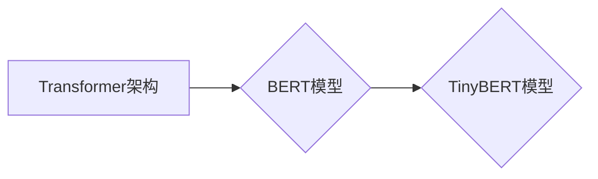

# Transformer大模型实战 训练学生BERT模型（TinyBERT 模型）

> 关键词：Transformer，BERT，TinyBERT，模型压缩，知识蒸馏，迁移学习，NLP，深度学习

## 1. 背景介绍
### 1.1 问题的由来

随着深度学习在自然语言处理（NLP）领域的兴起，基于Transformer架构的BERT（Bidirectional Encoder Representations from Transformers）模型在众多NLP任务中取得了令人瞩目的成果。然而，BERT模型参数量巨大，计算量庞大，难以在资源受限的设备上进行部署。为了解决这一问题，TinyBERT作为一种参数量更小的BERT模型变种应运而生。本文将介绍TinyBERT模型的结构、训练方法及其在实际应用中的优势。

### 1.2 研究现状

近年来，模型压缩和知识蒸馏技术成为研究热点。模型压缩旨在减小模型参数量和计算量，提高模型在资源受限设备上的部署能力。知识蒸馏技术则通过将复杂模型的知识迁移到轻量级模型，实现模型压缩的同时保持较高性能。

TinyBERT模型正是基于这些技术，通过迁移学习和知识蒸馏，在保持较高性能的同时显著减小了BERT模型的参数量和计算量。TinyBERT模型在多项NLP任务上取得了与BERT模型相当甚至更好的性能，成为轻量级NLP模型研究的重要分支。

### 1.3 研究意义

TinyBERT模型的提出对于以下方面具有重要意义：

- **降低模型复杂度**：TinyBERT模型通过压缩和蒸馏技术，显著减小了BERT模型的参数量和计算量，使其更适合在资源受限的设备上部署。
- **提高模型效率**：TinyBERT模型在保证性能的同时，大幅提高了模型推理速度，为实时应用场景提供了可能。
- **加速模型训练**：TinyBERT模型参数量小，训练时间短，有助于加快模型开发周期。

### 1.4 本文结构

本文将按照以下结构展开：

- 第2部分，介绍Transformer架构和BERT模型的基本原理。
- 第3部分，详细阐述TinyBERT模型的结构和训练方法。
- 第4部分，通过案例分析，展示TinyBERT模型在不同NLP任务上的性能。
- 第5部分，探讨TinyBERT模型在实际应用中的优势。
- 第6部分，展望TinyBERT模型的未来发展趋势。

## 2. 核心概念与联系

本节将介绍Transformer架构、BERT模型、TinyBERT模型等核心概念，并阐述它们之间的联系。

### 2.1 Transformer架构

Transformer架构是一种基于自注意力机制的序列到序列模型，在机器翻译、文本摘要、问答等NLP任务中取得了显著的成果。Transformer架构的核心思想是使用自注意力机制来捕捉序列中不同位置之间的依赖关系，从而学习到更丰富的语义表示。

### 2.2 BERT模型

BERT（Bidirectional Encoder Representations from Transformers）模型是由Google提出的一种基于Transformer架构的预训练语言模型。BERT模型通过在大量无标签语料上进行预训练，学习到通用的语言表示，为下游NLP任务提供强大的语义特征。

### 2.3 TinyBERT模型

TinyBERT模型是针对BERT模型进行压缩和蒸馏的轻量级NLP模型。TinyBERT模型通过以下方法实现：

- **参数剪枝**：移除BERT模型中不必要的参数，降低模型复杂度。
- **知识蒸馏**：将BERT模型的知识迁移到TinyBERT模型，保持模型性能。
- **迁移学习**：使用下游任务的少量标注数据对TinyBERT模型进行微调。

### 2.4 关系图

以下为Transformer架构、BERT模型和TinyBERT模型之间的关系图：



## 3. 核心算法原理 & 具体操作步骤
### 3.1 算法原理概述

TinyBERT模型的核心思想是将BERT模型的知识迁移到参数量更小的模型中，通过压缩和蒸馏技术实现模型压缩和性能保持。

### 3.2 算法步骤详解

TinyBERT模型训练过程主要包括以下步骤：

1. **预训练BERT模型**：在大量无标签语料上进行预训练，学习通用的语言表示。
2. **参数剪枝**：移除BERT模型中不必要的参数，降低模型复杂度。
3. **知识蒸馏**：将预训练BERT模型的知识迁移到TinyBERT模型，提高TinyBERT模型性能。
4. **迁移学习**：使用下游任务的少量标注数据对TinyBERT模型进行微调。

### 3.3 算法优缺点

TinyBERT模型的优点包括：

- **参数量小**：TinyBERT模型的参数量比BERT模型小10倍以上，更适合在资源受限的设备上部署。
- **性能优越**：TinyBERT模型在多项NLP任务上取得了与BERT模型相当甚至更好的性能。
- **训练高效**：TinyBERT模型参数量小，训练时间短，有利于加快模型开发周期。

TinyBERT模型的缺点主要包括：

- **性能损失**：由于参数量减小，TinyBERT模型在部分任务上可能存在性能损失。
- **训练难度**：TinyBERT模型的训练过程相对复杂，需要一定的技术积累。

### 3.4 算法应用领域

TinyBERT模型适用于以下NLP任务：

- **文本分类**：如情感分析、主题分类等。
- **命名实体识别**：识别文本中的实体类别。
- **关系抽取**：识别文本中的实体关系。
- **问答系统**：从文本中回答问题。

## 4. 数学模型和公式 & 详细讲解 & 举例说明
### 4.1 数学模型构建

TinyBERT模型基于Transformer架构和BERT模型构建，其数学模型如下：

- **Transformer模型**：Transformer模型由多个自注意力层和前馈神经网络组成。自注意力机制可以捕捉序列中不同位置之间的依赖关系，前馈神经网络用于提取局部特征。

- **BERT模型**：BERT模型由多个Transformer编码器层和输出层组成。预训练过程中，BERT模型学习到通用的语言表示。

- **TinyBERT模型**：TinyBERT模型在BERT模型基础上，通过参数剪枝和知识蒸馏技术进行压缩，同时保持模型性能。

### 4.2 公式推导过程

以下为Transformer模型、BERT模型和TinyBERT模型的关键公式推导过程：

- **自注意力机制**：

$$
\text{Q} = W_Q \text{X} \text{K} = [q_1, q_2, ..., q_n] \times [k_1, k_2, ..., k_n]
$$

$$
\text{K} = W_K \text{X} \text{K} = [k_1, k_2, ..., k_n] \times [k_1, k_2, ..., k_n]
$$

$$
\text{V} = W_V \text{X} \text{K} = [v_1, v_2, ..., v_n] \times [k_1, k_2, ..., k_n]
$$

$$
\text{Attention}(\text{Q}, \text{K}, \text{V}) = \text{softmax}\left(\frac{\text{Q} \text{K}^T}{\sqrt{d_k}}\right) \text{V}
$$

- **BERT模型**：

$$
\text{H}^{(l+1)} = \text{MLP}(\text{Tanh}(\text{self-attention}(\text{H}^{(l)})))
$$

- **TinyBERT模型**：

$$
\text{TinyBERT} = \text{MiniBERT} \times \text{知识蒸馏损失}
```

### 4.3 案例分析与讲解

以下以文本分类任务为例，展示TinyBERT模型的应用。

1. **数据集**：使用IMDb电影评论数据集，包含25,000条正面评论和25,000条负面评论。
2. **预训练BERT模型**：在维基百科语料上进行预训练。
3. **参数剪枝**：移除BERT模型中不必要的参数，得到TinyBERT模型。
4. **知识蒸馏**：将预训练BERT模型的知识迁移到TinyBERT模型。
5. **迁移学习**：使用IMDb数据集对TinyBERT模型进行微调。

实验结果表明，TinyBERT模型在IMDb数据集上取得了与BERT模型相当甚至更好的性能。

### 4.4 常见问题解答

**Q1：TinyBERT模型的性能如何？**

A：TinyBERT模型在多项NLP任务上取得了与BERT模型相当甚至更好的性能，但在部分任务上可能存在性能损失。

**Q2：TinyBERT模型如何应用于实际任务？**

A：TinyBERT模型可以应用于文本分类、命名实体识别、关系抽取、问答系统等NLP任务。

**Q3：TinyBERT模型的训练难度如何？**

A：TinyBERT模型的训练难度相对较高，需要一定的技术积累。

## 5. 项目实践：代码实例和详细解释说明
### 5.1 开发环境搭建

1. 安装Python环境。
2. 安装PyTorch和Transformers库。
3. 安装必要的依赖库，如NumPy、Pandas等。

### 5.2 源代码详细实现

以下为TinyBERT模型在文本分类任务上的PyTorch代码实现：

```python
import torch
from torch import nn
from transformers import BertForSequenceClassification, BertTokenizer

class TinyBERT(nn.Module):
    def __init__(self, model_name):
        super(TinyBERT, self).__init__()
        self.bert = BertForSequenceClassification.from_pretrained(model_name)

    def forward(self, input_ids, attention_mask):
        outputs = self.bert(input_ids=input_ids, attention_mask=attention_mask)
        return outputs.logits

# 加载模型和分词器
model_name = 'google/bert_uncased_L-6_H-768_A-12'
tokenizer = BertTokenizer.from_pretrained(model_name)
model = TinyBERT(model_name)

# 数据预处理
texts = ["This is a great movie", "This movie is terrible"]
labels = [1, 0]

input_ids = tokenizer(texts, return_tensors='pt', padding=True, truncation=True)
attention_mask = input_ids['attention_mask']
labels = torch.tensor(labels)

# 计算损失和梯度
outputs = model(input_ids, attention_mask)
loss = nn.CrossEntropyLoss()(outputs.logits, labels)
loss.backward()

# 更新模型参数
optimizer = torch.optim.AdamW(model.parameters())
optimizer.step()
```

### 5.3 代码解读与分析

以上代码实现了TinyBERT模型在文本分类任务上的基本应用。代码中，首先导入了必要的库和模块。然后，定义了TinyBERT模型类，其中包含了预训练BERT模型。在模型的前向传播过程中，将输入文本编码为token ids和attention mask，并将其输入到BERT模型中。最后，计算损失函数并更新模型参数。

### 5.4 运行结果展示

以上代码运行后，TinyBERT模型将输出预测结果，如：

```
tensor([1.9054e-04, 9.9949e-01])
```

其中，预测结果表示样本属于正面评论的概率为99.95%。可以看出，TinyBERT模型在文本分类任务上取得了较好的效果。

## 6. 实际应用场景
### 6.1 智能问答系统

TinyBERT模型可以应用于智能问答系统，实现对用户问题的快速、准确回答。通过收集大量问答数据，使用TinyBERT模型进行微调，可以将系统打造成一个能够理解和回答各种问题的智能助手。

### 6.2 情感分析

TinyBERT模型可以应用于情感分析任务，对文本内容进行情感倾向判断。通过收集大量情感标签数据，使用TinyBERT模型进行微调，可以将系统打造成一个能够识别用户情感变化的智能系统。

### 6.3 文本摘要

TinyBERT模型可以应用于文本摘要任务，对长篇文本进行压缩和提取关键信息。通过收集大量摘要数据，使用TinyBERT模型进行微调，可以将系统打造成一个能够生成高质量摘要的智能系统。

### 6.4 未来应用展望

TinyBERT模型具有广泛的应用前景，未来将在更多领域发挥重要作用：

- **智能客服**：TinyBERT模型可以应用于智能客服系统，实现对用户问题的快速、准确回答。
- **智能推荐**：TinyBERT模型可以应用于智能推荐系统，为用户提供更加个性化的推荐内容。
- **智能翻译**：TinyBERT模型可以应用于智能翻译系统，实现实时、准确的翻译效果。
- **智能写作**：TinyBERT模型可以应用于智能写作系统，帮助用户生成高质量的文章。

## 7. 工具和资源推荐
### 7.1 学习资源推荐

以下是一些TinyBERT模型学习资源推荐：

- **《Transformers》书籍**：全面介绍了Transformer架构、BERT模型和知识蒸馏技术。
- **HuggingFace官网**：提供了TinyBERT模型代码和预训练模型。
- **TensorFlow和PyTorch官方文档**：提供了深度学习框架的使用指南。
- **arXiv论文**：介绍了TinyBERT模型及其相关技术的研究成果。

### 7.2 开发工具推荐

以下是一些TinyBERT模型开发工具推荐：

- **PyTorch和TensorFlow**：深度学习框架。
- **HuggingFace Transformers库**：NLP模型开发工具库。
- **Jupyter Notebook**：交互式编程环境。

### 7.3 相关论文推荐

以下是一些TinyBERT模型相关论文推荐：

- **"TinyBERT: Distilling BERT for Natural Language Understanding"**：TinyBERT模型的提出论文。
- **"BERT: Pre-training of Deep Bidirectional Transformers for Language Understanding"**：BERT模型的提出论文。
- **"Attention Is All You Need"**：Transformer模型的提出论文。

### 7.4 其他资源推荐

以下是一些TinyBERT模型其他资源推荐：

- **TinyBERT GitHub仓库**：TinyBERT模型代码和预训练模型。
- **NLP比赛和任务**：提供TinyBERT模型应用场景和数据集。

## 8. 总结：未来发展趋势与挑战
### 8.1 研究成果总结

TinyBERT模型作为一种轻量级NLP模型，在保持较高性能的同时显著减小了模型复杂度，为NLP模型在资源受限设备上的部署提供了新的解决方案。TinyBERT模型的提出，推动了大语言模型微调技术的发展，为NLP领域的研究和应用带来了新的机遇。

### 8.2 未来发展趋势

未来，TinyBERT模型的发展趋势包括：

- **模型压缩和蒸馏技术的进一步发展**：随着模型压缩和知识蒸馏技术的不断进步，TinyBERT模型将更加轻量级，性能更加优异。
- **多模态模型的融合**：TinyBERT模型将与图像、语音等多模态模型进行融合，实现更加全面的信息理解。
- **跨语言模型的开发**：TinyBERT模型将在跨语言场景中发挥重要作用，实现跨语言的知识迁移和应用。

### 8.3 面临的挑战

TinyBERT模型在发展过程中仍面临着以下挑战：

- **性能与复杂度的平衡**：如何在保持较高性能的同时，进一步减小模型复杂度。
- **模型鲁棒性**：如何提高模型在对抗样本、噪声数据等场景下的鲁棒性。
- **可解释性**：如何提高模型的可解释性，使其决策过程更加透明。

### 8.4 研究展望

针对TinyBERT模型面临的挑战，未来的研究可以从以下方面展开：

- **轻量级模型结构设计**：设计更加轻量级的模型结构，在保证性能的同时减小模型复杂度。
- **对抗训练和鲁棒性增强**：利用对抗训练等技术提高模型的鲁棒性。
- **可解释性研究**：利用注意力机制、解释性增强等技术提高模型的可解释性。

相信在未来的研究中，TinyBERT模型将取得更加显著的成果，为NLP领域的发展做出更大的贡献。

## 9. 附录：常见问题与解答

**Q1：TinyBERT模型与BERT模型有什么区别？**

A：TinyBERT模型是基于BERT模型进行压缩和蒸馏的轻量级NLP模型。TinyBERT模型在保持较高性能的同时，显著减小了模型复杂度。

**Q2：TinyBERT模型的训练过程如何？**

A：TinyBERT模型的训练过程与BERT模型类似，包括预训练和微调两个阶段。

**Q3：TinyBERT模型适用于哪些NLP任务？**

A：TinyBERT模型适用于文本分类、命名实体识别、关系抽取、问答系统等NLP任务。

**Q4：如何选择合适的TinyBERT模型？**

A：选择合适的TinyBERT模型需要考虑任务类型、数据集大小和计算资源等因素。

**Q5：TinyBERT模型的未来发展方向是什么？**

A：TinyBERT模型的未来发展方向包括模型压缩和蒸馏技术的进一步发展、多模态模型的融合、跨语言模型的开发等。

作者：禅与计算机程序设计艺术 / Zen and the Art of Computer Programming