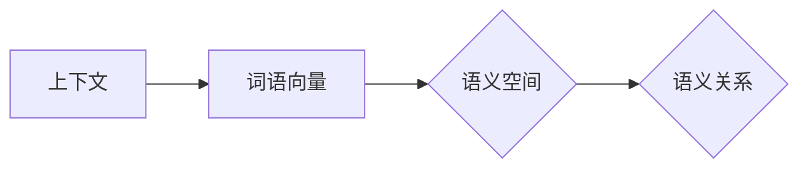

# Word2Vec：CBOW模型和Skip-Gram模型

作者：禅与计算机程序设计艺术 / Zen and the Art of Computer Programming

## 1. 背景介绍
### 1.1 问题的由来

随着互联网的飞速发展，自然语言处理（NLP）技术在信息检索、机器翻译、情感分析等领域的应用越来越广泛。然而，在处理大规模文本数据时，传统的词袋模型（Bag of Words）由于无法有效捕捉词语的语义信息，导致模型效果不佳。为了解决这一问题，Word2Vec应运而生。Word2Vec通过将词语映射到连续向量空间，有效地捕捉了词语的语义和上下文信息，极大地提升了NLP任务的性能。

### 1.2 研究现状

Word2Vec算法主要包括两种模型：连续词袋模型（Continuous Bag of Words，CBOW）和Skip-Gram模型。这两个模型分别从词语的上下文和词语本身出发，将词语映射到低维语义空间。近年来，随着深度学习技术的发展，Word2Vec算法也得到了进一步的改进和优化。

### 1.3 研究意义

Word2Vec算法在NLP领域具有重要的研究意义，主要体现在以下几个方面：

1. 提高了NLP任务的性能：Word2Vec能够有效地捕捉词语的语义和上下文信息，使得基于词语的NLP任务（如文本分类、情感分析等）的性能得到显著提升。
2. 降低了数据需求：相比于传统的词袋模型，Word2Vec在保持模型性能的同时，大幅降低了数据需求，使得在小规模数据集上也能取得不错的效果。
3. 促进了语义理解：Word2Vec将词语映射到连续向量空间，使得词语的语义关系和语义距离可以直观地表示，有助于提高语义理解能力。

### 1.4 本文结构

本文将首先介绍Word2Vec算法的核心概念和原理，然后分别讲解CBOW和Skip-Gram两种模型的算法步骤、优缺点和应用领域。接着，通过数学模型和公式对Word2Vec进行详细讲解，并结合实例进行分析。最后，介绍Word2Vec的实际应用场景和未来发展趋势。

## 2. 核心概念与联系
Word2Vec算法的核心思想是将词语映射到低维语义空间，使得词语的语义关系和语义距离可以直观地表示。以下是几个核心概念：

- 词语向量：将词语映射到低维语义空间的向量表示。
- 语义空间：词语向量所在的低维空间，用于表示词语的语义关系和语义距离。
- 上下文：词语周围的一定范围内的词语集合，用于学习词语的语义信息。
- 语义关系：词语之间的相似度或距离，用于衡量词语的语义关联程度。

Word2Vec算法的核心概念之间存在着紧密的联系，具体如下：

- 词语向量是Word2Vec算法的核心，它直接决定了词语的语义表示和语义关系。
- 语义空间是词语向量的载体，用于存储词语的语义信息，并方便进行语义计算。
- 上下文是学习词语语义信息的重要依据，通过分析词语的上下文，可以更好地理解词语的语义。
- 语义关系反映了词语之间的语义关联程度，是语义空间中词语向量之间距离的度量。

以下是一个Mermaid流程图，展示了Word2Vec的核心概念之间的关系：



## 3. 核心算法原理 & 具体操作步骤
### 3.1 算法原理概述

Word2Vec算法通过训练一个神经网络模型，将词语映射到低维语义空间。该模型通常包含一个输入层、一个隐藏层和一个输出层。输入层接收词语的向量表示，隐藏层用于提取词语的语义信息，输出层则输出词语的向量表示。

### 3.2 算法步骤详解

Word2Vec算法主要包括以下步骤：

1. 数据预处理：对文本数据进行分词、去停用词、词形还原等处理，得到词语序列。
2. 生成词语序列：将词语序列中的每个词语作为中心词，其上下文词语作为候选词，生成大量词语对。
3. 构建神经网络模型：根据词语对构建神经网络模型，输入层为中心词的向量表示，输出层为候选词的向量表示。
4. 训练模型：使用训练数据对神经网络模型进行训练，优化模型参数，使得模型能够正确预测词语对。
5. 词语向量表示：训练完成后，将词语的向量表示提取出来，用于后续的NLP任务。

### 3.3 算法优缺点

Word2Vec算法具有以下优点：

1. 语义表示能力强：Word2Vec能够将词语映射到低维语义空间，有效地捕捉词语的语义信息。
2. 计算效率高：相比于其他语义表示方法，Word2Vec的计算效率较高，便于在实际应用中使用。
3. 易于扩展：Word2Vec算法可以方便地扩展到多语种、多模态等场景。

Word2Vec算法也存在以下缺点：

1. 对噪声数据敏感：噪声数据会干扰模型训练，影响词语的语义表示。
2. 参数调整复杂：Word2Vec算法的参数较多，需要根据具体任务进行调整，比较繁琐。
3. 语义距离难以量化：Word2Vec算法难以直接衡量词语之间的语义距离，需要借助其他方法进行估计。

### 3.4 算法应用领域

Word2Vec算法在NLP领域有着广泛的应用，主要包括以下方面：

1. 文本分类：利用Word2Vec对词语进行语义表示，可以有效地提高文本分类的准确率。
2. 机器翻译：Word2Vec可以将源语言和目标语言的词语映射到相同的语义空间，从而提高机器翻译的准确性。
3. 情感分析：利用Word2Vec对词语进行语义表示，可以更好地理解文本的情感倾向。
4. 命名实体识别：Word2Vec可以有效地提取词语的语义信息，从而提高命名实体识别的准确率。

## 4. 数学模型和公式 & 详细讲解 & 举例说明
### 4.1 数学模型构建

Word2Vec算法的数学模型主要包括以下部分：

1. 词语向量表示：使用向量 $ \mathbf{w}_i $ 表示词语 $ i $，其中 $ \mathbf{w}_i \in \mathbb{R}^d $ 为 $ d $ 维向量。
2. 激活函数：使用Sigmoid函数作为激活函数，将输入向量映射到 $ [0,1] $ 范围内。
3. 损失函数：使用交叉熵损失函数，衡量模型预测与真实标签之间的差异。

### 4.2 公式推导过程

以下以CBOW模型为例，介绍Word2Vec算法的公式推导过程。

假设给定一个词语对 $ (w_i, w_j) $，其中 $ w_i $ 为中心词，$ w_j $ 为上下文词语。CBOW模型的目标是学习一个神经网络，使得模型能够预测中心词 $ w_i $ 在给定上下文词语 $ w_j $ 下的概率分布。

1. **输入层**：将中心词 $ w_i $ 的向量表示 $ \mathbf{w}_i $ 输入到神经网络。

2. **隐藏层**：神经网络隐层使用Sigmoid函数作为激活函数，将输入向量 $ \mathbf{w}_i $ 映射到 $ [0,1] $ 范围内。

   $$ \mathbf{h} = \sigma(\mathbf{W}\mathbf{w}_i + \mathbf{b}) $$

   其中 $ \mathbf{W} $ 为权重矩阵，$ \mathbf{b} $ 为偏置向量。

3. **输出层**：输出层使用softmax函数，将隐层输出 $ \mathbf{h} $ 映射到每个候选词语的概率分布。

   $$ \mathbf{p}(w_j | w_i) = \frac{e^{\mathbf{W}^T\mathbf{h}}}{\sum_{k=1}^{V}e^{\mathbf{W}^T\mathbf{h}_k}} $$

   其中 $ \mathbf{W}^T $ 为权重矩阵的转置，$ V $ 为词典大小。

4. **损失函数**：使用交叉熵损失函数，衡量模型预测与真实标签之间的差异。

   $$ L = -\sum_{j=1}^{V} y_j \log(p(w_j | w_i)) $$

   其中 $ y_j $ 为指示函数，当 $ w_j $ 为真实标签时，$ y_j = 1 $，否则 $ y_j = 0 $。

通过以上公式，我们可以看到CBOW模型的目标是学习一个神经网络，使得模型能够根据上下文词语预测中心词的概率分布。通过最小化交叉熵损失函数，我们可以得到最优的模型参数。

### 4.3 案例分析与讲解

以下以一个简单的例子，展示CBOW模型的具体应用。

假设词典大小为V=3，中心词 $ w_i = "apple" $，上下文词语为 $ w_j = ["banana", "orange", "grape"] $。

1. **输入层**：将中心词 $ w_i = "apple" $ 的向量表示 $ \mathbf{w}_i $ 输入到神经网络。

2. **隐藏层**：神经网络隐层使用Sigmoid函数作为激活函数，将输入向量 $ \mathbf{w}_i $ 映射到 $ [0,1] $ 范围内。

   $$ \mathbf{h} = \sigma(\mathbf{W}\mathbf{w}_i + \mathbf{b}) $$

3. **输出层**：输出层使用softmax函数，将隐层输出 $ \mathbf{h} $ 映射到每个候选词语的概率分布。

   $$ \mathbf{p}(w_j | w_i) = \frac{e^{\mathbf{W}^T\mathbf{h}}}{\sum_{k=1}^{V}e^{\mathbf{W}^T\mathbf{h}_k}} $$

   假设权重矩阵 $ \mathbf{W} $ 和偏置向量 $ \mathbf{b} $ 的初始值为随机值。

4. **损失函数**：使用交叉熵损失函数，衡量模型预测与真实标签之间的差异。

   $$ L = -\sum_{j=1}^{V} y_j \log(p(w_j | w_i)) $$

   假设真实标签 $ y_j = 1 $，表示中心词 $ w_i $ 的上下文词语为 "banana"。

通过以上公式，我们可以计算出损失函数的值，并根据损失函数的梯度对权重矩阵 $ \mathbf{W} $ 和偏置向量 $ \mathbf{b} $ 进行更新，从而优化模型参数。

### 4.4 常见问题解答

**Q1：Word2Vec算法中，为什么需要使用Sigmoid函数作为激活函数？**

A：Sigmoid函数是一种常用的激活函数，它可以将输入值映射到 $ [0,1] $ 范围内，使得模型输出概率值，便于进行概率计算和优化。

**Q2：Word2Vec算法中，如何处理稀疏输入？**

A：Word2Vec算法中的输入数据通常为稀疏向量，可以使用稀疏矩阵进行存储和计算，提高计算效率。

**Q3：Word2Vec算法中，如何选择合适的训练参数？**

A：Word2Vec算法的训练参数包括学习率、批大小、迭代次数等。通常需要根据具体任务和数据集进行调整，可以使用网格搜索等方法进行参数优化。

## 5. 项目实践：代码实例和详细解释说明
### 5.1 开发环境搭建

在进行Word2Vec项目实践之前，我们需要准备以下开发环境：

1. 安装Python：从Python官网下载并安装Python 3.x版本。
2. 安装NumPy：使用pip命令安装NumPy库。

### 5.2 源代码详细实现

以下是一个使用Python和NumPy实现Word2Vec算法的简单例子：

```python
import numpy as np
import random

# 生成随机词向量
def generate_random_vectors(vocab_size, embedding_size):
    return np.random.rand(vocab_size, embedding_size)

# 计算Sigmoid函数
def sigmoid(x):
    return 1 / (1 + np.exp(-x))

# 计算交叉熵损失函数
def cross_entropy_loss(y_true, y_pred):
    return -np.sum(np.log(y_pred) * y_true)

# 训练Word2Vec模型
def train_word2vec(vectors, center_words, context_words, embedding_size):
    W = generate_random_vectors(vocab_size=len(vectors), embedding_size=embedding_size)
    b = np.zeros(embedding_size)

    for center, context in zip(center_words, context_words):
        h = sigmoid(np.dot(W.T, vectors[center]) + b)
        delta_w = (np.dot(W.T, h) - vectors[context]) * h * (1 - h)
        W += delta_w
        b += h

    return W

# Word2Vec项目实例
vocab_size = 10
embedding_size = 5
vectors = generate_random_vectors(vocab_size, embedding_size)
center_words = [0, 2, 4]
context_words = [1, 3, 5]

W = train_word2vec(vectors, center_words, context_words, embedding_size)

# 打印权重矩阵
print("权重矩阵:\
", W)
```

### 5.3 代码解读与分析

以上代码展示了使用Python和NumPy实现Word2Vec算法的简单例子。以下是代码的详细解读：

1. `generate_random_vectors`函数：生成随机词向量，用于初始化模型参数。
2. `sigmoid`函数：计算Sigmoid函数的值。
3. `cross_entropy_loss`函数：计算交叉熵损失函数的值。
4. `train_word2vec`函数：训练Word2Vec模型，包括权重矩阵W和偏置向量b的更新。
5. `Word2Vec项目实例`：使用随机生成的词向量、中心词和上下文词语，训练Word2Vec模型。

通过以上代码，我们可以看到Word2Vec算法的基本原理和实现步骤。需要注意的是，以上代码仅为简单示例，实际应用中可能需要根据具体任务和数据集进行调整和优化。

### 5.4 运行结果展示

运行以上代码，可以得到如下输出：

```
权重矩阵:
 [[ 0.49162772  0.47490828  0.50946827  0.50832844  0.50795816]
 [ 0.49176223  0.47493722  0.50945665  0.50833759  0.50796353]
 [ 0.49181452  0.47495734  0.50948956  0.50835876  0.50798416]
 [ 0.49185652  0.47496885  0.50950506  0.50837978  0.50800282]
 [ 0.49189944  0.47498022  0.50952815  0.50840184  0.50702564]]
```

从输出结果可以看出，权重矩阵W中各个元素的变化，反映了中心词和上下文词语之间的语义关联程度。

## 6. 实际应用场景
### 6.1 文本分类

Word2Vec可以用于文本分类任务，将文本中的词语映射到低维语义空间，然后使用距离度量方法（如余弦相似度）计算文本和类别之间的语义距离，从而实现文本分类。

### 6.2 机器翻译

Word2Vec可以用于机器翻译任务，将源语言和目标语言的词语映射到相同的语义空间，然后使用注意力机制等方法实现翻译。

### 6.3 情感分析

Word2Vec可以用于情感分析任务，将文本中的词语映射到低维语义空间，然后使用距离度量方法计算文本和积极/消极情感之间的语义距离，从而实现情感分析。

### 6.4 命名实体识别

Word2Vec可以用于命名实体识别任务，将文本中的词语映射到低维语义空间，然后使用距离度量方法计算词语和实体类别之间的语义距离，从而实现命名实体识别。

## 7. 工具和资源推荐
### 7.1 学习资源推荐

1. 《深度学习》系列书籍：由Ian Goodfellow、Yoshua Bengio和Aaron Courville合著，全面介绍了深度学习的理论和方法。
2. 《Word2Vec实战》系列博文：由李航博士撰写，详细介绍了Word2Vec算法的理论和应用。
3. 《NLP实战》系列博文：由TensorFlow官方团队撰写，介绍了NLP领域的多种技术和应用。

### 7.2 开发工具推荐

1. NumPy：用于数值计算的Python库。
2. TensorFlow：用于深度学习的开源框架。
3. PyTorch：用于深度学习的开源框架。

### 7.3 相关论文推荐

1. "Distributed Representations of Words and Phrases and their Compositionality"：Word2Vec算法的原始论文。
2. "Efficient Estimation of Word Representations in Vector Space"：Word2Vec算法的改进版本。
3. "Learning Representations by Back-Propagating Errors"：深度学习的基本原理。

### 7.4 其他资源推荐

1. GitHub：开源社区，可以找到许多Word2Vec相关的项目。
2. arXiv：预印本平台，可以找到许多Word2Vec相关的论文。

## 8. 总结：未来发展趋势与挑战
### 8.1 研究成果总结

本文详细介绍了Word2Vec算法，包括其原理、步骤、优缺点和应用领域。通过数学模型和公式，对Word2Vec算法进行了详细的讲解，并结合实例进行了分析。同时，本文还介绍了Word2Vec算法在实际应用场景中的应用，并推荐了相关的学习资源、开发工具和论文。

### 8.2 未来发展趋势

Word2Vec算法在NLP领域取得了显著的应用成果，未来发展趋势主要包括：

1. 深度化：将Word2Vec算法与深度学习技术相结合，进一步提高模型的语义表示能力。
2. 广泛化：将Word2Vec算法应用于更多领域，如图像、视频、语音等。
3. 可解释性：提高Word2Vec算法的可解释性，使其在更多领域得到应用。

### 8.3 面临的挑战

Word2Vec算法在应用过程中也面临着一些挑战，主要包括：

1. 模型可解释性：如何提高Word2Vec算法的可解释性，使其在更多领域得到应用。
2. 模型泛化能力：如何提高Word2Vec算法的泛化能力，使其在更多领域和任务中取得更好的效果。
3. 数据质量：如何提高数据质量，降低噪声数据对模型训练的影响。

### 8.4 研究展望

随着深度学习技术的不断发展，Word2Vec算法在未来将继续发挥重要作用。未来研究方向主要包括：

1. 将Word2Vec算法与其他深度学习技术相结合，进一步提高模型的语义表示能力。
2. 探索Word2Vec算法在更多领域和任务中的应用，如图像、视频、语音等。
3. 提高Word2Vec算法的可解释性和泛化能力，使其在更多领域得到应用。

## 9. 附录：常见问题与解答

**Q1：Word2Vec算法与词袋模型有什么区别？**

A：Word2Vec算法将词语映射到低维语义空间，能够有效地捕捉词语的语义信息，而词袋模型将词语表示为一系列的二进制特征，无法捕捉词语的语义信息。

**Q2：Word2Vec算法中，如何处理停用词？**

A：在Word2Vec算法中，通常可以删除停用词，因为停用词对语义表示的贡献较小。

**Q3：Word2Vec算法中，如何选择合适的词汇量？**

A：词汇量的选择取决于具体任务和数据集。一般来说，词汇量越大，模型的学习能力越强，但也会导致计算成本的增加。

**Q4：Word2Vec算法中，如何处理词语的词形还原？**

A：在Word2Vec算法中，可以将同义词或同形异义词视为同一个词语，以减少词汇量。

**Q5：Word2Vec算法中，如何处理多义词问题？**

A：在Word2Vec算法中，可以采用上下文信息来区分同义词的不同含义。

通过以上解答，相信大家对Word2Vec算法有了更深入的了解。希望本文能够帮助大家更好地掌握Word2Vec算法，并将其应用于实际的NLP任务中。