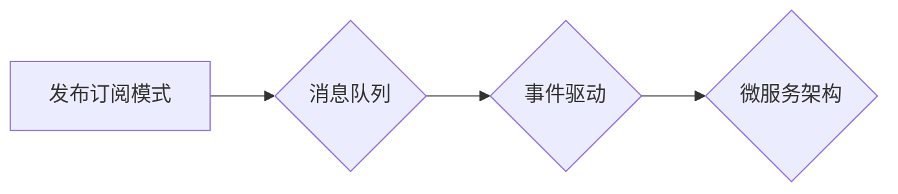

# 【AI大数据计算原理与代码实例讲解】发布订阅

## 关键词：

发布订阅模式，消息队列，分布式系统，大数据计算，消息传递，事件驱动，微服务

---

## 1. 背景介绍

### 1.1 问题的由来

在分布式系统和大数据计算领域，高效的消息传递和事件驱动机制是构建可扩展、高可用系统的基础。随着微服务架构的兴起，发布订阅模式（Publish-Subscribe）作为一种轻量级、松耦合的消息传递机制，被广泛应用于各种场景，如系统间通信、数据处理、流式计算等。

### 1.2 研究现状

近年来，随着云计算、大数据和人工智能技术的快速发展，发布订阅模式在AI大数据计算领域得到了广泛关注。研究者们针对发布订阅机制的设计、优化、应用等方面进行了深入研究，并涌现出许多优秀的开源消息队列和流处理框架，如Apache Kafka、RabbitMQ、Apache Pulsar、Apache Flink等。

### 1.3 研究意义

研究发布订阅模式及其在AI大数据计算领域的应用，对于构建高效、可靠、可扩展的分布式系统具有重要意义：

- 提高系统解耦度，降低系统间耦合，便于系统扩展和维护。
- 实现异步消息传递，降低系统间通信的延迟，提高系统吞吐量。
- 支持高可用和故障转移，提高系统的稳定性和可靠性。
- 促进数据共享和流转，支持复杂的业务逻辑和数据处理流程。

### 1.4 本文结构

本文将从以下几个方面对AI大数据计算中的发布订阅模式进行讲解：

- 核心概念与联系
- 核心算法原理与具体操作步骤
- 数学模型和公式
- 代码实例与详细解释
- 实际应用场景
- 工具和资源推荐
- 总结与展望

---

## 2. 核心概念与联系

### 2.1 发布订阅模式概述

发布订阅模式（Publish-Subscribe）是一种基于消息传递的通信机制，它将消息的发送者（发布者）和接收者（订阅者）解耦。发布者将消息发布到消息队列中，订阅者订阅感兴趣的消息，并从消息队列中获取消息。

### 2.2 消息队列

消息队列是一种存储消息的中间件，负责消息的持久化、传递和分发。常见的消息队列包括：

- 点对点消息队列：如ActiveMQ、RabbitMQ，支持消息的可靠传递。
- 发布订阅消息队列：如Kafka、Pulsar，支持高吞吐量和消息广播。

### 2.3 事件驱动

事件驱动是一种基于事件的编程范式，系统通过监听和响应事件来执行相应的操作。发布订阅模式与事件驱动相结合，可以实现系统间的异步通信和事件流转。

### 2.4 微服务架构

微服务架构将应用程序分解为多个独立的、可扩展的服务，每个服务负责处理特定功能。发布订阅模式在微服务架构中发挥着重要作用，用于服务间的通信和协调。

### 2.5 关系图

发布订阅模式、消息队列、事件驱动和微服务架构之间的关系如图所示：



---

## 3. 核心算法原理与具体操作步骤

### 3.1 算法原理概述

发布订阅模式的核心原理如下：

- 发布者：负责将消息发送到消息队列中。
- 订阅者：负责订阅感兴趣的消息，并从消息队列中获取消息。
- 消息队列：负责存储、传递和分发消息。

### 3.2 算法步骤详解

发布订阅模式的基本操作步骤如下：

1. 订阅者连接到消息队列。
2. 订阅者订阅感兴趣的消息。
3. 发布者将消息发送到消息队列。
4. 消息队列将消息推送给所有订阅者。

### 3.3 算法优缺点

发布订阅模式具有以下优点：

- 松耦合：发布者和订阅者之间解耦，便于系统扩展和维护。
- 异步通信：支持异步消息传递，降低系统间通信的延迟。
- 高可靠性：消息队列提供消息持久化和容错机制。
- 高吞吐量：支持高吞吐量的消息处理。

发布订阅模式也存在以下缺点：

- 消息顺序保证：在分布式系统中，消息顺序可能无法保证。
- 系统复杂度：需要设计复杂的消息处理逻辑。
- 消息传递延迟：消息传递可能存在延迟。

### 3.4 算法应用领域

发布订阅模式在以下领域得到广泛应用：

- 分布式系统间的通信
- 大数据处理和流处理
- 微服务架构中的服务间通信
- 实时消息推送和通知

---

## 4. 数学模型和公式

### 4.1 数学模型构建

发布订阅模式的数学模型可以表示为：

- 发布者：$P(x, t)$，表示发布者发布消息 $x$ 的时间 $t$。
- 订阅者：$S(x, t)$，表示订阅者接收消息 $x$ 的时间 $t$。
- 消息队列：$Q(x, t)$，表示消息 $x$ 在消息队列中的时间 $t$。

### 4.2 公式推导过程

假设发布者发布消息 $x$ 的时间为 $t_1$，订阅者接收消息的时间为 $t_2$，消息队列中消息 $x$ 的时间为 $t_3$，则有以下公式：

- $t_3 = t_1 + t_{\text{传递}}$
- $t_2 = t_3 + t_{\text{处理}}$

其中 $t_{\text{传递}}$ 和 $t_{\text{处理}}$ 分别表示消息传递和处理的时间。

### 4.3 案例分析与讲解

假设一个电商平台需要将用户下单信息实时推送给库存管理系统和订单管理系统。此时，可以将订单信息发布到消息队列中，库存管理系统和订单管理系统订阅订单信息，并从消息队列中获取订单信息。

发布者（电商平台）发布订单信息的时间为 $t_1$，消息传递和处理的时间分别为 $t_{\text{传递}}$ 和 $t_{\text{处理}}$。库存管理系统和订单管理系统接收订单信息的时间分别为 $t_2$ 和 $t_3$。

### 4.4 常见问题解答

**Q1：发布订阅模式如何保证消息顺序？**

A：在分布式系统中，消息顺序可能无法保证。可以使用消息队列的顺序特性来保证消息顺序，或者在消息处理过程中进行消息排序。

**Q2：发布订阅模式如何处理消息传递延迟？**

A：可以通过消息重试机制、消息优先级队列等方式来处理消息传递延迟。

---

## 5. 项目实践：代码实例和详细解释说明

### 5.1 开发环境搭建

以下是使用Python和RabbitMQ实现发布订阅模式的开发环境搭建步骤：

1. 安装Python环境。
2. 安装RabbitMQ服务器。
3. 安装Python客户端库pika。

### 5.2 源代码详细实现

**发布者代码**：

```python
import pika

# 连接到RabbitMQ服务器
connection = pika.BlockingConnection(pika.ConnectionParameters('localhost'))
channel = connection.channel()

# 创建队列
channel.queue_declare(queue='order_queue')

# 发布消息
channel.basic_publish(exchange='', routing_key='order_queue', body='Order 12345')

# 关闭连接
channel.close()
connection.close()
```

**订阅者代码**：

```python
import pika

def callback(ch, method, properties, body):
    print(f"Received {body}")

# 连接到RabbitMQ服务器
connection = pika.BlockingConnection(pika.ConnectionParameters('localhost'))
channel = connection.channel()

# 创建队列
channel.queue_declare(queue='order_queue')

# 订阅队列
channel.basic_consume(queue='order_queue', on_message_callback=callback)

# 启动消费者
print(' [*] Waiting for messages. To exit press CTRL+C')
channel.start_consuming()
```

### 5.3 代码解读与分析

发布者代码首先连接到RabbitMQ服务器，创建一个队列，然后发布一个消息到该队列中。订阅者代码连接到RabbitMQ服务器，创建一个队列，订阅该队列中的消息，并定义一个回调函数来处理接收到的消息。

### 5.4 运行结果展示

运行发布者代码，发布一条消息“Order 12345”。运行订阅者代码，订阅该消息，并打印接收到的消息内容。

---

## 6. 实际应用场景

### 6.1 分布式系统间的通信

发布订阅模式可以用于分布式系统间的通信，例如：

- 用户下单系统将订单信息发布到消息队列，库存管理系统和订单管理系统订阅订单信息，并处理订单。
- 用户评论系统将评论信息发布到消息队列，推荐系统订阅评论信息，并生成推荐内容。

### 6.2 大数据处理和流处理

发布订阅模式可以用于大数据处理和流处理，例如：

- 将实时数据源中的数据发布到消息队列，数据处理系统订阅数据，并进行处理和分析。
- 将数据处理的中间结果发布到消息队列，数据存储系统订阅结果，并存储到数据库中。

### 6.3 微服务架构中的服务间通信

发布订阅模式可以用于微服务架构中的服务间通信，例如：

- 用户服务将用户信息发布到消息队列，订单服务订阅用户信息，并处理用户订单。
- 商品服务将商品信息发布到消息队列，库存服务订阅商品信息，并处理商品库存。

---

## 7. 工具和资源推荐

### 7.1 学习资源推荐

- 《RabbitMQ实战》
- 《消息队列实战》
- 《分布式系统原理与范型》

### 7.2 开发工具推荐

- RabbitMQ
- Apache Kafka
- Apache Pulsar

### 7.3 相关论文推荐

- 《Event-Driven Architecture: A Brief History and Current State》
- 《Message Queuing: A Survey》
- 《A Survey of Microservices》

### 7.4 其他资源推荐

- Apache Kafka官网：https://kafka.apache.org/
- Apache Pulsar官网：https://pulsar.apache.org/
- RabbitMQ官网：https://www.rabbitmq.com/

---

## 8. 总结：未来发展趋势与挑战

### 8.1 研究成果总结

本文对AI大数据计算中的发布订阅模式进行了全面系统的讲解，包括核心概念、算法原理、代码实例、应用场景等。通过本文的学习，读者可以了解到发布订阅模式在分布式系统、大数据计算和微服务架构中的重要作用，并掌握如何使用发布订阅模式构建高效、可靠、可扩展的系统。

### 8.2 未来发展趋势

未来，发布订阅模式将呈现以下发展趋势：

- 更高吞吐量：消息队列将支持更高的吞吐量，以满足日益增长的数据处理需求。
- 更强可靠性：消息队列将提供更可靠的保障机制，如消息持久化、事务性消息等。
- 更好的集成能力：消息队列将与更多应用程序和框架集成，如大数据处理框架、微服务框架等。
- 更智能的智能：消息队列将引入人工智能技术，实现智能消息路由、智能消息处理等。

### 8.3 面临的挑战

发布订阅模式在AI大数据计算领域也面临以下挑战：

- 消息一致性：如何保证消息的一致性和顺序，是一个重要的挑战。
- 消息传递延迟：如何降低消息传递延迟，是一个需要解决的问题。
- 消息安全性：如何保证消息的安全性，是一个需要关注的问题。

### 8.4 研究展望

为了应对上述挑战，未来的研究方向包括：

- 研究消息一致性和顺序的保证机制。
- 研究消息传递延迟的优化方法。
- 研究消息安全性的保护技术。
- 研究发布订阅模式与其他人工智能技术的融合。

相信随着技术的不断发展，发布订阅模式将在AI大数据计算领域发挥更大的作用，为构建更加高效、可靠、可扩展的系统提供有力支持。

---

## 9. 附录：常见问题与解答

**Q1：发布订阅模式和事件驱动有什么区别？**

A：发布订阅模式和事件驱动都是一种基于消息的通信机制，但它们之间存在一些区别：

- 发布订阅模式是一种消息传递机制，发布者和订阅者之间解耦。
- 事件驱动是一种编程范式，系统通过监听和响应事件来执行相应的操作。

**Q2：发布订阅模式适用于哪些场景？**

A：发布订阅模式适用于以下场景：

- 分布式系统间的通信
- 大数据处理和流处理
- 微服务架构中的服务间通信
- 实时消息推送和通知

**Q3：如何保证发布订阅模式的消息顺序？**

A：可以通过以下方法保证发布订阅模式的消息顺序：

- 使用有序消息队列
- 在消息处理过程中进行消息排序

**Q4：如何降低发布订阅模式的消息传递延迟？**

A：可以通过以下方法降低发布订阅模式的消息传递延迟：

- 使用高性能的消息队列
- 优化消息处理逻辑

**Q5：如何保证发布订阅模式的消息安全性？**

A：可以通过以下方法保证发布订阅模式的消息安全性：

- 使用安全的连接
- 对消息进行加密和解密
- 限制消息访问权限

作者：禅与计算机程序设计艺术 / Zen and the Art of Computer Programming