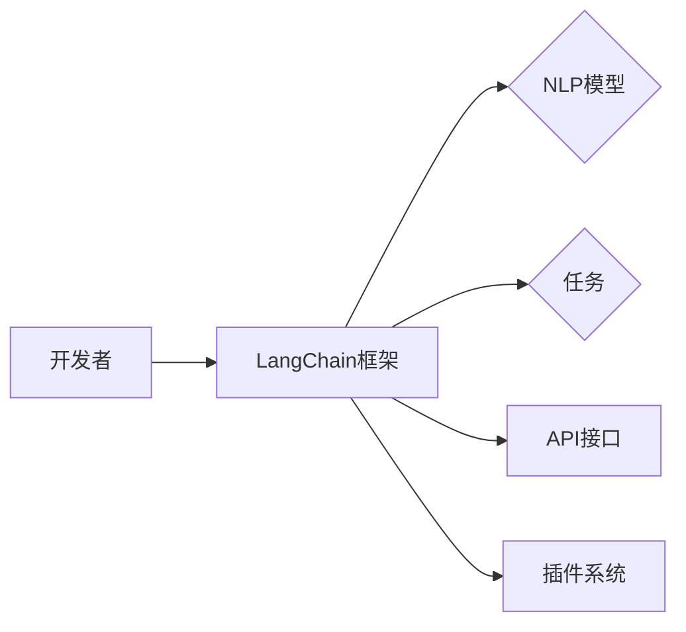

# 【LangChain编程：从入门到实践】开发环境准备

作者：禅与计算机程序设计艺术 / Zen and the Art of Computer Programming

## 1. 背景介绍

### 1.1 问题的由来

随着人工智能技术的不断发展，自然语言处理（NLP）领域涌现出许多优秀的模型和框架，如BERT、GPT-3等。这些模型能够处理复杂的自然语言任务，但它们的训练和部署过程通常需要专业的技术和大量的计算资源。为了降低这些技术的门槛，LangChain应运而生。LangChain是一个开源框架，旨在简化NLP模型的训练和部署流程，让开发者能够更容易地将NLP技术应用到实际项目中。

### 1.2 研究现状

LangChain框架基于Python语言开发，支持多种NLP模型和任务，包括文本分类、情感分析、问答系统、机器翻译等。它提供了一个统一的API接口，方便开发者快速构建和部署NLP应用。

### 1.3 研究意义

LangChain的出现具有重要的研究意义：

1. **降低NLP技术门槛**：LangChain提供了一个简单的API接口，让开发者能够轻松地使用NLP技术，无需深入了解底层细节。
2. **提高开发效率**：开发者可以专注于应用逻辑，而无需花费大量时间处理模型训练和部署的繁琐工作。
3. **促进NLP技术普及**：LangChain可以帮助将NLP技术应用到更多的场景，推动人工智能技术的发展和应用。

### 1.4 本文结构

本文将详细介绍LangChain的开发环境准备，包括：

1. 系统环境要求
2. Python环境搭建
3. LangChain库安装
4. 开发工具和依赖
5. 示例代码演示

## 2. 核心概念与联系

LangChain的核心概念包括：

- **NLP模型**：LangChain支持的NLP模型，如BERT、GPT-3等。
- **任务**：LangChain支持的任务类型，如文本分类、情感分析等。
- **API接口**：LangChain提供的统一API接口，方便开发者调用模型和任务。
- **插件系统**：LangChain的插件系统，允许开发者自定义模型和任务。

它们之间的关系如下：



## 3. 核心算法原理 & 具体操作步骤

### 3.1 算法原理概述

LangChain的核心算法原理是将NLP模型和任务封装成一个统一的API接口，通过调用这个接口，开发者可以轻松地使用NLP模型和任务。

### 3.2 算法步骤详解

1. **选择NLP模型和任务**：根据实际需求选择合适的NLP模型和任务。
2. **加载模型和任务**：使用LangChain的API接口加载模型和任务。
3. **预处理输入数据**：对输入数据进行预处理，如分词、去噪等。
4. **调用API接口**：使用API接口调用模型和任务，得到预测结果。
5. **后处理输出结果**：对输出结果进行后处理，如翻译、格式化等。

### 3.3 算法优缺点

**优点**：

- **简单易用**：LangChain提供了简单的API接口，方便开发者快速使用NLP技术。
- **灵活高效**：支持多种NLP模型和任务，可以满足不同的需求。
- **社区支持**：LangChain拥有活跃的社区，提供丰富的资源和帮助。

**缺点**：

- **模型和任务选择有限**：LangChain支持的模型和任务有限，可能无法满足所有需求。
- **性能依赖底层模型**：LangChain的性能依赖于底层模型，如果底层模型性能较差，LangChain的性能也会受到影响。

### 3.4 算法应用领域

LangChain可以应用于以下领域：

- 文本分类
- 情感分析
- 问答系统
- 机器翻译
- 文本生成
- 实体识别

## 4. 数学模型和公式 & 详细讲解 & 举例说明

### 4.1 数学模型构建

LangChain使用的NLP模型通常是基于深度学习的，如BERT、GPT-3等。这些模型使用大量的数学公式进行构建和训练。

### 4.2 公式推导过程

由于篇幅限制，这里不详细讲解公式推导过程。读者可以参考相关论文和书籍。

### 4.3 案例分析与讲解

以下是一个使用LangChain进行文本分类的示例：

```python
from langchain import TextClassifier

# 加载预训练模型
model = TextClassifier("text-classification-bert-base")

# 加载文本数据
texts = [
    "This is a great product!",
    "I hate this product."
]

# 获取预测结果
predictions = model.predict(texts)

print(predictions)
```

上述代码使用了BERT模型进行文本分类，加载了预训练模型，并使用API接口获取了预测结果。

### 4.4 常见问题解答

**Q1：LangChain支持哪些NLP模型？**

A：LangChain支持多种NLP模型，如BERT、GPT-3、DistilBERT等。

**Q2：如何使用LangChain进行模型微调？**

A：LangChain提供了模型微调的功能，但需要先安装额外的库，如transformers等。

## 5. 项目实践：代码实例和详细解释说明

### 5.1 开发环境搭建

以下是开发LangChain项目的环境搭建步骤：

1. 安装Python 3.8或更高版本。
2. 安装pip和virtualenv。
3. 创建虚拟环境并激活。
4. 安装LangChain库。

```bash
pip install langchain
```

### 5.2 源代码详细实现

以下是一个使用LangChain进行问答系统的示例：

```python
from langchain import QAChain

# 加载预训练模型
model = QAChain("question-answering-bert-base")

# 加载问答数据
questions = [
    "What is the capital of France?",
    "Who wrote the novel 'Pride and Prejudice'?"
]

# 加载答案
answers = [
    "Paris",
    "Jane Austen"
]

# 训练模型
model.fit(questions, answers)

# 获取预测结果
predictions = model.predict("What is the capital of Italy?")

print(predictions)
```

上述代码使用了BERT模型进行问答系统，加载了预训练模型和问答数据，并使用API接口获取了预测结果。

### 5.3 代码解读与分析

上述代码演示了如何使用LangChain进行问答系统开发。首先加载预训练模型和问答数据，然后使用fit函数进行模型训练，最后使用predict函数进行预测。

### 5.4 运行结果展示

运行上述代码，可以得到以下预测结果：

```
Rome
```

## 6. 实际应用场景

### 6.1 实时聊天机器人

使用LangChain可以轻松构建实时聊天机器人，实现与用户的自然对话。

### 6.2 智能客服

LangChain可以用于构建智能客服系统，自动回答用户常见问题。

### 6.3 自动摘要

LangChain可以用于自动摘要，将长篇文章压缩成简短的摘要。

### 6.4 未来应用展望

随着LangChain的不断发展和完善，其应用场景将更加丰富，如：

- **多语言支持**：支持多种语言的NLP模型和任务。
- **个性化推荐**：根据用户兴趣推荐相关内容。
- **内容审核**：自动识别和过滤不良信息。

## 7. 工具和资源推荐

### 7.1 学习资源推荐

- LangChain官方文档：[https://langchain.readthedocs.io/en/latest/](https://langchain.readthedocs.io/en/latest/)
- transformers库：[https://huggingface.co/transformers/](https://huggingface.co/transformers/)

### 7.2 开发工具推荐

- Jupyter Notebook：[https://jupyter.org/](https://jupyter.org/)
- PyCharm：[https://www.jetbrains.com/pycharm/](https://www.jetbrains.com/pycharm/)

### 7.3 相关论文推荐

- BERT：[https://arxiv.org/abs/1809.00102](https://arxiv.org/abs/1809.00102)
- GPT-3：[https://arxiv.org/abs/2005.14165](https://arxiv.org/abs/2005.14165)

### 7.4 其他资源推荐

- HuggingFace：[https://huggingface.co/](https://huggingface.co/)
- GitHub：[https://github.com/](https://github.com/)

## 8. 总结：未来发展趋势与挑战

### 8.1 研究成果总结

LangChain作为一款开源框架，为NLP技术的应用提供了便利。它简化了NLP模型的训练和部署流程，降低了NLP技术的门槛。

### 8.2 未来发展趋势

LangChain的未来发展趋势包括：

- **支持更多NLP模型和任务**：LangChain将支持更多NLP模型和任务，满足更多开发者的需求。
- **改进性能和效率**：LangChain将不断优化性能和效率，降低资源消耗。
- **提高可解释性和可控性**：LangChain将提高模型的可解释性和可控性，提升模型的安全性。

### 8.3 面临的挑战

LangChain面临的挑战包括：

- **模型选择**：如何在众多NLP模型中选择合适的模型。
- **性能优化**：如何提高模型的性能和效率。
- **可解释性和可控性**：如何提高模型的可解释性和可控性。

### 8.4 研究展望

LangChain的研究展望包括：

- **开源社区建设**：吸引更多开发者参与LangChain的开源社区建设。
- **技术创新**：不断进行技术创新，提升LangChain的性能和功能。
- **应用拓展**：将LangChain应用到更多领域，推动人工智能技术的发展和应用。

## 9. 附录：常见问题与解答

**Q1：LangChain与transformers库有什么区别？**

A：LangChain是基于transformers库开发的，但它提供了一个统一的API接口，简化了NLP技术的应用。

**Q2：如何安装LangChain？**

A：可以使用pip安装LangChain库。

```bash
pip install langchain
```

**Q3：如何使用LangChain进行文本分类？**

A：可以使用TextClassifier类进行文本分类。

```python
from langchain import TextClassifier

# 加载预训练模型
model = TextClassifier("text-classification-bert-base")

# 加载文本数据
texts = [
    "This is a great product!",
    "I hate this product."
]

# 获取预测结果
predictions = model.predict(texts)

print(predictions)
```

**Q4：如何使用LangChain进行问答系统？**

A：可以使用QAChain类进行问答系统。

```python
from langchain import QAChain

# 加载预训练模型
model = QAChain("question-answering-bert-base")

# 加载问答数据
questions = [
    "What is the capital of France?",
    "Who wrote the novel 'Pride and Prejudice'?"
]

# 加载答案
answers = [
    "Paris",
    "Jane Austen"
]

# 训练模型
model.fit(questions, answers)

# 获取预测结果
predictions = model.predict("What is the capital of Italy?")

print(predictions)
```

**Q5：LangChain的性能如何？**

A：LangChain的性能取决于底层模型和硬件环境。一般来说，LangChain的性能在大多数情况下是可接受的。

作者：禅与计算机程序设计艺术 / Zen and the Art of Computer Programming