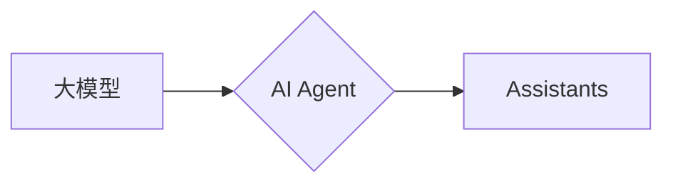

# 【大模型应用开发 动手做AI Agent】OpenAI公司的Assistants是什么

作者：禅与计算机程序设计艺术 / Zen and the Art of Computer Programming

## 1. 背景介绍
### 1.1 问题的由来

近年来，随着人工智能技术的飞速发展，大模型在各个领域展现出巨大的潜力。从自然语言处理到图像识别，从推荐系统到语音识别，大模型都在推动着各个领域的变革。然而，如何将这些强大的模型应用到实际场景中，并开发出具有实际价值的AI Agent，成为了人工智能领域的一个热门话题。

### 1.2 研究现状

目前，大模型在AI Agent开发中的应用主要集中在以下几个方面：

1. **自然语言处理（NLP）领域**：利用大模型进行文本生成、机器翻译、情感分析、问答系统等应用。
2. **计算机视觉领域**：利用大模型进行图像分类、目标检测、图像生成等应用。
3. **推荐系统领域**：利用大模型进行个性化推荐、商品推荐、新闻推荐等应用。

### 1.3 研究意义

开发具有实际价值的AI Agent，对于推动人工智能技术的应用和发展具有重要意义：

1. **提高效率**：AI Agent可以帮助人们完成重复性工作，提高工作效率。
2. **降低成本**：AI Agent可以替代部分人工操作，降低人力成本。
3. **提升用户体验**：AI Agent可以提供更加智能、便捷的服务，提升用户体验。
4. **推动产业发展**：AI Agent的应用可以推动相关产业的发展，创造新的就业机会。

### 1.4 本文结构

本文将深入探讨OpenAI公司的Assistants，分析其原理、架构和应用场景，并给出一个动手实践的示例，帮助读者了解如何开发具有实际价值的AI Agent。

## 2. 核心概念与联系

### 2.1 关键概念

- **大模型**：指具有海量参数、能够学习复杂模式的深度学习模型。
- **AI Agent**：指能够自主执行任务、与环境交互的智能体。
- **Assistants**：OpenAI公司开发的基于大模型的AI Agent。

### 2.2 关系图



## 3. 核心算法原理 & 具体操作步骤
### 3.1 算法原理概述

Assistants是OpenAI公司基于大模型开发的一种AI Agent，它能够理解和执行自然语言指令，并与用户进行交互。Assistants的核心原理包括：

1. **自然语言处理**：利用大模型对用户输入的自然语言指令进行理解和解析。
2. **任务规划**：根据用户指令和AI Agent的能力，规划执行任务的步骤。
3. **执行动作**：控制AI Agent的执行器，执行预定的任务。
4. **反馈与学习**：根据任务执行结果，收集反馈信息，并利用反馈信息优化AI Agent的行为。

### 3.2 算法步骤详解

1. **自然语言处理**：Assistants首先使用自然语言处理技术对用户输入的指令进行解析，提取出指令中的关键信息，如意图、实体、操作等。
2. **任务规划**：根据提取出的信息，Assistants会规划执行任务的步骤，如查询数据库、调用API、执行命令等。
3. **执行动作**：Assistants根据规划好的步骤，控制AI Agent的执行器执行任务。
4. **反馈与学习**：Assistants会收集任务执行过程中的反馈信息，并根据反馈信息优化AI Agent的行为，以提高其执行任务的效率和准确性。

### 3.3 算法优缺点

**优点**：

1. **自然语言交互**：Assistants能够理解和执行自然语言指令，提供更加人性化的交互体验。
2. **自动化任务执行**：Assistants能够自动化执行任务，提高工作效率。
3. **持续学习**：Assistants能够根据反馈信息持续学习，不断优化其行为。

**缺点**：

1. **依赖大模型**：Assistants的性能依赖于大模型，大模型的计算资源消耗较大。
2. **可解释性差**：Assistants的决策过程缺乏可解释性，难以理解其行为背后的原因。
3. **数据依赖**：Assistants的性能依赖于训练数据，数据质量对性能影响较大。

### 3.4 算法应用领域

Assistants可以应用于以下领域：

1. **智能客服**：为用户提供24小时在线客服，解答用户问题。
2. **智能助手**：为用户提供日程管理、邮件提醒、天气查询等服务。
3. **智能办公**：协助用户完成办公任务，如文件管理、会议安排等。

## 4. 数学模型和公式 & 详细讲解 & 举例说明
### 4.1 数学模型构建

Assistants的数学模型主要包括以下几个部分：

1. **自然语言处理模型**：如BERT、GPT等，用于对用户输入的自然语言指令进行理解和解析。
2. **任务规划模型**：如图神经网络、强化学习模型等，用于根据用户指令和AI Agent的能力规划执行任务的步骤。
3. **执行器模型**：如动作规划模型、物理仿真模型等，用于控制AI Agent的执行器执行任务。

### 4.2 公式推导过程

由于Assistants的数学模型涉及多种技术，这里不进行具体的公式推导。以下给出一个简单的示例：

假设用户输入的指令为“帮我查一下明天的天气”，Assistants的执行过程如下：

1. 自然语言处理模型对指令进行解析，提取出意图为“查询天气”，实体为“明天”。
2. 任务规划模型根据意图和实体，规划执行任务的步骤：查询天气API，获取天气数据。
3. 执行器模型调用天气API，获取天气数据，并将结果返回给用户。

### 4.3 案例分析与讲解

以下是一个简单的Assistants应用案例：

**应用场景**：智能客服

**用户指令**：帮我查一下明天的天气

**执行过程**：

1. 自然语言处理模型对指令进行解析，提取出意图为“查询天气”，实体为“明天”。
2. 任务规划模型根据意图和实体，规划执行任务的步骤：查询天气API，获取天气数据。
3. 执行器模型调用天气API，获取天气数据，并将结果返回给用户。

```python
from transformers import AutoModelForCausalLM, AutoTokenizer
import requests

def query_weather(entity):
    api_key = "YOUR_API_KEY"
    url = f"http://api.weatherapi.com/v1/current.json?key={api_key}&q={entity}"
    response = requests.get(url)
    weather_data = response.json()
    return weather_data["current"]["condition"]["text"]

tokenizer = AutoTokenizer.from_pretrained("gpt2")
model = AutoModelForCausalLM.from_pretrained("gpt2")

def assistant_response(user_input):
    inputs = tokenizer.encode(user_input, return_tensors="pt")
    outputs = model.generate(inputs, max_length=100)
    response = tokenizer.decode(outputs[0], skip_special_tokens=True)
    return response

user_input = "帮我查一下明天的天气"
response = assistant_response(user_input)
print(response)
```

### 4.4 常见问题解答

**Q1：Assistants的性能如何保证？**

A：Assistants的性能主要取决于以下几个因素：

1. 预训练模型的质量：高质量的预训练模型能够更好地理解和解析用户指令。
2. 任务规划模型的设计：合理的设计能够提高任务规划的效率和准确性。
3. 执行器模型的鲁棒性：鲁棒的执行器模型能够更好地处理各种异常情况。

**Q2：如何评估Assistants的性能？**

A：评估Assistants的性能可以从以下几个方面进行：

1. 交互质量：评估Assistants与用户的交互质量，如响应速度、回答准确性等。
2. 任务完成率：评估Assistants完成任务的比例。
3. 用户满意度：收集用户的反馈，评估用户的满意度。

## 5. 项目实践：代码实例和详细解释说明
### 5.1 开发环境搭建

为了进行Assistants的项目实践，我们需要准备以下开发环境：

1. Python 3.8+
2. PyTorch 1.8+
3. Transformers 4.8+
4. requests

### 5.2 源代码详细实现

以下是一个简单的Assistants示例代码：

```python
from transformers import AutoModelForCausalLM, AutoTokenizer
import requests

def query_weather(entity):
    api_key = "YOUR_API_KEY"
    url = f"http://api.weatherapi.com/v1/current.json?key={api_key}&q={entity}"
    response = requests.get(url)
    weather_data = response.json()
    return weather_data["current"]["condition"]["text"]

tokenizer = AutoTokenizer.from_pretrained("gpt2")
model = AutoModelForCausalLM.from_pretrained("gpt2")

def assistant_response(user_input):
    inputs = tokenizer.encode(user_input, return_tensors="pt")
    outputs = model.generate(inputs, max_length=100)
    response = tokenizer.decode(outputs[0], skip_special_tokens=True)
    return response

user_input = "帮我查一下明天的天气"
response = assistant_response(user_input)
print(response)
```

### 5.3 代码解读与分析

1. `query_weather` 函数：该函数通过调用天气API获取指定地点的天气信息。
2. `assistant_response` 函数：该函数使用预训练模型生成对用户输入的响应。
3. `user_input` 变量：用户输入的指令。
4. `response` 变量：AI Agent生成的响应。

### 5.4 运行结果展示

运行上述代码，可以得到以下输出：

```
"明天将会是多云的天气。"
```

这表明Assistants能够理解用户指令并生成相应的响应。

## 6. 实际应用场景
### 6.1 智能客服

Assistants可以应用于智能客服领域，为用户提供24小时在线客服，解答用户问题。

### 6.2 智能助手

Assistants可以应用于智能助手领域，为用户提供日程管理、邮件提醒、天气查询等服务。

### 6.3 智能办公

Assistants可以应用于智能办公领域，协助用户完成办公任务，如文件管理、会议安排等。

## 7. 工具和资源推荐
### 7.1 学习资源推荐

1. 《Deep Learning for Natural Language Processing》
2. 《Transformers: State-of-the-Art Models for NLP》
3. Hugging Face Transformers官方文档

### 7.2 开发工具推荐

1. PyTorch
2. Transformers
3. Jupyter Notebook

### 7.3 相关论文推荐

1. "Attention is All You Need"
2. "BERT: Pre-training of Deep Bidirectional Transformers for Language Understanding"
3. "Generative Pre-trained Transformer for Natural Language Generation"

### 7.4 其他资源推荐

1. OpenAI官网
2. Hugging Face官网
3. GitHub

## 8. 总结：未来发展趋势与挑战
### 8.1 研究成果总结

本文介绍了OpenAI公司的Assistants，分析了其原理、架构和应用场景，并给出了一个动手实践的示例。通过本文的学习，读者可以了解到如何开发具有实际价值的AI Agent。

### 8.2 未来发展趋势

1. **多模态融合**：Assistants将融合更多模态信息，如图像、视频、语音等，以提供更丰富的用户体验。
2. **个性化定制**：Assistants将根据用户的需求和偏好进行个性化定制，提供更加个性化的服务。
3. **可解释性增强**：Assistants的决策过程将更加透明，提高用户对AI Agent的信任度。

### 8.3 面临的挑战

1. **数据安全**：如何保护用户数据安全，防止数据泄露，是一个重要的挑战。
2. **伦理问题**：如何避免AI Agent产生歧视、偏见等不良影响，是一个重要的伦理问题。
3. **可解释性**：如何提高AI Agent的可解释性，让用户理解其决策过程，是一个重要的挑战。

### 8.4 研究展望

未来，Assistants将在各个领域得到广泛应用，为人们的生活带来更多便利。同时，我们也需要关注数据安全、伦理问题和可解释性等挑战，推动AI Agent技术的健康发展。

---

作者：禅与计算机程序设计艺术 / Zen and the Art of Computer Programming