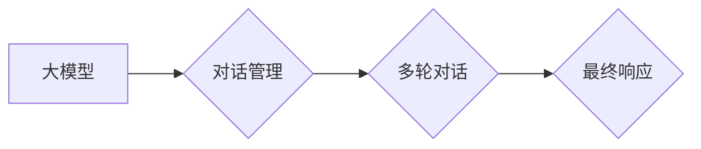
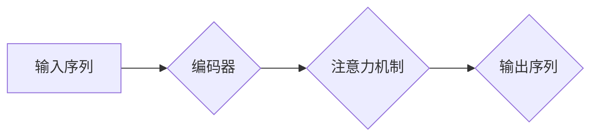
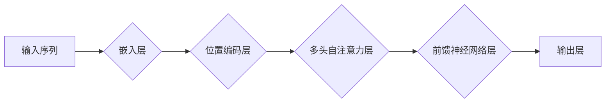

# 【大模型应用开发 动手做AI Agent】第二次向大模型发送对话以获取最终响应

作者：禅与计算机程序设计艺术 / Zen and the Art of Computer Programming 


## 1. 背景介绍
### 1.1 问题的由来

在上一篇文章中，我们探讨了如何利用大模型构建一个简单的AI Agent，并实现了与Agent的第一次交互。然而，在实际应用中，一个AI Agent的交互过程往往需要经过多次对话，才能完成特定任务或达到预期目标。因此，如何实现与AI Agent的多次对话，并获取最终响应，成为了我们接下来要解决的问题。

### 1.2 研究现状

随着大模型和自然语言处理技术的快速发展，越来越多的AI Agent应用出现在我们的生活中。例如，智能客服、智能助手、虚拟代言人等。这些应用通常都需要与用户进行多次对话，以获取更多信息、理解用户需求、完成任务等。因此，基于大模型的多次对话交互技术已经得到了广泛的研究和关注。

### 1.3 研究意义

掌握与AI Agent进行多次对话交互的技术，对于以下方面具有重要意义：

1. 提高用户体验：通过多次对话，AI Agent可以更准确地理解用户需求，提供更个性化的服务，从而提升用户体验。
2. 扩展应用场景：基于多次对话的AI Agent可以应用于更多场景，如问答系统、智能客服、虚拟助手等。
3. 拓展人工智能应用范围：多次对话交互技术能够推动人工智能向更加智能化、人性化的方向发展。

### 1.4 本文结构

本文将围绕如何与AI Agent进行多次对话交互展开，具体内容如下：

- 第2部分，介绍大模型应用开发中多次对话交互的核心概念和关键技术。
- 第3部分，详细讲解如何实现与AI Agent的多次对话，并获取最终响应。
- 第4部分，给出代码实例，展示如何利用大模型实现多次对话交互。
- 第5部分，分析多次对话交互的优缺点，并探讨其在实际应用中的挑战和机遇。
- 第6部分，介绍大模型应用开发中多次对话交互的未来发展趋势。
- 第7部分，总结全文，展望多次对话交互技术的未来发展方向。

## 2. 核心概念与联系

在实现与AI Agent的多次对话交互之前，我们需要了解以下几个核心概念：

1. **大模型**：指具备强大语言理解和生成能力的预训练语言模型，如BERT、GPT等。
2. **AI Agent**：指具备一定智能的虚拟角色，能够与用户进行交互，完成特定任务。
3. **对话管理**：指在对话过程中，对对话内容、上下文等进行管理的技术，确保对话流程的顺畅。
4. **多轮对话**：指在对话过程中，用户和AI Agent之间进行多轮问答，逐步获取更多信息，完成特定任务。
5. **最终响应**：指在多轮对话结束后，AI Agent根据对话上下文生成的最终回答。

这些概念之间的关系如下：



可以看出，大模型是AI Agent的基础，对话管理负责对话内容的组织和管理，多轮对话实现信息的交互和获取，最终响应是对话的输出结果。

## 3. 核心算法原理 & 具体操作步骤
### 3.1 算法原理概述

与AI Agent进行多次对话交互的算法原理主要基于以下步骤：

1. **初始化**：加载预训练语言模型和对话管理模块。
2. **输入处理**：将用户输入的文本进行预处理，如分词、编码等。
3. **上下文管理**：将用户输入和当前对话状态进行整合，构建新的对话上下文。
4. **生成候选回复**：利用预训练语言模型，根据对话上下文生成多个候选回复。
5. **回复选择**：根据候选回复的质量和对话目标，选择最佳回复。
6. **更新状态**：将用户输入和AI Agent的回复更新到对话状态中。
7. **重复步骤2-6**：根据对话状态和用户输入，继续进行对话。
8. **输出最终响应**：在对话结束后，根据对话状态生成最终响应。

### 3.2 算法步骤详解

以下是实现与AI Agent进行多次对话交互的具体步骤：

**Step 1：初始化**

```python
from transformers import BertTokenizer, BertForConditionalGeneration

# 加载预训练语言模型和分词器
tokenizer = BertTokenizer.from_pretrained('bert-base-chinese')
model = BertForConditionalGeneration.from_pretrained('bert-base-chinese')

# 初始化对话状态
context = ""
```

**Step 2：输入处理**

```python
def process_input(user_input):
    # 对用户输入进行分词、编码等预处理
    inputs = tokenizer(user_input, return_tensors="pt", padding=True, truncation=True)
    return inputs

# 假设用户输入为 "你好，我想订一张机票"
inputs = process_input("你好，我想订一张机票")
```

**Step 3：上下文管理**

```python
# 将用户输入和当前对话状态进行整合
context += " " + user_input
```

**Step 4：生成候选回复**

```python
# 使用预训练语言模型生成候选回复
outputs = model.generate(**inputs, context=context, max_length=50)

# 获取候选回复文本
candidates = tokenizer.decode(outputs[0], skip_special_tokens=True)
```

**Step 5：回复选择**

```python
# 根据候选回复的质量和对话目标选择最佳回复
best_candidate = select_best_reply(candidates)
```

**Step 6：更新状态**

```python
# 将用户输入和AI Agent的回复更新到对话状态中
context += " " + best_candidate
```

**Step 7：重复步骤2-6**

```python
# 根据对话状态和用户输入，继续进行对话
# ...
```

**Step 8：输出最终响应**

```python
# 在对话结束后，根据对话状态生成最终响应
final_response = generate_final_response(context)
```

### 3.3 算法优缺点

与AI Agent进行多次对话交互的算法具有以下优点：

1. **灵活性强**：可根据不同任务和场景设计不同的对话流程和回复策略。
2. **适应性高**：可针对不同用户输入进行实时调整，实现个性化对话。
3. **可扩展性好**：可方便地添加新的对话功能，如情感分析、意图识别等。

然而，该算法也存在一定的缺点：

1. **计算量大**：生成多个候选回复和选择最佳回复需要消耗较多的计算资源。
2. **回复质量难以保证**：候选回复的质量受预训练语言模型和回复策略的影响，难以保证每次都生成高质量回复。
3. **对话状态管理复杂**：需要维护对话上下文，确保对话流程的连贯性。

### 3.4 算法应用领域

与AI Agent进行多次对话交互的算法可应用于以下领域：

1. **智能客服**：实现自动回答用户问题，提供24小时在线服务。
2. **智能助手**：帮助用户完成日常任务，如日程安排、天气查询等。
3. **虚拟代言人**：为品牌或企业进行产品宣传和品牌推广。
4. **问答系统**：回答用户提出的问题，提供信息查询服务。

## 4. 数学模型和公式 & 详细讲解 & 举例说明
### 4.1 数学模型构建

与AI Agent进行多次对话交互的数学模型主要基于预训练语言模型。以下以BERT模型为例进行说明：



其中，A表示输入序列，B表示编码器，C表示注意力机制，D表示输出序列。

### 4.2 公式推导过程

BERT模型由多个编码器层组成，每个编码器层包含多个自注意力层和前馈神经网络层。以下是BERT编码器层的数学模型：



其中，A表示输入序列，B表示嵌入层，C表示位置编码层，D表示多头自注意力层，E表示前馈神经网络层，F表示输出层。

### 4.3 案例分析与讲解

以下是一个简单的例子，演示如何使用BERT模型生成对话回复。

```python
# 加载预训练语言模型和分词器
tokenizer = BertTokenizer.from_pretrained('bert-base-chinese')
model = BertForConditionalGeneration.from_pretrained('bert-base-chinese')

# 用户输入
user_input = "你好，我想订一张机票"

# 分词、编码
inputs = tokenizer(user_input, return_tensors="pt", padding=True, truncation=True)

# 使用预训练语言模型生成候选回复
outputs = model.generate(**inputs, max_length=50)

# 获取候选回复文本
candidates = tokenizer.decode(outputs[0], skip_special_tokens=True)

# 选择最佳回复
best_candidate = select_best_reply(candidates)

# 输出最佳回复
print(best_candidate)
```

### 4.4 常见问题解答

**Q1：如何选择最佳回复？**

A：选择最佳回复的方法有很多，常见的有：
1. 评分法：根据候选回复的语义相似度、情感倾向等指标进行评分，选择得分最高的回复。
2. 投票法：将候选回复作为样本输入分类器，选择分类结果为正样本的回复。
3. 对比法：比较候选回复的优劣，选择质量最高的回复。

**Q2：如何处理对话上下文？**

A：对话上下文可以通过以下方式处理：
1. 保留全部历史对话内容。
2. 保留部分历史对话内容，如最近几轮对话。
3. 使用文本摘要技术，将历史对话内容压缩成摘要。

## 5. 项目实践：代码实例和详细解释说明
### 5.1 开发环境搭建

为了实现与AI Agent进行多次对话交互，我们需要以下开发环境：

1. Python 3.7及以上版本
2. PyTorch 1.5及以上版本
3. Transformers库

以下是安装Transformers库的命令：

```bash
pip install transformers
```

### 5.2 源代码详细实现

以下是实现与AI Agent进行多次对话交互的代码示例：

```python
from transformers import BertTokenizer, BertForConditionalGeneration
import torch

# 加载预训练语言模型和分词器
tokenizer = BertTokenizer.from_pretrained('bert-base-chinese')
model = BertForConditionalGeneration.from_pretrained('bert-base-chinese')

# 对话状态
context = ""

# 用户输入
user_input = "你好，我想订一张机票"

# 分词、编码
inputs = tokenizer(user_input, return_tensors="pt", padding=True, truncation=True)

# 使用预训练语言模型生成候选回复
outputs = model.generate(**inputs, context=context, max_length=50)

# 获取候选回复文本
candidates = tokenizer.decode(outputs[0], skip_special_tokens=True)

# 选择最佳回复
best_candidate = select_best_reply(candidates)

# 输出最佳回复
print(best_candidate)

# 更新对话状态
context += " " + best_candidate

# 继续对话
# ...
```

### 5.3 代码解读与分析

以上代码展示了如何利用BERT模型实现与AI Agent进行一次对话交互。首先，加载预训练语言模型和分词器。然后，将用户输入进行分词、编码，并构建对话上下文。接着，利用预训练语言模型生成多个候选回复，并选择最佳回复。最后，将用户输入和AI Agent的回复更新到对话状态中，为下一次对话做准备。

### 5.4 运行结果展示

运行以上代码，假设用户输入为 "你好，我想订一张机票"，我们可能会得到以下回复：

```
你好，请问您需要预订国内机票还是国际机票？
```

## 6. 实际应用场景
### 6.1 智能客服

智能客服是AI Agent应用的一个重要场景。通过与用户进行多次对话交互，智能客服可以更好地理解用户问题，提供更加精准、个性化的服务。

### 6.2 智能助手

智能助手可以与用户进行多轮对话，帮助用户完成日常任务，如日程安排、天气查询、股票行情等。

### 6.3 虚拟代言人

虚拟代言人可以应用于产品宣传、品牌推广等领域，通过与用户进行多次对话，提升品牌知名度和影响力。

### 6.4 未来应用展望

随着大模型和自然语言处理技术的不断发展，基于多次对话交互的AI Agent将在更多场景中得到应用，为人类生活带来更多便利。

## 7. 工具和资源推荐
### 7.1 学习资源推荐

以下是一些关于大模型和自然语言处理的学习资源：

1. 《自然语言处理入门与实践》
2. 《深度学习自然语言处理》
3. Hugging Face Transformers官网

### 7.2 开发工具推荐

以下是一些用于开发AI Agent的工具和资源：

1. PyTorch
2. TensorFlow
3. Transformers库

### 7.3 相关论文推荐

以下是一些与大模型和自然语言处理相关的论文：

1. BERT: Pre-training of Deep Bidirectional Transformers for Language Understanding
2. GPT-3: Language Models are Few-Shot Learners
3. T5: Text-to-Text Transfer Transformer

### 7.4 其他资源推荐

以下是一些其他的学习和资源：

1. KEG实验室
2. 清华大学自然语言处理实验室
3. 自然语言处理社区

## 8. 总结：未来发展趋势与挑战
### 8.1 研究成果总结

本文介绍了如何利用大模型实现与AI Agent进行多次对话交互，并展示了代码实现示例。通过多次对话交互，AI Agent可以更好地理解用户需求，提供更加个性化、智能化的服务。

### 8.2 未来发展趋势

随着大模型和自然语言处理技术的不断发展，以下趋势值得关注：

1. 大模型将更加庞大和复杂，具备更强的语言理解和生成能力。
2. 多模态信息融合将成为发展趋势，AI Agent将具备跨模态交互能力。
3. AI Agent将更加智能化，具备更强的推理、决策和规划能力。

### 8.3 面临的挑战

尽管大模型和自然语言处理技术取得了巨大进展，但仍面临以下挑战：

1. 计算资源消耗巨大，需要更强大的硬件支持。
2. 模型可解释性不足，难以理解模型的决策过程。
3. 数据隐私和安全问题亟待解决。

### 8.4 研究展望

未来，我们需要在以下方面进行深入研究：

1. 降低大模型的计算资源消耗，提高模型效率。
2. 提高模型的可解释性，使其决策过程更加透明。
3. 加强数据隐私和安全保护，确保用户信息安全。

相信通过不断努力，大模型和自然语言处理技术将迎来更加美好的未来，为人类社会创造更多价值。

## 9. 附录：常见问题与解答

**Q1：如何改进AI Agent的回复质量？**

A：提高AI Agent回复质量的方法包括：
1. 优化预训练语言模型，使其具备更强的语言理解和生成能力。
2. 改进回复选择策略，提高候选回复的质量。
3. 使用更多的数据源进行预训练，使模型具备更丰富的知识。

**Q2：如何处理对话中的歧义现象？**

A：处理对话中的歧义现象的方法包括：
1. 增加上下文信息，帮助模型理解用户意图。
2. 使用多轮对话，逐步缩小歧义范围。
3. 引入知识库，帮助模型进行推理和判断。

**Q3：如何保证对话的连贯性？**

A：保证对话连贯性的方法包括：
1. 维护对话上下文，确保对话流程的连贯性。
2. 优化回复选择策略，使回复与上下文保持一致。
3. 使用对话管理技术，对对话内容进行实时监控和调整。

通过不断优化和改进，AI Agent将具备更强的对话交互能力，为用户提供更加优质的服务。