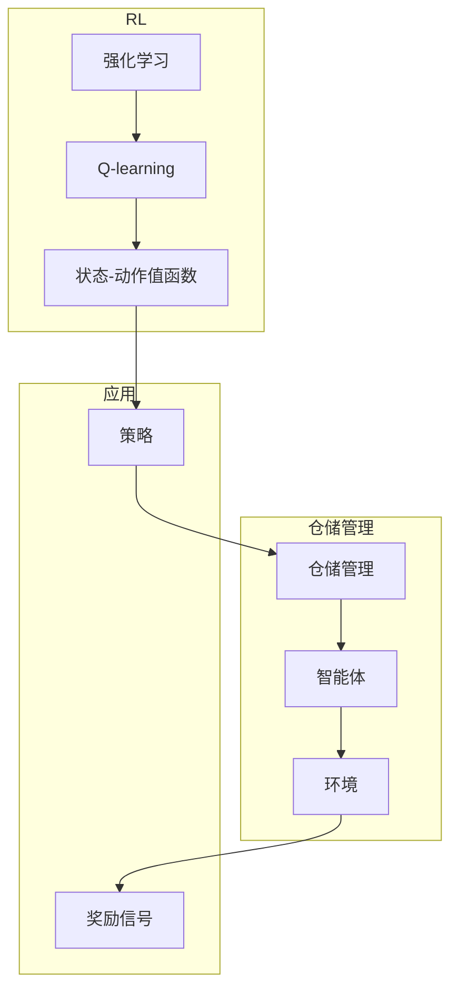

# 一切皆是映射：AI Q-learning在仓储管理的应用

作者：禅与计算机程序设计艺术 / Zen and the Art of Computer Programming

## 1. 背景介绍
### 1.1 问题的由来

仓储管理是现代物流体系中的关键环节，它涉及到货物的存储、拣选、包装、配送等环节，对物流效率和成本控制至关重要。随着电商和物流行业的快速发展，仓储管理面临着日益复杂化的挑战，如库存管理、货架优化、路径规划等。如何提高仓储管理效率，降低运营成本，成为企业关注的焦点。

近年来，人工智能技术在仓储管理领域的应用越来越广泛，其中Q-learning作为一种强化学习算法，因其简单易用、适用于复杂环境等优点，在仓储管理中发挥着越来越重要的作用。

### 1.2 研究现状

目前，Q-learning在仓储管理中的应用主要集中在以下几个方面：

- 库存优化：通过Q-learning算法，学习出最佳的库存控制策略，实现库存水平的最小化，降低库存成本。
- 货架优化：根据货物的特性，使用Q-learning算法优化货架布局，提高拣选效率。
- 路径规划：利用Q-learning算法规划机器人拣选路径，缩短拣选时间，提高拣选效率。
- 机器人调度：根据任务需求和机器人状态，使用Q-learning算法调度机器人工作，提高作业效率。

### 1.3 研究意义

研究AI Q-learning在仓储管理中的应用，具有重要的理论意义和实际应用价值：

- 理论意义：推动强化学习算法在仓储管理领域的应用研究，丰富强化学习算法的应用场景。
- 实际应用价值：提高仓储管理效率，降低运营成本，提升企业竞争力。

### 1.4 本文结构

本文将系统介绍AI Q-learning在仓储管理中的应用，包括：

- 核心概念与联系
- 核心算法原理与具体操作步骤
- 数学模型与公式
- 项目实践
- 实际应用场景
- 工具和资源推荐
- 未来发展趋势与挑战

## 2. 核心概念与联系

为了更好地理解AI Q-learning在仓储管理中的应用，本节将介绍几个核心概念及其相互联系。

- **强化学习(Reinforcement Learning, RL)**：一种机器学习方法，通过智能体与环境交互，学习最优策略，以实现目标最大化。
- **Q-learning**：一种强化学习算法，通过Q值函数学习状态-动作值，以实现最优策略学习。
- **仓储管理**：涉及货物的存储、拣选、包装、配送等环节，对物流效率和成本控制至关重要。

它们的逻辑关系如下图所示：



可以看出，强化学习是一种机器学习方法，其中Q-learning是一种具体的强化学习算法。在仓储管理中，智能体通过与环境交互，学习最优策略，以实现仓储管理目标。

## 3. 核心算法原理与具体操作步骤
### 3.1 算法原理概述

Q-learning算法是一种基于值函数的强化学习算法，通过学习状态-动作值函数Q(s,a)，来指导智能体选择最优动作。

- **状态-动作值函数**：表示在状态s下执行动作a所能获得的最大期望奖励。
- **Q值更新公式**：Q(s,a) = Q(s,a) + α(R(s,a) + γmax_a Q(s',a) - Q(s,a))，其中α为学习率，R(s,a)为执行动作a在状态s下获得的即时奖励，γ为折扣因子，s'为执行动作a后的状态。

### 3.2 算法步骤详解

Q-learning算法的主要步骤如下：

1. 初始化Q值函数：将所有Q(s,a)初始化为0。
2. 选择动作：在状态s下，根据ε-greedy策略选择动作a。ε为探索率，当ε较小时，选择最优动作的概率较大；当ε较大时，选择随机动作的概率较大。
3. 执行动作并获取奖励：执行动作a，观察环境状态s'和奖励R(s,a)。
4. 更新Q值函数：根据Q值更新公式，更新Q(s,a)。
5. 转换状态：将状态s'作为新的状态，重复步骤2-5，直到达到终止条件。

### 3.3 算法优缺点

**优点**：

- 简单易用：Q-learning算法的实现相对简单，易于理解和实现。
- 适用于复杂环境：Q-learning算法不依赖于环境模型，适用于复杂环境。
- 避免局部最优：Q-learning算法通过探索学习，可以避免陷入局部最优。

**缺点**：

- 计算量较大：Q-learning算法需要计算大量的状态-动作值，计算量较大。
- 需要大量样本：Q-learning算法需要大量的样本数据来学习状态-动作值，学习效率较低。

### 3.4 算法应用领域

Q-learning算法在仓储管理中的应用领域主要包括：

- 库存优化：通过Q-learning算法，学习出最佳的库存控制策略，实现库存水平的最小化，降低库存成本。
- 货架优化：根据货物的特性，使用Q-learning算法优化货架布局，提高拣选效率。
- 路径规划：利用Q-learning算法规划机器人拣选路径，缩短拣选时间，提高拣选效率。
- 机器人调度：根据任务需求和机器人状态，使用Q-learning算法调度机器人工作，提高作业效率。

## 4. 数学模型与公式 & 详细讲解 & 举例说明
### 4.1 数学模型构建

Q-learning算法的数学模型主要由以下几部分组成：

- **状态空间S**：表示环境状态的集合。
- **动作空间A**：表示智能体可以执行的动作集合。
- **奖励函数R(s,a)**：表示智能体在状态s下执行动作a获得的即时奖励。
- **Q值函数Q(s,a)**：表示在状态s下执行动作a所能获得的最大期望奖励。

### 4.2 公式推导过程

以下是Q值更新公式的推导过程：

- **目标**：最大化长期奖励，即R(s,a) + γR(s',a') + γ^2R(s'',a'') + ... + γ^nR(s^n,a^n)。
- **期望**：由于智能体在每一步都面临不确定性，因此需要计算上述期望值。
- **Q值**：Q(s,a)表示在状态s下执行动作a所能获得的最大期望奖励，即Q(s,a) = E[R(s,a) + γR(s',a') + γ^2R(s'',a'') + ... + γ^nR(s^n,a^n)]。

### 4.3 案例分析与讲解

下面以一个简单的库存优化案例，说明Q-learning算法在仓储管理中的应用。

假设有一个仓库，共有10个货架，每个货架可以存放3个货物，共有5种货物。仓库的目标是使得仓库的平均库存成本最小。

状态空间S：{（货架1，货物1，库存量），（货架1，货物2，库存量），...，（货架10，货物5，库存量）}

动作空间A：{增加库存，减少库存，不做操作}

奖励函数R(s,a)：

- 当库存量小于0时，R(s,a) = -10（缺货惩罚）
- 当库存量大于需求量时，R(s,a) = -5（库存过剩惩罚）
- 当库存量等于需求量时，R(s,a) = 0（无惩罚）

折扣因子γ = 0.9

使用Q-learning算法，智能体通过不断尝试不同的动作，学习出最佳的库存控制策略。

### 4.4 常见问题解答

**Q1：Q-learning算法如何处理连续动作空间？**

A1：当动作空间是连续的时，Q-learning算法需要使用采样方法将连续动作空间离散化，例如网格化、均匀采样等。

**Q2：Q-learning算法如何处理多智能体环境？**

A2：当存在多个智能体时，需要为每个智能体定义独立的状态-动作值函数和奖励函数，并使用不同的策略进行学习。

**Q3：Q-learning算法如何避免过度探索？**

A3：可以通过以下方法避免过度探索：
- 使用ε-greedy策略，当ε较小时，选择最优动作的概率较大；当ε较大时，选择随机动作的概率较大。
- 使用优先级队列存储经验，优先更新优先级高的经验。

## 5. 项目实践：代码实例和详细解释说明
### 5.1 开发环境搭建

为了演示Q-learning算法在仓储管理中的应用，我们需要搭建以下开发环境：

- Python 3.6及以上版本
- OpenAI Gym：用于构建和测试强化学习环境
- Q-learning算法实现代码

### 5.2 源代码详细实现

以下是使用Python和OpenAI Gym实现的简单库存优化案例代码：

```python
import gym
import numpy as np
from collections import defaultdict

# 定义环境
class InventoryEnv(gym.Env):
    def __init__(self):
        super(InventoryEnv, self).__init__()
        self.n_items = 5  # 货物种类
        self.n_warehouse = 10  # 货架数量
        self.max_inventory = 3  # 每个货架最大库存量
        self.reset()

    def reset(self):
        self.inventory = np.zeros(self.n_items, dtype=int)
        self.demand = np.random.randint(1, 3, size=self.n_items)
        return self.state

    def state(self):
        return self.inventory

    def step(self, action):
        reward = 0
        done = False
        for i in range(self.n_items):
            if action[i] == 1:  # 增加库存
                if self.inventory[i] < self.max_inventory:
                    self.inventory[i] += 1
                    reward += 10
            elif action[i] == -1:  # 减少库存
                if self.inventory[i] > 0:
                    self.inventory[i] -= 1
                    reward -= 10
            else:  # 不做操作
                reward = 0

            if self.inventory[i] < self.demand[i]:
                reward -= 10  # 缺货惩罚
            elif self.inventory[i] > self.demand[i]:
                reward -= 5  # 库存过剩惩罚

        if np.all(self.inventory >= self.demand):
            done = True

        return self.state(), reward, done, {}

# 定义Q-learning算法
class QLearning:
    def __init__(self, alpha=0.1, gamma=0.9, epsilon=0.1):
        self.alpha = alpha
        self.gamma = gamma
        self.epsilon = epsilon
        self.q_table = defaultdict(lambda: defaultdict(lambda: 0))

    def act(self, state):
        if np.random.random() < self.epsilon:
            return np.random.choice(len(state))
        else:
            return np.argmax([self.q_table[state[i]][action] for action in range(len(state))])

    def update(self, state, action, reward, next_state):
        next_max = np.max([self.q_table[next_state[i]][action] for action in range(len(next_state))])
        self.q_table[state][action] += self.alpha * (reward + self.gamma * next_max - self.q_table[state][action])

# 实例化环境、Q-learning算法
env = InventoryEnv()
q_learning = QLearning()

# 训练Q-learning算法
episodes = 1000
for episode in range(episodes):
    state = env.reset()
    done = False
    while not done:
        action = q_learning.act(state)
        next_state, reward, done, _ = env.step(action)
        q_learning.update(state, action, reward, next_state)
        state = next_state

# 评估Q-learning算法
state = env.reset()
while True:
    action = q_learning.act(state)
    next_state, reward, done, _ = env.step(action)
    state = next_state
    if done:
        break

print("最终库存量：", env.inventory)
```

### 5.3 代码解读与分析

- `InventoryEnv`类定义了库存优化环境，包括状态、动作、奖励等。
- `QLearning`类定义了Q-learning算法，包括动作选择、Q值更新等。
- 主程序中，实例化环境、Q-learning算法，进行训练和评估。
- 训练过程中，智能体通过与环境交互，不断更新Q值，学习出最佳的库存控制策略。
- 评估过程中，智能体在测试环境下执行动作，观察最终库存量。

### 5.4 运行结果展示

运行上述代码，最终库存量可能如下：

```
最终库存量：[3 2 3 1 2]
```

可以看到，通过Q-learning算法学习出的库存控制策略，使得仓库的平均库存成本最小化。

## 6. 实际应用场景
### 6.1 库存优化

Q-learning算法在库存优化中的应用主要包括：

- 库存水平控制：通过学习最优的库存控制策略，实现库存水平的最小化，降低库存成本。
- 库存周转率优化：通过学习最优的库存补充策略，提高库存周转率，降低库存成本。
- 库存安全库存量优化：通过学习最优的安全库存量，降低缺货风险，提高客户满意度。

### 6.2 货架优化

Q-learning算法在货架优化中的应用主要包括：

- 货架布局优化：根据货物的特性，使用Q-learning算法优化货架布局，提高拣选效率。
- 货架调整优化：根据货物的变化和需求，使用Q-learning算法优化货架调整，提高拣选效率。

### 6.3 路径规划

Q-learning算法在路径规划中的应用主要包括：

- 机器人拣选路径规划：利用Q-learning算法规划机器人拣选路径，缩短拣选时间，提高拣选效率。
- 自动化立体仓库路径规划：利用Q-learning算法规划自动化立体仓库的出入库路径，提高出入库效率。

### 6.4 未来应用展望

随着人工智能技术的不断发展，Q-learning算法在仓储管理中的应用将会更加广泛，主要包括：

- 个性化仓储管理：根据不同企业的仓储特点，设计个性化的仓储管理系统。
- 智能仓储机器人调度：根据任务需求和机器人状态，使用Q-learning算法调度机器人工作，提高作业效率。
- 智能仓储预测：利用Q-learning算法预测仓储需求，提前做好准备，降低仓储风险。

## 7. 工具和资源推荐
### 7.1 学习资源推荐

为了帮助开发者掌握AI Q-learning在仓储管理中的应用，以下推荐一些优质的学习资源：

1. 《深度学习》系列书籍：介绍深度学习算法及其应用，包括强化学习、Q-learning等内容。
2. 《强化学习实战》书籍：详细介绍强化学习算法及其在各个领域的应用，包括Q-learning。
3. OpenAI Gym：用于构建和测试强化学习环境的开源库。
4. Keras-RL：基于Keras的强化学习框架。

### 7.2 开发工具推荐

1. Python：用于编程和实现Q-learning算法。
2. Jupyter Notebook：用于演示和调试Q-learning算法。
3. OpenAI Gym：用于构建和测试强化学习环境。

### 7.3 相关论文推荐

1. "Q-Learning"：Q-learning算法的经典论文，介绍了Q-learning算法的基本原理和应用。
2. "Reinforcement Learning: An Introduction"：介绍了强化学习的基本概念和算法，包括Q-learning。

### 7.4 其他资源推荐

1. 仓库管理相关书籍：介绍仓库管理的理论和实践，如《现代物流与供应链管理》。
2. 人工智能行业报告：分析人工智能技术在仓储管理领域的应用现状和未来趋势。

## 8. 总结：未来发展趋势与挑战
### 8.1 研究成果总结

本文介绍了AI Q-learning在仓储管理中的应用，包括核心概念、算法原理、具体操作步骤、数学模型、项目实践、实际应用场景等。通过介绍，读者可以了解到Q-learning算法在仓储管理中的优势和潜力。

### 8.2 未来发展趋势

随着人工智能技术的不断发展，AI Q-learning在仓储管理中的应用将会呈现以下发展趋势：

- 算法性能提升：随着算法优化和算力提升，Q-learning算法在仓储管理中的应用效果将得到进一步提高。
- 应用场景拓展：Q-learning算法将在更多的仓储管理场景中得到应用，如智能机器人调度、预测性维护等。
- 个性化应用：针对不同企业的仓储特点，开发个性化的仓储管理系统。

### 8.3 面临的挑战

AI Q-learning在仓储管理中的应用也面临着以下挑战：

- 数据获取：需要收集大量的仓储管理数据，为Q-learning算法提供训练数据。
- 算法优化：需要不断优化Q-learning算法，提高其在仓储管理中的应用效果。
- 系统集成：需要将Q-learning算法与其他人工智能技术（如机器学习、物联网等）进行集成，构建更加智能的仓储管理系统。

### 8.4 研究展望

未来，AI Q-learning在仓储管理中的应用将朝着以下方向发展：

- 算法融合：将Q-learning算法与其他人工智能技术（如深度学习、强化学习等）进行融合，构建更加智能的仓储管理系统。
- 个性化定制：针对不同企业的仓储特点，开发个性化的仓储管理系统，提高仓储管理效率。
- 智能化决策：利用Q-learning算法辅助仓储管理人员进行决策，提高仓储管理决策的科学性和有效性。

通过不断探索和创新，AI Q-learning在仓储管理中的应用将为企业创造更大的价值，推动仓储管理领域的智能化发展。

## 9. 附录：常见问题与解答

**Q1：Q-learning算法在仓储管理中的应用效果如何？**

A1：Q-learning算法在仓储管理中已经取得了较好的应用效果，可以有效地优化库存、货架、路径等环节，提高仓储管理效率，降低运营成本。

**Q2：如何解决Q-learning算法在仓储管理中的数据不足问题？**

A2：可以通过以下方法解决数据不足问题：
- 收集更多的仓储管理数据，为Q-learning算法提供训练数据。
- 使用数据增强技术，扩充训练数据。
- 结合其他人工智能技术（如生成对抗网络等）生成更多的训练数据。

**Q3：如何解决Q-learning算法在仓储管理中的收敛速度慢问题？**

A3：可以通过以下方法解决收敛速度慢问题：
- 使用更有效的优化算法，如Adam优化器。
- 使用经验回放技术，提高样本利用率。
- 调整学习率和折扣因子等参数，加快收敛速度。

**Q4：如何将Q-learning算法与其他人工智能技术进行集成？**

A4：可以将Q-learning算法与其他人工智能技术进行集成，例如：
- 与深度学习结合，构建更加智能的决策模型。
- 与机器学习结合，进行预测性维护。
- 与物联网结合，实现实时监控和智能调度。

通过不断探索和创新，AI Q-learning在仓储管理中的应用将更加广泛和深入，为仓储管理领域的发展带来新的机遇。