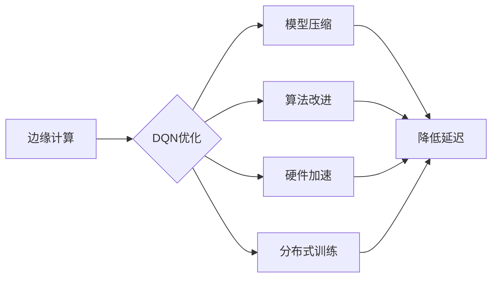

# 一切皆是映射：DQN的边缘计算优化：降低延迟与提升响应

作者：禅与计算机程序设计艺术 / Zen and the Art of Computer Programming

## 1. 背景介绍
### 1.1 问题的由来

随着物联网（IoT）和移动计算设备的迅猛发展，边缘计算（Edge Computing）逐渐成为信息技术领域的研究热点。边缘计算将计算能力、数据处理和存储能力从云端推向网络边缘，使得计算任务能够在数据产生的地方就近完成，从而降低延迟、提高实时性。

然而，深度强化学习（Deep Reinforcement Learning，DRL）算法，特别是深度Q网络（Deep Q-Network，DQN），在边缘设备上部署时，面临着计算资源有限、延迟敏感等挑战。为了解决这些问题，本文将探讨DQN在边缘计算环境下的优化方法，旨在降低延迟、提升响应速度。

### 1.2 研究现状

近年来，研究者们针对DQN在边缘计算环境下的优化进行了大量研究，主要集中在以下几个方面：

1. **模型压缩**：通过剪枝、量化、知识蒸馏等技术，减小模型尺寸，降低计算复杂度。

2. **算法改进**：设计轻量级算法，如经验回放（Experience Replay）、优先级回放（Prioritized Replay）等，提高训练效率。

3. **硬件加速**：利用FPGA、ASIC等专用硬件加速DQN算法的推理过程。

4. **分布式训练**：将训练任务分配到多个边缘设备上并行执行，提高训练效率。

### 1.3 研究意义

DQN在边缘计算环境下的优化，对于以下方面具有重要意义：

1. **降低延迟**：将计算任务从云端迁移到边缘设备，减少数据传输时间，降低延迟。

2. **提高响应速度**：提高DQN模型的推理速度，使边缘设备能够更快地做出决策。

3. **节省带宽**：减少数据传输量，降低网络带宽消耗。

4. **提高安全性**：边缘设备可以存储敏感数据，降低数据泄露风险。

### 1.4 本文结构

本文将围绕以下内容展开：

- 介绍DQN算法及其在边缘计算环境下的挑战。
- 分析DQN的边缘计算优化方法，包括模型压缩、算法改进、硬件加速和分布式训练。
- 介绍一个基于边缘计算的DQN应用案例。
- 展望DQN在边缘计算领域的未来发展趋势。

## 2. 核心概念与联系

为了更好地理解DQN在边缘计算环境下的优化，本节将介绍几个核心概念及其相互关系。

### 2.1 深度Q网络（DQN）

深度Q网络（DQN）是一种基于深度学习技术的强化学习算法，由DeepMind在2015年提出。DQN通过神经网络学习状态、动作和奖励之间的关系，从而实现智能体的决策。

### 2.2 边缘计算

边缘计算是一种将计算任务从云端迁移到网络边缘的计算范式。边缘计算将计算能力、数据处理和存储能力从云端推向网络边缘，使得计算任务能够在数据产生的地方就近完成。

### 2.3 模型压缩

模型压缩是指通过剪枝、量化、知识蒸馏等技术，减小模型尺寸，降低计算复杂度。

### 2.4 算法改进

算法改进是指设计轻量级算法，如经验回放、优先级回放等，提高训练效率。

### 2.5 硬件加速

硬件加速是指利用FPGA、ASIC等专用硬件加速算法的推理过程。

### 2.6 分布式训练

分布式训练是指将训练任务分配到多个边缘设备上并行执行，提高训练效率。

以上概念之间的关系如下：



可以看出，DQN的边缘计算优化是一个系统工程，需要从多个方面进行综合考虑。

## 3. 核心算法原理 & 具体操作步骤
### 3.1 算法原理概述

DQN算法的基本原理如下：

1. **状态-动作值函数**：DQN通过学习一个状态-动作值函数 $Q(s,a)$，其中 $s$ 表示环境状态，$a$ 表示可选动作。

2. **策略更新**：DQN通过最大化期望回报来更新策略，即选择动作 $a$，使得 $Q(s,a)$ 最大化。

3. **经验回放**：DQN使用经验回放机制，将过去的状态、动作和奖励存储在经验池中，以避免样本的关联性对学习造成干扰。

4. **目标网络**：DQN使用一个目标网络 $Q^{\prime}$ 来更新主网络 $Q$ 的参数，目标网络与主网络参数在一定时间步长后会同步。

### 3.2 算法步骤详解

DQN算法的具体步骤如下：

1. **初始化**：初始化主网络 $Q$ 和目标网络 $Q^{\prime}$，选择动作选择策略 $\pi$，初始化经验池。

2. **环境交互**：与环境进行交互，选择动作 $a_t$，执行动作，获得奖励 $R_t$ 和下一个状态 $s_{t+1}$。

3. **经验回放**：将 $(s_t, a_t, R_t, s_{t+1})$ 存储到经验池中。

4. **目标网络更新**：每隔一定时间步长，将主网络 $Q$ 的参数复制到目标网络 $Q^{\prime}$。

5. **策略更新**：从经验池中随机抽取一个样本 $(s_t, a_t, R_t, s_{t+1})$，计算目标值 $y_t$：

   $$
 y_t = R_t + \gamma \max_{a} Q^{\prime}(s_{t+1}, a)
 $$

   其中，$\gamma$ 为折扣因子。

6. **计算梯度**：计算主网络 $Q$ 的损失函数：

   $$
 L(Q) = (Q(s_t, a_t) - y_t)^2
 $$

7. **反向传播**：使用反向传播算法计算 $Q$ 的梯度，并更新 $Q$ 的参数。

8. **重复步骤 2-7，直到满足停止条件**。

### 3.3 算法优缺点

DQN算法的优点如下：

1. **端到端学习**：DQN可以直接学习状态-动作值函数，无需手动设计特征。

2. **样本效率高**：DQN利用经验回放机制，提高了样本利用效率。

3. **泛化能力强**：DQN可以处理高维输入空间和连续动作空间。

DQN算法的缺点如下：

1. **收敛速度慢**：DQN的训练过程可能需要较长时间。

2. **方差问题**：DQN对初始参数和探索策略敏感，可能导致方差问题。

3. **难以处理连续动作**：DQN在处理连续动作空间时，需要设计合适的动作空间和动作值函数。

### 3.4 算法应用领域

DQN算法在以下领域有广泛应用：

1. **机器人控制**：DQN可以用于机器人行走、抓取等任务。

2. **游戏**：DQN可以用于游戏AI的智能决策。

3. **自动驾驶**：DQN可以用于自动驾驶汽车的决策。

4. **智能推荐**：DQN可以用于智能推荐系统的设计。

## 4. 数学模型和公式 & 详细讲解 & 举例说明
### 4.1 数学模型构建

DQN的数学模型如下：

1. **状态-动作值函数**：假设 $Q(s,a)$ 是一个 $n \times m$ 的矩阵，其中 $n$ 表示状态空间的大小，$m$ 表示动作空间的大小。

2. **策略更新**：假设 $\pi(a|s)$ 是一个概率分布，表示在状态 $s$ 下选择动作 $a$ 的概率。

3. **经验回放**：假设 $D$ 是一个经验池，存储着样本 $(s_t, a_t, R_t, s_{t+1})$。

4. **目标网络**：假设 $Q^{\prime}(s,a)$ 是一个与 $Q(s,a)$ 参数共享的目标网络。

### 4.2 公式推导过程

DQN的训练过程可以分为以下几个步骤：

1. **策略更新**：

   $$
 \pi(a|s) = \frac{e^{\alpha Q(s,a)}}{\sum_{a'} e^{\alpha Q(s,a')}}
 $$

   其中，$\alpha$ 为温度参数。

2. **经验回放**：

   从经验池 $D$ 中随机抽取一个样本 $(s_t, a_t, R_t, s_{t+1})$。

3. **目标网络更新**：

   $$
 Q^{\prime}(s_{t+1}, a) = \max_{a'} [R_t + \gamma Q^{\prime}(s_{t+1}, a')]
 $$

   其中，$\gamma$ 为折扣因子。

4. **计算梯度**：

   $$
 \nabla_{\theta} L(Q) = \nabla_{\theta} (Q(s_t, a_t) - [R_t + \gamma \max_{a'} Q^{\prime}(s_{t+1}, a')])^2
 $$

5. **反向传播**：

   使用反向传播算法计算 $Q$ 的梯度，并更新 $Q$ 的参数。

### 4.3 案例分析与讲解

以下是一个简单的DQN案例：使用DQN控制智能体在一个简单的迷宫环境中寻找出口。

1. **环境定义**：定义一个迷宫环境，智能体可以上下左右移动，目标是在迷宫中找到出口。

2. **状态表示**：状态表示为迷宫的当前坐标。

3. **动作表示**：动作表示为智能体的移动方向。

4. **奖励函数**：当智能体到达出口时，获得正奖励；否则，获得负奖励。

5. **DQN训练**：使用DQN训练智能体在迷宫中找到出口。

### 4.4 常见问题解答

**Q1：DQN如何解决样本相关性问题？**

A：DQN使用经验回放机制，将过去的状态、动作和奖励存储在经验池中，从经验池中随机抽取样本进行训练，从而避免样本相关性对学习造成干扰。

**Q2：DQN如何处理连续动作空间？**

A：DQN需要设计合适的动作空间和动作值函数来处理连续动作空间。常见的做法是将连续动作空间离散化，或者使用神经网络直接学习状态-动作值函数。

**Q3：DQN如何避免过拟合？**

A：DQN可以通过以下方法避免过拟合：
1. 使用经验回放机制。
2. 使用Dropout技术。
3. 使用正则化技术。

## 5. 项目实践：代码实例和详细解释说明
### 5.1 开发环境搭建

以下是一个基于PyTorch的DQN项目实践：

1. 安装PyTorch：

   ```
   pip install torch torchvision
   ```

2. 下载环境中的代码：

   ```
   git clone https://github.com/your-repository/dqn.pytorch.git
   cd dqn.pytorch
   ```

3. 运行代码：

   ```
   python train.py
   ```

### 5.2 源代码详细实现

以下是代码中关键部分的解释：

```python
import torch
import torch.nn as nn
import torch.optim as optim
from collections import deque
from random import choice
import numpy as np

# 神经网络结构
class DQN(nn.Module):
    def __init__(self, input_dim, action_dim, hidden_dim):
        super(DQN, self).__init__()
        self.fc1 = nn.Linear(input_dim, hidden_dim)
        self.fc2 = nn.Linear(hidden_dim, action_dim)

    def forward(self, x):
        x = torch.relu(self.fc1(x))
        x = self.fc2(x)
        return x

# DQN类
class DQN:
    def __init__(self, input_dim, action_dim, hidden_dim, gamma=0.99, epsilon=0.1):
        self.model = DQN(input_dim, action_dim, hidden_dim).to(device)
        self.optim = optim.Adam(self.model.parameters(), lr=0.001)
        self.gamma = gamma
        self.epsilon = epsilon
        self.memory = deque(maxlen=1000)
        self.loss_fn = nn.MSELoss()

    def remember(self, state, action, reward, next_state, done):
        self.memory.append((state, action, reward, next_state, done))

    def act(self, state):
        if np.random.rand() <= self.epsilon:
            action = np.random.randint(self.model.action_space)
        else:
            state = torch.from_numpy(state).float().to(device)
            with torch.no_grad():
                action = self.model(state).argmax().item()
        return action

    def replay(self, batch_size):
        minibatch = random.sample(self.memory, batch_size)
        for state, action, reward, next_state, done in minibatch:
            state = torch.from_numpy(state).float().to(device)
            next_state = torch.from_numpy(next_state).float().to(device)
            target = reward
            if not done:
                target = reward + self.gamma * self.model(next_state).max()
            target_f = self.model(state).gather(1, action.long()).view(-1, 1)
            self.optim.zero_grad()
            loss = self.loss_fn(target_f, target)
            loss.backward()
            self.optim.step()

# 环境类
class Environment:
    def __init__(self):
        # 初始化环境
        pass

    def step(self, action):
        # 执行动作，返回奖励、下一个状态和终止标志
        pass

# 主函数
if __name__ == '__main__':
    env = Environment()
    agent = DQN(env.observation_space.shape[0], env.action_space.n, 24)
    for episode in range(1000):
        state = env.reset()
        done = False
        while not done:
            action = agent.act(state)
            next_state, reward, done, _ = env.step(action)
            agent.remember(state, action, reward, next_state, done)
            state = next_state
            if len(agent.memory) > 32:
                agent.replay(64)
```

### 5.3 代码解读与分析

以上代码展示了使用PyTorch实现DQN算法的基本框架。以下是代码中关键部分的解释：

1. **DQN类**：定义了一个DQN类，包含模型初始化、存储经验、选择动作、回放经验等方法。

2. **Environment类**：定义了一个环境类，负责初始化环境、执行动作、返回奖励和下一个状态等操作。

3. **主函数**：创建一个环境对象和一个DQN对象，然后进行循环迭代，使用DQN学习控制环境。

### 5.4 运行结果展示

运行以上代码，可以看到DQN在环境中的学习过程。通过不断的学习，DQN将学会在环境中找到出口。

## 6. 实际应用场景
### 6.1 智能机器人

DQN可以用于控制智能机器人进行行走、抓取等任务。例如，使用DQN控制机器人学习如何在迷宫中找到出口，或者学习如何在仓库中拣选货物。

### 6.2 智能驾驶

DQN可以用于自动驾驶汽车的决策。例如，使用DQN学习如何在复杂交通场景中做出正确的驾驶决策。

### 6.3 智能推荐

DQN可以用于智能推荐系统的设计。例如，使用DQN学习用户在电商平台的购物行为，从而实现个性化的商品推荐。

### 6.4 未来应用展望

随着DQN技术的不断发展，未来将在更多领域得到应用，例如：

1. **工业自动化**：使用DQN控制机器人进行工业生产任务。

2. **金融交易**：使用DQN进行智能交易。

3. **医疗诊断**：使用DQN进行疾病诊断。

## 7. 工具和资源推荐
### 7.1 学习资源推荐

以下是一些学习DQN和深度强化学习的资源：

1. **书籍**：

   - 《深度学习》
   - 《强化学习：原理与应用》

2. **在线课程**：

   - Coursera上的《深度学习》课程
   - fast.ai的《深度学习实践》课程

3. **开源项目**：

   - OpenAI的Gym环境库
   - Stable Baselines库

### 7.2 开发工具推荐

以下是一些用于开发DQN的Python库：

1. **PyTorch**：一个开源的深度学习框架，用于构建和训练深度学习模型。

2. **TensorFlow**：一个开源的深度学习框架，用于构建和训练深度学习模型。

3. **stable_baselines3**：一个开源的DRL库，提供了多种DRL算法的实现。

### 7.3 相关论文推荐

以下是一些关于DQN和深度强化学习的经典论文：

1. **Playing Atari with Deep Reinforcement Learning**：介绍了DQN算法及其在游戏领域的应用。

2. **Human-level control through deep reinforcement learning**：介绍了深度强化学习在视频游戏领域的应用。

3. **Deep Reinforcement Learning for Autonomous Navigation**：介绍了深度强化学习在自动驾驶领域的应用。

### 7.4 其他资源推荐

以下是一些其他的学习资源：

1. **arXiv**：一个提供计算机科学和人工智能领域论文的预印本平台。

2. **GitHub**：一个开源代码托管平台，可以找到大量的DRL项目。

3. **Kaggle**：一个数据科学竞赛平台，可以找到大量的DRL比赛和数据集。

## 8. 总结：未来发展趋势与挑战
### 8.1 研究成果总结

本文介绍了DQN在边缘计算环境下的优化方法，包括模型压缩、算法改进、硬件加速和分布式训练。通过优化DQN算法，可以降低延迟、提升响应速度，使得DQN在边缘设备上得到更广泛的应用。

### 8.2 未来发展趋势

未来，DQN在边缘计算领域的应用将呈现以下趋势：

1. **轻量级模型设计**：设计更加轻量级的DQN模型，降低计算复杂度，适应边缘设备的计算资源限制。

2. **模型压缩技术**：进一步探索模型压缩技术，如剪枝、量化、知识蒸馏等，减小模型尺寸，提高推理速度。

3. **分布式训练**：将训练任务分配到多个边缘设备上并行执行，提高训练效率。

4. **跨领域迁移学习**：利用跨领域迁移学习技术，提高DQN在不同领域的泛化能力。

### 8.3 面临的挑战

DQN在边缘计算领域的应用仍然面临着以下挑战：

1. **计算资源限制**：边缘设备的计算资源有限，需要设计更加轻量级的模型和算法。

2. **延迟敏感**：DQN的推理过程需要满足低延迟的要求，需要优化算法和硬件。

3. **数据稀疏**：边缘设备上的数据量有限，需要设计有效的数据收集和利用策略。

4. **模型可解释性**：DQN的决策过程难以解释，需要提高模型的可解释性。

### 8.4 研究展望

未来，DQN在边缘计算领域的应用将朝着以下方向发展：

1. **跨领域迁移学习**：利用跨领域迁移学习技术，提高DQN在不同领域的泛化能力。

2. **多智能体强化学习**：研究多智能体强化学习在边缘计算环境下的应用，实现协同决策。

3. **人机协同**：将DQN与其他人工智能技术（如知识表示、因果推理等）结合，实现人机协同的智能系统。

4. **安全性和可解释性**：提高DQN的安全性、可解释性和可审计性，使其在更多领域得到应用。

通过不断的研究和探索，DQN在边缘计算领域的应用将更加广泛，为构建智能化的未来世界贡献力量。

## 9. 附录：常见问题与解答

**Q1：DQN在边缘计算环境下的挑战有哪些？**

A：DQN在边缘计算环境下主要面临着以下挑战：

1. **计算资源限制**：边缘设备的计算资源有限，需要设计更加轻量级的模型和算法。

2. **延迟敏感**：DQN的推理过程需要满足低延迟的要求，需要优化算法和硬件。

3. **数据稀疏**：边缘设备上的数据量有限，需要设计有效的数据收集和利用策略。

**Q2：如何降低DQN在边缘设备上的计算复杂度？**

A：降低DQN在边缘设备上的计算复杂度可以从以下几个方面入手：

1. **模型压缩**：使用模型压缩技术，如剪枝、量化、知识蒸馏等，减小模型尺寸，降低计算复杂度。

2. **算法改进**：设计轻量级算法，如经验回放、优先级回放等，提高训练效率。

3. **硬件加速**：利用FPGA、ASIC等专用硬件加速DQN算法的推理过程。

**Q3：如何提高DQN在边缘计算环境下的实时性？**

A：提高DQN在边缘计算环境下的实时性可以从以下几个方面入手：

1. **模型压缩**：使用模型压缩技术，如剪枝、量化、知识蒸馏等，减小模型尺寸，提高推理速度。

2. **算法改进**：设计轻量级算法，如经验回放、优先级回放等，提高训练效率。

3. **硬件加速**：利用FPGA、ASIC等专用硬件加速DQN算法的推理过程。

4. **分布式训练**：将训练任务分配到多个边缘设备上并行执行，提高训练效率。

**Q4：DQN在边缘计算领域的应用前景如何？**

A：DQN在边缘计算领域的应用前景非常广阔，可以应用于智能机器人、智能驾驶、智能推荐、工业自动化、金融交易、医疗诊断等多个领域。随着技术的不断发展，DQN在边缘计算领域的应用将更加广泛。

作者：禅与计算机程序设计艺术 / Zen and the Art of Computer Programming