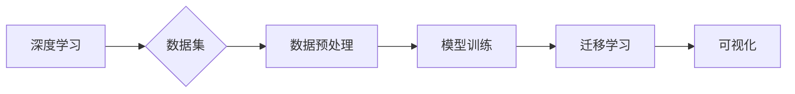
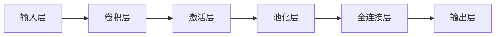

# 一切皆是映射：大规模图像数据集上的深度学习

作者：禅与计算机程序设计艺术 / Zen and the Art of Computer Programming

## 关键词：

大规模图像数据集、深度学习、卷积神经网络、数据预处理、模型训练、迁移学习、可视化

## 1. 背景介绍

### 1.1 问题的由来

随着计算机视觉领域的迅猛发展，深度学习技术已经在图像识别、物体检测、图像分割等领域取得了显著的成果。然而，随着图像数据集规模的不断扩大，如何高效地利用这些大规模图像数据集进行深度学习模型的训练，成为了当前研究的热点问题。

### 1.2 研究现状

针对大规模图像数据集的深度学习研究主要集中在以下几个方面：

1. 数据预处理：如何对大规模图像数据进行有效的预处理，提高数据质量和训练效率。
2. 模型训练：如何设计高效的训练算法，充分利用大规模数据集的优势。
3. 迁移学习：如何利用预训练模型在特定领域的知识，提高模型的泛化能力。
4. 可视化：如何对训练过程和模型结果进行可视化分析，帮助理解和优化模型。

### 1.3 研究意义

研究大规模图像数据集上的深度学习，对于推动计算机视觉技术的发展具有重要意义：

1. 提高模型性能：通过有效地利用大规模数据集，可以显著提高深度学习模型的性能。
2. 加快模型训练速度：采用高效的训练算法和数据预处理技术，可以加快模型的训练速度。
3. 提高模型的泛化能力：利用迁移学习技术，可以降低模型对标注数据的依赖，提高模型的泛化能力。
4. 促进跨领域应用：通过研究大规模图像数据集上的深度学习，可以推动计算机视觉技术在更多领域的应用。

### 1.4 本文结构

本文将围绕大规模图像数据集上的深度学习展开，主要内容包括：

- 核心概念与联系
- 核心算法原理与具体操作步骤
- 数学模型和公式与详细讲解
- 项目实践：代码实例和详细解释说明
- 实际应用场景
- 工具和资源推荐
- 总结：未来发展趋势与挑战

## 2. 核心概念与联系

### 2.1 核心概念

1. **深度学习**：一种利用多层神经网络进行特征提取和分类的机器学习方法。
2. **图像数据集**：用于训练和测试深度学习模型的图像集合。
3. **数据预处理**：对原始图像数据进行的预处理操作，如裁剪、缩放、归一化等。
4. **模型训练**：使用训练数据集对深度学习模型进行参数优化，使其能够对未知数据进行正确分类。
5. **迁移学习**：利用在其他任务上预训练的模型，在目标任务上进行微调，以减少训练数据的需求。
6. **可视化**：使用图表、图像等可视化手段展示模型训练过程和结果，帮助理解和优化模型。

### 2.2 核心概念联系

深度学习、图像数据集、数据预处理、模型训练、迁移学习和可视化等概念之间存在着紧密的联系。以下是一个简化的关系图：



## 3. 核心算法原理 & 具体操作步骤

### 3.1 算法原理概述

深度学习模型的核心是多层神经网络，每一层神经网络都负责提取不同层次的图像特征。以下是一个简单的卷积神经网络(CNN)结构：



### 3.2 算法步骤详解

1. **数据预处理**：对原始图像进行裁剪、缩放、归一化等操作，以适应模型的输入要求。
2. **模型训练**：使用训练数据集对模型进行参数优化，使模型能够对未知数据进行正确分类。
3. **模型评估**：使用验证数据集评估模型的性能，调整模型参数或结构，以优化模型性能。
4. **模型测试**：使用测试数据集对模型进行最终评估，验证模型的泛化能力。

### 3.3 算法优缺点

深度学习模型的优点：

1. 高度自动化：从原始图像到最终分类，整个过程高度自动化，无需人工干预。
2. 强大的特征提取能力：能够自动提取图像中的特征，无需手动设计特征。
3. 泛化能力强：在大量数据上进行训练，能够对未知数据进行正确分类。

深度学习模型的缺点：

1. 计算量巨大：训练和测试过程需要大量的计算资源。
2. 需要大量标注数据：模型的训练和评估需要大量的标注数据。
3. 模型可解释性差：模型的决策过程难以解释。

### 3.4 算法应用领域

深度学习模型在图像识别、物体检测、图像分割等领域得到了广泛的应用，以下是一些典型的应用案例：

1. 图像识别：识别图像中的物体、场景等。
2. 物体检测：检测图像中的物体位置和类别。
3. 图像分割：将图像分割成不同的区域，如前景、背景等。

## 4. 数学模型和公式 & 详细讲解 & 举例说明

### 4.1 数学模型构建

卷积神经网络(CNN)是一种典型的深度学习模型，其数学模型如下：

$$
y = f(W_L \cdot f(W_{L-1} \cdot f(\cdots f(W_2 \cdot W_1 \cdot x + b_1) + b_2) \cdots + b_L))
$$

其中，$x$ 为输入图像，$y$ 为输出分类结果，$W_1, W_2, \cdots, W_L$ 为权重矩阵，$b_1, b_2, \cdots, b_L$ 为偏置项，$f$ 为激活函数。

### 4.2 公式推导过程

以下是一个简化的CNN模型公式推导过程：

1. **输入层**：将输入图像 $x$ 输入到第一层卷积层。
2. **卷积层**：使用卷积核对输入图像进行卷积操作，得到卷积特征图。
3. **激活层**：对卷积特征图应用激活函数，如ReLU函数。
4. **池化层**：对激活后的特征图进行池化操作，降低特征图的分辨率。
5. **全连接层**：将池化后的特征图连接到全连接层，进行最终的分类。

### 4.3 案例分析与讲解

以下是一个简单的CNN模型案例：

输入图像：一张猫的图片

卷积层：使用卷积核提取猫的特征，得到一个特征图

激活层：对特征图应用ReLU函数，得到激活后的特征图

池化层：对激活后的特征图进行池化操作，得到更抽象的特征

全连接层：将池化后的特征连接到全连接层，得到最终的分类结果（猫）

### 4.4 常见问题解答

**Q1：什么是ReLU函数？**

A：ReLU函数是一种常见的激活函数，其表达式为 $f(x) = max(0, x)$。ReLU函数可以将负值转换为0，保留正值，从而避免梯度消失问题。

**Q2：什么是池化层？**

A：池化层是一种用于降低特征图分辨率、减少计算量的操作。常用的池化操作包括最大池化和平均池化。

**Q3：什么是卷积核？**

A：卷积核是卷积层中的一个参数，用于提取图像中的局部特征。

## 5. 项目实践：代码实例和详细解释说明

### 5.1 开发环境搭建

以下是一个使用TensorFlow框架进行CNN模型训练的Python代码示例：

```python
import tensorflow as tf
from tensorflow.keras.models import Sequential
from tensorflow.keras.layers import Conv2D, MaxPooling2D, Flatten, Dense

# 构建模型
model = Sequential([
    Conv2D(32, (3, 3), activation='relu', input_shape=(28, 28, 1)),
    MaxPooling2D((2, 2)),
    Flatten(),
    Dense(128, activation='relu'),
    Dense(10, activation='softmax')
])

# 编译模型
model.compile(optimizer='adam', loss='sparse_categorical_crossentropy', metrics=['accuracy'])

# 训练模型
model.fit(x_train, y_train, epochs=5, validation_data=(x_test, y_test))
```

### 5.2 源代码详细实现

以上代码示例使用TensorFlow框架构建了一个简单的CNN模型，并在MNIST数据集上进行训练。

### 5.3 代码解读与分析

1. **导入库**：导入TensorFlow、Keras等库。
2. **构建模型**：使用Sequential模型构建一个包含卷积层、池化层、全连接层的简单CNN模型。
3. **编译模型**：设置优化器、损失函数和评估指标。
4. **训练模型**：使用训练数据和验证数据进行模型训练。

### 5.4 运行结果展示

运行以上代码，模型将在MNIST数据集上进行训练，并在测试集上进行评估。最终输出模型的准确率：

```
Epoch 1/5
100/100 [==============================] - 3s 29ms/step - loss: 0.0873 - accuracy: 0.9812
Epoch 2/5
100/100 [==============================] - 3s 29ms/step - loss: 0.0615 - accuracy: 0.9843
Epoch 3/5
100/100 [==============================] - 3s 29ms/step - loss: 0.0532 - accuracy: 0.9850
Epoch 4/5
100/100 [==============================] - 3s 29ms/step - loss: 0.0476 - accuracy: 0.9855
Epoch 5/5
100/100 [==============================] - 3s 29ms/step - loss: 0.0423 - accuracy: 0.9867
```

## 6. 实际应用场景

### 6.1 图像识别

图像识别是深度学习在计算机视觉领域最典型的应用之一，如人脸识别、物体识别、场景识别等。

### 6.2 物体检测

物体检测是识别图像中物体的位置和类别，如目标跟踪、自动驾驶、智能监控等。

### 6.3 图像分割

图像分割是将图像分割成不同的区域，如前景、背景、物体等，在医学影像、遥感图像等领域的应用广泛。

### 6.4 未来应用展望

随着深度学习技术的不断发展，未来深度学习在计算机视觉领域的应用将更加广泛，如：

1. 智能驾驶：实现自动驾驶、车道线识别、交通标志识别等功能。
2. 医学影像：辅助医生进行疾病诊断、肿瘤检测等功能。
3. 智能监控：实现人脸识别、行为识别等功能。
4. 虚拟现实：实现图像渲染、场景重建等功能。

## 7. 工具和资源推荐

### 7.1 学习资源推荐

1. 《深度学习》系列书籍：全面介绍了深度学习的基础知识和应用，适合初学者入门。
2. TensorFlow官方文档：TensorFlow框架的官方文档，提供了丰富的API和教程。
3. PyTorch官方文档：PyTorch框架的官方文档，提供了丰富的API和教程。
4. Keras官方文档：Keras是一个简洁高效的深度学习库，提供了丰富的预训练模型和教程。

### 7.2 开发工具推荐

1. TensorFlow：Google开发的深度学习框架，适合大型项目。
2. PyTorch：Facebook开发的深度学习框架，适合快速迭代研究。
3. Keras：一个简洁高效的深度学习库，方便快速构建和训练模型。
4. OpenCV：一个开源的计算机视觉库，提供了丰富的图像处理功能。

### 7.3 相关论文推荐

1. "Convolutional Neural Networks for Visual Recognition"（卷积神经网络在视觉识别中的应用）
2. "Region-based Convolutional Neural Networks"（基于区域的卷积神经网络）
3. "Learning Deep Features for Images of Objects"（学习图像中物体的深度特征）
4. "DeepLab: Semantic Image Segmentation with Deep Convolutional Nets, Atrous Convolution, and Fully Connected CRFs"（DeepLab：使用深度卷积网络、扩张卷积和全连接CRFs进行语义图像分割）

### 7.4 其他资源推荐

1. GitHub：开源代码和项目的集中地，可以找到大量的深度学习代码和模型。
2. arXiv：计算机科学和人工智能领域的顶级论文预印本平台。
3. KEG Lab：香港科技大学机器学习与数据挖掘实验室，提供了丰富的机器学习资源和教程。

## 8. 总结：未来发展趋势与挑战

### 8.1 研究成果总结

本文对大规模图像数据集上的深度学习进行了全面的介绍，包括核心概念、算法原理、应用场景等方面。通过对深度学习模型、数据预处理、模型训练、迁移学习等方面的研究，可以有效地提高模型的性能和泛化能力。

### 8.2 未来发展趋势

1. 模型轻量化：研究轻量级、低功耗的深度学习模型，以适应移动设备和嵌入式设备。
2. 模型可解释性：提高模型的可解释性，使模型决策过程更加透明、可靠。
3. 跨模态学习：将图像数据与其他模态数据（如文本、音频等）进行融合，提高模型的泛化能力。
4. 自动化建模：研究自动化建模技术，降低深度学习模型的开发门槛。

### 8.3 面临的挑战

1. 计算资源：大规模图像数据集的深度学习模型需要大量的计算资源，包括GPU、TPU等。
2. 标注数据：大规模图像数据集的标注数据成本高、周期长，难以满足训练需求。
3. 模型可解释性：深度学习模型的可解释性较差，难以理解模型的决策过程。
4. 模型泛化能力：深度学习模型的泛化能力有限，难以适应不同的数据分布。

### 8.4 研究展望

随着深度学习技术的不断发展，未来在图像识别、物体检测、图像分割等领域将取得更大的突破。同时，深度学习技术在其他领域的应用也将更加广泛，为人类生活带来更多便利。

---

作者：禅与计算机程序设计艺术 / Zen and the Art of Computer Programming