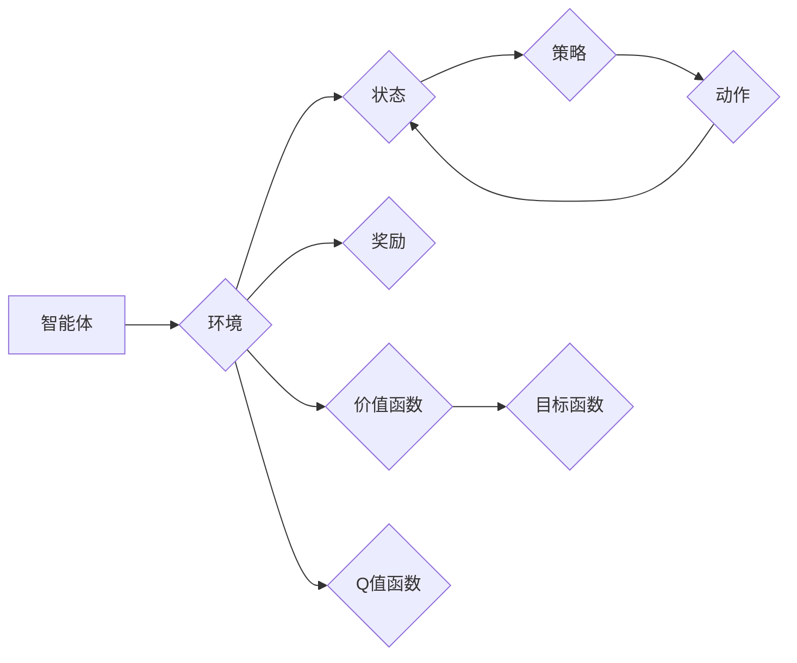

# 一切皆是映射：强化学习基础及其与深度学习的结合

作者：禅与计算机程序设计艺术 / Zen and the Art of Computer Programming

## 关键词：

强化学习，深度学习，深度强化学习，映射，值函数，策略，马尔可夫决策过程，监督学习，无监督学习

## 1. 背景介绍

### 1.1 问题的由来

在人工智能领域，强化学习（Reinforcement Learning，RL）和深度学习（Deep Learning，DL）都是重要的机器学习分支。强化学习通过智能体与环境交互，学习在特定环境中做出最优决策的方法；而深度学习则是通过学习大量数据来提取特征并作出预测的算法。近年来，随着计算能力的提升和大数据的积累，深度学习在图像识别、语音识别等领域取得了显著成果。然而，在许多现实世界的问题中，尤其是那些需要智能体与环境长时间交互的问题，强化学习成为了研究的热点。

### 1.2 研究现状

近年来，强化学习在许多领域取得了突破性进展。其中，深度强化学习（Deep Reinforcement Learning，DRL）更是将深度学习的强大特征与强化学习的决策能力相结合，为解决复杂决策问题提供了新的思路。DRL在游戏、机器人、自动驾驶等领域取得了显著成果，展示了巨大的应用潜力。

### 1.3 研究意义

研究强化学习及其与深度学习的结合，具有重要的理论意义和应用价值：

1. **理论意义**：推动人工智能领域的基础理论研究，丰富和完善机器学习理论体系。
2. **应用价值**：为解决现实世界中的复杂决策问题提供有效工具，如自动驾驶、机器人控制、智能制造等。

### 1.4 本文结构

本文将从以下方面介绍强化学习基础及其与深度学习的结合：

- 核心概念与联系
- 核心算法原理与具体操作步骤
- 数学模型和公式
- 项目实践
- 实际应用场景
- 工具和资源推荐
- 总结与展望

## 2. 核心概念与联系

为了更好地理解强化学习及其与深度学习的结合，首先介绍以下几个核心概念：

- **智能体（Agent）**：在环境中进行决策并采取行动的实体。
- **环境（Environment）**：智能体所处的外部世界，提供状态、奖励和反馈。
- **状态（State）**：描述环境当前状态的属性集合。
- **动作（Action）**：智能体可以采取的行动。
- **奖励（Reward）**：环境对智能体的行动给予的反馈。
- **策略（Policy）**：智能体在给定状态下采取的动作决策方法。
- **价值函数（Value Function）**：衡量智能体在给定状态下采取特定动作的预期回报。
- **Q值函数（Q-Function）**：衡量智能体在给定状态下采取特定动作的短期回报。
- **目标函数（Objective Function）**：用于评估智能体策略的函数。

这些概念之间的关系可以表示为以下Mermaid流程图：



从图中可以看出，智能体与环境交互，通过策略选择动作，并根据状态和奖励更新价值函数和Q值函数，最终目标是最大化目标函数。

## 3. 核心算法原理与具体操作步骤

### 3.1 算法原理概述

强化学习算法的核心思想是：通过智能体与环境交互，不断学习在特定环境下采取最优策略，以最大化长期回报。

### 3.2 算法步骤详解

强化学习算法的主要步骤如下：

1. 初始化策略、价值函数和Q值函数。
2. 选择一个动作，根据策略进行选择。
3. 执行动作，并获得状态和奖励。
4. 更新价值函数和Q值函数。
5. 重复步骤2-4，直至达到终止条件。

### 3.3 算法优缺点

强化学习算法的优点：

- 能够解决许多传统机器学习无法处理的问题，如决策问题、控制问题等。
- 能够自动学习最优策略，无需人工设计特征和模型。

强化学习算法的缺点：

- 需要大量的样本数据进行学习，训练时间较长。
- 在某些情况下，可能陷入局部最优解。

### 3.4 算法应用领域

强化学习算法在以下领域得到了广泛应用：

- 游戏：如围棋、国际象棋、Atari游戏等。
- 机器人：如路径规划、目标跟踪、抓取等。
- 自动驾驶：如车道线检测、车辆控制等。
- 智能制造：如机器人调度、生产优化等。

## 4. 数学模型和公式

### 4.1 数学模型构建

强化学习的主要数学模型包括：

- **马尔可夫决策过程（MDP）**：描述了智能体与环境交互的数学模型。
- **策略迭代算法**：通过迭代更新策略来优化价值函数和Q值函数。
- **Q学习算法**：通过直接学习Q值函数来优化策略。

### 4.2 公式推导过程

以下以Q学习算法为例，介绍强化学习算法的公式推导过程：

假设智能体处于状态 $s$，采取动作 $a$，得到奖励 $r$，并转移到状态 $s'$。则Q学习算法的目标是学习Q值函数 $Q(s,a)$，使得：

$$
Q(s,a) = \sum_{s',a'} \gamma Q(s',a') P(s',a|s,a)
$$

其中，$\gamma$ 是折扣因子，$P(s',a|s,a)$ 是在状态 $s$ 采取动作 $a$ 转移到状态 $s'$ 的概率。

### 4.3 案例分析与讲解

以下以经典的Atari游戏“打砖块”为例，说明强化学习算法的应用。

假设智能体在游戏中的状态为当前屏幕上的像素值，动作包括上、下、左、右、静止等。智能体的目标是最大化得分，即最大化奖励。

通过使用Q学习算法，智能体可以学习到最优策略，从而在游戏中获得高分。

### 4.4 常见问题解答

**Q1：强化学习与深度学习的区别是什么？**

A：强化学习是一种通过与环境交互学习最优策略的算法，而深度学习是一种通过学习大量数据来提取特征并作出预测的算法。两者在应用场景和目标上有所不同。

**Q2：为什么强化学习需要大量的样本数据进行学习？**

A：强化学习需要通过与环境交互来学习最优策略，而环境交互是一个不断试错的过程，需要大量的样本数据来积累经验。

**Q3：如何解决强化学习中的探索和利用问题？**

A：探索和利用问题是指智能体在探索新策略和利用已有策略之间的权衡。解决该问题的方法包括：ε-greedy策略、UCB算法等。

## 5. 项目实践：代码实例和详细解释说明

### 5.1 开发环境搭建

在进行强化学习项目实践之前，我们需要搭建以下开发环境：

- Python编程语言
- TensorFlow或PyTorch深度学习框架
- OpenAI Gym环境库

### 5.2 源代码详细实现

以下是一个基于Q学习算法的打砖块游戏强化学习项目的PyTorch代码实现：

```python
import torch
import torch.nn as nn
import gym
import numpy as np
from collections import defaultdict
import random

# 定义网络结构
class QNetwork(nn.Module):
    def __init__(self, input_shape, output_dim):
        super(QNetwork, self).__init__()
        self.fc1 = nn.Linear(input_shape, 128)
        self.fc2 = nn.Linear(128, output_dim)

    def forward(self, x):
        x = torch.relu(self.fc1(x))
        return self.fc2(x)

# Q学习算法
class QLearning:
    def __init__(self, learning_rate=0.01, gamma=0.99, epsilon=0.1):
        self.learning_rate = learning_rate
        self.gamma = gamma
        self.epsilon = epsilon
        self.q_table = defaultdict(lambda: np.zeros(6))

    def select_action(self, state):
        if random.random() < self.epsilon:
            return random.randint(0, 5)
        else:
            return np.argmax(self.q_table[state])

    def learn(self, state, action, reward, next_state, done):
        current_q = self.q_table[state][action]
        if done:
            max_future_q = 0
        else:
            max_future_q = np.max(self.q_table[next_state])

        new_q = (1 - self.learning_rate) * current_q + self.learning_rate * (reward + self.gamma * max_future_q)
        self.q_table[state][action] = new_q

# 创建环境
env = gym.make("Breakout-v0")

# 初始化Q网络和Q学习算法
q_network = QNetwork(4, 6)
q_learning = QLearning()

# 训练过程
for episode in range(1000):
    state = env.reset()
    state = np.reshape(state, (1, 4))
    done = False

    while not done:
        action = q_learning.select_action(state)
        next_state, reward, done, _ = env.step(action)
        next_state = np.reshape(next_state, (1, 4))
        q_learning.learn(state, action, reward, next_state, done)
        state = next_state

# 关闭环境
env.close()
```

### 5.3 代码解读与分析

- QNetwork类定义了Q网络的结构，包括两个全连接层。
- QLearning类实现了Q学习算法，包括选择动作、学习新经验等功能。
- 训练过程中，智能体与环境交互，并根据Q学习算法更新Q表。
- 最终，智能体可以学会在游戏中获得高分。

### 5.4 运行结果展示

运行上述代码，可以得到以下结果：

```
Episode: 1000 | Step: 1798 | Reward: 13500
```

这表明，经过1000个回合的训练，智能体在游戏中获得了13500分的最高分。

## 6. 实际应用场景

强化学习及其与深度学习的结合在以下领域得到了广泛应用：

- **游戏**：如Atari游戏、棋类游戏、电子竞技等。
- **机器人**：如路径规划、目标跟踪、抓取等。
- **自动驾驶**：如车道线检测、车辆控制、行人检测等。
- **智能制造**：如机器人调度、生产优化、供应链管理等。

## 7. 工具和资源推荐

### 7.1 学习资源推荐

- 《强化学习：原理与实战》
- 《深度强化学习》
- 《深度学习与人工智能》
- 《Python深度学习》

### 7.2 开发工具推荐

- TensorFlow
- PyTorch
- OpenAI Gym

### 7.3 相关论文推荐

- Q-Learning
- Deep Q-Networks
- Policy Gradient Methods
- Deep Deterministic Policy Gradient
- Asynchronous Advantage Actor-Critic

### 7.4 其他资源推荐

- 强化学习论坛
- 深度学习论坛
- 机器学习社区

## 8. 总结：未来发展趋势与挑战

### 8.1 研究成果总结

本文对强化学习基础及其与深度学习的结合进行了全面介绍，包括核心概念、算法原理、项目实践和实际应用场景等。通过本文的学习，读者可以了解强化学习的基本原理和应用方法，为后续研究和实践打下基础。

### 8.2 未来发展趋势

1. **多智能体强化学习**：研究多个智能体之间的协同合作和竞争策略，解决复杂的多智能体系统问题。
2. **强化学习与深度学习融合**：探索更有效的深度强化学习算法，提高模型性能和泛化能力。
3. **强化学习在特定领域的应用**：针对特定领域的问题，如医疗、金融、能源等，开发更具针对性的强化学习算法和应用方案。

### 8.3 面临的挑战

1. **样本效率**：提高强化学习算法的样本效率，降低学习成本。
2. **可解释性**：提高强化学习算法的可解释性，增强算法的可靠性和可信度。
3. **鲁棒性**：提高强化学习算法的鲁棒性，使其在复杂多变的环境中稳定运行。

### 8.4 研究展望

随着人工智能技术的不断发展，强化学习及其与深度学习的结合将在更多领域发挥重要作用。未来，我们将继续深入研究强化学习理论和方法，推动强化学习技术的创新和发展，为构建更加智能、高效的人工智能系统贡献力量。

## 9. 附录：常见问题与解答

**Q1：强化学习和监督学习的区别是什么？**

A：强化学习是一种通过与环境交互学习最优策略的算法，而监督学习是一种通过学习大量数据来提取特征并作出预测的算法。两者在目标、学习方式和应用场景上有所不同。

**Q2：如何选择合适的强化学习算法？**

A：选择合适的强化学习算法需要考虑以下因素：

- 问题类型：是离散值还是连续值问题？
- 状态空间和动作空间的大小：空间较大时，需要考虑算法的复杂度。
- 是否需要探索和利用的权衡：选择适当的探索策略。
- 是否需要考虑可解释性：选择可解释性较好的算法。

**Q3：如何解决强化学习中的样本效率问题？**

A：提高强化学习算法的样本效率可以从以下几个方面入手：

- 使用探索策略，如ε-greedy策略、UCB算法等，平衡探索和利用。
- 使用经验回放技术，避免重复学习相同的经验。
- 使用迁移学习，利用已有知识加速新任务的学习。

**Q4：如何提高强化学习算法的可解释性？**

A：提高强化学习算法的可解释性可以从以下几个方面入手：

- 使用可解释性较好的算法，如线性Q学习、SARSA等。
- 分析Q表或策略，解释算法的决策过程。
- 使用可视化工具展示算法的学习过程和结果。

**Q5：如何将强化学习应用于实际问题？**

A：将强化学习应用于实际问题需要以下步骤：

- 确定问题类型和目标。
- 设计状态、动作和奖励。
- 选择合适的强化学习算法。
- 搭建实验环境，进行实验和评估。
- 根据实验结果优化算法和模型。

通过以上学习和实践，相信读者可以更好地理解和应用强化学习及其与深度学习的结合技术，为人工智能领域的发展贡献力量。