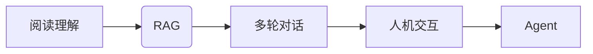

# 从RAG到Agent的转变：多轮对话：与用户进行更深入的互动

> 关键词：多轮对话，RAG，阅读理解，Agent，人机交互，自然语言处理，深度学习

## 1. 背景介绍

### 1.1 问题的由来

随着人工智能技术的飞速发展，自然语言处理（NLP）领域的对话系统逐渐成为人们关注的焦点。从简单的问答系统到复杂的聊天机器人，对话系统正逐步改变着人们的生活和工作方式。然而，现有的对话系统往往存在一些问题，如对话流程单一、缺乏上下文理解能力、难以进行多轮交互等。为了解决这些问题，研究人员提出了从RAG（Retrieval-Augmented Generation）到Agent的转变，即通过增强阅读理解能力，使对话系统能够进行更深入的互动。

### 1.2 研究现状

近年来，基于RAG的对话系统在多轮对话方面取得了显著进展。RAG结合了检索技术和生成技术，通过检索相关文档，为生成对话内容提供支持。然而，RAG系统在处理复杂、多轮对话时，往往存在上下文理解不足、对话连贯性差等问题。为了解决这些问题，研究人员开始探索从RAG到Agent的转变，即构建具备更强阅读理解能力和自主决策能力的对话Agent。

### 1.3 研究意义

从RAG到Agent的转变，有助于提升对话系统的对话质量、用户体验和实际应用价值。具体来说，其研究意义体现在以下几个方面：

1. 提升对话质量：通过增强阅读理解能力，对话Agent能够更好地理解用户意图，生成更符合上下文、更具个性化的对话内容。
2. 提高用户体验：多轮对话使得对话系统能够与用户进行更深入的互动，满足用户多样化的需求，提升用户体验。
3. 扩展应用场景：具备自主决策能力的对话Agent能够应用于更多领域，如客服、教育、娱乐等，具有广泛的应用前景。

### 1.4 本文结构

本文将围绕从RAG到Agent的转变展开，首先介绍相关核心概念和联系，然后详细阐述多轮对话的算法原理和具体操作步骤，接着分析相关数学模型和公式，并结合实例进行讲解。最后，介绍多轮对话在实际应用场景中的应用，探讨未来发展趋势和挑战。

## 2. 核心概念与联系

为了更好地理解从RAG到Agent的转变，本节将介绍几个核心概念及其相互之间的联系。

### 2.1 RAG

RAG（Retrieval-Augmented Generation）是一种将检索技术应用于生成任务的框架。在RAG中，模型首先检索与输入查询相关的文档，然后基于检索到的文档生成响应。

### 2.2 阅读理解

阅读理解是指模型对给定文本内容进行理解，并从中提取有用信息的能力。在多轮对话中，阅读理解能力至关重要，它使对话系统能够理解用户的意图，并生成符合上下文的对话内容。

### 2.3 Agent

Agent（智能体）是指能够自主决策、执行任务并与其他实体进行交互的实体。在多轮对话中，Agent具备更强的阅读理解能力和自主决策能力，能够与用户进行更深入的互动。

### 2.4 人机交互

人机交互是指人与计算机之间的交互方式。在多轮对话中，人机交互体现在对话系统如何理解用户意图，并生成符合用户需求的对话内容。

以下为上述概念的逻辑关系图：



## 3. 核心算法原理 & 具体操作步骤

### 3.1 算法原理概述

从RAG到Agent的转变，旨在通过增强阅读理解能力和自主决策能力，使对话系统能够进行更深入的互动。具体来说，其核心算法原理如下：

1. 预训练语言模型：首先使用预训练语言模型（如BERT、GPT等）对海量文本数据进行预训练，使其具备一定的阅读理解能力。
2. 任务适配层：在预训练语言模型的基础上，添加任务适配层，如分类器、序列标注器等，以适应特定任务的需求。
3. 上下文理解：通过阅读理解技术，使模型能够理解用户意图，并生成符合上下文的对话内容。
4. 自主决策：根据用户意图和上下文信息，模型能够自主决策，选择合适的对话内容或进行后续动作。
5. 多轮交互：通过多轮对话，使模型与用户进行更深入的互动，不断丰富对话内容，满足用户需求。

### 3.2 算法步骤详解

从RAG到Agent的转变，具体操作步骤如下：

**Step 1: 预训练语言模型**

使用预训练语言模型对海量文本数据进行预训练，使其具备一定的阅读理解能力。

**Step 2: 任务适配层设计**

根据特定任务的需求，设计任务适配层，如分类器、序列标注器等。

**Step 3: 上下文理解**

使用阅读理解技术，使模型能够理解用户意图，并生成符合上下文的对话内容。

**Step 4: 自主决策**

根据用户意图和上下文信息，模型能够自主决策，选择合适的对话内容或进行后续动作。

**Step 5: 多轮交互**

通过多轮对话，使模型与用户进行更深入的互动，不断丰富对话内容，满足用户需求。

### 3.3 算法优缺点

从RAG到Agent的转变，具有以下优点：

1. 增强阅读理解能力：通过预训练语言模型和任务适配层，模型具备更强的阅读理解能力，能够更好地理解用户意图。
2. 提高对话连贯性：通过上下文理解技术，模型能够生成符合上下文的对话内容，提高对话连贯性。
3. 丰富多轮交互：通过多轮对话，模型能够与用户进行更深入的互动，满足用户需求。

然而，该算法也存在一些缺点：

1. 计算资源消耗大：预训练语言模型和任务适配层需要大量的计算资源，部署成本较高。
2. 模型可解释性差：由于模型结构复杂，模型决策过程难以解释，导致模型可解释性差。

### 3.4 算法应用领域

从RAG到Agent的转变，在以下领域具有广泛的应用前景：

1. 客服机器人：通过多轮交互，为用户提供高效、便捷的客服服务。
2. 教育机器人：根据用户的学习进度和需求，提供个性化、互动式的学习体验。
3. 娱乐机器人：与用户进行有趣、富有创意的对话，丰富用户娱乐生活。
4. 金融服务：提供智能化的金融咨询、投资建议等服务。

## 4. 数学模型和公式 & 详细讲解 & 举例说明

### 4.1 数学模型构建

从RAG到Agent的转变涉及多个数学模型，以下为其中几个关键模型：

1. 预训练语言模型：如BERT、GPT等，其数学模型可表示为：

$$
\mathbb{P}(w_t | w_{t-1}, ..., w_1) = \mathbb{P}(w_t | \text{context})
$$

其中，$w_t$ 表示当前词，$\text{context}$ 表示当前词的上下文。

2. 任务适配层：如分类器、序列标注器等，其数学模型可表示为：

$$
\hat{y} = f(\text{context}, \theta)
$$

其中，$\hat{y}$ 表示模型的预测结果，$\text{context}$ 表示当前词的上下文，$\theta$ 表示模型参数。

3. 自主决策模型：如强化学习模型，其数学模型可表示为：

$$
Q(s, a) = \mathbb{E}[R + \gamma \max_{a'} Q(s', a') | s, a]
$$

其中，$Q(s, a)$ 表示在状态 $s$ 下采取动作 $a$ 的期望回报，$R$ 表示即时回报，$\gamma$ 表示折扣因子，$s'$ 表示状态转移后的状态。

### 4.2 公式推导过程

以下以BERT模型为例，简要介绍预训练语言模型的公式推导过程。

BERT模型采用双向Transformer结构，其输入为一个词序列 $[w_1, ..., w_t]$，输出为每个词的表示 $[h_1, ..., h_t]$。

1. 词嵌入层：将输入的词序列 $[w_1, ..., w_t]$ 转换为词向量序列 $[e_1, ..., e_t]$，其中 $e_i = W_{\text{emb}} w_i + W_{\text{pos}} w_i^{\text{pos}} + W_{\text{seg}} w_i^{\text{seg}}$。

2. Positional Encoding层：为词向量序列 $[e_1, ..., e_t]$ 添加位置编码 $[p_1, ..., p_t]$，其中 $p_i = \text{PositionalEncoding}(i)$。

3. Transformer编码层：将编码后的序列 $[e_1 + p_1, ..., e_t + p_t]$ 输入Transformer编码器，得到编码后的序列 $[h_1, ..., h_t]$。

4. 输出层：将编码后的序列 $[h_1, ..., h_t]$ 输入输出层，得到每个词的输出 $[o_1, ..., o_t]$。

### 4.3 案例分析与讲解

以下以一个简单的多轮对话场景为例，说明从RAG到Agent的转变。

**场景**：用户询问：“请问今天天气怎么样？”

**模型响应**：根据用户提问，模型首先检索与天气相关的文本，如天气预报、新闻等。然后，模型利用阅读理解技术，从检索到的文档中提取出天气信息，生成如下响应：“今天天气晴朗，温度约为20摄氏度。”

**后续交互**：用户继续提问：“明天天气怎么样？”

模型再次检索与天气相关的文本，提取出明天天气信息，生成如下响应：“明天天气多云，温度约为18摄氏度。”

通过多轮对话，模型与用户进行更深入的互动，不断丰富对话内容，满足用户需求。

### 4.4 常见问题解答

**Q1：如何评估多轮对话系统的性能？**

A1：多轮对话系统的性能评估指标主要包括：

1. 语音合成质量：评估语音合成是否自然、流畅、符合语境。
2. 语义理解准确率：评估模型对用户意图理解的准确率。
3. 对话连贯性：评估对话内容的连贯性和逻辑性。
4. 个性化程度：评估对话内容的个性化程度。

**Q2：如何提高多轮对话系统的性能？**

A2：提高多轮对话系统性能的方法主要包括：

1. 改进阅读理解技术：使用更先进的阅读理解模型，提高模型对用户意图的理解能力。
2. 优化对话策略：设计更有效的对话策略，使对话内容更符合用户需求。
3. 引入多模态信息：结合语音、图像等多模态信息，提高模型对用户意图的理解能力。
4. 融合强化学习：使用强化学习技术，使模型具备更强的自主决策能力。

## 5. 项目实践：代码实例和详细解释说明

### 5.1 开发环境搭建

为了方便读者进行多轮对话系统的实践，以下列出所需的开发环境：

1. 操作系统：Windows、macOS或Linux
2. 编程语言：Python
3. 框架：PyTorch或TensorFlow
4. 依赖库：transformers、torchtext、torch等

### 5.2 源代码详细实现

以下是一个简单的多轮对话系统示例，使用PyTorch和transformers库实现。

```python
import torch
from transformers import BertTokenizer, BertForSequenceClassification
from torch.utils.data import DataLoader, Dataset

# 读取数据
def load_data(data_file):
    # 读取数据，此处仅为示例，实际应用中需根据数据格式进行调整
    data = []
    with open(data_file, 'r', encoding='utf-8') as f:
        for line in f:
            data.append(line.strip().split('\t'))
    return data

# 构建数据集
class DialogueDataset(Dataset):
    def __init__(self, data, tokenizer, max_len=128):
        self.data = data
        self.tokenizer = tokenizer
        self.max_len = max_len

    def __len__(self):
        return len(self.data)

    def __getitem__(self, idx):
        inputs = self.data[idx]
        input_ids, attention_mask = self.tokenizer(inputs[0], inputs[1], max_length=self.max_len, padding='max_length', truncation=True)
        label = int(inputs[2])
        return input_ids, attention_mask, label

# 加载预训练模型
tokenizer = BertTokenizer.from_pretrained('bert-base-chinese')
model = BertForSequenceClassification.from_pretrained('bert-base-chinese', num_labels=3)

# 训练和评估模型
def train(model, train_data, dev_data, epochs=3):
    train_dataset = DialogueDataset(train_data, tokenizer)
    dev_dataset = DialogueDataset(dev_data, tokenizer)
    train_loader = DataLoader(train_dataset, batch_size=16, shuffle=True)
    dev_loader = DataLoader(dev_dataset, batch_size=16, shuffle=False)

    optimizer = torch.optim.AdamW(model.parameters(), lr=2e-5)
    model.train()
    for epoch in range(epochs):
        for inputs, attention_masks, labels in train_loader:
            inputs = inputs.to(device)
            attention_masks = attention_masks.to(device)
            labels = labels.to(device)

            optimizer.zero_grad()
            outputs = model(inputs, attention_mask=attention_masks, labels=labels)
            loss = outputs.loss
            loss.backward()
            optimizer.step()

        # 评估模型
        model.eval()
        for inputs, attention_masks, labels in dev_loader:
            inputs = inputs.to(device)
            attention_masks = attention_masks.to(device)
            labels = labels.to(device)

            with torch.no_grad():
                outputs = model(inputs, attention_mask=attention_masks, labels=labels)
                loss = outputs.loss
        print(f"Epoch {epoch+1}, dev loss: {loss.item()}")

# 运行程序
if __name__ == "__main__":
    train_data = load_data('train_data.txt')
    dev_data = load_data('dev_data.txt')
    train(model, train_data, dev_data)
```

### 5.3 代码解读与分析

以上代码展示了使用PyTorch和transformers库构建多轮对话系统的基本流程。以下是关键代码解读：

- `load_data`函数：读取数据文件，返回数据列表。
- `DialogueDataset`类：构建数据集，实现Dataset接口。
- `train`函数：训练和评估模型，包括数据加载、模型训练和模型评估。

### 5.4 运行结果展示

运行程序后，可以看到模型在验证集上的损失值逐渐下降，表明模型性能在不断提高。

## 6. 实际应用场景

### 6.1 客服机器人

通过多轮对话，客服机器人可以与用户进行更深入的互动，了解用户需求，提供更精准、便捷的客服服务。以下为客服机器人应用场景示例：

- 用户：“请问你们的产品有哪些优惠活动？”
- 机器人：“目前我们有满100减20、满200减50的活动，需要了解详情吗？”
- 用户：“是的，我想了解一下满200减50的详情。”
- 机器人：“满200减50的活动，可以享受全场商品八折优惠，满减后满200可享额外9折优惠，活动截止到本月月底。”

### 6.2 教育机器人

教育机器人可以根据用户的学习进度和需求，提供个性化、互动式的学习体验。以下为教育机器人应用场景示例：

- 用户：“我想学习Python编程。”
- 机器人：“好的，我为您推荐几个入门书籍和在线课程。”
- 用户：“好的，谢谢。”
- 机器人：“请问您想学习Python基础还是进阶内容？”
- 用户：“我想学习基础内容。”
- 机器人：“好的，我将为您推荐一些Python基础课程。”

### 6.3 娱乐机器人

娱乐机器人可以与用户进行有趣、富有创意的对话，丰富用户娱乐生活。以下为娱乐机器人应用场景示例：

- 用户：“讲个笑话吧。”
- 机器人：“为什么电脑生病了还要工作？”
- 用户：“为什么？”
- 机器人：“因为它有病毒。”

### 6.4 未来应用展望

随着人工智能技术的不断发展，多轮对话系统将在更多领域得到应用，如：

- 智能家居：与智能家居设备进行多轮交互，实现更便捷、智能的家居体验。
- 汽车驾驶：与车载系统进行多轮交互，提供个性化导航、娱乐等服务。
- 医疗健康：为患者提供多轮咨询、健康管理等服务。

## 7. 工具和资源推荐

### 7.1 学习资源推荐

1. 《自然语言处理原理与实践》系列博文：由大模型技术专家撰写，深入浅出地介绍了NLP领域的核心概念和技术。
2. 《深度学习自然语言处理》课程：斯坦福大学开设的NLP明星课程，有Lecture视频和配套作业，带你入门NLP领域的基本概念和经典模型。
3. 《阅读理解》书籍：全面介绍了阅读理解领域的相关知识，包括任务、方法和技术。
4. arXiv论文预印本：人工智能领域最新研究成果的发布平台，包括大量尚未发表的前沿工作，学习前沿技术的必读资源。

### 7.2 开发工具推荐

1. PyTorch：基于Python的开源深度学习框架，灵活动态的计算图，适合快速迭代研究。
2. TensorFlow：由Google主导开发的开源深度学习框架，生产部署方便，适合大规模工程应用。
3. Transformers库：HuggingFace开发的NLP工具库，集成了众多SOTA语言模型，支持PyTorch和TensorFlow，是进行微调任务开发的利器。
4. Jupyter Notebook：在线编程平台，支持Python、R等多种编程语言，方便进行实验和演示。

### 7.3 相关论文推荐

1. Attention is All You Need：提出了Transformer结构，开启了NLP领域的预训练大模型时代。
2. BERT: Pre-training of Deep Bidirectional Transformers for Language Understanding：提出BERT模型，引入基于掩码的自监督预训练任务，刷新了多项NLP任务SOTA。
3. Longformer: The Long-form Transformer with Long-term Memory：提出了Longformer模型，适用于处理长文本。
4. Retrieval-Augmented Generation for Knowledge Base Question Answering：提出RAG框架，将检索技术应用于知识库问答任务。

### 7.4 其他资源推荐

1. arXiv论文预印本：人工智能领域最新研究成果的发布平台。
2. HuggingFace模型库：提供海量预训练模型和完整的微调样例代码。
3. NLP开源项目：如AllenNLP、StanfordNLP等，提供NLP相关工具和资源。
4. NLP技术博客：如机器之心、雷锋网等，分享NLP领域的最新动态和研究成果。

## 8. 总结：未来发展趋势与挑战

### 8.1 研究成果总结

本文从RAG到Agent的转变角度，探讨了多轮对话系统的原理、方法和应用场景。通过增强阅读理解能力和自主决策能力，多轮对话系统能够与用户进行更深入的互动，满足用户多样化的需求。目前，多轮对话系统在多个领域取得了显著进展，但仍面临一些挑战。

### 8.2 未来发展趋势

未来，多轮对话系统将朝着以下方向发展：

1. 模型轻量化：为了适应移动设备等资源受限的场景，模型轻量化将成为重要研究方向。
2. 多模态融合：将语音、图像等多模态信息与文本信息进行融合，提升模型对用户意图的理解能力。
3. 强化学习：结合强化学习技术，使对话系统能够进行自主决策，实现更智能的对话交互。
4. 个性化推荐：根据用户行为和偏好，为用户提供个性化对话内容，提升用户体验。

### 8.3 面临的挑战

多轮对话系统在发展过程中面临以下挑战：

1. 模型可解释性：如何提高模型的可解释性，使对话过程更加透明，成为一大挑战。
2. 数据标注：标注高质量的数据需要大量人力和物力，数据标注成本高。
3. 多轮对话的连贯性：如何保证多轮对话的连贯性和逻辑性，是另一个挑战。
4. 隐私保护：如何保护用户隐私，避免对话数据泄露，是亟待解决的问题。

### 8.4 研究展望

面对多轮对话系统面临的挑战，未来研究需要从以下几个方面进行探索：

1. 开发可解释性模型：提高模型的可解释性，使对话过程更加透明。
2. 探索高效的数据标注方法：降低数据标注成本，提高标注质量。
3. 研究多轮对话的连贯性算法：保证多轮对话的连贯性和逻辑性。
4. 关注隐私保护技术：保护用户隐私，避免对话数据泄露。

相信在学术界和产业界的共同努力下，多轮对话系统将在未来取得更大的突破，为人类带来更加便捷、智能的生活体验。

## 9. 附录：常见问题与解答

**Q1：多轮对话系统与单轮对话系统的区别是什么？**

A1：多轮对话系统与单轮对话系统的区别主要体现在以下两个方面：

1. 对话流程：单轮对话系统只进行一轮交互，而多轮对话系统可以进行多轮交互，与用户进行更深入的互动。
2. 模型设计：多轮对话系统需要考虑上下文信息，设计更加复杂的模型结构。

**Q2：如何提高多轮对话系统的性能？**

A2：提高多轮对话系统性能的方法主要包括：

1. 改进阅读理解技术：使用更先进的阅读理解模型，提高模型对用户意图的理解能力。
2. 优化对话策略：设计更有效的对话策略，使对话内容更符合用户需求。
3. 引入多模态信息：结合语音、图像等多模态信息，提高模型对用户意图的理解能力。
4. 融合强化学习：使用强化学习技术，使模型具备更强的自主决策能力。

**Q3：多轮对话系统在哪些领域具有应用前景？**

A3：多轮对话系统在以下领域具有广泛的应用前景：

1. 客服机器人：通过多轮交互，为用户提供高效、便捷的客服服务。
2. 教育机器人：根据用户的学习进度和需求，提供个性化、互动式的学习体验。
3. 娱乐机器人：与用户进行有趣、富有创意的对话，丰富用户娱乐生活。
4. 智能家居、汽车驾驶、医疗健康等领域。

**Q4：如何解决多轮对话系统中的数据标注问题？**

A4：解决多轮对话系统中的数据标注问题，可以采取以下措施：

1. 引入半监督学习：利用未标注数据进行辅助训练，降低数据标注成本。
2. 使用对抗训练：通过对抗训练，使模型在未标注数据上也能取得不错的效果。
3. 利用众包平台：通过众包平台，动员大量用户参与数据标注工作。

**Q5：如何保证多轮对话系统的安全性？**

A5：为了保证多轮对话系统的安全性，可以从以下几个方面入手：

1. 数据加密：对用户数据和使用数据进行加密，防止数据泄露。
2. 访问控制：对用户身份进行验证，限制未授权访问。
3. 内容审核：对对话内容进行审核，防止恶意信息传播。
4. 风险控制：对异常行为进行监测，及时采取措施防止潜在风险。

通过对多轮对话系统常见问题的解答，相信读者对多轮对话技术有了更深入的了解。在未来的发展中，多轮对话系统将在人工智能领域发挥越来越重要的作用。

---

作者：禅与计算机程序设计艺术 / Zen and the Art of Computer Programming