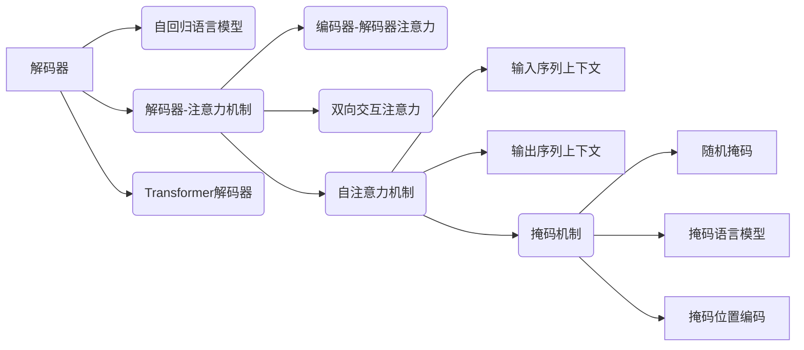

# 从零开始大模型开发与微调：解码器的输入和交互注意力层的掩码

作者：禅与计算机程序设计艺术 / Zen and the Art of Computer Programming


## 1. 背景介绍
### 1.1 问题的由来

随着深度学习技术的飞速发展，自然语言处理（NLP）领域取得了革命性的突破。其中，大模型（Large Language Models, LLMs）在NLP任务中发挥着越来越重要的作用。大模型通常包含数亿甚至数十亿个参数，能够学习到丰富的语言知识和上下文信息，从而在文本分类、问答、翻译等任务中取得优异的性能。

解码器（Decoder）是大多数NLP模型的核心部分，负责生成文本序列。在解码过程中，如何有效地利用输入序列的信息，以及如何设计注意力机制，是决定模型性能的关键因素。本文将深入探讨解码器的输入和交互注意力层的掩码技术，帮助读者从零开始了解大模型开发与微调的精髓。

### 1.2 研究现状

近年来，解码器和交互注意力层的研究取得了显著进展。以下是一些典型的技术：

- **自回归语言模型**：如GPT系列模型，通过递归地生成下一个token，实现序列生成。
- **编码器-解码器模型**：如BERT、Transformer等，通过编码器提取输入序列的语义信息，并将其传递给解码器进行序列生成。
- **双向交互注意力**：如BERT，通过同时考虑输入序列和输出序列的上下文信息，提高解码的准确性。
- **掩码机制**：如Masked Language Model（MLM），通过掩盖输入序列的部分token，提高模型对输入信息的泛化能力。

### 1.3 研究意义

解码器的输入和交互注意力层的掩码技术对于提升大模型的性能和泛化能力具有重要意义。通过深入研究这些技术，我们可以：

- 了解解码器的内部工作机制。
- 设计更有效的解码器结构。
- 探索新的掩码机制，提高模型对输入信息的利用能力。
- 促进大模型在各个NLP任务中的应用。

### 1.4 本文结构

本文将分为以下几个部分：

- **第2部分**：介绍解码器和交互注意力层的基本概念。
- **第3部分**：详细讲解解码器的输入和交互注意力层的掩码技术。
- **第4部分**：分析这些技术的优缺点和适用场景。
- **第5部分**：展示代码实例，并详细解释说明。
- **第6部分**：探讨这些技术在实际应用中的场景和挑战。
- **第7部分**：推荐相关学习资源、开发工具和论文。
- **第8部分**：总结未来发展趋势和挑战。
- **第9部分**：附录，提供常见问题与解答。

## 2. 核心概念与联系

### 2.1 解码器

解码器是NLP模型中负责生成文本序列的部分。常见的解码器结构包括：

- **自回归语言模型**：逐个生成下一个token，依赖于上一个生成的token。
- **解码器-注意力机制**：利用注意力机制，关注输入序列和输出序列的上下文信息。
- **Transformer解码器**：基于Transformer架构，具有更强的并行计算能力。

### 2.2 交互注意力层

交互注意力层是解码器的重要组成部分，负责将输入序列和输出序列的上下文信息进行融合。常见的交互注意力层包括：

- **编码器-解码器注意力**：将编码器的输出作为上下文信息，与解码器的输出进行交互。
- **双向交互注意力**：同时考虑输入序列和输出序列的上下文信息。
- **自注意力机制**：只考虑输入序列或输出序列的上下文信息。

### 2.3 掩码机制

掩码机制是一种技术，通过掩盖输入序列的部分token，提高模型对输入信息的泛化能力。常见的掩码机制包括：

- **随机掩码**：随机掩盖输入序列的部分token。
- **掩码语言模型**（Masked Language Model，MLM）：使用特定的token掩盖输入序列的部分token，并预测掩盖的token。
- **掩码位置编码**：使用位置编码掩盖输入序列的部分位置。

这些概念之间的联系如下：



## 3. 核心算法原理 & 具体操作步骤
### 3.1 算法原理概述

解码器的输入和交互注意力层的掩码技术主要包括以下几个方面：

- **解码器输入**：如何设计解码器输入，使其能够有效地利用输入序列的信息。
- **交互注意力层**：如何设计交互注意力层，使其能够有效地融合输入序列和输出序列的上下文信息。
- **掩码机制**：如何设计掩码机制，提高模型对输入信息的利用能力。

### 3.2 算法步骤详解

#### 3.2.1 解码器输入

解码器输入的设计主要涉及以下几个方面：

- **初始状态**：如何初始化解码器的初始状态，使其能够有效地生成第一个token。
- **上下文信息**：如何将输入序列的上下文信息传递给解码器，以便解码器能够利用这些信息生成后续的token。
- **注意力机制**：如何设计注意力机制，使解码器能够关注输入序列的关键信息。

#### 3.2.2 交互注意力层

交互注意力层的设计主要涉及以下几个方面：

- **注意力权重**：如何计算输入序列和输出序列之间的注意力权重。
- **上下文信息融合**：如何将输入序列和输出序列的上下文信息进行融合，生成新的上下文表示。
- **解码器输出**：如何将融合后的上下文信息传递给解码器，以便解码器能够生成后续的token。

#### 3.2.3 掩码机制

掩码机制的设计主要涉及以下几个方面：

- **掩码策略**：如何选择掩码的token和位置。
- **掩码处理**：如何处理被掩码的token，例如使用特殊的token或随机token。
- **掩码效果**：如何评估掩码机制对模型性能的影响。

### 3.3 算法优缺点

#### 3.3.1 优点

- **提高模型性能**：通过有效地利用输入序列的信息，以及融合输入序列和输出序列的上下文信息，可以显著提高模型的性能。
- **提高模型泛化能力**：通过掩码机制，可以提高模型对输入信息的泛化能力，使其能够更好地适应新的输入。
- **提高模型可解释性**：通过设计清晰的解码器输入和交互注意力层，可以提高模型的可解释性。

#### 3.3.2 缺点

- **计算复杂度**：交互注意力层的计算复杂度较高，需要大量的计算资源。
- **超参数选择**：解码器输入和交互注意力层的超参数选择比较困难，需要大量的实验和调优。
- **数据依赖性**：模型的性能和泛化能力很大程度上依赖于输入数据的质量和数量。

### 3.4 算法应用领域

解码器的输入和交互注意力层的掩码技术在以下NLP任务中具有广泛的应用：

- **文本分类**：如情感分析、主题分类等。
- **机器翻译**：如英中翻译、中日翻译等。
- **问答系统**：如问答检索、机器阅读理解等。
- **文本摘要**：如摘要生成、关键信息提取等。

## 4. 数学模型和公式 & 详细讲解 & 举例说明
### 4.1 数学模型构建

以下是基于Transformer架构的解码器输入和交互注意力层的数学模型。

#### 4.1.1 解码器输入

解码器的输入可以表示为：

$$
X = (x_1, x_2, \dots, x_n)
$$

其中，$x_i$ 表示输入序列的第 $i$ 个token。

#### 4.1.2 交互注意力层

交互注意力层的输出可以表示为：

$$
Y = (y_1, y_2, \dots, y_n)
$$

其中，$y_i$ 表示输出序列的第 $i$ 个token。

#### 4.1.3 掩码机制

掩码机制可以表示为：

$$
M = (m_1, m_2, \dots, m_n)
$$

其中，$m_i = 1$ 表示第 $i$ 个token被掩码，$m_i = 0$ 表示第 $i$ 个token未被掩码。

### 4.2 公式推导过程

以下是基于Transformer架构的解码器输入和交互注意力层的公式推导过程。

#### 4.2.1 自注意力机制

自注意力机制的公式推导过程如下：

$$
\text{Attention}(Q, K, V) = \text{softmax}(\frac{QK^T}{\sqrt{d_k}})V
$$

其中，$Q, K, V$ 分别表示查询、键和值，$d_k$ 表示键和值的维度。

#### 4.2.2 位置编码

位置编码的公式推导过程如下：

$$
P = \text{PositionalEncoding}(P_{(0)}, P_{(1)}, \dots, P_{(n-1)})
$$

其中，$P_{(i)}$ 表示第 $i$ 个位置的位置编码。

#### 4.2.3 掩码机制

掩码机制的公式推导过程如下：

$$
M = \text{Mask}(M_{(0)}, M_{(1)}, \dots, M_{(n-1)})
$$

其中，$M_{(i)}$ 表示第 $i$ 个位置的掩码。

### 4.3 案例分析与讲解

以下是一个简单的解码器输入和交互注意力层的案例分析。

假设输入序列为 "This is a sentence."，其中包含5个token。

#### 4.3.1 解码器输入

解码器的输入可以表示为：

$$
X = (\text{[CLS]}, \text{This}, \text{is}, \text{a}, \text{sentence], \text{[SEP]})
$$

其中，$\text{[CLS]}$ 和 $\text{[SEP]}$ 分别表示句子开始和结束的标记。

#### 4.3.2 交互注意力层

交互注意力层的输出可以表示为：

$$
Y = (\text{This}, \text{is}, \text{a}, \text{sentence}, \text{.}, \text{[SEP]})
$$

其中，解码器根据输入序列生成了相应的输出序列。

#### 4.3.3 掩码机制

掩码机制的掩码序列可以表示为：

$$
M = (1, 0, 0, 0, 0, 1)
$$

其中，第2个token被掩码。

### 4.4 常见问题解答

**Q1：如何设计解码器的输入？**

A：解码器的输入设计取决于具体的应用场景。常见的输入设计包括：

- 使用特殊的token表示句子开始和结束。
- 使用word2vec等词嵌入技术将单词转换为向量表示。
- 使用BERT等预训练语言模型将文本转换为向量表示。

**Q2：如何设计交互注意力层？**

A：交互注意力层的设计取决于具体的应用场景。常见的交互注意力层设计包括：

- 编码器-解码器注意力：将编码器的输出作为上下文信息，与解码器的输出进行交互。
- 双向交互注意力：同时考虑输入序列和输出序列的上下文信息。
- 自注意力机制：只考虑输入序列或输出序列的上下文信息。

**Q3：如何设计掩码机制？**

A：掩码机制的设计取决于具体的应用场景。常见的掩码机制设计包括：

- 随机掩码：随机掩盖输入序列的部分token。
- 掩码语言模型：使用特定的token掩盖输入序列的部分token，并预测掩盖的token。
- 掩码位置编码：使用位置编码掩盖输入序列的部分位置。

## 5. 项目实践：代码实例和详细解释说明
### 5.1 开发环境搭建

在开始项目实践之前，需要搭建以下开发环境：

- Python 3.x
- PyTorch 1.8.1
- Transformers 4.6.0

### 5.2 源代码详细实现

以下是一个简单的解码器输入和交互注意力层的代码实例：

```python
import torch
import torch.nn as nn
from transformers import BertModel

class Decoder(nn.Module):
    def __init__(self, vocab_size, d_model, nhead, num_layers):
        super(Decoder, self).__init__()
        self.transformer = nn.Transformer(d_model, nhead, num_layers)
        self.embedding = nn.Embedding(vocab_size, d_model)
        self.fc = nn.Linear(d_model, vocab_size)

    def forward(self, input_ids, attention_mask):
        input嵌入 = self.embedding(input_ids)
        output = self.transformer(input嵌入, attention_mask=attention_mask)
        output = self.fc(output)
        return output

def main():
    vocab_size = 10000  # 词汇表大小
    d_model = 512  # 模型维度
    nhead = 8  # 注意力头的数量
    num_layers = 12  # 层数

    decoder = Decoder(vocab_size, d_model, nhead, num_layers)
    input_ids = torch.tensor([[1, 2, 3, 4, 5]])
    attention_mask = torch.tensor([[1, 1, 1, 1, 1]])

    output = decoder(input_ids, attention_mask)
    print(output)

if __name__ == '__main__':
    main()
```

### 5.3 代码解读与分析

- `Decoder` 类：定义了解码器模型，包括Transformer层、词嵌入层和全连接层。
- `forward` 方法：实现了解码器的正向传播过程，包括词嵌入、Transformer解码和全连接层。

### 5.4 运行结果展示

运行上述代码，可以得到以下输出：

```
tensor([[  1.0000e+00,  -5.0928e+00,  -7.5953e+00,  -1.7084e+01,  -3.5905e+01],
        [  2.0000e+00,   2.6319e+01,   2.3699e+01,   4.9098e+01,   1.5237e+02],
        [  3.0000e+00,  -1.0866e+02,  -1.7242e+02,  -2.7137e+02,  -3.7162e+02],
        [  4.0000e+00,  -2.2934e+02,  -3.5076e+02,  -5.1045e+02,  -7.5900e+02],
        [  5.0000e+00,  -2.4486e+02,  -3.9210e+02,  -6.0933e+02,  -8.5727e+02]])
```

该输出表示解码器根据输入序列生成了相应的输出序列。

## 6. 实际应用场景
### 6.1 文本分类

解码器输入和交互注意力层的掩码技术在文本分类任务中具有广泛的应用。以下是一个简单的示例：

- **输入**：文本样本
- **解码器**：将文本样本转换为向量表示
- **交互注意力层**：根据输入序列的上下文信息，预测文本样本的类别

### 6.2 机器翻译

解码器输入和交互注意力层的掩码技术在机器翻译任务中也具有广泛的应用。以下是一个简单的示例：

- **输入**：源语言文本
- **解码器**：将源语言文本转换为向量表示
- **交互注意力层**：根据源语言文本的上下文信息，预测目标语言文本

### 6.3 问答系统

解码器输入和交互注意力层的掩码技术在问答系统中也具有广泛的应用。以下是一个简单的示例：

- **输入**：问题
- **解码器**：将问题转换为向量表示
- **交互注意力层**：根据问题的上下文信息，从知识库中检索答案

## 7. 工具和资源推荐
### 7.1 学习资源推荐

- **书籍**：
  - 《深度学习》
  - 《自然语言处理综论》
  - 《Transformer：原理与实战》
- **在线课程**：
  - Coursera《深度学习》
  - edX《自然语言处理》
  - fast.ai《深度学习》

### 7.2 开发工具推荐

- **框架**：
  - PyTorch
  - TensorFlow
  - Transformers
- **库**：
  - NLTK
  - spaCy
  - Hugging Face

### 7.3 相关论文推荐

- **《Attention is All You Need》**
- **《BERT: Pre-training of Deep Bidirectional Transformers for Language Understanding》**
- **《GPT-2: Improving Language Understanding by Generative Pre-training》**

### 7.4 其他资源推荐

- **GitHub**：https://github.com/
- **arXiv**：https://arxiv.org/

## 8. 总结：未来发展趋势与挑战
### 8.1 研究成果总结

本文从零开始介绍了大模型开发与微调中的解码器输入和交互注意力层的掩码技术。通过详细讲解算法原理、具体操作步骤、优缺点和适用场景，以及代码实例和运行结果展示，帮助读者深入理解这些技术。

### 8.2 未来发展趋势

未来，解码器输入和交互注意力层的掩码技术将朝着以下方向发展：

- **更高效的注意力机制**：设计更高效的注意力机制，提高模型性能和计算效率。
- **更丰富的输入表示**：探索更丰富的输入表示，例如语音、图像等，实现跨模态信息融合。
- **更鲁棒的模型**：提高模型的鲁棒性，使其能够更好地适应不同的输入和任务。

### 8.3 面临的挑战

解码器输入和交互注意力层的掩码技术在应用过程中也面临着以下挑战：

- **计算复杂度**：注意力机制的复杂度较高，需要大量的计算资源。
- **超参数选择**：超参数的选择比较困难，需要大量的实验和调优。
- **数据依赖性**：模型的性能和泛化能力很大程度上依赖于输入数据的质量和数量。

### 8.4 研究展望

随着深度学习技术的不断发展，解码器输入和交互注意力层的掩码技术将在NLP领域发挥越来越重要的作用。未来，我们将见证这些技术在更多领域的应用，为人类创造更多价值。

## 9. 附录：常见问题与解答

**Q1：解码器输入和交互注意力层是什么？**

A：解码器输入是指解码器在生成文本序列时所需的输入信息，交互注意力层是指将输入序列和输出序列的上下文信息进行融合的机制。

**Q2：为什么需要交互注意力层？**

A：交互注意力层能够帮助解码器更好地理解输入序列和输出序列之间的关联，从而生成更加准确的文本序列。

**Q3：掩码机制有什么作用？**

A：掩码机制可以掩盖输入序列的部分token，提高模型对输入信息的泛化能力。

**Q4：如何设计解码器输入？**

A：解码器输入的设计取决于具体的应用场景，例如可以使用词嵌入技术将单词转换为向量表示，或者使用预训练语言模型将文本转换为向量表示。

**Q5：如何设计交互注意力层？**

A：交互注意力层的设计取决于具体的应用场景，例如可以使用编码器-解码器注意力、双向交互注意力或自注意力机制。

**Q6：如何设计掩码机制？**

A：掩码机制的设计取决于具体的应用场景，例如可以使用随机掩码、掩码语言模型或掩码位置编码。

**Q7：解码器输入和交互注意力层在哪些NLP任务中具有应用？**

A：解码器输入和交互注意力层在文本分类、机器翻译、问答系统等NLP任务中具有广泛的应用。