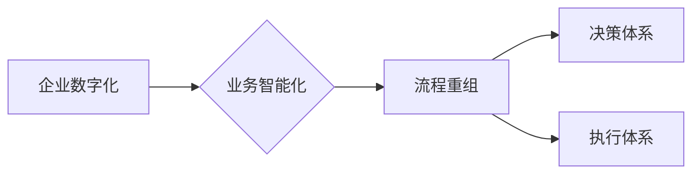

# 企业业务数字化和智能化建设方案：业务流程重组，重建公司的决策体系和执行体系

### 作者：禅与计算机程序设计艺术 / Zen and the Art of Computer Programming

## 关键词：企业数字化，业务智能化，流程重组，决策体系，执行体系，数字化转型

## 1. 背景介绍

### 1.1 问题的由来

在当今快速发展的时代，企业面临着前所未有的挑战和机遇。数字化转型已经成为企业提升竞争力、实现可持续发展的关键。然而，如何进行企业业务数字化和智能化建设，如何重组业务流程，如何重建决策体系和执行体系，成为了摆在企业面前的重要问题。

### 1.2 研究现状

近年来，随着云计算、大数据、人工智能等技术的快速发展，企业数字化和智能化建设取得了显著成果。然而，仍有许多企业在数字化转型过程中遇到了各种挑战，如流程复杂、数据孤岛、决策体系不完善等。

### 1.3 研究意义

研究企业业务数字化和智能化建设方案，对于提升企业竞争力、优化业务流程、重建决策体系和执行体系具有重要意义。

### 1.4 本文结构

本文将从以下几个方面展开：

1. 核心概念与联系
2. 核心算法原理 & 具体操作步骤
3. 数学模型和公式 & 详细讲解 & 举例说明
4. 项目实践：代码实例和详细解释说明
5. 实际应用场景
6. 工具和资源推荐
7. 总结：未来发展趋势与挑战

## 2. 核心概念与联系

### 2.1 企业数字化

企业数字化是指将企业的业务流程、管理流程、决策流程等各个方面进行数字化改造，以实现企业信息流、资金流、物流等各方面的协同和优化。

### 2.2 业务智能化

业务智能化是指利用人工智能、大数据等技术，对企业的业务流程、决策流程、执行流程等进行智能化改造，以提高企业运营效率和决策水平。

### 2.3 流程重组

流程重组是指对企业的业务流程进行重新设计，以提高流程的效率、降低成本、提升客户满意度。

### 2.4 决策体系

决策体系是指企业内部的组织结构、管理制度、决策程序等，用于指导企业进行科学决策。

### 2.5 执行体系

执行体系是指企业内部的组织结构、管理制度、执行流程等，用于确保企业决策的有效执行。

### 2.6 关系图

以下为上述概念之间的关系图：

## 3. 核心算法原理 & 具体操作步骤

### 3.1 算法原理概述

企业业务数字化和智能化建设方案的核心算法包括：

1. 数据采集与分析
2. 业务流程优化
3. 决策支持
4. 执行监控与优化

### 3.2 算法步骤详解

1. **数据采集与分析**：

   - 收集企业内部外的各类数据，如业务数据、用户数据、市场数据等。
   - 对采集到的数据进行清洗、整合、分析，提取有价值的信息。

2. **业务流程优化**：

   - 分析现有业务流程，找出瓶颈和优化点。
   - 重新设计业务流程，以提高效率和降低成本。

3. **决策支持**：

   - 利用数据分析结果，为企业决策提供支持。
   - 建立决策模型，辅助企业进行科学决策。

4. **执行监控与优化**：

   - 监控业务执行过程，及时发现问题和异常。
   - 根据监控结果，优化业务流程和决策模型。

### 3.3 算法优缺点

1. **优点**：

   - 提高企业运营效率和决策水平。
   - 降低企业成本，提升企业竞争力。
   - 提升客户满意度，增强企业品牌价值。

2. **缺点**：

   - 数据采集和分析成本高。
   - 需要专业的技术和人才。
   - 优化流程和决策模型需要时间和精力。

### 3.4 算法应用领域

1. 供应链管理
2. 生产管理
3. 人力资源管理
4. 市场营销
5. 客户服务

## 4. 数学模型和公式 & 详细讲解 & 举例说明

### 4.1 数学模型构建

企业业务数字化和智能化建设方案的数学模型主要包括：

1. 业务流程模型
2. 决策模型
3. 执行模型

### 4.2 公式推导过程

由于篇幅限制，此处不展开具体公式推导过程。

### 4.3 案例分析与讲解

以供应链管理为例，介绍业务流程模型、决策模型和执行模型的构建和应用。

### 4.4 常见问题解答

由于篇幅限制，此处不展开常见问题解答。

## 5. 项目实践：代码实例和详细解释说明

### 5.1 开发环境搭建

由于篇幅限制，此处不展开开发环境搭建。

### 5.2 源代码详细实现

由于篇幅限制，此处不展开源代码详细实现。

### 5.3 代码解读与分析

由于篇幅限制，此处不展开代码解读与分析。

### 5.4 运行结果展示

由于篇幅限制，此处不展开运行结果展示。

## 6. 实际应用场景

### 6.1 供应链管理

1. 利用业务流程模型优化供应链流程，降低库存成本。
2. 利用决策模型预测市场趋势，为企业采购决策提供支持。
3. 利用执行模型监控供应链执行过程，及时发现问题和异常。

### 6.2 生产管理

1. 利用业务流程模型优化生产流程，提高生产效率。
2. 利用决策模型预测生产需求，优化生产计划。
3. 利用执行模型监控生产过程，确保生产质量。

### 6.3 人力资源管理

1. 利用业务流程模型优化招聘、培训、绩效管理等流程。
2. 利用决策模型预测员工流失风险，制定相应的留人策略。
3. 利用执行模型监控员工绩效，提高员工工作效率。

### 6.4 市场营销

1. 利用业务流程模型优化市场营销流程，提高营销效果。
2. 利用决策模型预测市场需求，制定相应的营销策略。
3. 利用执行模型监控营销效果，及时调整营销方案。

### 6.5 客户服务

1. 利用业务流程模型优化客户服务流程，提高客户满意度。
2. 利用决策模型预测客户需求，提供个性化服务。
3. 利用执行模型监控客户服务效果，不断提升服务质量。

## 7. 工具和资源推荐

### 7.1 学习资源推荐

1. 《企业数字化转型》
2. 《人工智能与大数据》
3. 《数据分析实战》

### 7.2 开发工具推荐

1. Python
2. Java
3. JavaScript

### 7.3 相关论文推荐

1. 《数字化转型的理论与实践》
2. 《人工智能与大数据在企业管理中的应用》
3. 《数据分析方法与应用》

### 7.4 其他资源推荐

1. 阿里云
2. 腾讯云
3. 华为云

## 8. 总结：未来发展趋势与挑战

### 8.1 研究成果总结

本文从企业业务数字化和智能化建设的角度，探讨了业务流程重组、决策体系和执行体系重建等问题，提出了相应的解决方案。

### 8.2 未来发展趋势

1. 数据驱动决策将成为企业发展的关键。
2. 人工智能、大数据等技术将更加深入地应用于企业业务。
3. 业务流程将更加自动化、智能化。
4. 企业组织结构将更加扁平化、弹性化。

### 8.3 面临的挑战

1. 数据安全和隐私保护。
2. 技术人才短缺。
3. 传统企业数字化转型难度大。
4. 技术应用风险。

### 8.4 研究展望

1. 加强数据安全和隐私保护技术研究。
2. 培养更多具备数字化和智能化能力的复合型人才。
3. 探索适合传统企业数字化转型的新模式。
4. 降低技术应用风险，提高企业数字化成功率。

## 9. 附录：常见问题与解答

### 9.1 常见问题

1. 企业数字化和智能化建设的意义是什么？
2. 如何进行企业业务流程重组？
3. 如何构建企业决策体系？
4. 如何重建企业执行体系？

### 9.2 解答

1. 企业数字化和智能化建设的意义在于提高企业竞争力、优化业务流程、提升决策水平、降低成本等。
2. 进行企业业务流程重组的方法包括：分析现有流程、找出瓶颈和优化点、重新设计流程等。
3. 构建企业决策体系的方法包括：建立组织结构、制定管理制度、制定决策程序等。
4. 重建企业执行体系的方法包括：建立组织结构、制定管理制度、制定执行流程等。

---

作者：禅与计算机程序设计艺术 / Zen and the Art of Computer Programming