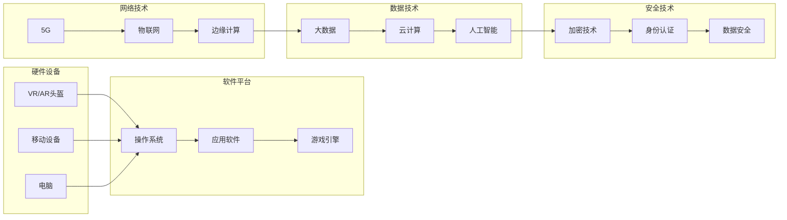

# 元宇宙 (Metaverse)

作者：禅与计算机程序设计艺术 / Zen and the Art of Computer Programming

## 关键词

虚拟现实、增强现实、混合现实、数字孪生、社交网络、游戏、商业、教育、艺术、文化

## 1. 背景介绍

### 1.1 问题的由来

随着互联网技术的飞速发展，虚拟现实(VR)、增强现实(AR)和混合现实(MR)等技术在近年来取得了突破性进展。这些技术的发展，不仅改变了人们的生活方式，也催生了一个全新的概念——元宇宙(Metaverse)。元宇宙是一个由虚拟世界、数字现实和现实世界融合而成的虚拟空间，用户可以在其中进行社交、工作、娱乐和探索等活动。

### 1.2 研究现状

元宇宙的概念在近年来受到了广泛关注，许多科技巨头纷纷布局元宇宙领域。例如，Facebook将公司名称改为Meta，专注于构建元宇宙；微软、谷歌等公司也在积极研发相关技术。此外，许多初创公司也纷纷加入元宇宙赛道，推出各种相关产品和服务。

### 1.3 研究意义

元宇宙作为一个新兴的领域，具有广泛的应用前景。它不仅能够为人们提供全新的生活方式，还能够推动虚拟现实、增强现实、数字孪生等技术的发展，为各个行业带来变革。

### 1.4 本文结构

本文将围绕元宇宙这一主题，从核心概念、技术架构、应用场景、未来发展趋势等方面进行探讨。具体内容包括：

- 核心概念与联系
- 技术架构与关键技术
- 应用场景与案例分析
- 未来发展趋势与挑战
- 工具和资源推荐
- 总结与展望

## 2. 核心概念与联系

### 2.1 元宇宙的定义

元宇宙是一个由虚拟世界、数字现实和现实世界融合而成的虚拟空间，用户可以在其中进行社交、工作、娱乐和探索等活动。它是一个无缝连接的虚拟世界，用户可以通过虚拟现实、增强现实等设备进入元宇宙，与其他用户进行互动。

### 2.2 元宇宙的核心概念

- **虚拟世界**：由计算机生成的虚拟环境，用户可以通过VR/AR设备进入其中。
- **数字现实**：将现实世界中的物体、场景和人物等进行数字化处理，实现与现实世界的交互。
- **社交**：用户在元宇宙中可以与其他用户进行交流、互动，形成虚拟社交网络。
- **工作**：元宇宙可以成为远程办公、在线教育、远程医疗等领域的平台。
- **娱乐**：用户可以在元宇宙中玩游戏、观看电影、听音乐等，丰富娱乐生活。
- **探索**：用户可以探索元宇宙中的各种虚拟世界，体验不同的文化和风景。

### 2.3 元宇宙与相关技术的关系

元宇宙的构建依赖于多种技术的支撑，包括：

- **虚拟现实(VR)**：通过模拟真实环境，为用户提供沉浸式体验。
- **增强现实(AR)**：在现实世界叠加虚拟信息，增强现实感知。
- **混合现实(MR)**：融合VR和AR技术，实现虚拟世界与现实世界的无缝交互。
- **数字孪生**：通过数字化复制现实世界中的物体、场景和人物，实现远程监控和控制。
- **区块链**：为元宇宙提供去中心化的身份认证、交易和治理机制。
- **人工智能(AI)**：为元宇宙提供智能化的交互、推荐和决策支持。

## 3. 技术架构与关键技术

### 3.1 技术架构概述

元宇宙的技术架构主要包括以下几个方面：

- **硬件设备**：VR/AR头盔、移动设备、电脑等。
- **软件平台**：操作系统、应用软件、游戏引擎等。
- **网络技术**：5G、物联网、边缘计算等。
- **数据技术**：大数据、云计算、人工智能等。
- **安全技术**：加密技术、身份认证、数据安全等。

### 3.2 关键技术详解

- **虚拟现实(VR)**：通过头显等设备，将用户沉浸在虚拟环境中，提供沉浸式体验。
- **增强现实(AR)**：在现实世界中叠加虚拟信息，增强现实感知，例如AR眼镜、AR手机等。
- **混合现实(MR)**：融合VR和AR技术，实现虚拟世界与现实世界的无缝交互，例如MR眼镜、MR手机等。
- **数字孪生**：通过数字化复制现实世界中的物体、场景和人物，实现远程监控和控制，例如工业领域的数字孪生工厂。
- **区块链**：为元宇宙提供去中心化的身份认证、交易和治理机制，例如NFT、DeFi等。
- **人工智能(AI)**：为元宇宙提供智能化的交互、推荐和决策支持，例如语音助手、推荐系统等。

### 3.3 技术架构图

## 4. 应用场景与案例分析

### 4.1 社交

元宇宙为用户提供了全新的社交方式。用户可以在虚拟世界中建立社交关系，分享生活，共同参与各种活动。

- **案例分析**：Facebook的Horizon Workrooms，用户可以在虚拟会议室中召开会议，进行远程协作。

### 4.2 工作

元宇宙可以成为远程办公、在线教育、远程医疗等领域的平台，为人们提供更加便捷、高效的服务。

- **案例分析**：微软的Microsoft Teams，用户可以在虚拟会议室中召开会议，进行远程协作。

### 4.3 娱乐

元宇宙为用户提供了丰富的娱乐方式，包括游戏、电影、音乐等。

- **案例分析**：Roblox，一个基于元宇宙的游戏平台，用户可以在其中创建和体验各种游戏。

### 4.4 探索

元宇宙为用户提供了全新的探索方式，可以体验不同的文化和风景。

- **案例分析**：Sandbox，一个元宇宙平台，用户可以在其中创建和体验各种虚拟世界。

## 5. 未来发展趋势与挑战

### 5.1 发展趋势

- **硬件设备更加普及**：随着技术的发展，VR/AR设备将更加便携、舒适，价格也更加亲民。
- **软件平台更加丰富**：元宇宙的软件平台将更加丰富，为用户提供更加多样化的体验。
- **网络技术更加成熟**：5G、物联网等技术的成熟，将为元宇宙提供更加稳定、高速的网络环境。
- **数据技术更加先进**：大数据、云计算、人工智能等技术将进一步提升元宇宙的智能化水平。
- **安全技术更加完善**：加密技术、身份认证、数据安全等技术将保证元宇宙的安全性和可靠性。

### 5.2 挑战

- **技术挑战**：硬件设备、软件平台、网络技术等各个方面都需要持续的技术创新。
- **伦理挑战**：元宇宙的发展可能带来新的伦理问题，例如隐私保护、网络安全等。
- **社会挑战**：元宇宙的普及可能会对传统行业和就业产生冲击。
- **法律挑战**：元宇宙的监管和法律法规体系尚不完善。

## 6. 工具和资源推荐

### 6.1 学习资源推荐

- **书籍**：
  - 《Metaverse: And How It Will Change Everything》
  - 《The Big Picture: On the Future of Life in a Virtual World》
- **在线课程**：
  - Coursera上的《虚拟现实和增强现实》
  - Udemy上的《虚拟现实和增强现实基础》
- **网站**：
  - metaverse.io
  - theverge.com

### 6.2 开发工具推荐

- **虚拟现实开发**：
  - Unity
  - Unreal Engine
  - VRChat
- **增强现实开发**：
  - ARKit
  - ARCore
  - ARToolKit
- **混合现实开发**：
  - Windows Mixed Reality
  - Magic Leap

### 6.3 相关论文推荐

- **虚拟现实**：
  - "Virtual Reality: The Third Revolution" by Jaron Lanier
  - "Augmented Reality: A Survey of the State of the Art" by John K. L. Lim
- **增强现实**：
  - "Augmented Reality: Principles and Practice" by Andy Mabbett
  - "Principles of Augmented Reality" by Steven Feiner
- **混合现实**：
  - "Mixed Reality: Principles and Practice" by Andrew N. Saxena
  - "Mixed Reality: State of the Art" by Patrizia Veneri

### 6.4 其他资源推荐

- **社交媒体**：
  - Twitter上的#metaverse话题
  - LinkedIn上的元宇宙相关群组
- **行业报告**：
  - Gartner的《MetaVerse Magic》
  - McKinsey的《The Metaverse: A new digital frontier》

## 7. 总结：未来发展趋势与挑战

元宇宙作为一个新兴领域，具有广泛的应用前景。随着技术的不断进步，元宇宙将逐渐成为人们生活的一部分，为人们带来全新的生活方式和工作方式。然而，元宇宙的发展也面临着诸多挑战，需要我们共同面对和解决。

### 7.1 研究成果总结

本文对元宇宙的核心概念、技术架构、应用场景、未来发展趋势和挑战进行了全面系统的介绍，为读者提供了对元宇宙的全面了解。

### 7.2 未来发展趋势

元宇宙的未来发展趋势包括：硬件设备更加普及、软件平台更加丰富、网络技术更加成熟、数据技术更加先进、安全技术更加完善。

### 7.3 面临的挑战

元宇宙的发展面临的技术挑战、伦理挑战、社会挑战和法律挑战。

### 7.4 研究展望

未来，元宇宙的研究将更加注重以下几个方面：

- 技术创新，推动元宇宙的硬件、软件、网络等技术不断发展。
- 伦理规范，建立元宇宙的伦理规范体系，确保元宇宙的健康发展。
- 社会融合，促进元宇宙与传统社会的融合，实现共同发展。
- 法律法规，完善元宇宙的法律法规体系，保障元宇宙的合法权益。

相信随着技术的不断进步和人类的共同努力，元宇宙必将迎来更加美好的未来。

---

作者：禅与计算机程序设计艺术 / Zen and the Art of Computer Programming