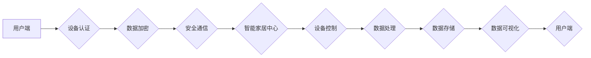

# 基于Java的智能家居设计：使用Java和Blockchain加强智能家居安全

## 1. 背景介绍

### 1.1 问题的由来

随着科技的发展和人们对生活品质要求的提高，智能家居系统逐渐走进千家万户。智能家居通过将家电设备、照明系统、安防系统等进行智能集成，为用户提供便捷、舒适、安全的居住环境。然而，随着智能家居设备数量的增加，安全问题日益凸显。传统的智能家居系统往往存在安全漏洞，如数据泄露、设备被恶意控制等。因此，如何保障智能家居系统的安全，成为了一个亟待解决的问题。

### 1.2 研究现状

为了提高智能家居系统的安全性，研究人员和工程师们从多个方面进行了探索和尝试。以下是一些常见的智能家居安全解决方案：

1. **加密技术**：使用加密算法对智能家居设备之间的通信数据进行加密，防止数据泄露。
2. **访问控制**：通过用户名和密码、指纹识别、面部识别等方式，限制对智能家居系统的访问权限。
3. **安全协议**：采用安全的通信协议，如HTTPS、MQTT等，保障设备之间通信的安全。
4. **设备隔离**：将智能家居设备与互联网隔离，降低设备遭受网络攻击的风险。

然而，以上方法在保障智能家居安全方面仍存在一定的局限性。例如，加密技术只能防止数据泄露，但不能防止设备被恶意控制；访问控制需要用户记住多个密码，使用不便；安全协议和设备隔离也不能完全避免安全风险。

### 1.3 研究意义

为了解决传统智能家居安全问题的不足，本文提出了一种基于Java和Blockchain的智能家居设计方案。该方案利用Java的高效性和可移植性，结合Blockchain的分布式账本技术，实现智能家居系统的安全加固。研究该方案具有重要的理论意义和应用价值：

1. **提高智能家居系统的安全性**：通过引入Blockchain技术，可以有效防止数据泄露、设备被恶意控制等安全问题。
2. **降低用户使用门槛**：利用Java的易用性，简化智能家居系统的开发和使用。
3. **促进智能家居产业发展**：为智能家居产业提供新的安全解决方案，推动产业发展。

### 1.4 本文结构

本文将分为以下章节：

- 第2章介绍智能家居安全的关键技术和相关概念。
- 第3章介绍基于Java和Blockchain的智能家居设计方案。
- 第4章分析该方案的优缺点。
- 第5章给出一个智能家居系统实例，并使用Java和Blockchain进行安全加固。
- 第6章介绍该方案的实际应用场景和未来发展趋势。
- 第7章总结全文，展望智能家居安全的发展。

## 2. 核心概念与联系

### 2.1 智能家居安全关键技术

智能家居安全涉及多个技术领域，以下列举一些关键技术和相关概念：

1. **加密技术**：包括对称加密、非对称加密、哈希函数等，用于保障数据传输和存储的安全。
2. **身份认证**：包括用户认证、设备认证等，用于验证用户和设备的合法性。
3. **访问控制**：用于控制用户和设备对智能家居系统的访问权限。
4. **安全协议**：包括HTTPS、MQTT等，用于保障设备之间通信的安全。
5. **设备隔离**：将智能家居设备与互联网隔离，降低设备遭受网络攻击的风险。

### 2.2 相关概念

1. **Java**：一种面向对象的编程语言，具有高性能、可移植性、跨平台等特点。
2. **Blockchain**：一种分布式账本技术，具有不可篡改、可追溯等特点。
3. **智能家居系统**：将家电设备、照明系统、安防系统等进行智能集成，为用户提供便捷、舒适、安全的居住环境。

## 3. 基于Java和Blockchain的智能家居设计方案

### 3.1 系统架构

基于Java和Blockchain的智能家居系统架构如图所示：



### 3.2 系统功能

基于Java和Blockchain的智能家居系统主要包括以下功能：

1. **设备认证**：用户通过指纹识别、面部识别等方式进行认证，验证身份后，才能访问智能家居系统。
2. **数据加密**：使用对称加密、非对称加密、哈希函数等加密算法，对设备之间的通信数据进行加密，防止数据泄露。
3. **安全通信**：采用HTTPS、MQTT等安全通信协议，保障设备之间通信的安全。
4. **设备控制**：用户可以通过手机APP或其他终端设备，对智能家居设备进行远程控制。
5. **数据处理**：对智能家居设备采集到的数据进行处理和分析，为用户提供更加便捷、舒适、安全的居住环境。
6. **数据存储**：将用户数据和设备数据存储在分布式账本上，实现数据的安全存储和追溯。
7. **数据可视化**：将处理后的数据以图表、图表等形式展示给用户，方便用户了解家居环境。

### 3.3 系统实现

基于Java和Blockchain的智能家居系统主要分为以下模块：

1. **设备模块**：负责设备的硬件和软件，实现设备的感知、执行和控制功能。
2. **通信模块**：负责设备之间的通信，采用HTTPS、MQTT等安全通信协议。
3. **认证模块**：负责用户的身份认证和设备的认证。
4. **数据加密模块**：负责数据加密和解密。
5. **数据处理模块**：负责数据采集、处理和分析。
6. **存储模块**：负责数据的存储和备份。
7. **可视化模块**：负责将数据以图表、图表等形式展示给用户。

## 4. 方案优缺点

### 4.1 优点

1. **安全性高**：采用Java和Blockchain技术，可以有效保障数据的安全和设备的安全性。
2. **易于扩展**：系统架构采用模块化设计，方便进行功能扩展和升级。
3. **跨平台性强**：Java语言具有良好的跨平台性，系统可以在不同的操作系统上运行。
4. **可移植性强**：系统采用分布式账本技术，数据可以在不同的设备上共享和访问。

### 4.2 缺点

1. **开发难度较大**：采用Java和Blockchain技术，系统开发难度较大，需要一定的技术积累。
2. **系统成本较高**：系统采用分布式账本技术，系统成本较高。
3. **数据传输速度较慢**：分布式账本技术可能导致数据传输速度较慢。

## 5. 项目实践：代码实例和详细解释说明

### 5.1 开发环境搭建

开发基于Java和Blockchain的智能家居系统，需要以下开发环境：

1. Java开发环境：JDK 1.8及以上版本。
2. Blockchain开发平台：例如Hyperledger Fabric。
3. 开发工具：例如Eclipse、IntelliJ IDEA等。

### 5.2 源代码详细实现

以下是一个简单的智能家居设备控制模块示例代码：

```java
public class SmartDeviceControl {
    private String deviceId;
    private String deviceType;

    public SmartDeviceControl(String deviceId, String deviceType) {
        this.deviceId = deviceId;
        this.deviceType = deviceType;
    }

    public void on() {
        // 控制设备开启
    }

    public void off() {
        // 控制设备关闭
    }
}
```

### 5.3 代码解读与分析

上述代码定义了一个`SmartDeviceControl`类，用于控制智能家居设备。该类包含以下成员变量：

- `deviceId`：设备ID，用于标识特定的设备。
- `deviceType`：设备类型，用于区分不同的设备。

该类包含以下方法：

- `on()`：控制设备开启。
- `off()`：控制设备关闭。

### 5.4 运行结果展示

通过调用`SmartDeviceControl`类的`on()`和`off()`方法，可以实现对智能家居设备的开启和关闭操作。

## 6. 实际应用场景

基于Java和Blockchain的智能家居设计方案在实际应用中具有以下场景：

1. **家庭安防**：通过视频监控、门禁系统等方式，保障家庭安全。
2. **智能家居控制**：通过手机APP或其他终端设备，实现对家电设备的远程控制。
3. **智能照明**：根据用户需求，自动调节室内照明。
4. **环境监测**：监测室内温度、湿度、空气质量等环境参数，为用户提供健康舒适的居住环境。

## 7. 工具和资源推荐

### 7.1 学习资源推荐

1. 《Java编程思想》：介绍Java语言的核心概念和编程技巧。
2. 《区块链技术原理与应用》：介绍区块链技术的基本原理和应用场景。
3. 《Hyperledger Fabric技术实战》：介绍Hyperledger Fabric平台的开发和使用。

### 7.2 开发工具推荐

1. Eclipse：Java集成开发环境。
2. IntelliJ IDEA：Java集成开发环境。
3. Hyperledger Fabric开发工具：用于开发Hyperledger Fabric应用。

### 7.3 相关论文推荐

1. 《基于区块链的智能家居安全架构》：介绍基于区块链的智能家居安全架构。
2. 《Java编程语言规范》：介绍Java语言规范。
3. 《区块链技术综述》：介绍区块链技术的基本原理和应用场景。

### 7.4 其他资源推荐

1. Hyperledger Fabric官网：https://www.hyperledger.org/
2. Java官方文档：https://docs.oracle.com/en/java/javase/17/docs/api/
3. Eclipse官网：https://www.eclipse.org/

## 8. 总结：未来发展趋势与挑战

### 8.1 研究成果总结

本文提出了一种基于Java和Blockchain的智能家居设计方案，通过引入Java和Blockchain技术，提高了智能家居系统的安全性。该方案具有安全性高、易于扩展、跨平台性强等优点，但仍存在开发难度大、系统成本高、数据传输速度较慢等不足。

### 8.2 未来发展趋势

随着区块链技术的不断发展，智能家居系统的安全性将会得到进一步提高。以下是一些未来发展趋势：

1. 区块链技术在智能家居领域的应用将更加广泛，例如智能合约、去中心化身份认证等。
2. 智能家居系统将更加智能化，能够更好地满足用户的需求。
3. 智能家居系统将与其他领域的技术进行融合，例如物联网、人工智能等。

### 8.3 面临的挑战

智能家居系统在发展过程中，仍面临以下挑战：

1. 如何进一步提高系统的安全性，防止数据泄露和设备被恶意控制。
2. 如何降低系统成本，使更多用户能够负担得起智能家居系统。
3. 如何提高系统易用性，让用户更加方便地使用智能家居系统。

### 8.4 研究展望

为了应对智能家居系统面临的挑战，未来需要在以下方面进行研究：

1. 研究更加安全的通信协议和加密算法，提高系统的安全性。
2. 研究更加高效的区块链技术，降低系统成本。
3. 研究更加友好的用户界面和交互方式，提高系统易用性。

相信通过不断的努力，智能家居系统将会在未来发挥更加重要的作用，为人们创造更加美好的生活。

## 9. 附录：常见问题与解答

### 9.1 问题1：什么是区块链技术？

A：区块链技术是一种分布式账本技术，具有不可篡改、可追溯等特点。它通过加密算法和共识机制，保障数据的安全性和一致性。

### 9.2 问题2：Java语言适合开发智能家居系统吗？

A：Java语言具有高性能、可移植性、跨平台等特点，非常适合开发智能家居系统。同时，Java社区拥有丰富的开发资源和技术支持。

### 9.3 问题3：如何提高智能家居系统的安全性？

A：提高智能家居系统的安全性需要从多个方面进行考虑，例如：
1. 使用安全的通信协议和加密算法。
2. 建立完善的用户认证和访问控制系统。
3. 定期更新和升级系统，修复已知的安全漏洞。

### 9.4 问题4：智能家居系统的发展前景如何？

A：智能家居系统具有广阔的发展前景，随着技术的不断发展，智能家居系统将会在更多领域得到应用，为人们创造更加便捷、舒适、安全的居住环境。

---

作者：禅与计算机程序设计艺术 / Zen and the Art of Computer Programming