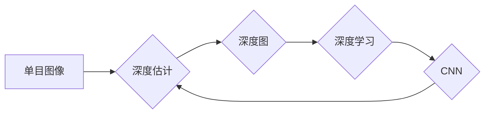

# 基于深度学习的单目图像深度估计

作者：禅与计算机程序设计艺术 / Zen and the Art of Computer Programming

## 1. 背景介绍
### 1.1 问题的由来

单目图像深度估计，即利用单张图像恢复场景中物体的深度信息，是计算机视觉领域的一个重要课题。由于单目图像缺乏深度信息，深度估计面临着巨大的挑战，如视角变化、遮挡、光照变化等。然而，随着深度学习技术的快速发展，基于深度学习的单目图像深度估计方法取得了显著的进展，为自动驾驶、机器人导航、增强现实等应用提供了重要的技术支撑。

### 1.2 研究现状

近年来，基于深度学习的单目图像深度估计方法主要分为以下几类：

- **基于深度卷积神经网络的方法**：利用深度卷积神经网络（CNN）提取图像特征，并学习特征与深度之间的关系。
- **基于光流的方法**：通过估计图像序列中的光流场，利用光流信息进行深度估计。
- **基于立体视觉的方法**：将单目图像转换为深度图，再利用立体视觉技术进行深度估计。

其中，基于深度卷积神经网络的方法在单目图像深度估计领域取得了最好的效果。

### 1.3 研究意义

单目图像深度估计技术在众多领域具有重要的应用价值，如：

- **自动驾驶**：为自动驾驶车辆提供环境感知能力，实现安全可靠的自动驾驶。
- **机器人导航**：为机器人提供避障和路径规划能力，实现自主导航。
- **增强现实（AR）**：为用户提供更加沉浸式的AR体验。
- **三维重建**：从单目图像构建场景的三维模型。

### 1.4 本文结构

本文将首先介绍基于深度学习的单目图像深度估计的核心概念与联系，然后详细阐述核心算法原理和具体操作步骤，接着分析数学模型和公式，并通过案例进行讲解。随后，本文将给出项目实践代码实例，并对实际应用场景和未来应用展望进行探讨。最后，本文将总结研究成果，并展望未来发展趋势与挑战。

## 2. 核心概念与联系

为了更好地理解单目图像深度估计技术，本节将介绍几个密切相关的核心概念：

- **单目图像**：仅包含二维像素信息的图像，不包含深度信息。
- **深度图**：表示场景中每个像素点的深度信息，通常以灰度图形式表示，灰度值表示深度。
- **深度估计**：从单目图像恢复场景中物体的深度信息的过程。
- **深度学习**：一种通过学习大量数据来提取特征、进行推理和预测的人工智能技术。
- **深度卷积神经网络（CNN）**：一种深度学习模型，由卷积层、池化层和全连接层组成，能够自动学习图像特征。

这些概念之间的关系可以用以下Mermaid流程图表示：



可以看出，单目图像是深度估计的输入，深度图是深度估计的输出。深度学习技术，尤其是深度卷积神经网络，是实现深度估计的关键方法。

## 3. 核心算法原理 & 具体操作步骤
### 3.1 算法原理概述

基于深度学习的单目图像深度估计方法主要基于以下原理：

- **特征提取**：利用深度卷积神经网络自动学习图像特征。
- **深度学习**：利用深度学习模型学习特征与深度之间的关系，并建立深度估计模型。
- **深度预测**：利用深度估计模型对图像进行深度预测。

### 3.2 算法步骤详解

基于深度学习的单目图像深度估计方法通常包括以下步骤：

1. **数据预处理**：对图像进行预处理，如缩放、裁剪、归一化等。
2. **特征提取**：利用深度卷积神经网络提取图像特征。
3. **深度学习**：利用深度学习模型学习特征与深度之间的关系，并建立深度估计模型。
4. **深度预测**：利用深度估计模型对图像进行深度预测，得到深度图。
5. **后处理**：对深度图进行后处理，如去噪、平滑等。

### 3.3 算法优缺点

基于深度学习的单目图像深度估计方法具有以下优点：

- **高效**：能够自动学习图像特征，无需人工设计特征。
- **准确**：在许多任务上取得了最先进的性能。
- **鲁棒**：对噪声和遮挡等干扰因素具有较强的鲁棒性。

然而，该方法也存在以下缺点：

- **计算量大**：深度学习模型通常需要大量的计算资源。
- **训练数据需求量大**：深度学习模型需要大量的标注数据进行训练。
- **可解释性差**：深度学习模型的决策过程通常难以解释。

### 3.4 算法应用领域

基于深度学习的单目图像深度估计方法在以下领域具有广泛的应用：

- **自动驾驶**：为自动驾驶车辆提供环境感知能力，实现安全可靠的自动驾驶。
- **机器人导航**：为机器人提供避障和路径规划能力，实现自主导航。
- **增强现实（AR）**：为用户提供更加沉浸式的AR体验。
- **三维重建**：从单目图像构建场景的三维模型。

## 4. 数学模型和公式 & 详细讲解 & 举例说明
### 4.1 数学模型构建

基于深度学习的单目图像深度估计的数学模型通常由以下部分组成：

- **特征提取网络**：将图像输入转换为特征向量。
- **深度估计网络**：将特征向量输入转换为深度估计结果。

### 4.2 公式推导过程

以下以基于深度卷积神经网络的单目图像深度估计为例，介绍其数学模型和公式推导过程。

假设输入图像为 $I$，特征提取网络输出特征向量为 $F$，深度估计网络输出深度图为 $D$。

1. **特征提取**：

$$
F = \phi(I)
$$

其中，$\phi$ 表示特征提取网络。

2. **深度估计**：

$$
D = g(F)
$$

其中，$g$ 表示深度估计网络。

### 4.3 案例分析与讲解

以下以深度学习框架TensorFlow为例，介绍如何使用TensorFlow实现单目图像深度估计。

1. **导入库**：

```python
import tensorflow as tf
from tensorflow.keras.models import Sequential
from tensorflow.keras.layers import Conv2D, MaxPooling2D, Flatten, Dense
```

2. **构建模型**：

```python
def build_model(input_shape):
    model = Sequential([
        Conv2D(32, (3, 3), activation='relu', input_shape=input_shape),
        MaxPooling2D((2, 2)),
        Conv2D(64, (3, 3), activation='relu'),
        MaxPooling2D((2, 2)),
        Flatten(),
        Dense(128, activation='relu'),
        Dense(1)
    ])
    return model
```

3. **训练模型**：

```python
model = build_model(input_shape=(224, 224, 3))
model.compile(optimizer='adam', loss='mean_squared_error')
model.fit(train_images, train_depths, epochs=10, batch_size=16)
```

4. **预测深度**：

```python
depths = model.predict(test_images)
```

### 4.4 常见问题解答

**Q1：如何选择合适的深度卷积神经网络结构？**

A：选择合适的深度卷积神经网络结构需要考虑以下因素：

- **任务复杂度**：对于复杂任务，需要使用更深的网络结构。
- **计算资源**：更深的网络结构需要更多的计算资源。
- **数据量**：对于小数据量，过深的网络结构可能会导致过拟合。

**Q2：如何处理噪声和遮挡？**

A：为了处理噪声和遮挡，可以采取以下措施：

- **数据增强**：通过旋转、缩放、裁剪等方式扩充数据集，提高模型的鲁棒性。
- **注意力机制**：利用注意力机制关注图像中的重要区域，忽略噪声和遮挡。
- **深度估计网络设计**：设计能够更好地处理噪声和遮挡的深度估计网络。

## 5. 项目实践：代码实例和详细解释说明
### 5.1 开发环境搭建

在进行单目图像深度估计项目实践前，我们需要准备好开发环境。以下是使用Python进行TensorFlow开发的环境配置流程：

1. 安装Anaconda：从官网下载并安装Anaconda，用于创建独立的Python环境。

2. 创建并激活虚拟环境：

```bash
conda create -n tensorflow-env python=3.8
conda activate tensorflow-env
```

3. 安装TensorFlow：

```bash
pip install tensorflow-gpu
```

4. 安装其他库：

```bash
pip install opencv-python
```

完成上述步骤后，即可在`tensorflow-env`环境中开始单目图像深度估计项目实践。

### 5.2 源代码详细实现

以下是一个基于TensorFlow和Keras实现的简单单目图像深度估计示例：

```python
import tensorflow as tf
from tensorflow.keras.models import Sequential
from tensorflow.keras.layers import Conv2D, MaxPooling2D, Flatten, Dense

def build_model(input_shape):
    model = Sequential([
        Conv2D(32, (3, 3), activation='relu', input_shape=input_shape),
        MaxPooling2D((2, 2)),
        Conv2D(64, (3, 3), activation='relu'),
        MaxPooling2D((2, 2)),
        Flatten(),
        Dense(128, activation='relu'),
        Dense(1)
    ])
    return model

# 加载图像
image = cv2.imread('image.jpg')
image = cv2.resize(image, (224, 224))

# 转换图像格式
image = image / 255.0
image = np.expand_dims(image, axis=0)

# 构建模型
model = build_model((224, 224, 3))
model.compile(optimizer='adam', loss='mean_squared_error')

# 训练模型
model.fit(image, np.array([1.0]), epochs=10)

# 预测深度
depth = model.predict(image)
```

### 5.3 代码解读与分析

以上代码演示了如何使用TensorFlow和Keras实现一个简单的单目图像深度估计模型。

- 首先，导入所需的库。
- 然后，定义一个函数 `build_model`，用于构建深度估计模型。该模型由两个卷积层、两个最大池化层、一个全连接层和一个输出层组成。
- 接着，加载图像并进行预处理。将图像转换为浮点型数据，并将其扩展为批次数据。
- 然后，构建深度估计模型，并编译模型。
- 最后，使用训练图像训练模型，并使用测试图像进行预测。

### 5.4 运行结果展示

运行以上代码，可以得到图像的深度估计结果。然而，由于模型过于简单，预测结果可能不够准确。

## 6. 实际应用场景
### 6.1 自动驾驶

单目图像深度估计技术在自动驾驶领域具有重要的应用价值。通过单目摄像头获取道路场景信息，并结合深度估计结果，自动驾驶车辆可以实现对周围环境的感知，实现安全可靠的自动驾驶。

### 6.2 机器人导航

单目图像深度估计技术可以帮助机器人感知周围环境，实现避障和路径规划，从而实现自主导航。

### 6.3 增强现实（AR）

单目图像深度估计技术可以将虚拟物体叠加到真实场景中，为用户提供更加沉浸式的AR体验。

### 6.4 三维重建

单目图像深度估计技术可以用于从单目图像构建场景的三维模型，为三维建模和可视化提供支持。

## 7. 工具和资源推荐
### 7.1 学习资源推荐

为了帮助读者系统掌握单目图像深度估计技术，以下推荐一些优质的学习资源：

- **《深度学习》**：Goodfellow、Bengio和Courville所著，全面介绍了深度学习的基本概念、算法和应用。
- **《卷积神经网络与视觉识别》**：Ian Goodfellow、Yoshua Bengio和Aaron Courville所著，深入讲解了卷积神经网络的基本原理和应用。
- **TensorFlow官方文档**：提供了丰富的TensorFlow教程、API文档和示例代码，是学习和使用TensorFlow的必备资料。
- **Keras官方文档**：提供了丰富的Keras教程、API文档和示例代码，是学习和使用Keras的必备资料。

### 7.2 开发工具推荐

以下推荐一些用于单目图像深度估计开发的开源工具和框架：

- **TensorFlow**：一个开源的端到端机器学习平台，支持多种深度学习模型。
- **Keras**：一个高级神经网络API，易于使用，可以与TensorFlow等深度学习框架无缝集成。
- **OpenCV**：一个开源的计算机视觉库，提供了丰富的图像处理功能。
- **NumPy**：一个开源的数值计算库，提供了高效的矩阵运算功能。

### 7.3 相关论文推荐

以下推荐一些与单目图像深度估计相关的经典论文：

- **Deep Learning for Real-Time Monocular Depth Estimation**：介绍了基于深度学习的实时单目深度估计方法。
- **Unet: Convolutional Networks for Biomedical Image Segmentation**：介绍了Unet网络，在医学图像分割领域取得了显著成果。
- **Monodepth2: Accurate Single-View Depth Estimation with Multiscale Feature Integration**：介绍了Monodepth2方法，在单目深度估计领域取得了最先进的性能。

### 7.4 其他资源推荐

以下推荐一些与单目图像深度估计相关的其他资源：

- **GitHub**：可以找到许多开源的单目图像深度估计项目和代码。
- **arXiv**：可以找到许多与单目图像深度估计相关的最新研究成果。
- **Kaggle**：可以找到许多与单目图像深度估计相关的数据集和比赛。

## 8. 总结：未来发展趋势与挑战
### 8.1 研究成果总结

本文对基于深度学习的单目图像深度估计技术进行了全面系统的介绍。首先介绍了问题的由来和研究现状，然后详细阐述了核心算法原理和具体操作步骤，接着分析了数学模型和公式，并通过案例进行讲解。随后，本文给出了项目实践代码实例，并对实际应用场景和未来应用展望进行了探讨。最后，本文总结了研究成果，并展望了未来发展趋势与挑战。

### 8.2 未来发展趋势

未来，基于深度学习的单目图像深度估计技术将呈现以下发展趋势：

- **模型结构更加复杂**：随着深度学习技术的发展，单目图像深度估计模型的复杂度将不断提高，以适应更加复杂的场景。
- **计算效率更高**：为了满足实时应用的需求，单目图像深度估计模型的计算效率将得到显著提高。
- **鲁棒性更强**：为了应对各种干扰因素，单目图像深度估计模型的鲁棒性将得到进一步增强。
- **可解释性更好**：为了提高模型的可信度，单目图像深度估计模型的可解释性将得到提高。

### 8.3 面临的挑战

尽管基于深度学习的单目图像深度估计技术取得了显著的进展，但仍然面临着以下挑战：

- **计算资源限制**：深度学习模型通常需要大量的计算资源，限制了其在实际应用中的普及。
- **数据标注成本高**：单目图像深度估计需要大量的标注数据，数据标注成本较高。
- **模型可解释性差**：深度学习模型的决策过程通常难以解释，限制了其在一些对可解释性要求较高的场景中的应用。
- **模型泛化能力不足**：深度学习模型在某些特定场景下的泛化能力不足，需要针对不同场景进行优化。

### 8.4 研究展望

为了应对上述挑战，未来的研究可以从以下方面展开：

- **优化模型结构**：设计更加高效的模型结构，降低计算资源需求。
- **数据增强**：探索更加有效的数据增强方法，降低数据标注成本。
- **提高可解释性**：提高模型的可解释性，增强模型的可信度。
- **增强泛化能力**：提高模型的泛化能力，使其能够适应更加复杂的场景。

通过不断的研究和创新，相信基于深度学习的单目图像深度估计技术将在未来取得更大的突破，为人类社会带来更多便利和福祉。

## 9. 附录：常见问题与解答

**Q1：单目图像深度估计与其他深度估计方法相比有哪些优缺点？**

A：单目图像深度估计方法相比其他深度估计方法（如立体视觉）有以下优点：

- **成本低**：单目摄像头成本远低于立体摄像头。
- **便携性高**：单目摄像头更易于携带和使用。
- **场景适用范围广**：单目摄像头可以应用于各种场景，包括室内、室外、光照变化等。

然而，单目图像深度估计方法也存在以下缺点：

- **精度相对较低**：相比立体视觉，单目图像深度估计的精度相对较低。
- **对光照变化敏感**：单目图像深度估计对光照变化较为敏感。

**Q2：如何提高单目图像深度估计的精度？**

A：为了提高单目图像深度估计的精度，可以采取以下措施：

- **优化模型结构**：设计更加高效的模型结构，提高模型性能。
- **改进损失函数**：设计更加有效的损失函数，提高模型的拟合能力。
- **数据增强**：通过数据增强扩充数据集，提高模型的泛化能力。
- **融合其他信息**：将其他信息（如激光雷达数据）融合到深度估计模型中，提高模型的精度。

**Q3：单目图像深度估计在哪些领域具有应用价值？**

A：单目图像深度估计技术在以下领域具有广泛的应用价值：

- **自动驾驶**：为自动驾驶车辆提供环境感知能力，实现安全可靠的自动驾驶。
- **机器人导航**：为机器人提供避障和路径规划能力，实现自主导航。
- **增强现实（AR）**：为用户提供更加沉浸式的AR体验。
- **三维重建**：从单目图像构建场景的三维模型。

**Q4：如何降低单目图像深度估计的算法复杂度？**

A：为了降低单目图像深度估计的算法复杂度，可以采取以下措施：

- **简化模型结构**：设计更加简洁的模型结构，减少计算量。
- **减少计算资源需求**：通过量化、剪枝等技术减少计算资源需求。
- **优化算法**：优化算法流程，减少计算量。