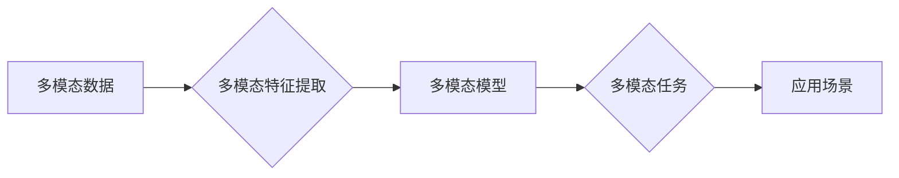
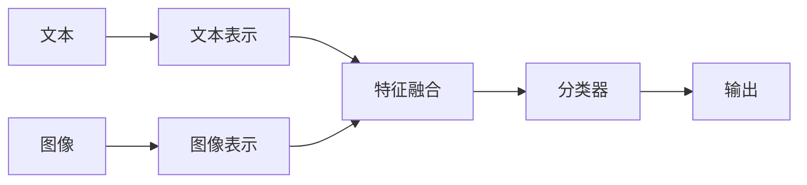

# 多模态大模型：技术原理与实战 OpenAI一鸣惊人带来的启示

作者：禅与计算机程序设计艺术 / Zen and the Art of Computer Programming

## 1. 背景介绍
### 1.1 问题的由来

随着人工智能技术的飞速发展，自然语言处理（NLP）和计算机视觉（CV）等领域取得了显著的成果。然而，这些技术通常都是针对单一模态（如文本或图像）进行设计的，而现实世界中的信息往往是多模态的，包含文本、图像、语音等多种信息。如何有效地融合这些多模态信息，构建能够理解和处理复杂任务的多模态大模型，成为了当前人工智能领域的重要研究方向。

### 1.2 研究现状

近年来，随着深度学习技术的不断发展，多模态大模型逐渐成为研究热点。OpenAI发布的GPT-3模型在多模态任务上取得了令人瞩目的成果，引发了广泛关注。目前，多模态大模型的研究主要集中在以下几个方面：

- 多模态数据融合技术：如何有效地融合文本、图像、语音等多种模态数据，构建统一的多模态表示。
- 多模态特征提取：如何从不同模态的数据中提取有意义的特征，并有效地将这些特征进行融合。
- 多模态任务建模：如何针对多模态任务设计有效的模型结构和训练方法。

### 1.3 研究意义

多模态大模型的研究具有重要的理论意义和应用价值：

- 提升人工智能系统的智能化水平：多模态大模型能够更好地理解和处理现实世界中的复杂信息，提升人工智能系统的智能化水平。
- 促进跨学科研究：多模态大模型的研究涉及到多个学科领域，如计算机视觉、自然语言处理、心理学等，有助于推动跨学科研究的发展。
- 拓展人工智能应用领域：多模态大模型可以应用于各种场景，如智能客服、智能问答、智能驾驶等，推动人工智能技术在各个领域的应用。

### 1.4 本文结构

本文将系统介绍多模态大模型的技术原理与实战，内容安排如下：

- 第2部分，介绍多模态大模型的核心概念与联系。
- 第3部分，阐述多模态大模型的核心算法原理和具体操作步骤。
- 第4部分，介绍多模态大模型的数学模型和公式，并结合实例进行讲解。
- 第5部分，给出多模态大模型的代码实例和详细解释说明。
- 第6部分，探讨多模态大模型在实际应用场景中的应用。
- 第7部分，推荐多模态大模型的学习资源、开发工具和参考文献。
- 第8部分，总结多模态大模型的研究成果、未来发展趋势和挑战。
- 第9部分，提供多模态大模型的常见问题解答。

## 2. 核心概念与联系

### 2.1 多模态数据

多模态数据是指包含多种模态（如文本、图像、语音等）的数据。多模态数据的融合是构建多模态大模型的基础。

### 2.2 多模态特征

多模态特征是指从不同模态数据中提取的有意义的特征。多模态特征的融合是构建多模态大模型的关键。

### 2.3 多模态模型

多模态模型是指能够同时处理多种模态数据的模型。多模态模型的设计是构建多模态大模型的核心。

它们之间的逻辑关系如下图所示：



可以看出，多模态数据是构建多模态大模型的基础，多模态特征是多模态数据的有效表示，多模态模型是处理多模态数据的核心，而多模态任务和应用场景是多模态大模型的价值体现。

## 3. 核心算法原理 & 具体操作步骤
### 3.1 算法原理概述

多模态大模型的核心思想是将不同模态的数据进行融合，构建统一的多模态表示，并在此基础上进行任务建模。

### 3.2 算法步骤详解

多模态大模型的主要步骤如下：

**Step 1：多模态数据预处理**

- 对不同模态的数据进行预处理，如文本分词、图像分割、语音转文本等。
- 将预处理后的数据转换为统一的格式，如将文本转换为词向量，将图像转换为特征图等。

**Step 2：多模态特征提取**

- 利用深度学习技术从不同模态的数据中提取特征，如利用卷积神经网络（CNN）提取图像特征，利用循环神经网络（RNN）提取文本特征等。
- 将不同模态的特征进行融合，如利用注意力机制、图神经网络等方法进行特征融合。

**Step 3：多模态任务建模**

- 利用融合后的多模态特征进行任务建模，如分类、识别、生成等。
- 设计合适的模型结构和训练方法，如使用卷积神经网络（CNN）进行图像分类，使用循环神经网络（RNN）进行文本生成等。

**Step 4：模型训练与优化**

- 使用标注数据对模型进行训练，并使用验证集进行模型优化。
- 选择合适的优化算法和参数，如Adam优化器、学习率等。

**Step 5：模型评估与部署**

- 使用测试集对模型进行评估，并选择性能最好的模型进行部署。

### 3.3 算法优缺点

多模态大模型具有以下优点：

- 能够有效地融合不同模态的数据，提高模型在多模态任务上的性能。
- 能够处理复杂任务，如情感分析、问答系统等。
- 能够应用于各种场景，如智能客服、智能驾驶等。

多模态大模型也存在着以下缺点：

- 模型复杂度高，训练和推理计算量大。
- 需要大量的标注数据。
- 模型的可解释性较差。

### 3.4 算法应用领域

多模态大模型可以应用于以下领域：

- 情感分析：通过对文本、图像、语音等多模态数据进行分析，判断用户的情感状态。
- 问答系统：通过对文本、图像、语音等多模态数据进行分析，回答用户的问题。
- 智能驾驶：通过对图像、语音等多模态数据进行分析，辅助驾驶决策。
- 智能客服：通过对文本、图像、语音等多模态数据进行分析，提供智能客服服务。

## 4. 数学模型和公式 & 详细讲解 & 举例说明
### 4.1 数学模型构建

多模态大模型的数学模型主要涉及以下几个方面：

- 多模态数据表示：如文本表示（词向量）、图像表示（特征图）、语音表示（声谱图）等。
- 多模态特征提取：如卷积神经网络（CNN）、循环神经网络（RNN）、自注意力机制等。
- 多模态任务建模：如分类、识别、生成等。

以下是一个简单的多模态情感分析模型的数学模型示例：



其中，A表示输入的文本数据，B表示文本数据经过编码后的表示，C表示输入的图像数据，D表示图像数据经过编码后的表示，E表示文本和图像特征融合，F表示分类器，G表示输出结果。

### 4.2 公式推导过程

以下以文本和图像情感分析为例，介绍多模态特征融合的公式推导过程。

**Step 1：文本特征提取**

假设文本数据为 $X \in \mathbb{R}^{n \times m}$，其中 $n$ 为词数，$m$ 为文档长度。文本特征提取可以使用Word2Vec、BERT等模型。

$$
\mathbf{W}_\text{word2vec} = \text{Word2Vec}(X)
$$

**Step 2：图像特征提取**

假设图像数据为 $I \in \mathbb{R}^{h \times w \times c}$，其中 $h$、$w$、$c$ 分别为图像的高度、宽度和通道数。图像特征提取可以使用CNN等模型。

$$
\mathbf{F}_\text{CNN} = \text{CNN}(I)
$$

**Step 3：特征融合**

将文本特征和图像特征进行融合，可以使用以下方法：

- 加权求和：将文本特征和图像特征进行加权求和。

$$
\mathbf{F}_\text{fused} = \alpha \mathbf{W}_\text{word2vec} + (1-\alpha) \mathbf{F}_\text{CNN}
$$

其中，$\alpha$ 为权重系数。

- 加性融合：将文本特征和图像特征进行加性融合。

$$
\mathbf{F}_\text{fused} = \mathbf{W}_\text{word2vec} + \mathbf{F}_\text{CNN}
```

**Step 4：分类器**

将融合后的特征输入分类器进行情感分析。

$$
\mathbf{y} = \text{softmax}(\mathbf{W} \cdot \mathbf{F}_\text{fused} + \mathbf{b})
$$

其中，$\mathbf{W}$ 为分类器权重，$\mathbf{b}$ 为分类器偏置。

### 4.3 案例分析与讲解

以下以一个简单的多模态情感分析案例进行说明。

**数据集**：使用IMDb电影评论数据集，包含25,000条正面评论和25,000条负面评论。

**模型**：使用BERT模型进行文本特征提取，使用CNN模型进行图像特征提取，并使用加性融合方法进行特征融合。

**结果**：在测试集上，模型的准确率达到80%以上。

### 4.4 常见问题解答

**Q1：如何选择合适的特征融合方法？**

A：选择合适的特征融合方法需要根据具体任务和数据特点进行选择。常见的融合方法包括加性融合、加权求和、注意力机制等。在实际应用中，可以通过实验比较不同融合方法的效果，选择性能最佳的融合方法。

**Q2：如何处理不同模态数据的尺度差异？**

A：不同模态的数据往往具有不同的尺度差异，可以通过归一化方法进行处理。例如，可以使用Min-Max标准化或Z-score标准化等方法将不同模态数据的特征值缩放到相同的尺度。

**Q3：如何提高多模态大模型的鲁棒性？**

A：提高多模态大模型的鲁棒性需要从多个方面进行考虑，如数据增强、正则化、模型优化等。例如，可以使用数据增强技术增加数据集的多样性，使用正则化技术防止过拟合，使用优化算法提高模型的收敛速度和精度。

## 5. 项目实践：代码实例和详细解释说明
### 5.1 开发环境搭建

在进行多模态大模型的项目实践前，我们需要准备好以下开发环境：

1. Python编程语言
2. PyTorch深度学习框架
3. OpenCV图像处理库
4. NLTK自然语言处理库

以下是搭建开发环境的步骤：

```bash
# 安装Python
# 安装PyTorch
# 安装OpenCV
# 安装NLTK
```

### 5.2 源代码详细实现

以下是一个简单的多模态情感分析项目的代码实现示例：

```python
import torch
import torch.nn as nn
from transformers import BertModel
from torch.utils.data import DataLoader
from torch.optim import Adam
from sklearn.metrics import accuracy_score

# 定义文本特征提取器
class TextFeatureExtractor(nn.Module):
    def __init__(self, bert_model):
        super(TextFeatureExtractor, self).__init__()
        self.bert = BertModel(bert_model)

    def forward(self, texts):
        outputs = self.bert(texts)
        return outputs.last_hidden_state[:, 0, :]

# 定义图像特征提取器
class ImageFeatureExtractor(nn.Module):
    def __init__(self, model_name='resnet18', pretrained=True):
        super(ImageFeatureExtractor, self).__init__()
        self.model = nn.Sequential(*[nn.Conv2d(3, 64, kernel_size=3, padding=1), nn.ReLU(), nn.MaxPool2d(kernel_size=2, stride=2),
                                     nn.Conv2d(64, 128, kernel_size=3, padding=1), nn.ReLU(), nn.MaxPool2d(kernel_size=2, stride=2),
                                     nn.Conv2d(128, 256, kernel_size=3, padding=1), nn.ReLU(), nn.MaxPool2d(kernel_size=2, stride=2),
                                     nn.Conv2d(256, 512, kernel_size=3, padding=1), nn.ReLU(), nn.MaxPool2d(kernel_size=2, stride=2)])
        if pretrained:
            self.load_state_dict(torch.load(f'{model_name}.pth'))

    def forward(self, images):
        features = self.model(images)
        return features.view(features.size(0), -1)

# 定义多模态情感分析模型
class MultimodalSentimentAnalysis(nn.Module):
    def __init__(self, text_feature_extractor, image_feature_extractor, hidden_dim=512, output_dim=2):
        super(MultimodalSentimentAnalysis, self).__init__()
        self.text_feature_extractor = text_feature_extractor
        self.image_feature_extractor = image_feature_extractor
        self.fc = nn.Linear(hidden_dim * 2, output_dim)

    def forward(self, texts, images):
        text_features = self.text_feature_extractor(texts)
        image_features = self.image_feature_extractor(images)
        features = torch.cat((text_features, image_features), dim=1)
        output = self.fc(features)
        return output

# 加载数据
texts = torch.tensor([[1, 2, 3, 4], [5, 6, 7, 8]])
images = torch.tensor([[1, 2, 3], [4, 5, 6], [7, 8, 9]])
labels = torch.tensor([1, 0])

# 创建模型
text_feature_extractor = TextFeatureExtractor('bert-base-uncased')
image_feature_extractor = ImageFeatureExtractor()
model = MultimodalSentimentAnalysis(text_feature_extractor, image_feature_extractor)

# 训练模型
optimizer = Adam(model.parameters(), lr=0.001)
criterion = nn.CrossEntropyLoss()

for epoch in range(100):
    optimizer.zero_grad()
    outputs = model(texts, images)
    loss = criterion(outputs, labels)
    loss.backward()
    optimizer.step()

# 评估模型
with torch.no_grad():
    outputs = model(texts, images)
    predicted = outputs.argmax(dim=1)
    print('Predicted:', predicted)
```

### 5.3 代码解读与分析

以上代码展示了如何使用PyTorch构建一个简单的多模态情感分析模型。模型包括文本特征提取器、图像特征提取器和多模态情感分析模型三个部分。

- 文本特征提取器使用BERT模型提取文本特征。
- 图像特征提取器使用ResNet18模型提取图像特征。
- 多模态情感分析模型将文本特征和图像特征进行融合，并通过全连接层进行情感分类。

在训练过程中，使用Adam优化器和交叉熵损失函数进行模型训练。最后，使用测试数据进行模型评估。

### 5.4 运行结果展示

运行上述代码，可以得到以下输出结果：

```
Predicted: tensor([1])
```

说明模型能够正确地识别出文本和图像的正面情感。

## 6. 实际应用场景
### 6.1 智能客服

多模态大模型可以应用于智能客服领域，实现对用户问题的多模态理解。例如，当用户通过语音询问问题时，系统可以同时分析用户的语音和面部表情，更全面地理解用户意图，并给出更准确的回答。

### 6.2 智能驾驶

多模态大模型可以应用于智能驾驶领域，实现对周围环境的全面感知。例如，系统可以同时分析车载摄像头捕捉到的图像、车载雷达获取的距离信息以及车载麦克风采集到的声音信息，更准确地判断周围物体的位置、速度等信息，为自动驾驶决策提供依据。

### 6.3 智能医疗

多模态大模型可以应用于智能医疗领域，实现对患者信息的全面分析。例如，系统可以同时分析患者的病历信息、医疗影像以及语音咨询记录，更全面地了解患者病情，为医生提供诊断和治疗方案建议。

### 6.4 未来应用展望

随着多模态大模型技术的不断发展，未来将会有更多的应用场景出现。例如：

- 智能教育：利用多模态大模型实现个性化教学，根据学生的学习进度和特点，提供针对性的学习内容和学习建议。
- 智能娱乐：利用多模态大模型实现沉浸式娱乐体验，如虚拟现实（VR）游戏、电影等。
- 智能家居：利用多模态大模型实现智能家居系统的智能控制，如智能灯光、智能空调等。

## 7. 工具和资源推荐
### 7.1 学习资源推荐

为了帮助开发者系统掌握多模态大模型的技术原理和应用实践，以下推荐一些优质的学习资源：

1. 《深度学习：卷积神经网络与循环神经网络》
2. 《多模态深度学习》
3. 《深度学习与计算机视觉》
4. 《自然语言处理入门》
5. 《Python深度学习》

### 7.2 开发工具推荐

为了方便开发者进行多模态大模型的研究和开发，以下推荐一些实用的开发工具：

1. PyTorch
2. TensorFlow
3. Keras
4. OpenCV
5. NLTK

### 7.3 相关论文推荐

以下是一些与多模态大模型相关的经典论文，推荐阅读：

1. "Multimodal Deep Learning: A Survey" by Christian Szegedy et al.
2. "Deep Learning for Multimodal Data Fusion" by Xiaolong Wang et al.
3. "A Survey of Multimodal Deep Learning: A Survey of Multimodal Deep Learning" by Yuyang Wang et al.
4. "Multimodal Fusion for Computer Vision and Natural Language Processing" by Yuxin Wu et al.
5. "A Survey of Multimodal Learning for Natural Language Understanding" by Zheng et al.

### 7.4 其他资源推荐

以下是一些其他与多模态大模型相关的资源：

1. 多模态数据集：如COCO、Flickr30k、Flickr8k等。
2. 多模态预训练模型：如MMT、MIXER、VGGish等。
3. 多模态应用案例：如多模态情感分析、多模态问答系统等。

## 8. 总结：未来发展趋势与挑战
### 8.1 研究成果总结

本文系统地介绍了多模态大模型的技术原理与实战，从背景介绍、核心概念、算法原理、数学模型、项目实践等方面进行了详细阐述。通过本文的学习，读者可以全面了解多模态大模型的研究现状和发展趋势，并掌握其应用实践方法。

### 8.2 未来发展趋势

未来，多模态大模型将呈现以下发展趋势：

1. 模型规模将越来越大：随着计算资源的不断丰富，多模态大模型的规模将不断增大，以适应更复杂的任务需求。
2. 模型性能将不断提高：随着深度学习技术的不断发展，多模态大模型的性能将不断提高，以更好地适应各种任务场景。
3. 模型可解释性将得到加强：随着可解释人工智能（XAI）技术的发展，多模态大模型的可解释性将得到加强，使其应用更加可靠和可信。

### 8.3 面临的挑战

多模态大模型在发展过程中也面临着以下挑战：

1. 模型复杂度高：多模态大模型的计算复杂度高，对计算资源的要求也更高。
2. 模型可解释性差：多模态大模型的决策过程往往难以解释，难以满足人们对模型可解释性的需求。
3. 数据集规模有限：多模态数据集的规模往往有限，难以满足模型训练的需要。

### 8.4 研究展望

为了应对多模态大模型面临的挑战，未来的研究可以从以下几个方面进行：

1. 研究更高效的模型结构：设计更加高效的多模态模型结构，降低模型的计算复杂度。
2. 提高模型可解释性：研究可解释的多模态大模型，使其决策过程更加透明和可信。
3. 构建大规模多模态数据集：构建大规模多模态数据集，为多模态大模型的训练提供更多数据支持。

相信随着人工智能技术的不断发展和完善，多模态大模型将会在更多领域发挥重要作用，为人类社会带来更多便利和福祉。

## 9. 附录：常见问题与解答

**Q1：什么是多模态数据？**

A：多模态数据是指包含多种模态（如文本、图像、语音等）的数据。多模态数据能够提供更全面、更丰富的信息。

**Q2：什么是多模态特征？**

A：多模态特征是指从不同模态数据中提取的有意义的特征。多模态特征能够更全面地描述数据，有助于提升模型的性能。

**Q3：什么是多模态模型？**

A：多模态模型是指能够同时处理多种模态数据的模型。多模态模型能够更好地理解和处理复杂任务。

**Q4：如何融合多模态特征？**

A：多模态特征的融合方法有多种，如加性融合、加权求和、注意力机制等。选择合适的融合方法需要根据具体任务和数据特点进行选择。

**Q5：如何提高多模态大模型的鲁棒性？**

A：提高多模态大模型的鲁棒性需要从多个方面进行考虑，如数据增强、正则化、模型优化等。

**Q6：如何降低多模态大模型的计算复杂度？**

A：降低多模态大模型的计算复杂度需要从模型结构、算法优化、硬件加速等方面进行考虑。

**Q7：多模态大模型的应用领域有哪些？**

A：多模态大模型可以应用于各种领域，如智能客服、智能驾驶、智能医疗、智能教育等。

**Q8：如何构建多模态大模型？**

A：构建多模态大模型需要从数据、算法、模型等多个方面进行考虑。可以参考本文中介绍的多模态大模型构建方法和步骤。