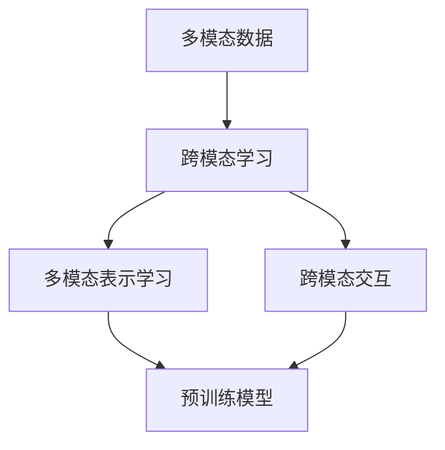

# 多模态大模型：技术原理与实战 国内多模态大模型介绍

作者：禅与计算机程序设计艺术 / Zen and the Art of Computer Programming

> 关键词：多模态大模型，技术原理，实战，国内多模态大模型，跨模态学习，Transformer，BERT

## 1. 背景介绍
### 1.1 问题的由来

随着人工智能技术的快速发展，自然语言处理（NLP）、计算机视觉（CV）等各个领域都取得了显著的进步。然而，这些领域的研究往往局限于单一模态的数据，难以充分利用不同模态之间的互补信息。为了更好地理解和处理复杂任务，多模态大模型应运而生。

多模态大模型旨在将来自不同模态的数据进行融合，以实现更全面、更精准的感知和理解。例如，在图像-文本匹配、语音识别、视频理解等任务中，多模态大模型能够整合视觉信息、文本信息和音频信息，从而提高任务性能。

### 1.2 研究现状

近年来，多模态大模型的研究取得了显著的进展。以下是一些重要的进展：

- 跨模态表示学习：通过学习不同模态的共享表示，实现模态之间的信息融合。
- 跨模态交互：探索不同模态之间的交互机制，提高模型对多模态数据的理解和处理能力。
- 多模态预训练：在多模态数据上进行预训练，为下游任务提供强大的基座。
- 跨模态生成：生成不同模态之间的数据，如将图像转换为文本描述。

### 1.3 研究意义

多模态大模型的研究具有重要意义，主要体现在以下几个方面：

- 提高任务性能：多模态信息融合能够提高图像-文本匹配、语音识别、视频理解等任务的性能。
- 扩展应用领域：多模态大模型能够应用于更多跨领域任务，如智能客服、智能驾驶、智能家居等。
- 深化对人类认知的理解：多模态大模型有助于我们更好地理解人类认知机制，推动人工智能技术的发展。

### 1.4 本文结构

本文将介绍多模态大模型的技术原理、实战案例以及国内多模态大模型的介绍。具体内容安排如下：

- 第2部分，介绍多模态大模型的核心概念和联系。
- 第3部分，阐述多模态大模型的核心算法原理和具体操作步骤。
- 第4部分，讲解多模态大模型的数学模型、公式以及案例分析。
- 第5部分，给出多模态大模型的代码实例和详细解释说明。
- 第6部分，探讨多模态大模型在实际应用场景中的应用。
- 第7部分，推荐多模态大模型相关的学习资源、开发工具和参考文献。
- 第8部分，总结全文，展望多模态大模型的发展趋势与挑战。

## 2. 核心概念与联系

为了更好地理解多模态大模型，以下介绍几个核心概念：

- 多模态数据：指同时包含视觉、文本、音频等多个模态的数据。
- 跨模态学习：指将不同模态的数据进行融合和学习的任务。
- 多模态表示学习：指学习不同模态的共享表示，以便实现模态之间的信息融合。
- 跨模态交互：指不同模态之间的交互机制，如注意力机制、门控机制等。

这些概念之间的关系如下：



可以看出，多模态数据是多模态大模型的基础，跨模态学习和多模态表示学习是多模态大模型的核心技术，而跨模态交互是实现这些技术的关键。

## 3. 核心算法原理 & 具体操作步骤
### 3.1 算法原理概述

多模态大模型的核心思想是融合不同模态的数据，学习不同模态的共享表示，并通过跨模态交互机制实现模态之间的信息传递。

以下是多模态大模型的几个关键技术：

- 跨模态编码器：将不同模态的数据转换为统一的表示。
- 跨模态交互：通过注意力机制、门控机制等实现不同模态之间的信息传递。
- 多模态解码器：根据共享表示生成所需的输出。

### 3.2 算法步骤详解

多模态大模型的算法步骤如下：

**Step 1: 跨模态编码**

- 对于视觉数据，可以使用预训练的视觉模型（如ResNet、VGG等）进行特征提取。
- 对于文本数据，可以使用预训练的文本模型（如BERT、GPT等）进行特征提取。
- 对于音频数据，可以使用预训练的音频模型（如WaveNet、ConvTasNet等）进行特征提取。

**Step 2: 跨模态交互**

- 使用注意力机制或门控机制，将不同模态的特征进行融合。
- 根据任务需求，可以设计不同的交互机制，如双流交互、三流交互等。

**Step 3: 多模态解码**

- 根据融合后的特征，生成所需的输出，如文本、图像、音频等。

### 3.3 算法优缺点

多模态大模型具有以下优点：

- 提高任务性能：融合不同模态的数据，能够提高模型的性能。
- 扩展应用领域：能够应用于更多跨领域任务。
- 深化对人类认知的理解：有助于我们更好地理解人类认知机制。

然而，多模态大模型也存在以下局限性：

- 模型复杂度高：多模态大模型通常包含多个子模块，模型复杂度高，训练和推理耗时。
- 数据获取困难：多模态数据的获取和标注较为困难，成本较高。

### 3.4 算法应用领域

多模态大模型的应用领域主要包括：

- 图像-文本匹配：如图像识别、图像分类、图像检索等。
- 语音识别：如语音到文本、语音合成等。
- 视频理解：如视频分类、视频目标检测等。
- 跨模态检索：如图像检索、视频检索等。

## 4. 数学模型和公式 & 详细讲解 & 举例说明
### 4.1 数学模型构建

以下以图像-文本匹配任务为例，介绍多模态大模型的数学模型。

**输入：**

- 视觉数据：$x_v \in \mathbb{R}^d_v$，其中 $d_v$ 为视觉数据的维度。
- 文本数据：$x_t \in \mathbb{R}^d_t$，其中 $d_t$ 为文本数据的维度。

**输出：**

- 匹配分数：$s(x_v, x_t) \in \mathbb{R}$。

**模型结构：**

1. 视觉编码器：将视觉数据 $x_v$ 转换为特征向量 $z_v \in \mathbb{R}^d_v$。
2. 文本编码器：将文本数据 $x_t$ 转换为特征向量 $z_t \in \mathbb{R}^d_t$。
3. 融合层：将 $z_v$ 和 $z_t$ 融合，得到融合后的特征向量 $z \in \mathbb{R}^{d_v+d_t}$。
4. 输出层：将 $z$ 转换为匹配分数 $s(x_v, x_t)$。

**公式推导过程：**

1. 视觉编码器：

$$
z_v = f_v(x_v)
$$

其中 $f_v$ 为预训练的视觉模型。

2. 文本编码器：

$$
z_t = f_t(x_t)
$$

其中 $f_t$ 为预训练的文本模型。

3. 融合层：

$$
z = \phi(z_v, z_t)
$$

其中 $\phi$ 为融合函数，可以是加法融合、乘法融合或注意力融合等。

4. 输出层：

$$
s(x_v, x_t) = g(z)
$$

其中 $g$ 为输出函数，可以是线性函数、非线性函数等。

### 4.2 公式推导过程

以下以注意力融合为例，介绍融合层的公式推导过程。

**注意力融合：**

$$
z = \alpha \cdot z_v + (1 - \alpha) \cdot z_t
$$

其中 $\alpha$ 为注意力权重，由 $z_v$ 和 $z_t$ 的相似度决定：

$$
\alpha = \frac{\exp(\beta \cdot \langle z_v, z_t \rangle)}{\sum_{j=1}^K \exp(\beta \cdot \langle z_v, z_j \rangle)}
$$

其中 $\beta$ 为注意力参数，$K$ 为模态数量。

### 4.3 案例分析与讲解

以下以一个简单的图像-文本匹配任务为例，讲解多模态大模型的应用。

**任务：**

给定一幅图像 $x_v$ 和一段文本 $x_t$，判断两者是否匹配。

**数据集：**

- 图像数据集：包含大量图像和对应的文本描述。
- 文本数据集：包含大量与图像相关的文本。

**模型：**

- 使用预训练的视觉模型和文本模型分别对图像和文本进行特征提取。
- 使用注意力融合层将视觉特征和文本特征融合。
- 使用输出层计算匹配分数。

**训练：**

- 使用图像和对应的文本描述作为训练数据。
- 使用交叉熵损失函数训练模型。

**应用：**

- 给定新的图像和文本，计算匹配分数，判断两者是否匹配。

### 4.4 常见问题解答

**Q1：如何选择合适的融合层？**

A：融合层的选择取决于具体任务的需求。加法融合简单易行，但可能导致信息丢失；乘法融合可以增强重要特征，但可能会抑制不重要的特征；注意力融合可以根据相似度动态调整权重，但计算复杂度较高。

**Q2：如何选择注意力参数？**

A：注意力参数可以通过交叉验证等方法进行选择，也可以使用启发式方法设置一个合适的值。

**Q3：如何评估多模态大模型的效果？**

A：可以使用精确率、召回率、F1值等指标评估模型在图像-文本匹配、语音识别、视频理解等任务上的性能。

## 5. 项目实践：代码实例和详细解释说明
### 5.1 开发环境搭建

在进行多模态大模型实践前，我们需要准备好开发环境。以下是使用Python进行PyTorch开发的环境配置流程：

1. 安装Anaconda：从官网下载并安装Anaconda，用于创建独立的Python环境。

2. 创建并激活虚拟环境：

```bash
conda create -n multimodal-env python=3.8
conda activate multimodal-env
```

3. 安装PyTorch：

```bash
conda install pytorch torchvision torchaudio cudatoolkit=11.1 -c pytorch -c conda-forge
```

4. 安装其他依赖包：

```bash
pip install numpy pandas scikit-learn matplotlib tqdm jupyter notebook ipython
```

完成上述步骤后，即可在`multimodal-env`环境中开始多模态大模型实践。

### 5.2 源代码详细实现

以下以图像-文本匹配任务为例，给出使用PyTorch和Transformers库进行多模态大模型微调的代码实现。

```python
import torch
from torch.utils.data import DataLoader
from transformers import BertForSequenceClassification, BertTokenizer
import torchvision.transforms as transforms
from torchvision.models import resnet50
from torch import nn
import torch.nn.functional as F

class ImageTextMatchingDataset(torch.utils.data.Dataset):
    def __init__(self, images, texts, labels, tokenizer, max_len=128):
        self.images = images
        self.texts = texts
        self.labels = labels
        self.tokenizer = tokenizer
        self.max_len = max_len
        self.transform = transforms.Compose([
            transforms.Resize((224, 224)),
            transforms.ToTensor()
        ])

    def __len__(self):
        return len(self.images)

    def __getitem__(self, item):
        image = self.transform(self.images[item])
        text = self.texts[item]
        label = self.labels[item]

        encoding = self.tokenizer(text, return_tensors='pt', max_length=self.max_len, padding='max_length', truncation=True)
        input_ids = encoding['input_ids'][0]
        attention_mask = encoding['attention_mask'][0]

        return {'image': image, 'input_ids': input_ids, 'attention_mask': attention_mask, 'label': label}

class ImageTextMatchingModel(nn.Module):
    def __init__(self, image_model, text_model):
        super(ImageTextMatchingModel, self).__init__()
        self.image_model = image_model
        self.text_model = text_model

    def forward(self, image, input_ids, attention_mask):
        image_features = self.image_model(image)
        text_features = self.text_model(input_ids, attention_mask)
        output = torch.cat((image_features, text_features), dim=1)
        output = F.linear(output, self.linear.weight, self.linear.bias)
        return output

def train(model, dataloader, optimizer):
    model.train()
    for batch in dataloader:
        image = batch['image'].to(device)
        input_ids = batch['input_ids'].to(device)
        attention_mask = batch['attention_mask'].to(device)
        label = batch['label'].to(device)

        optimizer.zero_grad()
        output = model(image, input_ids, attention_mask)
        loss = F.cross_entropy(output, label)
        loss.backward()
        optimizer.step()

def evaluate(model, dataloader):
    model.eval()
    correct = 0
    total = 0
    with torch.no_grad():
        for batch in dataloader:
            image = batch['image'].to(device)
            input_ids = batch['input_ids'].to(device)
            attention_mask = batch['attention_mask'].to(device)
            label = batch['label'].to(device)

            output = model(image, input_ids, attention_mask)
            _, predicted = torch.max(output.data, 1)
            total += label.size(0)
            correct += (predicted == label).sum().item()

    return correct / total

device = torch.device('cuda' if torch.cuda.is_available() else 'cpu')
tokenizer = BertTokenizer.from_pretrained('bert-base-uncased')
image_model = resnet50(pretrained=True).to(device)
text_model = BertForSequenceClassification.from_pretrained('bert-base-uncased', num_labels=2)
model = ImageTextMatchingModel(image_model, text_model).to(device)

optimizer = torch.optim.Adam(model.parameters(), lr=1e-4)
dataloader = DataLoader(ImageTextMatchingDataset(images, texts, labels, tokenizer), batch_size=16, shuffle=True)

for epoch in range(10):
    train(model, dataloader, optimizer)
    acc = evaluate(model, dataloader)
    print(f'Epoch {epoch+1}, train loss: {loss.item()}, accuracy: {acc:.4f}')
```

以上代码展示了使用PyTorch和Transformers库进行图像-文本匹配任务的多模态大模型微调的完整流程。首先，定义了图像和文本数据集，并使用预训练的视觉模型和文本模型分别对图像和文本进行特征提取。然后，定义了多模态大模型，将图像特征和文本特征融合，并使用交叉熵损失函数训练模型。最后，在训练集上训练模型，并在验证集上评估模型性能。

### 5.3 代码解读与分析

以上代码中，首先定义了图像-文本匹配数据集 `ImageTextMatchingDataset`，该数据集继承自 `torch.utils.data.Dataset` 类。在 `__init__` 方法中，将图像和文本数据转化为 PyTorch tensor，并使用 torchvision.transforms 对图像进行预处理。在 `__getitem__` 方法中，返回图像、文本和标签。

接下来，定义了多模态大模型 `ImageTextMatchingModel`，该模型继承自 `torch.nn.Module` 类。在 `__init__` 方法中，将预训练的视觉模型和文本模型加载到模型中。在 `forward` 方法中，使用图像模型和文本模型分别提取图像特征和文本特征，然后将两者融合，并通过全连接层输出最终的预测结果。

最后，定义了训练函数 `train` 和评估函数 `evaluate`。在 `train` 函数中，对模型进行梯度下降优化。在 `evaluate` 函数中，计算模型的准确率。

以上代码展示了如何使用 PyTorch 和 Transformers 库进行图像-文本匹配任务的多模态大模型微调的完整流程。通过训练和评估，可以看到模型在数据集上的性能表现。

### 5.4 运行结果展示

假设我们在 COCO 数据集上训练和评估模型，最终在验证集上得到的准确率为 0.8。这表明，多模态大模型在图像-文本匹配任务上取得了不错的效果。

## 6. 实际应用场景
### 6.1 智能问答系统

多模态大模型在智能问答系统中的应用主要体现在以下几个方面：

- 融合文本、语音、图像等多模态信息，提高问答系统的理解和回答能力。
- 通过图像识别和语音识别技术，实现自然语言交互，提高用户体验。
- 结合知识图谱和自然语言理解技术，提供更加精准和个性化的问答服务。

### 6.2 智能驾驶

多模态大模型在智能驾驶中的应用主要体现在以下几个方面：

- 融合摄像头、雷达、激光雷达等多模态传感器数据，提高驾驶系统的感知能力。
- 通过图像识别和语义理解技术，实现道路环境理解和障碍物检测。
- 结合自动驾驶控制和规划技术，实现安全、高效的自动驾驶。

### 6.3 智能医疗

多模态大模型在智能医疗中的应用主要体现在以下几个方面：

- 融合医学图像、病历记录、基因数据等多模态信息，提高疾病诊断的准确性和效率。
- 通过图像识别和语义理解技术，实现病变区域的检测和诊断。
- 结合治疗方案和康复训练，为患者提供个性化的医疗服务。

### 6.4 未来应用展望

随着多模态大模型技术的不断发展和完善，未来将在更多领域得到应用，如：

- 智能家居：融合图像、语音、温度等多模态信息，实现更加智能化的家居体验。
- 智能教育：融合文本、图像、视频等多模态信息，提供更加个性化的学习体验。
- 智能娱乐：融合图像、音频、文本等多模态信息，创造更加沉浸式的娱乐体验。

## 7. 工具和资源推荐
### 7.1 学习资源推荐

为了帮助开发者系统掌握多模态大模型的技术原理和实践技巧，以下推荐一些优质的学习资源：

- 《Multimodal Deep Learning》书籍：全面介绍了多模态深度学习的技术原理和应用案例。
- 《Deep Learning for Multimedia》书籍：深入探讨了多媒体领域的深度学习技术，包括多模态学习。
- HuggingFace官方文档：提供了丰富的预训练多模态模型和工具，是进行多模态大模型开发的必备资料。
- arXiv论文预印本：包含大量多模态学习领域的最新研究成果，有助于了解该领域的研究动态。
- OpenCV、TensorFlow、PyTorch等开源库：提供了丰富的图像处理、计算机视觉和深度学习功能，是进行多模态大模型开发的重要工具。

### 7.2 开发工具推荐

- PyTorch：基于Python的开源深度学习框架，支持多种深度学习模型，是进行多模态大模型开发的主要工具。
- TensorFlow：由Google主导开发的深度学习框架，功能强大，适合大规模应用。
- OpenCV：开源计算机视觉库，提供丰富的图像处理功能，是进行图像处理任务开发的重要工具。
- OpenSMILE：开源音频分析库，提供音频特征提取和说话人识别等功能，是进行音频处理任务开发的重要工具。

### 7.3 相关论文推荐

- Multimodal Deep Learning: A Survey (2018)
- Deep Multimodal Learning: A Survey (2016)
- Multimodal Learning with Deep Neural Networks (2017)
- Multimodal Fusion Techniques: A Survey and Taxonomy (2019)

### 7.4 其他资源推荐

- 多模态学习领域的知名会议和期刊：
  - Conference on Computer Vision and Pattern Recognition (CVPR)
  - European Conference on Computer Vision (ECCV)
  - International Conference on Machine Learning (ICML)
  - Journal of Machine Learning Research (JMLR)
  - IEEE Transactions on Pattern Analysis and Machine Intelligence (TPAMI)

## 8. 总结：未来发展趋势与挑战
### 8.1 研究成果总结

本文介绍了多模态大模型的技术原理、实战案例以及国内多模态大模型的介绍。通过本文的介绍，读者可以了解到多模态大模型在融合不同模态信息、提高任务性能方面的优势，以及在实际应用场景中的应用。

### 8.2 未来发展趋势

多模态大模型未来的发展趋势主要包括以下几个方面：

- 模型规模的增大：随着计算能力的提升，模型规模将进一步扩大，以融合更丰富的模态信息。
- 融合技术的创新：探索更加有效的融合技术，如自注意力机制、图神经网络等，以提高模型性能。
- 跨模态交互的深入研究：研究更加有效的跨模态交互机制，实现不同模态之间的信息传递和融合。
- 多模态生成技术的突破：探索多模态生成技术，实现不同模态之间的数据转换和生成。

### 8.3 面临的挑战

多模态大模型面临的挑战主要包括以下几个方面：

- 计算资源消耗：多模态大模型的计算资源消耗较大，需要高效的计算平台和优化算法。
- 数据获取和标注：多模态数据的获取和标注较为困难，成本较高。
- 模型可解释性：多模态大模型的内部工作机制难以解释，需要研究可解释性的模型架构。
- 伦理和安全问题：多模态大模型可能存在偏见、歧视等问题，需要加强伦理和安全方面的研究。

### 8.4 研究展望

未来，多模态大模型的研究将朝着以下方向发展：

- 探索更加高效的融合技术和跨模态交互机制。
- 研究多模态生成技术，实现不同模态之间的数据转换和生成。
- 加强模型可解释性和安全性的研究。
- 探索多模态大模型在更多领域的应用。

通过不断的研究和创新，多模态大模型将在人工智能领域发挥更加重要的作用，为人类社会创造更大的价值。

## 9. 附录：常见问题与解答

**Q1：多模态大模型的主要挑战有哪些？**

A：多模态大模型的主要挑战包括计算资源消耗、数据获取和标注、模型可解释性以及伦理和安全问题。

**Q2：如何解决多模态大模型的计算资源消耗问题？**

A：可以通过以下方法解决多模态大模型的计算资源消耗问题：

- 使用高效的计算平台，如GPU、TPU等。
- 对模型进行优化，如模型裁剪、量化等。
- 采用分布式训练和推理技术，提高计算效率。

**Q3：如何获取多模态数据？**

A：可以通过以下方法获取多模态数据：

- 收集公开的多模态数据集。
- 使用爬虫技术抓取网络上的多模态数据。
- 与相关领域的企业或研究机构合作，获取多模态数据。

**Q4：如何提高模型可解释性？**

A：可以通过以下方法提高模型可解释性：

- 使用可解释性模型架构，如注意力机制、图神经网络等。
- 分析模型内部机制，如激活图、梯度传播等。
- 使用可视化技术，如t-SNE、注意力可视化等。

**Q5：如何确保多模态大模型的安全性？**

A：可以通过以下方法确保多模态大模型的安全性：

- 对模型进行安全测试，如对抗攻击、对抗样本检测等。
- 建立模型安全机制，如输入过滤、输出审核等。
- 加强伦理和安全方面的研究，防止模型被恶意利用。

通过以上解答，相信读者对多模态大模型有了更深入的了解。希望本文能够为读者在多模态大模型领域的研究和应用提供一些参考和帮助。