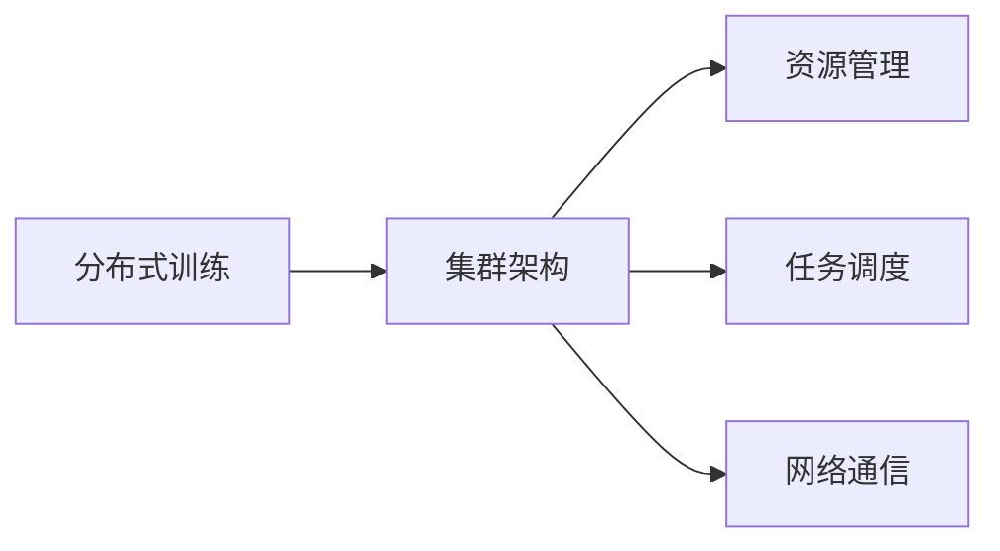

# 大规模语言模型从理论到实践 分布式训练的集群架构

作者：禅与计算机程序设计艺术 / Zen and the Art of Computer Programming


## 1. 背景介绍
### 1.1 问题的由来

随着深度学习技术的飞速发展，大规模语言模型（Large Language Models, LLMs）在自然语言处理（Natural Language Processing, NLP）领域取得了突破性进展。LLMs，如BERT、GPT-3等，通过在庞大的文本语料上进行预训练，能够理解并生成复杂的自然语言表达。然而，这些模型的训练过程需要消耗大量的计算资源，传统的单机训练模式已经无法满足需求。因此，分布式训练的集群架构成为了LLMs训练的关键技术。

### 1.2 研究现状

分布式训练的集群架构已经成为LLMs训练的标配。目前，主流的分布式训练框架包括TensorFlow、PyTorch、MXNet等，它们都提供了丰富的API和工具，支持大规模模型的训练。此外，云计算平台的兴起也为分布式训练提供了便捷的资源获取方式。

### 1.3 研究意义

研究分布式训练的集群架构对于LLMs的发展具有重要意义：

1. 提高训练效率：分布式训练可以将大规模模型分散到多个计算节点上并行训练，显著缩短训练时间。
2. 提升计算资源利用率：分布式训练可以充分利用现有计算资源，提高资源利用率。
3. 支持大规模模型：分布式训练可以支持更大规模的模型，突破单机内存和算力限制。
4. 降低训练成本：通过优化资源分配和调度策略，分布式训练可以降低训练成本。

### 1.4 本文结构

本文将从以下方面介绍分布式训练的集群架构：

- 核心概念与联系
- 核心算法原理与具体操作步骤
- 数学模型和公式
- 项目实践
- 实际应用场景
- 工具和资源推荐
- 总结

## 2. 核心概念与联系

### 2.1 分布式训练

分布式训练是指将大规模模型的训练任务分散到多个计算节点上并行执行，以提高训练效率。分布式训练的常见架构包括：

- 数据并行：将数据集分割成多个子集，每个计算节点负责训练模型的一个子集。
- 模型并行：将模型分割成多个子模型，每个计算节点负责训练模型的一个子模型。
- 算子并行：将计算图中的算子分散到多个计算节点上并行执行。

### 2.2 集群架构

集群架构是指将多个计算节点通过网络连接在一起，形成一个计算集群。集群架构可以支持分布式训练、数据处理、高性能计算等多种应用场景。

### 2.3 关系图

以下为分布式训练与集群架构的关系图：



### 2.4 关联分析

分布式训练与集群架构之间存在着紧密的联系。分布式训练需要集群架构提供计算资源、任务调度、资源管理等支持，而集群架构则需要分布式训练来充分利用其计算能力。

## 3. 核心算法原理与具体操作步骤
### 3.1 算法原理概述

分布式训练的核心算法原理是将大规模模型分散到多个计算节点上并行执行，并协调节点之间的通信和同步。以下是几种常见的分布式训练算法：

- 数据并行：在每个计算节点上独立训练模型的子集，并在每轮迭代后同步模型参数。
- 模型并行：在每个计算节点上独立训练模型的子模型，并在每轮迭代后同步模型参数。
- 算子并行：将计算图中的算子分散到多个计算节点上并行执行，并在每轮迭代后同步中间计算结果。

### 3.2 算法步骤详解

以下以数据并行为例，介绍分布式训练的具体操作步骤：

1. 将数据集分割成多个子集，每个子集包含部分样本。
2. 将每个计算节点分配一个子集，并分别在每个节点上独立训练模型。
3. 在每轮迭代后，计算节点之间同步模型参数。
4. 重复步骤2和3，直至模型收敛。

### 3.3 算法优缺点

- 数据并行：
  - 优点：简单易实现，能够充分利用数据并行带来的加速效果。
  - 缺点：对于计算密集型任务，数据并行可能无法带来显著的加速效果。

- 模型并行：
  - 优点：能够充分利用计算资源，适用于计算密集型任务。
  - 缺点：实现复杂，需要考虑参数同步和梯度更新等问题。

- 算子并行：
  - 优点：能够充分利用计算资源，适用于计算密集型任务。
  - 缺点：实现复杂，需要考虑中间计算结果的同步和存储等问题。

### 3.4 算法应用领域

分布式训练算法适用于各种大规模模型的训练，如：

- 自然语言处理
- 计算机视觉
- 强化学习
- 其他深度学习任务

## 4. 数学模型和公式
### 4.1 数学模型构建

分布式训练的数学模型主要涉及以下概念：

- 模型参数：表示模型的权重和偏置。
- 训练数据：表示训练过程中使用的样本数据。
- 梯度：表示模型参数的更新方向。
- 损失函数：表示模型预测结果与真实标签之间的差异。

### 4.2 公式推导过程

以下以数据并行为例，介绍分布式训练的公式推导过程：

1. 假设模型参数为 $\theta$，则模型预测为 $y = f(x;\theta)$。
2. 计算梯度：$g = \nabla_{\theta}L(x,y)$，其中 $L$ 为损失函数。
3. 更新参数：$\theta = \theta - \alpha g$，其中 $\alpha$ 为学习率。
4. 数据并行：
   - 将数据集分割成 $k$ 个子集，每个子集包含 $N/k$ 个样本。
   - 在每个计算节点上独立训练模型，并在每轮迭代后同步模型参数。

### 4.3 案例分析与讲解

以下以BERT模型为例，介绍分布式训练的案例分析：

1. 将BERT模型分解为多个子模型，每个子模型负责处理输入文本的特定部分。
2. 在每个计算节点上独立训练子模型，并在每轮迭代后同步模型参数。
3. 利用分布式训练框架（如PyTorch或TensorFlow）进行训练。

### 4.4 常见问题解答

**Q1：分布式训练是否会降低模型精度？**

A：分布式训练本身不会降低模型精度，但不当的实现可能导致精度下降。例如，数据并行中的梯度累积可能导致精度损失。

**Q2：分布式训练是否需要特殊的硬件支持？**

A：分布式训练需要一定的硬件支持，如高性能计算节点、高速网络等。但并非必须使用昂贵的硬件，普通的CPU和GPU也能满足基本需求。

**Q3：如何选择合适的分布式训练框架？**

A：选择分布式训练框架需要考虑以下因素：

- 支持的编程语言
- 支持的模型类型
- 生态系统
- 社区支持

## 5. 项目实践：代码实例和详细解释说明
### 5.1 开发环境搭建

以下以PyTorch为例，介绍分布式训练的开发环境搭建：

1. 安装PyTorch：从PyTorch官网下载安装包，并根据系统环境选择合适的版本。
2. 安装Python：建议使用Python 3.6及以上版本。
3. 安装相关库：安装TensorFlow、NumPy、Pandas等库。

### 5.2 源代码详细实现

以下以PyTorch为例，介绍分布式训练的代码实现：

```python
import torch
import torch.distributed as dist

# 初始化分布式环境
def init_distributed_mode(args):
    dist.init_process_group(
        backend='nccl',  # 使用NCCL后端
        init_method='env://',  # 使用环境变量初始化
        world_size=args.world_size,  # 计算节点数量
        rank=args.rank  # 计算节点编号
    )

# 训练函数
def train(model, dataloader, optimizer, device):
    model.to(device)
    model.train()
    for data in dataloader:
        optimizer.zero_grad()
        outputs = model(data)
        loss = loss_function(outputs, targets)
        loss.backward()
        optimizer.step()

# 主函数
def main(args):
    # 初始化分布式环境
    init_distributed_mode(args)

    # 加载模型和数据
    model = MyModel().to(device)
    dataloader = DataLoader(MyDataset(), batch_size=32, shuffle=True)

    # 定义优化器
    optimizer = torch.optim.Adam(model.parameters(), lr=0.001)

    # 训练模型
    train(model, dataloader, optimizer, device)

if __name__ == '__main__':
    args = argparse.ArgumentParser()
    args.add_argument('--world_size', type=int, default=2)  # 计算节点数量
    args.add_argument('--rank', type=int, default=0)  # 计算节点编号
    main(args)
```

### 5.3 代码解读与分析

上述代码展示了使用PyTorch进行分布式训练的基本流程：

1. 初始化分布式环境：使用`init_distributed_mode`函数初始化分布式环境，包括计算节点数量和编号。
2. 加载模型和数据：加载预训练模型和训练数据。
3. 定义优化器：定义用于优化模型参数的优化器。
4. 训练模型：使用`train`函数进行模型训练，包括前向传播、反向传播和参数更新等操作。

### 5.4 运行结果展示

运行上述代码，可以在多个计算节点上并行训练模型，并输出训练过程中的损失值。

## 6. 实际应用场景
### 6.1 机器翻译

机器翻译是LLMs的典型应用场景。分布式训练可以显著提高机器翻译模型的训练效率，缩短训练时间。

### 6.2 情感分析

情感分析是NLP领域的重要任务。分布式训练可以加快情感分析模型的训练速度，提高模型性能。

### 6.3 问答系统

问答系统是LLMs的另一个应用场景。分布式训练可以加速问答系统的训练过程，提高问答系统的准确性。

## 7. 工具和资源推荐
### 7.1 学习资源推荐

- 《深度学习框架PyTorch实战》
- 《TensorFlow实战》
- 《大规模分布式训练系统实践》
- 《分布式系统原理与范型》

### 7.2 开发工具推荐

- PyTorch
- TensorFlow
- MXNet
- Horovod

### 7.3 相关论文推荐

- Distributed Representations (Hinton et al., 1986)
- Distributed Optimization in Overparameterized Deep Neural Networks (Yoshida et al., 2018)
- Communication-Efficient Async SGD: Fairness and Speed (Shelhamer et al., 2017)

### 7.4 其他资源推荐

- PyTorch官方文档：https://pytorch.org/docs/stable/
- TensorFlow官方文档：https://www.tensorflow.org/tutorials
- MXNet官方文档：https://mxnet.apache.org/Documentation/guides.html
- Horovod官方文档：https://github.com/horovod/horovod

## 8. 总结：未来发展趋势与挑战
### 8.1 研究成果总结

本文从理论到实践，介绍了分布式训练的集群架构，包括核心概念、算法原理、项目实践和实际应用场景。通过分布式训练，LLMs的训练效率得到了显著提升，为LLMs在各个领域的应用奠定了基础。

### 8.2 未来发展趋势

1. 更高效的分布式训练算法：随着深度学习算法的不断进步，将会有更多高效、鲁棒的分布式训练算法出现。
2. 优化计算资源调度：如何更好地调度计算资源，提高资源利用率，将是一个重要的研究方向。
3. 跨平台兼容性：如何使分布式训练框架在多种平台上具有良好的兼容性，将是一个重要的研究方向。
4. 可解释性和安全性：如何提高分布式训练模型的可解释性和安全性，将是一个重要的研究方向。

### 8.3 面临的挑战

1. 算力资源：大规模模型的训练需要大量的算力资源，如何高效地利用计算资源，将是一个重要的挑战。
2. 网络通信：分布式训练需要节点之间的通信，如何优化网络通信效率，将是一个重要的挑战。
3. 系统可靠性：如何保证分布式训练系统的可靠性，将是一个重要的挑战。

### 8.4 研究展望

随着分布式训练技术的不断发展，LLMs将在各个领域得到更广泛的应用。未来，分布式训练技术将与人工智能、云计算等领域深度融合，推动人工智能技术向更广阔的领域发展。

## 9. 附录：常见问题与解答

**Q1：分布式训练与传统训练有什么区别？**

A：分布式训练与传统训练的主要区别在于并行计算。分布式训练通过将训练任务分散到多个计算节点上并行执行，从而提高训练效率。

**Q2：分布式训练需要哪些硬件支持？**

A：分布式训练需要一定的硬件支持，如高性能计算节点、高速网络等。但并非必须使用昂贵的硬件，普通的CPU和GPU也能满足基本需求。

**Q3：如何选择合适的分布式训练框架？**

A：选择分布式训练框架需要考虑以下因素：

- 支持的编程语言
- 支持的模型类型
- 生态系统
- 社区支持

**Q4：分布式训练是否需要特殊的网络环境？**

A：分布式训练需要稳定的网络环境，以保证节点之间的通信畅通。

**Q5：分布式训练如何保证数据一致性？**

A：分布式训练中，数据一致性可以通过以下方法保证：

- 使用分布式文件系统
- 使用数据同步机制
- 使用分布式锁

**Q6：分布式训练是否会导致模型精度下降？**

A：分布式训练本身不会导致模型精度下降，但不当的实现可能导致精度损失。例如，数据并行中的梯度累积可能导致精度损失。

**Q7：如何优化分布式训练的性能？**

A：优化分布式训练性能可以从以下几个方面入手：

- 使用高效的分布式训练框架
- 优化计算资源调度
- 优化网络通信
- 优化模型结构

**Q8：分布式训练在工业界有哪些应用？**

A：分布式训练在工业界有广泛的应用，如：

- 机器翻译
- 情感分析
- 问答系统
- 图像识别

**Q9：分布式训练是否需要编写大量的代码？**

A：分布式训练框架提供了丰富的API和工具，可以简化分布式训练的代码编写。但仍然需要编写一些必要的代码，如初始化分布式环境、定义优化器等。

**Q10：分布式训练在未来会有哪些发展趋势？**

A：分布式训练在未来将会有以下发展趋势：

- 更高效的分布式训练算法
- 优化计算资源调度
- 跨平台兼容性
- 可解释性和安全性