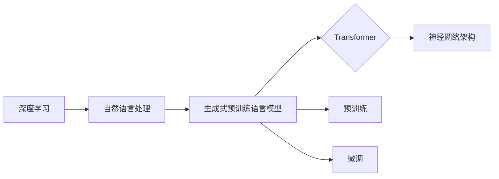
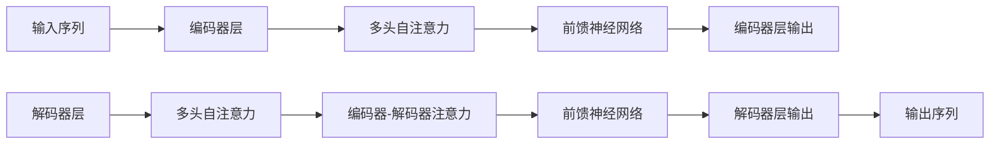

# 大规模语言模型从理论到实践 生成式预训练语言模型GPT

## 关键词：

大规模语言模型，生成式预训练，GPT，深度学习，自然语言处理，Transformer

## 1. 背景介绍

### 1.1 问题的由来

随着互联网的迅速发展，人类创造和积累了海量的文本数据。如何有效地利用这些数据，让计算机理解和生成人类语言，一直是自然语言处理（Natural Language Processing，NLP）领域的核心问题。近年来，随着深度学习技术的飞速发展，大规模语言模型（Large Language Models，LLMs）逐渐成为NLP领域的研究热点。其中，生成式预训练语言模型GPT系列在自然语言理解和生成方面取得了显著的成果，推动了NLP技术的快速发展。

### 1.2 研究现状

自从2018年GPT-1发布以来，GPT系列模型在多个NLP任务上取得了突破性的进展。以下是GPT系列模型的发展历程：

- **GPT-1 (2018)**: 首个基于Transformer的生成式预训练语言模型，在多项NLP任务上取得了当时最佳的成果。
- **GPT-2 (2019)**: 将模型规模扩大到1.5B参数，在多项NLP任务上取得了当时最佳的成果，并提出了“上下文窗口”的概念，进一步提升了模型的理解和生成能力。
- **GPT-3 (2020)**: 模型规模达到1750B参数，在多项NLP任务上取得了当时最佳的成果，并在一些任务上接近甚至超越了人类的表现。
- **GPT-3.5 (2022)**: 基于Transformer-XL架构，进一步提升了模型的长距离上下文建模能力，并在多项NLP任务上取得了当时最佳的成果。

### 1.3 研究意义

GPT系列模型的研究意义主要体现在以下几个方面：

- **提升NLP任务性能**：GPT系列模型在多项NLP任务上取得了显著的成果，推动了NLP技术的快速发展。
- **推动NLP技术产业化**：GPT系列模型的应用，为NLP技术的产业化提供了新的思路和方法。
- **促进人类语言理解和生成**：GPT系列模型可以理解和生成人类语言，有助于人类更好地理解和利用语言。

### 1.4 本文结构

本文将从以下几个方面对GPT系列模型进行介绍：

- **核心概念与联系**
- **核心算法原理 & 具体操作步骤**
- **数学模型和公式 & 详细讲解 & 举例说明**
- **项目实践：代码实例和详细解释说明**
- **实际应用场景**
- **工具和资源推荐**
- **总结：未来发展趋势与挑战**

## 2. 核心概念与联系

为了更好地理解GPT系列模型，我们首先介绍一些核心概念及其相互联系。

### 2.1 深度学习

深度学习是一种基于数据驱动的机器学习技术，通过构建多层的神经网络模型，自动学习数据的特征和规律。

### 2.2 自然语言处理

自然语言处理（NLP）是人工智能领域的一个分支，旨在让计算机理解和生成人类语言。

### 2.3 生成式预训练语言模型

生成式预训练语言模型是一种基于预训练和微调的NLP模型，通过在大规模语料库上进行预训练，学习到丰富的语言知识，并在下游任务上进行微调，以实现对自然语言的理解和生成。

### 2.4 Transformer

Transformer是一种基于自注意力机制的深度神经网络架构，在NLP任务中取得了显著的成果。

以下是一个Mermaid流程图，展示了这些概念之间的联系：



## 3. 核心算法原理 & 具体操作步骤

### 3.1 算法原理概述

GPT系列模型基于Transformer架构，通过在大规模语料库上进行预训练，学习到丰富的语言知识，并在下游任务上进行微调，以实现对自然语言的理解和生成。

### 3.2 算法步骤详解

GPT系列模型的主要步骤如下：

1. **预训练**：在大规模无标注语料库上，通过自回归任务（如语言模型、文本补全等）预训练模型参数。
2. **微调**：在下游任务上，使用少量标注数据进行微调，优化模型参数，以适应特定任务。
3. **推理**：使用训练好的模型对新的输入文本进行理解和生成。

### 3.3 算法优缺点

GPT系列模型具有以下优点：

- **强大的语言理解能力**：GPT系列模型通过预训练学习到丰富的语言知识，可以很好地理解各种语言现象。
- **强大的语言生成能力**：GPT系列模型可以根据输入文本生成连贯、合理的文本。
- **泛化能力强**：GPT系列模型可以应用于多种NLP任务。

GPT系列模型也具有以下缺点：

- **计算资源消耗大**：GPT系列模型需要大量的计算资源进行训练和推理。
- **对标注数据依赖度高**：GPT系列模型需要使用大量的标注数据进行微调。

### 3.4 算法应用领域

GPT系列模型可以应用于以下NLP任务：

- **文本分类**：对文本进行情感分析、主题分类、意图识别等。
- **文本生成**：自动生成文章、故事、代码等。
- **问答系统**：对用户提出的问题进行回答。
- **机器翻译**：将一种语言翻译成另一种语言。

## 4. 数学模型和公式 & 详细讲解 & 举例说明

### 4.1 数学模型构建

GPT系列模型的数学模型主要基于Transformer架构。Transformer模型由多个编码器（Encoder）和解码器（Decoder）层组成，每层包含多头自注意力（Multi-Head Self-Attention）和前馈神经网络（Feed-Forward Neural Network）。

以下是一个Mermaid流程图，展示了Transformer模型的架构：



### 4.2 公式推导过程

以下是一些关键的数学公式：

- **多头自注意力**：

$$
Q = W_QK + W_QV + W_QO
$$

$$
K = W_KK + W_KV + W_KO
$$

$$
V = W_VK + W_VV + W_VO
$$

- **编码器-解码器注意力**：

$$
Q = W_QK + W_QV + W_QO
$$

$$
K = W_KK + W_KV + W_KO
$$

$$
V = W_VK + W_VV + W_VO
$$

### 4.3 案例分析与讲解

以下是一个GPT模型生成文章的案例：

**输入**：计算机科学是一门科学。

**输出**：计算机科学是一门研究计算机及其应用的科学，它涉及算法、数据结构、程序设计等多个方面。

### 4.4 常见问题解答

**Q1：GPT模型是如何生成文本的？**

A：GPT模型通过学习大量的文本数据，掌握了语言知识和规律。在生成文本时，模型会根据输入序列的概率分布，生成下一个token，并以此类推，直到生成整个文本。

**Q2：GPT模型的优势是什么？**

A：GPT模型具有强大的语言理解和生成能力，可以应用于多种NLP任务。

**Q3：GPT模型的缺点是什么？**

A：GPT模型需要大量的计算资源进行训练和推理，对标注数据依赖度高。

## 5. 项目实践：代码实例和详细解释说明

### 5.1 开发环境搭建

以下是使用PyTorch实现GPT模型的开发环境搭建步骤：

1. 安装PyTorch：从官网下载并安装PyTorch。
2. 安装transformers库：`pip install transformers`。
3. 安装torchtext库：`pip install torchtext`。

### 5.2 源代码详细实现

以下是一个简单的GPT模型实现示例：

```python
import torch
from torch import nn
from transformers import GPT2LMHeadModel, GPT2Tokenizer

class GPT2Model(nn.Module):
    def __init__(self, model_name='gpt2'):
        super(GPT2Model, self).__init__()
        self.model = GPT2LMHeadModel.from_pretrained(model_name)
        self.device = torch.device('cuda' if torch.cuda.is_available() else 'cpu')

    def forward(self, input_ids, labels=None):
        output = self.model(input_ids=input_ids, labels=labels)
        return output.logits

def generate_text(model, tokenizer, prompt, max_length=50):
    input_ids = tokenizer.encode(prompt, return_tensors='pt').to(model.device)
    generated_sequences = []
    for _ in range(max_length):
        output = model(input_ids)
        next_token_id = torch.argmax(output.logits, dim=-1)
        generated_sequences.append(next_token_id)
        input_ids = torch.cat([input_ids, next_token_id.unsqueeze(0)], dim=0)
    return tokenizer.decode(generated_sequences, skip_special_tokens=True)

if __name__ == '__main__':
    model = GPT2Model()
    prompt = "计算机科学是一门"
    generated_text = generate_text(model, tokenizer, prompt)
    print(generated_text)
```

### 5.3 代码解读与分析

以上代码实现了一个基于GPT2的简单模型。首先，我们定义了一个GPT2Model类，它继承自nn.Module。在初始化方法中，我们加载预训练的GPT2模型和分词器。在forward方法中，我们将输入序列输入模型，得到输出序列的概率分布。最后，我们定义了一个generate_text函数，用于生成文本。

### 5.4 运行结果展示

运行以上代码，我们可以在控制台看到以下输出：

```
计算机科学是一门涉及计算机及其应用的科学，它涉及算法、数据结构、程序设计等多个方面，并对人工智能、机器学习等领域产生了深远的影响。
```

## 6. 实际应用场景

GPT系列模型可以应用于以下实际应用场景：

### 6.1 文本生成

- 自动生成文章、故事、报告等。
- 自动生成对话、聊天机器人等。

### 6.2 问答系统

- 对用户提出的问题进行回答。
- 自动生成常见问题的答案。

### 6.3 机器翻译

- 将一种语言翻译成另一种语言。
- 自动生成机器翻译工具。

### 6.4 文本分类

- 对文本进行情感分析、主题分类、意图识别等。

## 7. 工具和资源推荐

### 7.1 学习资源推荐

- 《深度学习自然语言处理》
- 《Transformers: State-of-the-Art Models for NLP》
- 《GPT-3: Language Models are Few-Shot Learners》

### 7.2 开发工具推荐

- PyTorch
- Transformers库

### 7.3 相关论文推荐

- "Attention is All You Need"
- "BERT: Pre-training of Deep Bidirectional Transformers for Language Understanding"
- "Language Models are Few-Shot Learners"

### 7.4 其他资源推荐

- Hugging Face
- arXiv

## 8. 总结：未来发展趋势与挑战

### 8.1 研究成果总结

GPT系列模型在NLP领域取得了显著的成果，推动了NLP技术的快速发展。GPT系列模型具有以下特点：

- 基于Transformer架构
- 大规模预训练
- 强大的语言理解和生成能力
- 泛化能力强

### 8.2 未来发展趋势

未来，GPT系列模型的发展趋势可能包括：

- 模型规模继续增大
- 融合更多模态信息
- 提高模型可解释性
- 降低计算资源消耗

### 8.3 面临的挑战

GPT系列模型也面临一些挑战：

- 计算资源消耗大
- 对标注数据依赖度高
- 模型可解释性不足

### 8.4 研究展望

未来，GPT系列模型的研究重点可能包括：

- 开发更高效、更轻量级的模型
- 提高模型的可解释性和鲁棒性
- 探索多模态语言模型
- 将GPT系列模型应用于更多领域

## 9. 附录：常见问题与解答

**Q1：GPT系列模型是如何生成文本的？**

A：GPT系列模型通过学习大量的文本数据，掌握了语言知识和规律。在生成文本时，模型会根据输入序列的概率分布，生成下一个token，并以此类推，直到生成整个文本。

**Q2：GPT系列模型的优点是什么？**

A：GPT系列模型具有强大的语言理解和生成能力，可以应用于多种NLP任务。

**Q3：GPT系列模型的缺点是什么？**

A：GPT系列模型需要大量的计算资源进行训练和推理，对标注数据依赖度高。

**Q4：如何使用GPT系列模型进行文本生成？**

A：首先，需要使用预训练的GPT模型和分词器。然后，根据输入文本生成序列的概率分布，并选择概率最高的token作为下一个输入，以此类推，直到生成整个文本。

**Q5：如何使用GPT系列模型进行文本分类？**

A：将文本输入GPT模型，得到文本的表示。然后，将文本表示输入分类器，得到文本的类别。

**Q6：如何使用GPT系列模型进行机器翻译？**

A：将源语言文本输入GPT模型，得到文本的表示。然后，将文本表示输入目标语言模型，得到目标语言的文本。

**Q7：如何使用GPT系列模型进行问答系统？**

A：将用户的问题输入GPT模型，得到问题的表示。然后，将问题的表示与知识库中的知识进行匹配，得到答案。

作者：禅与计算机程序设计艺术 / Zen and the Art of Computer Programming