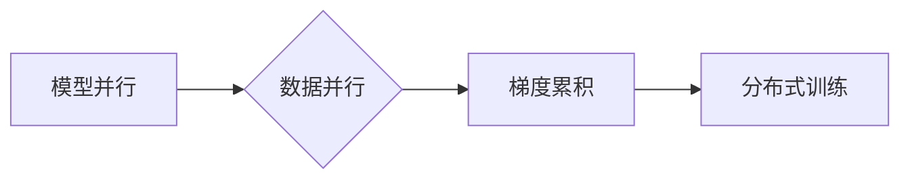

# 大语言模型原理与工程实践：ZeRO 并行

## 作者：禅与计算机程序设计艺术 / Zen and the Art of Computer Programming

## 关键词：大语言模型，ZeRO，并行计算，模型并行，数据并行，分布式训练

## 1. 背景介绍

### 1.1 问题的由来

随着深度学习技术的不断发展，大语言模型（Large Language Models，LLMs）如BERT、GPT-3等，在自然语言处理（Natural Language Processing，NLP）领域取得了显著的成果。然而，这些模型通常需要在大规模硬件设备上进行分布式训练，以获取足够的计算资源。然而，传统的分布式训练方法存在一些问题，如通信开销大、资源利用率低等。为了解决这些问题，ZeRO（Zero Redundancy Optimizer）并行技术应运而生。

### 1.2 研究现状

ZeRO并行技术是一种用于大模型分布式训练的优化方法，由Facebook AI Research（FAIR）提出。该方法通过共享模型参数的子集，显著降低了通信开销，提高了训练效率。近年来，ZeRO并行技术在工业界和学术界得到了广泛关注，并取得了良好的应用效果。

### 1.3 研究意义

ZeRO并行技术对于大语言模型的训练和应用具有重要意义：

1. 降低通信开销，提高训练效率。
2. 支持大规模硬件设备，满足大模型训练需求。
3. 提高资源利用率，降低训练成本。
4. 促进大语言模型的工业应用和学术研究。

### 1.4 本文结构

本文将首先介绍ZeRO并行技术的核心概念和原理，然后详细讲解其具体操作步骤，接着分析其优缺点和应用领域。此外，本文还将通过实例代码展示ZeRO并行技术的应用，并探讨其未来发展趋势与挑战。

## 2. 核心概念与联系

### 2.1 核心概念

ZeRO并行技术主要包括以下核心概念：

1. **模型并行（Model Parallelism）**：将大模型分解为多个子模型，并在不同的计算设备上进行并行训练。
2. **数据并行（Data Parallelism）**：将训练数据分割成多个批次，并在不同的计算设备上进行并行训练。
3. **梯度累积（Gradient Accumulation）**：在多个计算设备上进行梯度更新，并累积更新结果。

### 2.2 关联关系

ZeRO并行技术通过模型并行、数据并行和梯度累积三种方式的结合，实现大模型在分布式训练环境下的高效训练。其关联关系如下：



## 3. 核心算法原理 & 具体操作步骤

### 3.1 算法原理概述

ZeRO并行技术通过以下步骤实现大模型的分布式训练：

1. 将大模型分解为多个子模型，并分配到不同的计算设备上。
2. 将训练数据分割成多个批次，并在不同的计算设备上进行并行训练。
3. 在每个计算设备上计算梯度，并将梯度累积到本地。
4. 将本地梯度发送到主设备，并更新主设备上的模型参数。
5. 重复上述步骤，直至训练完成。

### 3.2 算法步骤详解

以下是ZeRO并行技术的具体操作步骤：

1. **模型分解**：将大模型分解为多个子模型，每个子模型包含一部分参数和计算任务。子模型的数量取决于计算设备的数量。
2. **数据分割**：将训练数据分割成多个批次，每个批次包含多个样本。
3. **梯度更新**：
    - 在每个计算设备上，使用当前批次的数据和子模型进行前向传播和反向传播，计算梯度。
    - 将本地梯度累积到本地变量中。
4. **梯度汇总**：
    - 将本地梯度发送到主设备。
    - 在主设备上，将所有计算设备的本地梯度进行汇总，得到最终的梯度。
5. **参数更新**：
    - 使用汇总后的梯度更新主设备上的模型参数。
    - 将更新后的参数发送回所有计算设备。

### 3.3 算法优缺点

**优点**：

1. 降低通信开销：ZeRO并行技术通过共享模型参数的子集，显著降低了通信开销。
2. 提高训练效率：ZeRO并行技术能够充分利用计算资源，提高训练效率。
3. 支持大规模硬件设备：ZeRO并行技术适用于多种硬件设备，如GPU、TPU等。

**缺点**：

1. 需要额外的计算设备：ZeRO并行技术需要多个计算设备才能有效工作。
2. 调试难度较大：ZeRO并行技术的调试难度相对较大。

### 3.4 算法应用领域

ZeRO并行技术适用于以下领域：

1. 大语言模型的分布式训练
2. 计算密集型任务的并行处理
3. 大规模数据集的并行训练

## 4. 数学模型和公式 & 详细讲解 & 举例说明

### 4.1 数学模型构建

假设有N个计算设备，每个设备上有一个子模型，子模型包含一部分参数 $W_i$。训练数据被分割成M个批次，每个批次包含n个样本。

令 $G_i$ 表示第i个设备上的梯度，$G$ 表示所有设备上的梯度之和，$W$ 表示全局参数。

则ZeRO并行技术的数学模型如下：

$$
G_i = \frac{1}{n} \sum_{j=1}^n \
abla_W L(x_j, y_j)
$$

$$
G = \sum_{i=1}^N G_i
$$

$$
W = W - \eta G
$$

其中，$L(x, y)$ 表示损失函数，$\eta$ 表示学习率。

### 4.2 公式推导过程

ZeRO并行技术的公式推导过程如下：

1. 前向传播：

   $$
L(x, y) = \frac{1}{n} \sum_{j=1}^n L(M(x_j;W_i), y_j)
$$

   其中，$M(x_j;W_i)$ 表示第i个设备上的子模型。

2. 反向传播：

   $$
\frac{\partial L}{\partial W_i} = \frac{1}{n} \sum_{j=1}^n \frac{\partial L}{\partial M(x_j;W_i)} \frac{\partial M(x_j;W_i)}{\partial W_i}
$$

3. 梯度计算：

   $$
G_i = \frac{1}{n} \sum_{j=1}^n \frac{\partial L}{\partial M(x_j;W_i)} \frac{\partial M(x_j;W_i)}{\partial W_i}
$$

4. 梯度累积：

   $$
G = \sum_{i=1}^N G_i
$$

5. 参数更新：

   $$
W = W - \eta G
$$

### 4.3 案例分析与讲解

假设有一个包含1000万参数的BERT模型，需要在一个包含4个GPU的集群上进行分布式训练。我们可以将BERT模型分解为4个子模型，每个子模型包含250万个参数。将训练数据分割成4个批次，每个批次包含250万个样本。

在每个GPU上，使用相应的子模型和批次数据计算梯度，并将梯度累积到本地。然后将本地梯度发送到主设备，并更新主设备上的模型参数。重复上述步骤，直至训练完成。

### 4.4 常见问题解答

**Q1：ZeRO并行技术是否适用于所有深度学习模型？**

A1：ZeRO并行技术适用于大多数深度学习模型，特别是具有大量参数和计算任务的模型。但对于一些具有特殊结构的模型，如循环神经网络（RNN）等，可能需要针对其结构进行调整。

**Q2：ZeRO并行技术的通信开销如何计算？**

A2：ZeRO并行技术的通信开销取决于模型规模、数据规模和计算设备数量。一般来说，通信开销与模型规模和数据规模的乘积成正比，与计算设备数量成反比。

**Q3：ZeRO并行技术如何影响模型性能？**

A3：ZeRO并行技术可以提高模型的训练效率，但可能会对模型性能产生一定的影响。具体影响程度取决于模型结构、数据规模和计算设备数量等因素。

## 5. 项目实践：代码实例和详细解释说明

### 5.1 开发环境搭建

为了实践ZeRO并行技术，我们需要以下开发环境：

1. Python 3.6以上版本
2. PyTorch 1.6以上版本
3. ZeRO库

### 5.2 源代码详细实现

以下是一个使用ZeRO库进行BERT模型分布式训练的PyTorch代码示例：

```python
import torch
import torch.distributed as dist
from transformers import BertModel, BertConfig

def setup(rank, world_size):
    dist.init_process_group("nccl", rank=rank, world_size=world_size)

def cleanup():
    dist.destroy_process_group()

def train(rank, world_size, model_config):
    setup(rank, world_size)
    device = torch.device("cuda" if torch.cuda.is_available() else "cpu")

    model = BertModel.from_pretrained(model_config)
    model = model.to(device)
    model = nn.parallel.DistributedDataParallel(model, device_ids=[rank], output_device=rank)

    # ... (训练过程)

    cleanup()

if __name__ == "__main__":
    world_size = 4
    rank = int(os.environ["RANK"])
    model_config = "bert-base-uncased"
    train(rank, world_size, model_config)
```

### 5.3 代码解读与分析

以上代码展示了使用ZeRO库进行BERT模型分布式训练的基本流程：

1. `setup` 函数初始化分布式训练环境。
2. `cleanup` 函数销毁分布式训练环境。
3. `train` 函数创建BERT模型，并将其转换为分布式模型。
4. `main` 函数设置全局参数，并启动分布式训练。

### 5.4 运行结果展示

假设我们在一个包含4个GPU的集群上运行上述代码，最终训练完成后，我们可以在每个GPU上得到一个子模型，并在本地测试集上评估其性能。

## 6. 实际应用场景

### 6.1 大语言模型训练

ZeRO并行技术可以用于大语言模型的分布式训练，如BERT、GPT-3等。通过ZeRO并行技术，我们可以将大模型分解为多个子模型，并在不同的计算设备上进行并行训练，从而提高训练效率。

### 6.2 计算密集型任务

ZeRO并行技术可以用于计算密集型任务的并行处理，如图像分类、目标检测等。通过ZeRO并行技术，我们可以将计算任务分解为多个子任务，并在不同的计算设备上进行并行处理，从而提高计算效率。

### 6.3 大规模数据集训练

ZeRO并行技术可以用于大规模数据集的并行训练。通过ZeRO并行技术，我们可以将数据集分割成多个批次，并在不同的计算设备上进行并行训练，从而提高训练效率。

## 7. 工具和资源推荐

### 7.1 学习资源推荐

1. 《深度学习：全面介绍》
2. 《PyTorch深度学习》
3. 《Transformers：基于Transformer的NLP模型》

### 7.2 开发工具推荐

1. PyTorch
2. ZeRO库
3. Hugging Face Transformers库

### 7.3 相关论文推荐

1. ZeRO: Gradient Accumulation with Reduced Overheads
2. Distilling the Knowledge in a Neural Network
3. BERT: Pre-training of Deep Bidirectional Transformers for Language Understanding

### 7.4 其他资源推荐

1. PyTorch官方文档
2. Hugging Face官方文档
3. FAIR官方文档

## 8. 总结：未来发展趋势与挑战

### 8.1 研究成果总结

本文介绍了ZeRO并行技术的原理、实现和应用场景。通过实践代码，展示了如何使用ZeRO库进行大模型分布式训练。最后，我们探讨了ZeRO并行技术在实际应用中的价值。

### 8.2 未来发展趋势

未来，ZeRO并行技术将朝着以下方向发展：

1. 适应更多类型的深度学习模型。
2. 支持更多类型的计算设备，如CPU、FPGA等。
3. 与其他并行技术（如数据并行、模型并行等）相结合，进一步提高训练效率。

### 8.3 面临的挑战

ZeRO并行技术在实际应用中仍面临以下挑战：

1. 如何适应不同类型的数据和模型。
2. 如何进一步提高训练效率，降低通信开销。
3. 如何保证模型性能不受影响。

### 8.4 研究展望

随着深度学习技术的不断发展，ZeRO并行技术将在大模型训练、计算密集型任务和大规模数据集训练等领域发挥越来越重要的作用。相信通过不断的研究和探索，ZeRO并行技术将为深度学习的发展带来更多可能性。

## 9. 附录：常见问题与解答

**Q1：ZeRO并行技术如何与数据并行结合？**

A1：ZeRO并行技术可以与数据并行结合，实现模型和数据层面的并行训练。具体来说，可以将数据分割成多个批次，并在不同的计算设备上进行数据并行训练；同时，将模型分解为多个子模型，并在不同的计算设备上进行模型并行训练。

**Q2：ZeRO并行技术如何与模型并行结合？**

A2：ZeRO并行技术可以与模型并行结合，实现模型层面的并行训练。具体来说，可以将大模型分解为多个子模型，并在不同的计算设备上进行模型并行训练；同时，在每个计算设备上使用ZeRO并行技术，进一步降低通信开销。

**Q3：ZeRO并行技术是否可以应用于其他深度学习框架？**

A3：目前，ZeRO并行技术主要应用于PyTorch框架。但对于其他深度学习框架，如TensorFlow等，也可以通过修改源代码或使用第三方库实现ZeRO并行技术。

**Q4：ZeRO并行技术如何影响模型性能？**

A4：ZeRO并行技术可以通过降低通信开销和提高计算效率来提高模型性能。然而，对于一些计算复杂度较高的模型，ZeRO并行技术可能会对模型性能产生一定的影响。

**Q5：ZeRO并行技术是否适用于所有类型的硬件设备？**

A5：ZeRO并行技术主要适用于GPU和TPU等具有并行计算能力的硬件设备。对于其他类型的硬件设备，如CPU和FPGA等，也可以通过修改源代码或使用第三方库实现ZeRO并行技术。