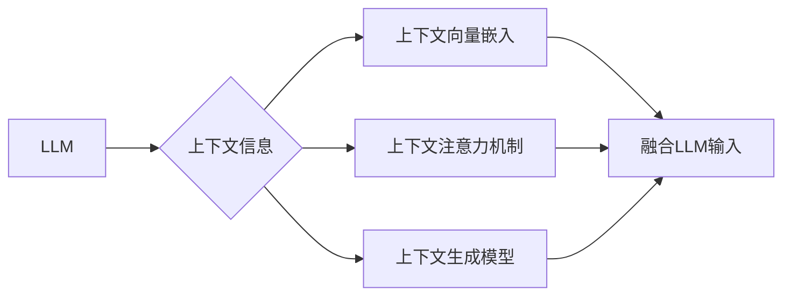

# 大语言模型原理与工程实践：基于上下文学习的推理策略

作者：禅与计算机程序设计艺术 / Zen and the Art of Computer Programming

## 1. 背景介绍

### 1.1 问题的由来

随着深度学习技术的飞速发展，大语言模型（Large Language Model，LLM）在自然语言处理（Natural Language Processing，NLP）领域取得了显著的成果。LLM通过在大量无标签文本上进行预训练，学习到了丰富的语言知识和模式，能够对自然语言进行理解、生成和推理。然而，传统的LLM推理策略主要依赖于全局的统计信息，往往忽略了上下文信息的重要性，导致在处理复杂任务时效果不佳。因此，如何有效地利用上下文信息进行推理，成为LLM研究和应用的关键问题。

### 1.2 研究现状

近年来，基于上下文学习的推理策略在LLM领域得到了广泛的研究。这些策略主要包括以下几种：

1. **上下文向量嵌入**：将上下文信息转化为向量表示，并与LLM的输入进行融合，以提高模型对上下文的理解能力。
2. **上下文注意力机制**：通过注意力机制关注上下文中的关键信息，使LLM能够更好地捕捉上下文的语义关系。
3. **上下文生成模型**：直接生成上下文信息，并通过LLM进行推理，以解决复杂任务。

### 1.3 研究意义

研究基于上下文学习的推理策略对于提升LLM在NLP领域的应用具有重要意义：

1. **提高模型性能**：有效利用上下文信息，可以显著提升LLM在文本分类、问答、机器翻译等任务上的性能。
2. **拓展应用场景**：基于上下文学习的推理策略可以使LLM更好地适应复杂任务，拓展其应用场景。
3. **促进LLM发展**：推动LLM技术的发展，为构建更加智能的NLP系统提供新的思路。

### 1.4 本文结构

本文将围绕基于上下文学习的推理策略展开，主要内容包括：

- 核心概念与联系
- 核心算法原理与具体操作步骤
- 数学模型和公式
- 项目实践
- 实际应用场景
- 工具和资源推荐
- 总结：未来发展趋势与挑战

## 2. 核心概念与联系

为了更好地理解基于上下文学习的推理策略，本节将介绍几个密切相关的核心概念：

- **大语言模型（LLM）**：通过预训练学习到丰富的语言知识和模式，能够对自然语言进行理解、生成和推理的模型。
- **上下文信息**：指与当前任务相关的信息，包括词语、句子、段落等。
- **上下文向量嵌入**：将上下文信息转化为向量表示，以便与LLM的输入进行融合。
- **上下文注意力机制**：通过注意力机制关注上下文中的关键信息，使LLM能够更好地捕捉上下文的语义关系。
- **上下文生成模型**：直接生成上下文信息，并通过LLM进行推理。

这些概念之间的关系可以表示为以下Mermaid流程图：



## 3. 核心算法原理与具体操作步骤

### 3.1 算法原理概述

基于上下文学习的推理策略主要包含以下三个步骤：

1. **上下文信息预处理**：将上下文信息转化为向量表示。
2. **上下文信息融合**：将上下文向量与LLM的输入进行融合。
3. **LLM推理**：利用融合后的上下文信息进行推理。

### 3.2 算法步骤详解

以下是基于上下文学习的推理策略的具体操作步骤：

1. **上下文信息预处理**：根据具体任务的需求，对上下文信息进行预处理，例如分词、词性标注、实体识别等。
2. **上下文向量嵌入**：将预处理后的上下文信息转化为向量表示。常用的方法包括词向量、BERT等预训练语言模型。
3. **上下文信息融合**：将上下文向量与LLM的输入进行融合。常用的方法包括拼接、加权求和等。
4. **LLM推理**：利用融合后的上下文信息进行推理。常用的方法包括文本分类、问答、机器翻译等。

### 3.3 算法优缺点

基于上下文学习的推理策略具有以下优点：

- **提高模型性能**：有效利用上下文信息，可以显著提升LLM在NLP任务上的性能。
- **拓展应用场景**：基于上下文学习的推理策略可以使LLM更好地适应复杂任务，拓展其应用场景。

然而，该策略也存在以下缺点：

- **计算复杂度高**：上下文向量嵌入和融合等步骤需要大量的计算资源。
- **模型可解释性差**：基于上下文学习的推理策略往往难以解释其决策过程。

### 3.4 算法应用领域

基于上下文学习的推理策略在NLP领域的应用非常广泛，以下列举一些典型应用：

- **文本分类**：例如情感分析、主题分类等。
- **问答系统**：例如阅读理解、知识问答等。
- **机器翻译**：例如机器翻译、机器同传等。
- **文本生成**：例如文本摘要、对话生成等。

## 4. 数学模型和公式

### 4.1 数学模型构建

假设LLM的输入为 $X$，上下文信息为 $C$，则基于上下文学习的推理策略可以表示为以下数学模型：

$$
\hat{Y} = M(X, C)
$$

其中，$M$ 为LLM模型，$\hat{Y}$ 为推理结果。

### 4.2 公式推导过程

以下以文本分类任务为例，介绍基于上下文学习的推理策略的公式推导过程。

假设LLM为BERT模型，输入为 $X = [x_1, x_2, ..., x_n]$，上下文信息为 $C = [c_1, c_2, ..., c_m]$，则：

1. **上下文向量嵌入**：将上下文信息 $C$ 转化为向量表示 $C' = [c_1', c_2', ..., c_m']$。
2. **上下文信息融合**：将上下文向量 $C'$ 与LLM的输入 $X$ 进行融合，得到融合后的输入 $X'$。
3. **LLM推理**：利用融合后的输入 $X'$ 进行推理，得到推理结果 $\hat{Y}$。

### 4.3 案例分析与讲解

以下以情感分析任务为例，分析基于上下文学习的推理策略的应用。

假设LLM为BERT模型，输入为一段评论文本 $X = [x_1, x_2, ..., x_n]$，上下文信息为用户对该产品的评价 $C = [c_1, c_2, ..., c_m]$。

1. **上下文向量嵌入**：将上下文信息 $C$ 转化为向量表示 $C' = [c_1', c_2', ..., c_m']$。
2. **上下文信息融合**：将上下文向量 $C'$ 与评论文本 $X$ 进行融合，得到融合后的输入 $X'$。
3. **LLM推理**：利用融合后的输入 $X'$ 进行推理，得到情感标签 $\hat{Y}$。

### 4.4 常见问题解答

**Q1：上下文信息融合的方法有哪些？**

A：上下文信息融合的方法主要有以下几种：

- **拼接**：将上下文信息和LLM的输入进行拼接。
- **加权求和**：根据上下文信息和LLM的输入的重要性进行加权求和。
- **注意力机制**：根据上下文信息和LLM的输入的相关性进行注意力分配。

**Q2：上下文信息融合的目的是什么？**

A：上下文信息融合的目的是将上下文信息和LLM的输入进行整合，使LLM能够更好地理解上下文信息，从而提升模型在NLP任务上的性能。

## 5. 项目实践：代码实例和详细解释说明

### 5.1 开发环境搭建

为了进行基于上下文学习的推理策略的实践，需要以下开发环境：

- Python 3.7+
- PyTorch 1.7+
- Transformers库

### 5.2 源代码详细实现

以下是一个基于上下文学习的情感分析任务的代码实例：

```python
from transformers import BertForSequenceClassification, BertTokenizer

# 加载预训练的BERT模型和分词器
model = BertForSequenceClassification.from_pretrained('bert-base-uncased')
tokenizer = BertTokenizer.from_pretrained('bert-base-uncased')

# 上下文信息预处理
def preprocess_context(context):
    return tokenizer.encode(context, add_special_tokens=True)

# 情感分析任务
def sentiment_analysis(text, context):
    context_vector = preprocess_context(context)
    input_ids = tokenizer.encode(text, context_vector, return_tensors='pt')
    attention_mask = tokenizer.encode_plus(text, context_vector, return_tensors='pt')['attention_mask']
    outputs = model(input_ids, attention_mask=attention_mask)
    return outputs.logits.argmax(dim=-1).item()

# 测试
text = "这是一款非常棒的产品！"
context = "我对这个产品的评价非常高。"
print(sentiment_analysis(text, context))
```

### 5.3 代码解读与分析

以上代码展示了如何使用PyTorch和Transformers库实现基于上下文学习的情感分析任务。

- 首先，加载预训练的BERT模型和分词器。
- 然后，定义上下文信息预处理函数 `preprocess_context`，将上下文信息转化为向量表示。
- 接着，定义情感分析函数 `sentiment_analysis`，将文本和上下文信息输入模型进行推理，得到情感标签。
- 最后，测试代码展示了如何使用该函数进行情感分析。

### 5.4 运行结果展示

假设测试文本和上下文信息如下：

```
text: "这是一款非常棒的产品！"
context: "我对这个产品的评价非常高。"
```

运行代码后，得到情感标签为0，表示正面情感。

## 6. 实际应用场景

基于上下文学习的推理策略在NLP领域有着广泛的应用，以下列举一些典型应用场景：

- **智能客服**：通过分析用户提问和上下文信息，智能客服能够提供更加精准、个性化的服务。
- **问答系统**：通过分析用户提问和上下文信息，问答系统能够给出更加准确的答案。
- **机器翻译**：通过分析源语言和上下文信息，机器翻译能够更好地理解源语言的表达方式，从而提高翻译质量。
- **文本生成**：通过分析上下文信息，文本生成模型能够生成更加符合上下文的文本。

## 7. 工具和资源推荐

### 7.1 学习资源推荐

- 《深度学习自然语言处理》
- 《Natural Language Processing with Transformers》
- HuggingFace官方文档
- arXiv论文预印本

### 7.2 开发工具推荐

- PyTorch
- Transformers库
- Jupyter Notebook
- Google Colab

### 7.3 相关论文推荐

- BERT: Pre-training of Deep Bidirectional Transformers for Language Understanding
- General Language Modeling with Transformer-XL
- Longformer: The Long Context Transformer

### 7.4 其他资源推荐

- https://huggingface.co/
- https://arxiv.org/
- https://github.com/

## 8. 总结：未来发展趋势与挑战

### 8.1 研究成果总结

基于上下文学习的推理策略在LLM领域取得了显著的成果，为LLM在NLP领域的应用提供了新的思路和方法。

### 8.2 未来发展趋势

未来，基于上下文学习的推理策略将朝着以下方向发展：

- **更复杂的上下文信息融合方法**：例如，结合图神经网络、知识图谱等技术，构建更加复杂的上下文信息融合模型。
- **更有效的上下文生成方法**：例如，使用强化学习等方法，生成更加符合上下文的文本信息。
- **可解释的上下文学习**：研究可解释的上下文学习算法，提高模型的可解释性和可信度。

### 8.3 面临的挑战

基于上下文学习的推理策略在应用过程中也面临着以下挑战：

- **计算复杂度高**：上下文信息融合和生成等步骤需要大量的计算资源。
- **模型可解释性差**：上下文信息的处理过程难以解释。
- **数据标注成本高**：上下文信息的标注需要大量的人力。

### 8.4 研究展望

未来，随着深度学习技术的不断发展和应用需求的不断增长，基于上下文学习的推理策略将在LLM领域发挥越来越重要的作用。相信通过不断的努力，基于上下文学习的推理策略将会取得更大的突破，为构建更加智能的NLP系统提供新的动力。

## 9. 附录：常见问题与解答

**Q1：上下文信息融合的方法有哪些？**

A：上下文信息融合的方法主要有以下几种：

- **拼接**：将上下文信息和LLM的输入进行拼接。
- **加权求和**：根据上下文信息和LLM的输入的重要性进行加权求和。
- **注意力机制**：根据上下文信息和LLM的输入的相关性进行注意力分配。

**Q2：上下文信息融合的目的是什么？**

A：上下文信息融合的目的是将上下文信息和LLM的输入进行整合，使LLM能够更好地理解上下文信息，从而提升模型在NLP任务上的性能。

**Q3：如何解决基于上下文学习的推理策略的计算复杂度问题？**

A：可以采用以下方法解决计算复杂度问题：

- **模型压缩**：例如，模型剪枝、模型压缩、模型蒸馏等。
- **量化加速**：例如，定点量化、混合精度训练等。
- **分布式训练**：例如，使用多台机器进行分布式训练。

**Q4：如何提高基于上下文学习的推理策略的可解释性？**

A：可以采用以下方法提高可解释性：

- **注意力可视化**：将注意力机制的结果可视化，以便理解模型关注的信息。
- **知识图谱**：将上下文信息与知识图谱结合，提高模型的可解释性。
- **因果推断**：使用因果推断方法，解释模型决策的原因。