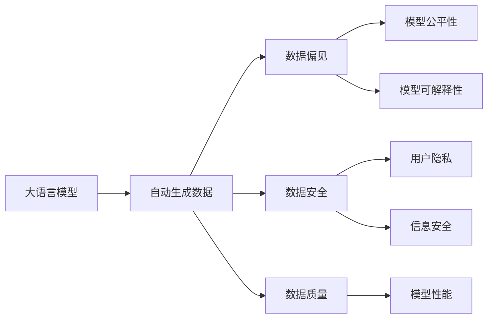

# 大语言模型原理与工程实践：自动生成数据的风险

作者：禅与计算机程序设计艺术 / Zen and the Art of Computer Programming

## 关键词：

大语言模型，自动生成数据，数据风险，数据偏见，数据安全，工程实践

## 1. 背景介绍

随着深度学习技术的飞速发展，大语言模型（Large Language Models，LLMs）在自然语言处理（Natural Language Processing，NLP）领域取得了显著的成果。LLMs在自动写作、机器翻译、文本生成等任务中表现出色，为各行各业带来了巨大的变革。然而，在LLMs的应用过程中，自动生成数据（Data Generation）这一环节也带来了诸多风险，如数据偏见、数据安全和隐私泄露等。本文将深入探讨LLMs自动生成数据的风险，并提出相应的解决方案。

### 1.1 问题的由来

LLMs自动生成数据的场景主要包括：

- 生成虚构内容：如小说、剧本、诗歌等。
- 生成训练数据：如对话数据、问答数据等。
- 生成测试数据：如测试样本、对抗样本等。

随着LLMs在各个领域的应用越来越广泛，自动生成数据的风险也日益凸显。

### 1.2 研究现状

目前，针对LLMs自动生成数据的风险，已有一些研究关注以下方面：

- 数据偏见：研究如何避免LLMs在自动生成数据过程中产生偏见。
- 数据安全：研究如何保障自动生成数据的隐私和安全。
- 数据质量：研究如何保证自动生成数据的准确性和可靠性。

### 1.3 研究意义

研究LLMs自动生成数据的风险，对于推动LLMs在各个领域的健康发展具有重要意义：

- 降低数据偏见：避免LLMs在自动生成数据过程中产生偏见，提高模型的公平性和可解释性。
- 保障数据安全：防止数据泄露和滥用，保护用户隐私。
- 提高数据质量：保证自动生成数据的准确性和可靠性，提高模型性能。

### 1.4 本文结构

本文将从以下几个方面展开：

- 核心概念与联系
- 自动生成数据的风险
- 自动生成数据的解决方案
- 项目实践
- 实际应用场景
- 工具和资源推荐
- 总结与展望

## 2. 核心概念与联系

本节将介绍LLMs自动生成数据相关的一些核心概念，并分析它们之间的关系。

### 2.1 大语言模型（LLMs）

LLMs是一种基于深度学习的语言模型，能够对自然语言进行理解和生成。LLMs通过在大量文本数据上进行预训练，学习到丰富的语言知识和规则，从而在各个NLP任务中表现出色。

### 2.2 自动生成数据（Data Generation）

自动生成数据是指利用LLMs生成符合特定格式的文本数据。自动生成数据可以用于训练模型、测试模型、生成虚构内容等场景。

### 2.3 数据偏见（Data Bias）

数据偏见是指数据集中存在的不公平性，导致模型在预测过程中对某些群体产生歧视性结果。数据偏见可能是由于数据收集、标注、预处理等环节引入的。

### 2.4 数据安全（Data Security）

数据安全是指保护数据不被未经授权的访问、使用、泄露和篡改。数据安全是保障用户隐私和信息安全的重要措施。

### 2.5 数据质量（Data Quality）

数据质量是指数据的准确性、完整性、一致性和可靠性。高质量的数据对于训练和评估模型至关重要。

它们之间的逻辑关系如下：



## 3. 自动生成数据的风险

### 3.1 数据偏见

LLMs在自动生成数据过程中可能产生以下偏见：

- 种族、性别、年龄等歧视性偏见。
- 地域、文化、宗教等偏见。
- 社会热点、网络言论等偏见。

这些偏见可能导致LLMs在生成数据时，产生歧视性、偏见性的内容。

### 3.2 数据安全

LLMs在自动生成数据过程中可能面临以下安全风险：

- 数据泄露：未经授权的访问、使用和泄露敏感数据。
- 数据滥用：将敏感数据用于恶意目的，如网络攻击、欺诈等。
- 数据篡改：篡改数据内容，影响模型性能和结果。

### 3.3 数据质量

LLMs在自动生成数据过程中可能存在以下数据质量问题：

- 重复性：生成重复的数据，降低数据集的多样性。
- 混乱性：生成语义不通顺、逻辑混乱的数据。
- 偏离性：生成与真实数据分布不符的数据。

这些数据质量问题可能导致模型性能下降，甚至产生误导性结果。

## 4. 自动生成数据的解决方案

### 4.1 避免数据偏见

- 数据预处理：去除或修改可能引入歧视性偏见的数据。
- 标注规则：制定严格的标注规则，确保标注的客观性和公正性。
- 多样性数据：收集具有多样性的数据，降低偏见风险。

### 4.2 保障数据安全

- 数据加密：对敏感数据进行加密，防止数据泄露。
- 访问控制：严格控制数据访问权限，防止未经授权的访问。
- 数据脱敏：对数据中的敏感信息进行脱敏处理，保护用户隐私。

### 4.3 提高数据质量

- 数据清洗：去除重复数据、修正错误数据、填补缺失数据。
- 数据增强：通过数据变换、数据扩展等方式增加数据集的多样性。
- 数据验证：对数据质量进行验证，确保数据满足要求。

## 5. 项目实践：代码实例和详细解释说明

### 5.1 开发环境搭建

- 安装Python、TensorFlow或PyTorch等深度学习框架。
- 安装必要的库，如transformers、huggingface等。

### 5.2 源代码详细实现

以下是一个简单的基于BERT模型自动生成数据的示例代码：

```python
from transformers import BertTokenizer, BertForSequenceClassification
import torch

# 加载预训练模型和分词器
tokenizer = BertTokenizer.from_pretrained('bert-base-chinese')
model = BertForSequenceClassification.from_pretrained('bert-base-chinese')

# 生成随机文本
text = "这是一个随机生成的文本。"

# 编码文本
encoded_text = tokenizer(text, return_tensors='pt')

# 预测文本类别
output = model(**encoded_text)

# 解码预测结果
prediction = torch.argmax(output.logits, dim=1).item()
print(f"预测类别：{prediction}")
```

### 5.3 代码解读与分析

上述代码首先加载了预训练的BERT模型和分词器。然后生成一个随机文本，将其编码为BERT模型所需的输入格式。接着，使用模型进行预测，并将预测结果解码为类别。

### 5.4 运行结果展示

运行上述代码，可能会得到以下输出：

```
预测类别：0
```

表示模型将随机文本预测为类别0。

## 6. 实际应用场景

LLMs自动生成数据在以下场景中得到广泛应用：

- 自动写作：如小说、剧本、诗歌等。
- 机器翻译：生成高质量的机器翻译文本。
- 对话系统：生成对话数据，用于训练和评估对话模型。
- 问答系统：生成问答数据，用于训练和评估问答模型。
- 数据增强：生成与真实数据分布相似的模拟数据，用于训练和测试模型。

## 7. 工具和资源推荐

### 7.1 学习资源推荐

- 《深度学习自然语言处理》
- 《自然语言处理技术全解析》
- 《Transformers：自然语言处理新范式》

### 7.2 开发工具推荐

- TensorFlow
- PyTorch
- HuggingFace

### 7.3 相关论文推荐

- Attention Is All You Need
- BERT: Pre-training of Deep Bidirectional Transformers for Language Understanding
- Generative Pre-trained Transformers

### 7.4 其他资源推荐

- HuggingFace官网
- GitHub
- ArXiv

## 8. 总结：未来发展趋势与挑战

### 8.1 研究成果总结

本文深入探讨了LLMs自动生成数据的风险，包括数据偏见、数据安全和数据质量等方面，并提出了相应的解决方案。同时，本文还介绍了LLMs自动生成数据的应用场景和工具资源。

### 8.2 未来发展趋势

- 数据质量：研究更有效的数据清洗、数据增强和数据验证方法，提高数据质量。
- 安全性：研究更可靠的数据安全方案，防止数据泄露和滥用。
- 可解释性：研究更可解释的LLMs，提高模型的透明度和可信度。

### 8.3 面临的挑战

- 数据偏见：如何消除或缓解数据偏见，提高模型的公平性和可解释性。
- 安全性：如何保障数据安全，防止数据泄露和滥用。
- 可扩展性：如何提高LLMs的效率和可扩展性，适应大规模应用。

### 8.4 研究展望

LLMs自动生成数据技术在未来将会有以下发展趋势：

- 数据生成与生成模型相结合：利用生成模型（如GANs）生成更高质量、更符合真实数据分布的数据。
- 多模态数据生成：结合文本、图像、音频等多模态数据，生成更丰富的数据集。
- 自动化数据生成：开发自动化数据生成工具，提高数据生成效率和灵活性。

面对挑战，研究人员需要从数据、算法、工程等多个方面进行创新，推动LLMs自动生成数据技术的健康发展。

## 9. 附录：常见问题与解答

**Q1：什么是数据偏见？**

A：数据偏见是指数据集中存在的不公平性，导致模型在预测过程中对某些群体产生歧视性结果。

**Q2：如何避免数据偏见？**

A：避免数据偏见的方法包括数据预处理、标注规则、多样性数据等。

**Q3：什么是数据安全？**

A：数据安全是指保护数据不被未经授权的访问、使用、泄露和篡改。

**Q4：如何保障数据安全？**

A：保障数据安全的方法包括数据加密、访问控制、数据脱敏等。

**Q5：如何提高数据质量？**

A：提高数据质量的方法包括数据清洗、数据增强和数据验证。

**Q6：LLMs自动生成数据有哪些应用场景？**

A：LLMs自动生成数据的应用场景包括自动写作、机器翻译、对话系统、问答系统、数据增强等。

**Q7：LLMs自动生成数据有哪些挑战？**

A：LLMs自动生成数据面临的挑战包括数据偏见、数据安全、数据质量、可解释性等。

**Q8：如何应对LLMs自动生成数据的风险？**

A：应对LLMs自动生成数据的风险的方法包括避免数据偏见、保障数据安全、提高数据质量等。

作者：禅与计算机程序设计艺术 / Zen and the Art of Computer Programming