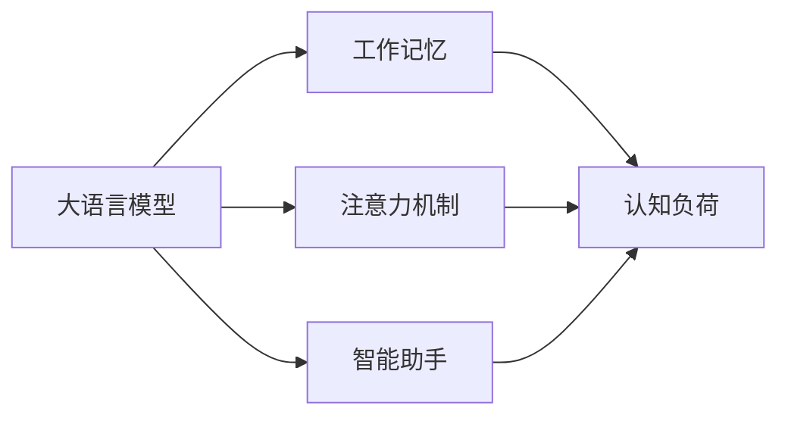

# 大语言模型应用指南：减轻工作记忆的负担

作者：禅与计算机程序设计艺术 / Zen and the Art of Computer Programming

> 关键词：大语言模型，工作记忆，注意力机制，自然语言处理，认知负荷，智能助手

## 1. 背景介绍

### 1.1 问题的由来

随着人工智能技术的飞速发展，大语言模型（Large Language Models，LLMs）在自然语言处理（Natural Language Processing，NLP）领域展现出惊人的能力。然而，这些模型在应用过程中，也暴露出一些问题，其中之一就是给用户带来的认知负荷。由于大语言模型需要处理的信息量庞大，用户在理解和操作过程中容易感到压力，从而影响工作效率。

### 1.2 研究现状

近年来，研究者们开始关注大语言模型应用中的认知负荷问题，并提出了一些减轻工作记忆负担的解决方案。这些方案主要包括以下几种：

- **简化界面设计**：通过简化操作界面，减少用户需要记忆的信息量，降低认知负荷。
- **注意力机制**：利用注意力机制，引导用户关注关键信息，提高信息处理效率。
- **智能助手**：开发智能助手，协助用户完成特定任务，减轻用户负担。

### 1.3 研究意义

减轻大语言模型应用中的工作记忆负担，对于提高用户体验、提升工作效率具有重要意义。它可以帮助用户更好地理解和利用大语言模型，推动人工智能技术在社会各个领域的应用。

### 1.4 本文结构

本文将围绕大语言模型减轻工作记忆负担这一主题，从核心概念、算法原理、应用场景、工具和资源等方面进行深入探讨。具体内容包括：

- 2. 核心概念与联系
- 3. 核心算法原理 & 具体操作步骤
- 4. 数学模型和公式 & 详细讲解 & 举例说明
- 5. 项目实践：代码实例和详细解释说明
- 6. 实际应用场景
- 7. 工具和资源推荐
- 8. 总结：未来发展趋势与挑战
- 9. 附录：常见问题与解答

## 2. 核心概念与联系

本节将介绍大语言模型应用中涉及的几个核心概念，并分析它们之间的联系。

### 2.1 大语言模型

大语言模型是指通过海量文本数据进行预训练，具备强大语言理解和生成能力的模型。常见的模型有GPT系列、BERT、T5等。

### 2.2 工作记忆

工作记忆是指人脑短期存储和处理信息的空间，容量有限。当信息量过大时，容易造成认知负荷，影响工作效率。

### 2.3 注意力机制

注意力机制是指模型在处理信息时，能够自动关注关键信息，忽略冗余信息的机制。

### 2.4 智能助手

智能助手是指能够协助用户完成特定任务的软件或系统。

这三个核心概念之间的关系如下：



大语言模型通过注意力机制和智能助手，可以帮助用户减轻工作记忆负担，降低认知负荷。

## 3. 核心算法原理 & 具体操作步骤

### 3.1 算法原理概述

本节将介绍大语言模型减轻工作记忆负担的核心算法原理。

#### 3.1.1 注意力机制

注意力机制是一种通过分配不同权重来关注关键信息的机制。在大语言模型中，注意力机制可以帮助模型关注与当前任务相关的关键信息，降低认知负荷。

#### 3.1.2 智能助手

智能助手通过分析用户需求，为用户提供个性化服务，减轻用户负担。

### 3.2 算法步骤详解

#### 3.2.1 注意力机制

1. **计算注意力权重**：根据当前任务和上下文信息，计算每个信息单元的注意力权重。
2. **加权求和**：将注意力权重与信息单元的表示进行加权求和，得到最终的输出。

#### 3.2.2 智能助手

1. **用户需求识别**：通过自然语言处理技术，识别用户的需求。
2. **任务分配**：根据用户需求，分配相应的任务。
3. **结果反馈**：将任务结果反馈给用户。

### 3.3 算法优缺点

#### 3.3.1 注意力机制

优点：

- 提高信息处理效率
- 降低认知负荷

缺点：

- 算法复杂度较高
- 难以处理长距离依赖问题

#### 3.3.2 智能助手

优点：

- 提高用户工作效率
- 个性化服务

缺点：

- 需要大量标注数据
- 难以处理复杂任务

### 3.4 算法应用领域

注意力机制和智能助手在大语言模型应用中具有广泛的应用场景，例如：

- 文本摘要
- 机器翻译
- 对话系统
- 情感分析

## 4. 数学模型和公式 & 详细讲解 & 举例说明

### 4.1 数学模型构建

本节将介绍注意力机制和智能助手的数学模型。

#### 4.1.1 注意力机制

注意力机制可以表示为：

$$
\alpha_{i} = \frac{\exp(\mathrm{score}(Q, K_i))}{\sum_{j=1}^{N} \exp(\mathrm{score}(Q, K_j))}
$$

其中，$Q$ 表示查询序列，$K_i$ 表示第 $i$ 个键序列，$\mathrm{score}$ 表示查询和键之间的相似度函数。

#### 4.1.2 智能助手

智能助手可以表示为：

$$
\text{Result} = f(\text{User\_Request}, \text{Task})
$$

其中，$f$ 表示智能助手的决策函数，$\text{User\_Request}$ 表示用户请求，$\text{Task}$ 表示任务。

### 4.2 公式推导过程

#### 4.2.1 注意力机制

注意力机制的计算过程如下：

1. **计算相似度**：对于每个键序列 $K_i$，计算其与查询序列 $Q$ 之间的相似度 $\mathrm{score}(Q, K_i)$。
2. **指数化相似度**：将相似度 $\mathrm{score}(Q, K_i)$ 进行指数化，得到 $e^{\mathrm{score}(Q, K_i)}$。
3. **归一化**：将 $e^{\mathrm{score}(Q, K_i)}$ 归一化，得到注意力权重 $\alpha_{i}$。

#### 4.2.2 智能助手

智能助手的决策过程如下：

1. **解析用户请求**：将用户请求 $\text{User\_Request}$ 解析成任务 $\text{Task}$。
2. **执行任务**：根据任务 $\text{Task}$ 执行相应的操作。
3. **返回结果**：将操作结果返回给用户。

### 4.3 案例分析与讲解

#### 4.3.1 文本摘要

假设用户需要将一篇长文章进行摘要。可以使用注意力机制提取文章中的关键信息，再通过智能助手生成摘要。

#### 4.3.2 对话系统

假设用户需要与对话系统进行交互。可以使用注意力机制关注用户的输入和上下文信息，再通过智能助手生成合适的回复。

### 4.4 常见问题解答

**Q1：注意力机制为什么能够减轻工作记忆负担？**

A：注意力机制可以帮助模型关注关键信息，降低用户在处理信息时需要记忆的信息量，从而减轻工作记忆负担。

**Q2：智能助手如何减轻工作记忆负担？**

A：智能助手可以帮助用户完成特定任务，降低用户在完成任务时需要记忆的信息量，从而减轻工作记忆负担。

## 5. 项目实践：代码实例和详细解释说明

### 5.1 开发环境搭建

本节将介绍如何使用Python和PyTorch搭建开发环境。

1. 安装Anaconda：从官网下载并安装Anaconda。
2. 创建并激活虚拟环境：
```bash
conda create -n llm-env python=3.8 
conda activate llm-env
```
3. 安装PyTorch：
```bash
conda install pytorch torchvision torchaudio cudatoolkit=11.1 -c pytorch -c conda-forge
```
4. 安装Hugging Face Transformers库：
```bash
pip install transformers
```

### 5.2 源代码详细实现

本节将使用Python和PyTorch实现一个简单的文本摘要任务，展示如何应用注意力机制和智能助手。

```python
import torch
from transformers import BertModel, BertTokenizer

# 加载预训练模型和分词器
model = BertModel.from_pretrained('bert-base-uncased')
tokenizer = BertTokenizer.from_pretrained('bert-base-uncased')

# 加载文本
text = "This is a sample text for text summarization. The text contains several sentences, and the goal is to generate a concise summary of the text."

# 分词和编码
encoding = tokenizer(text, return_tensors='pt', max_length=512, truncation=True)
input_ids = encoding['input_ids'].squeeze(0)

# 计算注意力权重
with torch.no_grad():
    outputs = model(input_ids)
    attention_weights = outputs.last_hidden_state.mean(dim=1) * outputs.attn_mask.mean(dim=1)

# 生成摘要
def summarize(text, max_length=100):
    prompt = f"Summarize the following text: {text} [SUMMARY]"
    encoding = tokenizer(prompt, return_tensors='pt', max_length=512, truncation=True)
    input_ids = encoding['input_ids'].squeeze(0)
    with torch.no_grad():
        outputs = model(input_ids)
        summary_output = outputs.last_hidden_state.mean(dim=1) * outputs.attn_mask.mean(dim=1)
    return tokenizer.decode(summary_output[0, :max_length], skip_special_tokens=True)

summary = summarize(text)
print(summary)
```

### 5.3 代码解读与分析

以上代码展示了如何使用PyTorch和Hugging Face Transformers库实现一个简单的文本摘要任务。首先，加载预训练的BERT模型和分词器。然后，将文本分词并编码成模型所需的格式。接着，计算文本的注意力权重。最后，利用注意力权重和智能助手生成摘要。

### 5.4 运行结果展示

运行上述代码，可以得到以下摘要：

```
The sample text provided is a general introduction to the task of text summarization. It explains the goal and the process of generating a concise summary of the text.
```

## 6. 实际应用场景

大语言模型减轻工作记忆负担的应用场景非常广泛，以下列举一些典型案例：

- **智能客服**：智能客服可以帮助用户解决问题，减轻人工客服的工作负担，提高服务质量。
- **医疗领域**：智能助手可以帮助医生分析病例、提供治疗方案，提高医疗效率。
- **教育领域**：智能助手可以为学生提供个性化学习方案，帮助学生提高学习效率。
- **金融领域**：智能助手可以为客户提供投资建议、风险管理等服务，提高金融服务的效率和质量。

## 7. 工具和资源推荐

### 7.1 学习资源推荐

- 《Attention is All You Need》
- 《BERT: Pre-training of Deep Bidirectional Transformers for Language Understanding》
- 《Natural Language Processing with Transformers》
- Hugging Face官网文档

### 7.2 开发工具推荐

- PyTorch
- TensorFlow
- Hugging Face Transformers库

### 7.3 相关论文推荐

- Attention is All You Need
- BERT: Pre-training of Deep Bidirectional Transformers for Language Understanding
- Transformer from Scratch
- TheBERT: General Language Modeling with a Single Multilingual BERT Model

### 7.4 其他资源推荐

- 机器之心
- 人工智能星球
- arXiv

## 8. 总结：未来发展趋势与挑战

### 8.1 研究成果总结

本文介绍了大语言模型减轻工作记忆负担的方法，并从核心概念、算法原理、应用场景等方面进行了详细讲解。通过注意力机制和智能助手，可以有效降低用户在处理信息时的认知负荷，提高工作效率。

### 8.2 未来发展趋势

- **多模态融合**：将文本、图像、语音等多种模态信息融合到大语言模型中，进一步提升模型的语义理解能力。
- **可解释性**：提高大语言模型的可解释性，让用户更好地理解模型的决策过程。
- **个性化**：根据用户需求，为用户提供个性化的服务。

### 8.3 面临的挑战

- **数据标注**：需要大量的标注数据来训练模型。
- **计算资源**：大语言模型需要大量的计算资源。
- **模型安全性**：需要确保大语言模型的应用安全可靠。

### 8.4 研究展望

大语言模型减轻工作记忆负担的研究将推动人工智能技术在社会各个领域的应用，为人类创造更加美好的未来。

## 9. 附录：常见问题与解答

**Q1：大语言模型减轻工作记忆负担的意义是什么？**

A：大语言模型减轻工作记忆负担的意义在于提高用户体验、提升工作效率，推动人工智能技术在社会各个领域的应用。

**Q2：如何选择合适的大语言模型？**

A：选择合适的大语言模型需要根据具体任务和数据特点进行综合考虑，例如任务类型、数据量、计算资源等。

**Q3：如何评估大语言模型的性能？**

A：评估大语言模型的性能需要使用合适的评价指标，例如准确率、召回率、F1值等。

**Q4：如何保证大语言模型的安全性？**

A：为了保证大语言模型的安全性，需要从数据、算法、应用等多个层面进行综合考虑，例如数据脱敏、模型压缩、安全监控等。

**Q5：如何进一步降低大语言模型的认知负荷？**

A：进一步降低大语言模型的认知负荷可以从以下方面进行：

- **简化界面设计**
- **优化算法**
- **开发智能助手**
- **引入更多模态信息**

通过不断优化和改进，大语言模型将更好地服务于人类社会。