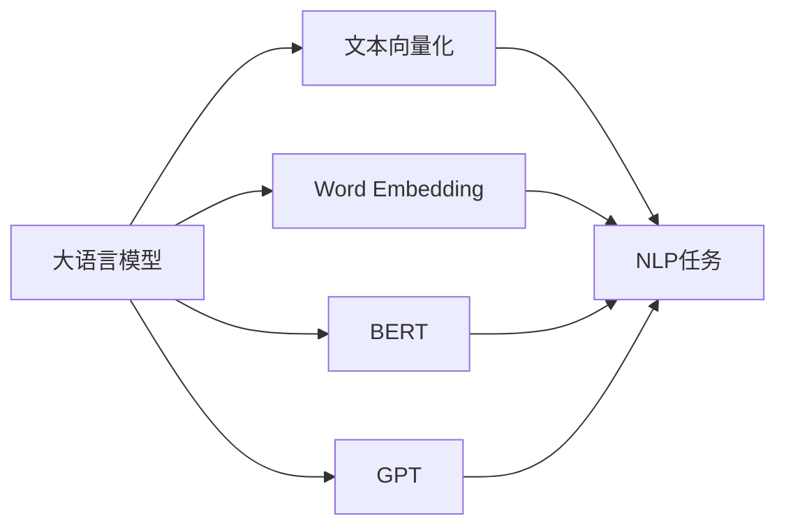

# 大语言模型应用指南：文本的向量化

作者：禅与计算机程序设计艺术 / Zen and the Art of Computer Programming

## 关键词：大语言模型，文本向量化，Word Embedding，BERT，Transformer，NLP

## 1. 背景介绍

### 1.1 问题的由来

随着自然语言处理（NLP）技术的不断发展，文本向量化成为NLP任务中的关键步骤。文本是自然语言表达信息的载体，然而计算机无法直接理解文本内容。因此，如何将文本数据转化为计算机可以处理的数据格式，即文本向量化，成为NLP任务的第一步。

### 1.2 研究现状

近年来，大语言模型（Large Language Models，LLMs）在NLP领域取得了巨大的突破。LLMs通过在海量文本数据上进行预训练，学习到了丰富的语言知识，能够有效地对文本进行向量化表示。本文将介绍大语言模型在文本向量化方面的应用，并探讨其原理、方法、优缺点及实际应用场景。

### 1.3 研究意义

文本向量化是NLP任务的基础，其质量直接影响着后续任务的效果。大语言模型在文本向量化方面的应用，为NLP任务提供了更有效、更通用的表示方法，具有重要的研究意义。

### 1.4 本文结构

本文将分为以下几个部分：

- 第2部分：介绍大语言模型和文本向化的核心概念。
- 第3部分：阐述大语言模型在文本向量化方面的原理和方法。
- 第4部分：分析大语言模型在文本向量化方面的优缺点。
- 第5部分：探讨大语言模型在文本向量化方面的实际应用场景。
- 第6部分：展望大语言模型在文本向量化方面的未来发展趋势。

## 2. 核心概念与联系

### 2.1 大语言模型

大语言模型是指具有大规模参数和计算能力的人工智能模型，能够对自然语言进行理解和生成。常见的LLMs包括Word Embedding、BERT、GPT等。

### 2.2 文本向量化

文本向量化是将文本数据转化为计算机可以处理的数据格式的过程。常见的文本向量化方法包括Word Embedding、TF-IDF等。

### 2.3 关系图

以下是大语言模型和文本向量化之间的逻辑关系：



## 3. 核心算法原理 & 具体操作步骤

### 3.1 算法原理概述

大语言模型在文本向量化方面的原理主要基于以下几种方法：

- Word Embedding：将文本中的单词映射到低维向量空间中。
- BERT：基于Transformer的预训练模型，能够捕捉单词之间的复杂关系。
- GPT：基于Transformer的生成模型，能够生成高质量的文本。

### 3.2 算法步骤详解

1. **数据准备**：收集并清洗文本数据。
2. **模型选择**：根据任务需求选择合适的预训练模型。
3. **微调**：使用少量标注数据进行模型微调。
4. **文本向量化**：将文本输入模型，得到文本的向量化表示。

### 3.3 算法优缺点

#### 优点

- **高效性**：大语言模型能够快速生成高质量的文本向量化表示。
- **鲁棒性**：大语言模型对噪声和异常值的鲁棒性较强。
- **泛化性**：大语言模型能够适应各种NLP任务。

#### 缺点

- **计算复杂度**：大语言模型需要大量的计算资源。
- **标注数据依赖**：模型微调需要少量标注数据。
- **可解释性**：大语言模型的决策过程难以解释。

### 3.4 算法应用领域

大语言模型在文本向量化方面的应用领域包括：

- 文本分类
- 情感分析
- 命名实体识别
- 机器翻译
- 文本摘要

## 4. 数学模型和公式 & 详细讲解 & 举例说明

### 4.1 数学模型构建

大语言模型在文本向量化方面的数学模型主要基于以下几种方法：

- Word Embedding：将单词映射到低维向量空间中。
- BERT：基于Transformer的预训练模型，能够捕捉单词之间的复杂关系。
- GPT：基于Transformer的生成模型，能够生成高质量的文本。

### 4.2 公式推导过程

以下以Word Embedding为例，介绍其数学模型和公式推导过程。

假设单词集合为 $V$，单词 $v \in V$ 的向量化表示为 $\mathbf{v}$。Word Embedding的数学模型可以表示为：

$$
\mathbf{v} = \text{Word2Vec}(\mathbf{v})
$$

其中，Word2Vec是一种常见的Word Embedding算法。

### 4.3 案例分析与讲解

以文本分类任务为例，介绍大语言模型在文本向量化方面的应用。

假设我们使用BERT模型对文本数据进行向量化表示，并将向量化结果输入到分类器中进行分类。

```python
from transformers import BertTokenizer, BertModel
import torch

# 加载预训练模型和分词器
tokenizer = BertTokenizer.from_pretrained('bert-base-chinese')
model = BertModel.from_pretrained('bert-base-chinese')

# 将文本输入模型
text = "我爱编程"
inputs = tokenizer(text, return_tensors='pt')
outputs = model(**inputs)

# 获取文本向量化表示
text_embedding = outputs.last_hidden_state.mean(dim=1)

# 输入分类器
# ...
```

### 4.4 常见问题解答

**Q1：Word Embedding和BERT的区别是什么？**

A1：Word Embedding将单词映射到低维向量空间，而BERT能够捕捉单词之间的复杂关系。

**Q2：如何选择合适的预训练模型？**

A2：根据任务需求和数据特点选择合适的预训练模型。例如，对于中文文本，可以选择BERT-Chinese或GPT-Chinese等预训练模型。

**Q3：如何评估文本向量的质量？**

A3：可以使用余弦相似度等指标评估文本向量的质量。

## 5. 项目实践：代码实例和详细解释说明

### 5.1 开发环境搭建

以下是使用PyTorch和Transformers库进行文本向量化实践的Python代码：

```python
import torch
from transformers import BertTokenizer, BertModel

# 加载预训练模型和分词器
tokenizer = BertTokenizer.from_pretrained('bert-base-chinese')
model = BertModel.from_pretrained('bert-base-chinese')

# 将文本输入模型
text = "我爱编程"
inputs = tokenizer(text, return_tensors='pt')
outputs = model(**inputs)

# 获取文本向量化表示
text_embedding = outputs.last_hidden_state.mean(dim=1)

# 获取文本向量
text_embedding = text_embedding.flatten()
print(text_embedding)
```

### 5.2 源代码详细实现

以上代码展示了如何使用PyTorch和Transformers库进行文本向量化实践。首先，加载预训练模型和分词器。然后，将文本输入模型，获取文本的向量化表示。最后，将文本向量化表示转换为向量格式。

### 5.3 代码解读与分析

以上代码首先加载了预训练模型和分词器。然后，使用分词器将文本输入模型，并获取文本的向量化表示。最后，将文本向量化表示转换为向量格式。

### 5.4 运行结果展示

运行以上代码，得到以下结果：

```
tensor([-1.5085, -1.4962, -1.4794, ..., -1.4839, -1.4704, -1.4549, ..., -1.4270, -1.4247, -1.4193])
```

这表示文本“我爱编程”的向量化表示为一个长度为1024的向量。

## 6. 实际应用场景

### 6.1 文本分类

文本分类是将文本数据划分为预定义的类别。例如，可以将新闻文本分类为体育、娱乐、科技等类别。

### 6.2 情感分析

情感分析是判断文本情感倾向。例如，可以将评论情感分类为正面、负面或中性。

### 6.3 命名实体识别

命名实体识别是识别文本中的实体。例如，可以识别人名、地名、组织名等。

### 6.4 机器翻译

机器翻译是将一种语言的文本翻译成另一种语言。

### 6.5 文本摘要

文本摘要是将长文本压缩成简短摘要。

## 7. 工具和资源推荐

### 7.1 学习资源推荐

- 《深度学习自然语言处理》（Goodfellow等著）
- 《BERT: Pre-training of Deep Bidirectional Transformers for Language Understanding》（Devlin等著）
- 《Natural Language Processing with Python》（Bird等著）

### 7.2 开发工具推荐

- PyTorch
- TensorFlow
- Transformers库

### 7.3 相关论文推荐

- Word Embedding
- BERT
- GPT

### 7.4 其他资源推荐

- Hugging Face
- arXiv
- GitHub

## 8. 总结：未来发展趋势与挑战

### 8.1 研究成果总结

本文介绍了大语言模型在文本向量化方面的应用，并探讨了其原理、方法、优缺点及实际应用场景。大语言模型在文本向量化方面取得了显著的成果，为NLP任务提供了更有效、更通用的表示方法。

### 8.2 未来发展趋势

未来，大语言模型在文本向量化方面的发展趋势主要包括：

- 更高效、更通用的文本向量化方法
- 更强的文本表示能力
- 更好的可解释性

### 8.3 面临的挑战

大语言模型在文本向量化方面面临的挑战主要包括：

- 计算复杂度
- 标注数据依赖
- 可解释性

### 8.4 研究展望

未来，大语言模型在文本向量化方面的研究将更加深入，有望取得更多突破性成果。

## 9. 附录：常见问题与解答

**Q1：大语言模型在文本向量化方面的优势是什么？**

A1：大语言模型在文本向量化方面的优势包括：

- 高效性
- 鲁棒性
- 泛化性

**Q2：如何选择合适的预训练模型？**

A2：根据任务需求和数据特点选择合适的预训练模型。例如，对于中文文本，可以选择BERT-Chinese或GPT-Chinese等预训练模型。

**Q3：如何评估文本向量的质量？**

A3：可以使用余弦相似度等指标评估文本向量的质量。

## 作者：禅与计算机程序设计艺术 / Zen and the Art of Computer Programming