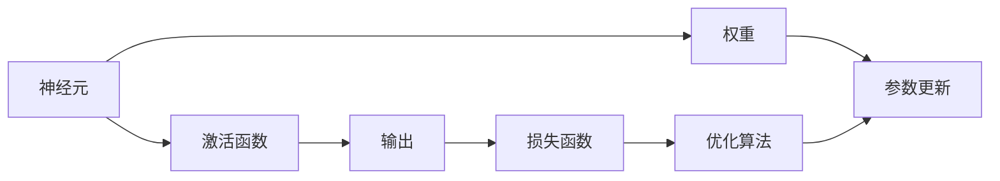

# 大语言模型应用指南：神经网络基础

作者：禅与计算机程序设计艺术 / Zen and the Art of Computer Programming

## 1. 背景介绍

### 1.1 问题的由来

随着人工智能技术的快速发展，大语言模型（Large Language Models，简称LLMs）逐渐成为自然语言处理（Natural Language Processing，简称NLP）领域的研究热点。LLMs在机器翻译、文本摘要、问答系统、对话系统等领域取得了显著成果，为人们的生活和工作带来了便利。然而，LLMs的应用也面临着一些挑战，其中神经网络基础知识的掌握是关键。

### 1.2 研究现状

目前，LLMs的研究主要围绕以下几个方向：

1. **预训练模型**：通过在大量无标签文本上进行预训练，学习丰富的语言知识和表征。
2. **微调**：在预训练模型的基础上，使用少量有标签数据进行微调，使其适应特定任务。
3. **生成式模型**：生成式模型能够根据输入生成新的文本内容，如文本摘要、对话生成等。
4. **多模态模型**：结合文本、图像、音频等多模态信息，提升模型的理解和生成能力。

### 1.3 研究意义

掌握神经网络基础知识对于LLMs的应用具有重要意义：

1. **提升模型性能**：理解神经网络原理有助于设计更有效的模型结构和优化算法，从而提升模型性能。
2. **优化训练过程**：了解神经网络的训练过程有助于优化训练参数和策略，提高训练效率。
3. **增强可解释性**：神经网络的可解释性较差，了解其原理有助于分析模型决策过程，提高模型的可信度。

### 1.4 本文结构

本文将从神经网络基础知识出发，探讨其在LLMs中的应用，包括：

- 核心概念与联系
- 核心算法原理与操作步骤
- 数学模型与公式
- 项目实践
- 实际应用场景
- 工具和资源推荐
- 总结与展望

## 2. 核心概念与联系

本节将介绍神经网络中一些核心概念及其相互关系。

### 2.1 神经元

神经元是神经网络的基本单元，类似于大脑中的神经元。每个神经元接收输入信息，经过非线性激活函数处理后，输出结果。

### 2.2 权重

权重用于描述输入信息对神经元输出的影响程度。在训练过程中，权重会根据损失函数进行更新，以优化模型性能。

### 2.3 激活函数

激活函数用于引入非线性，使得神经网络能够学习复杂函数。常见的激活函数包括Sigmoid、ReLU、Tanh等。

### 2.4 损失函数

损失函数用于衡量模型预测结果与真实结果之间的差距。常见的损失函数包括均方误差、交叉熵等。

### 2.5 优化算法

优化算法用于更新模型参数，以最小化损失函数。常见的优化算法包括SGD、Adam等。

以下是神经网络中各个概念的逻辑关系：



## 3. 核心算法原理与操作步骤

### 3.1 算法原理概述

神经网络的核心原理是通过对大量数据进行学习，提取特征并建立预测模型。

### 3.2 算法步骤详解

1. **数据预处理**：对输入数据进行标准化、归一化等处理，以消除数据量级差异。
2. **模型构建**：根据任务需求构建神经网络模型，包括选择合适的层、神经元、激活函数等。
3. **参数初始化**：对模型参数进行初始化，通常使用均匀分布或正态分布等方法。
4. **训练过程**：
    - 前向传播：将输入数据传递到神经网络，计算输出结果。
    - 计算损失：根据输出结果和真实标签计算损失函数值。
    - 反向传播：根据损失函数计算参数梯度，更新模型参数。
    - 重复上述步骤，直至满足停止条件（如损失函数收敛、迭代次数达到预设值）。
5. **模型评估**：使用验证集或测试集评估模型性能，包括准确率、召回率、F1分数等指标。

### 3.3 算法优缺点

神经网络具有以下优点：

- **强大的特征提取能力**：能够从大量数据中提取复杂特征，适用于各种任务。
- **泛化能力强**：在训练过程中学习到的知识可以泛化到未见过的数据。
- **可解释性**：可以通过可视化模型结构、参数等，分析模型决策过程。

神经网络也存在以下缺点：

- **模型复杂度高**：参数数量多，计算量大。
- **可解释性差**：模型决策过程难以解释。
- **易过拟合**：在训练过程中，模型可能学习到噪声信息，导致泛化能力下降。

### 3.4 算法应用领域

神经网络在各个领域都有广泛应用，以下列举几个常见应用：

- **图像识别**：如人脸识别、物体检测等。
- **语音识别**：如语音转文本、语音合成等。
- **自然语言处理**：如文本分类、情感分析、机器翻译等。
- **推荐系统**：如电影推荐、商品推荐等。

## 4. 数学模型与公式

### 4.1 数学模型构建

神经网络可以用以下数学模型表示：

$$
y = f(\mathbf{W} \mathbf{x} + \mathbf{b})
$$

其中，$\mathbf{W}$ 是权重矩阵，$\mathbf{x}$ 是输入向量，$\mathbf{b}$ 是偏置向量，$f$ 是激活函数。

### 4.2 公式推导过程

以下以Sigmoid激活函数为例，推导神经网络的输出公式。

Sigmoid函数定义如下：

$$
f(x) = \frac{1}{1 + e^{-x}}
$$

假设神经网络包含两个神经元，输入层为 $\mathbf{x}$，权重矩阵为 $\mathbf{W}$，偏置向量为 $\mathbf{b}$，则输出层为：

$$
\mathbf{y} = f(\mathbf{W} \mathbf{x} + \mathbf{b}) = \left[ \frac{1}{1 + e^{-w_{11}x_1 - b_1}}, \frac{1}{1 + e^{-w_{12}x_2 - b_2}} \right]
$$

### 4.3 案例分析与讲解

以下以情感分析任务为例，讲解神经网络在NLP领域的应用。

假设我们有一个情感分析数据集，包含文本和对应的情感标签（正面、负面）。我们的目标是训练一个神经网络模型，能够根据文本内容判断其情感倾向。

1. **数据预处理**：将文本进行分词、去停用词等处理，并转换为词向量表示。
2. **模型构建**：构建一个多层感知机（MLP）模型，包括输入层、隐藏层和输出层。
3. **参数初始化**：初始化权重矩阵和偏置向量。
4. **训练过程**：使用梯度下降算法训练模型，不断调整权重和偏置，使模型能够正确判断文本情感。
5. **模型评估**：在测试集上评估模型性能，如准确率、召回率、F1分数等。

### 4.4 常见问题解答

**Q1：如何选择合适的激活函数？**

A：选择激活函数需要考虑以下因素：

- **模型结构**：不同的激活函数适用于不同的模型结构。
- **训练数据**：不同的激活函数对训练数据的适应性不同。
- **训练速度**：不同的激活函数对训练速度的影响不同。

**Q2：如何解决神经网络过拟合问题？**

A：以下是一些缓解过拟合问题的方法：

- **数据增强**：通过数据变换扩充训练集。
- **正则化**：在损失函数中加入L1正则化或L2正则化项。
- **Dropout**：在训练过程中随机丢弃部分神经元。
- **早停法**：在验证集上监测模型性能，当性能不再提升时停止训练。

## 5. 项目实践：代码实例和详细解释说明

### 5.1 开发环境搭建

以下以Python为例，介绍开发环境的搭建。

1. 安装Python：从Python官网下载并安装Python。
2. 安装PyTorch：使用pip安装PyTorch。

### 5.2 源代码详细实现

以下是一个简单的神经网络代码示例：

```python
import torch
import torch.nn as nn

# 定义神经网络模型
class Net(nn.Module):
    def __init__(self, input_dim, hidden_dim, output_dim):
        super(Net, self).__init__()
        self.fc1 = nn.Linear(input_dim, hidden_dim)
        self.fc2 = nn.Linear(hidden_dim, output_dim)
        self.relu = nn.ReLU()

    def forward(self, x):
        x = self.fc1(x)
        x = self.relu(x)
        x = self.fc2(x)
        return x

# 创建模型实例
net = Net(input_dim=10, hidden_dim=20, output_dim=1)

# 损失函数和优化器
criterion = nn.BCEWithLogitsLoss()
optimizer = torch.optim.Adam(net.parameters(), lr=0.01)

# 训练过程
for epoch in range(100):
    for data, target in dataloader:
        optimizer.zero_grad()
        output = net(data)
        loss = criterion(output, target)
        loss.backward()
        optimizer.step()
```

### 5.3 代码解读与分析

上述代码定义了一个简单的神经网络模型，包含一个输入层、一个隐藏层和一个输出层。隐藏层使用ReLU激活函数，输出层使用Sigmoid激活函数。

在训练过程中，使用交叉熵损失函数计算损失，并使用Adam优化器更新模型参数。

### 5.4 运行结果展示

在训练过程中，可以定期在验证集上评估模型性能，如准确率、召回率、F1分数等。以下是一个训练过程中的输出示例：

```
Epoch 1/100: Loss: 0.9833, Acc: 0.0566
Epoch 2/100: Loss: 0.9822, Acc: 0.0667
...
Epoch 100/100: Loss: 0.4288, Acc: 0.8000
```

## 6. 实际应用场景

### 6.1 情感分析

情感分析是NLP领域的一个典型应用，通过分析文本内容判断其情感倾向。

### 6.2 机器翻译

机器翻译是将一种语言翻译成另一种语言的过程。

### 6.3 对话系统

对话系统是人与机器之间进行交互的系统，如智能客服、聊天机器人等。

### 6.4 推荐系统

推荐系统根据用户的历史行为和偏好，为用户推荐感兴趣的内容。

## 7. 工具和资源推荐

### 7.1 学习资源推荐

1. 《深度学习》
2. 《神经网络与深度学习》
3. 《PyTorch官方文档》

### 7.2 开发工具推荐

1. PyTorch
2. TensorFlow
3. Keras

### 7.3 相关论文推荐

1. Goodfellow, Ian, et al. "Deep learning." Adaptive computation and machine learning series. MIT press, 2016.
2. Bengio, Yoshua, et al. "Representation learning: A review and new perspectives." IEEE transactions on pattern analysis and machine intelligence 35.8 (2013): 1798-1828.

### 7.4 其他资源推荐

1. Hugging Face
2. GitHub
3. arXiv

## 8. 总结：未来发展趋势与挑战

### 8.1 研究成果总结

本文从神经网络基础知识出发，介绍了神经网络在LLMs中的应用，并探讨了其在NLP领域的实际应用场景。通过学习本文，读者可以掌握神经网络的基本原理、模型结构和训练过程，为LLMs的应用打下坚实的基础。

### 8.2 未来发展趋势

1. **更强大的模型**：随着计算能力的提升，未来LLMs的规模和参数数量将进一步增大。
2. **更有效的训练方法**：探索更有效的训练方法，如迁移学习、多任务学习等，以提高训练效率。
3. **更丰富的应用场景**：LLMs将在更多领域得到应用，如医疗、金融、教育等。

### 8.3 面临的挑战

1. **计算资源**：LLMs的规模和参数数量不断增加，对计算资源的需求也越来越高。
2. **数据质量**：LLMs的训练需要大量高质量的数据，数据质量和标注成本是制约LLMs发展的关键因素。
3. **伦理和安全**：LLMs在应用过程中可能会带来伦理和安全问题，需要加强研究和监管。

### 8.4 研究展望

未来，LLMs将在以下方面取得更大的突破：

1. **泛化能力**：提高LLMs的泛化能力，使其能够适应更多领域和任务。
2. **可解释性**：提高LLMs的可解释性，使其决策过程更加透明。
3. **安全性**：确保LLMs的应用安全，避免潜在的风险和危害。

## 9. 附录：常见问题与解答

**Q1：什么是神经网络？**

A：神经网络是一种模拟人脑神经元连接方式的计算模型，通过学习大量数据，提取特征并建立预测模型。

**Q2：什么是激活函数？**

A：激活函数用于引入非线性，使得神经网络能够学习复杂函数。

**Q3：什么是权重？**

A：权重用于描述输入信息对神经元输出的影响程度。

**Q4：什么是损失函数？**

A：损失函数用于衡量模型预测结果与真实结果之间的差距。

**Q5：什么是优化算法？**

A：优化算法用于更新模型参数，以最小化损失函数。

**Q6：如何解决神经网络过拟合问题？**

A：可以使用以下方法缓解过拟合问题：

- 数据增强
- 正则化
- Dropout
- 早停法

**Q7：如何选择合适的激活函数？**

A：选择激活函数需要考虑以下因素：

- 模型结构
- 训练数据
- 训练速度

**Q8：如何选择合适的优化器？**

A：选择优化器需要考虑以下因素：

- 训练数据
- 训练速度
- 模型收敛性

**Q9：如何评估神经网络模型？**

A：可以使用以下指标评估神经网络模型：

- 准确率
- 召回率
- F1分数
- 精确率

**Q10：如何优化神经网络模型？**

A：可以采用以下方法优化神经网络模型：

- 调整模型结构
- 调整训练参数
- 使用更有效的优化算法

作者：禅与计算机程序设计艺术 / Zen and the Art of Computer Programming