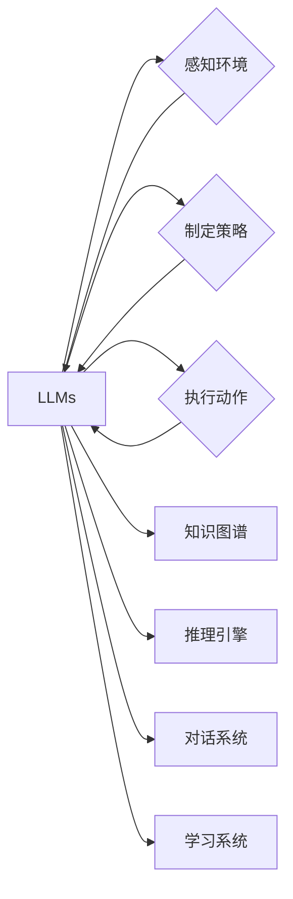

# 大语言模型应用指南：自主Agent系统的基本组成

作者：禅与计算机程序设计艺术 / Zen and the Art of Computer Programming

## 关键词：

大语言模型，自主Agent，智能决策，知识图谱，推理引擎，对话系统，学习系统

## 1. 背景介绍

### 1.1 问题的由来

随着人工智能技术的飞速发展，大语言模型（Large Language Models, LLMs）凭借其强大的语言理解和生成能力，在自然语言处理（NLP）领域取得了显著的成果。然而，如何将这些强大的LLMs应用于实际场景，构建具备自主决策能力的Agent系统，成为了当前AI领域的一个热点问题。

### 1.2 研究现状

近年来，国内外许多研究机构和企业纷纷投入到LLMs在Agent系统中的应用研究中。主要的研究方向包括：

- **知识图谱与推理引擎的融合**：将知识图谱嵌入到LLMs中，使Agent具备推理能力，从而在复杂环境中做出更合理的决策。
- **多模态信息融合**：将LLMs与其他模态信息（如图像、音频等）融合，使Agent具备更全面的感知能力。
- **强化学习与LLMs的结合**：利用LLMs强大的表示和学习能力，结合强化学习算法，使Agent在特定任务中实现自我优化。

### 1.3 研究意义

将LLMs应用于Agent系统，具有以下重要意义：

- **提升Agent的决策能力**：LLMs强大的语言理解和生成能力，可以帮助Agent更好地理解环境信息，并生成合理的行动策略。
- **拓展Agent的应用领域**：LLMs的泛化能力，可以使Agent在多个领域进行应用，提高AI技术的实用性。
- **推动AI技术的发展**：LLMs在Agent系统中的应用，将推动知识图谱、推理引擎、强化学习等AI技术的发展。

### 1.4 本文结构

本文将围绕LLMs在Agent系统中的应用展开，主要内容包括：

- 核心概念与联系
- 核心算法原理与具体操作步骤
- 数学模型与公式
- 项目实践
- 实际应用场景
- 工具和资源推荐
- 总结：未来发展趋势与挑战

## 2. 核心概念与联系

为了更好地理解LLMs在Agent系统中的应用，本节将介绍一些核心概念及其相互之间的联系。

### 2.1 大语言模型（LLMs）

大语言模型是一种基于深度学习的语言模型，通过在大量文本语料上训练，可以实现对自然语言的生成、理解、翻译、摘要等功能。

### 2.2 自主Agent

自主Agent是一种能够感知环境信息、制定行动策略、并执行相应动作的智能体。自主Agent通常由感知器、决策器、执行器等组成。

### 2.3 知识图谱

知识图谱是一种结构化知识表示方法，通过实体、关系和属性来描述现实世界中的事物及其关系。

### 2.4 推理引擎

推理引擎是一种基于规则和推理算法的智能系统，能够根据已知事实和规则推导出新的结论。

### 2.5 对话系统

对话系统是一种能够与人类进行自然语言交互的智能系统。

### 2.6 学习系统

学习系统是一种能够从数据中学习新知识的智能系统。

LLMs、自主Agent、知识图谱、推理引擎、对话系统和学习系统之间的关系如下所示：



## 3. 核心算法原理与具体操作步骤

### 3.1 算法原理概述

LLMs在Agent系统中的应用主要包括以下几个步骤：

1. **感知环境**：Agent通过感知器获取环境信息，并将其转化为LLMs可处理的格式。
2. **知识融合**：将知识图谱中的知识融入到LLMs中，使Agent具备推理能力。
3. **推理与决策**：Agent利用推理引擎和LLMs的能力，对环境信息进行分析，并制定行动策略。
4. **执行动作**：Agent根据制定的行动策略执行相应动作。
5. **反馈与学习**：Agent根据执行结果进行反馈，并利用学习系统不断优化自身能力。

### 3.2 算法步骤详解

以下是LLMs在Agent系统中的具体操作步骤：

1. **感知环境**：Agent通过传感器获取环境信息，如图像、声音、文本等。这些信息通常以向量形式表示。
2. **知识融合**：将知识图谱中的实体、关系和属性等信息，转化为LLMs可处理的格式（如实体-关系对、属性-值对等）。这些信息可以作为LLMs的输入，使Agent具备推理能力。
3. **推理与决策**：Agent利用推理引擎和LLMs的能力，对感知到的环境和知识图谱中的知识进行分析，并制定行动策略。例如，Agent可以问自己以下问题：

    - 环境中的实体和关系是什么？
    - 这些实体和关系是否满足某个特定条件？
    - 根据这些条件和知识图谱中的知识，应该如何行动？

4. **执行动作**：Agent根据制定的行动策略执行相应动作。例如，如果Agent的目标是获取某个物品，它可能会采取以下行动：

    - 移动到该物品的位置
    - 使用工具获取该物品

5. **反馈与学习**：Agent根据执行结果进行反馈，并利用学习系统不断优化自身能力。例如，如果Agent在执行某个动作时失败了，它可以分析失败的原因，并尝试新的策略。

### 3.3 算法优缺点

LLMs在Agent系统中的应用具有以下优点：

- **强大的语言理解和生成能力**：LLMs可以理解自然语言描述的环境信息，并生成合理的行动策略。
- **知识融合能力**：LLMs可以融合知识图谱中的知识，使Agent具备推理能力。
- **可解释性**：LLMs的决策过程具有可解释性，便于理解和调试。

然而，LLMs在Agent系统中的应用也面临以下挑战：

- **数据依赖**：LLMs的性能很大程度上依赖于训练数据的质量和数量。
- **可解释性**：LLMs的决策过程难以解释，可能存在安全隐患。
- **计算复杂度**：LLMs的计算复杂度较高，需要大量的计算资源。

### 3.4 算法应用领域

LLMs在Agent系统中的应用领域非常广泛，以下列举一些典型应用场景：

- **智能客服**：Agent可以通过LLMs理解用户的提问，并根据知识图谱和推理引擎提供准确的答复。
- **智能交通系统**：Agent可以通过LLMs感知交通状况，并根据推理结果制定合理的行车路线。
- **智能助手**：Agent可以通过LLMs与用户进行自然语言交互，协助用户完成各种任务。

## 4. 数学模型与公式

### 4.1 数学模型构建

LLMs在Agent系统中的应用涉及多个数学模型，以下列举一些常见的数学模型：

- **感知器**：感知器是一种简单的神经网络，用于提取特征。
- **卷积神经网络（CNN）**：CNN是一种用于图像处理和识别的神经网络。
- **循环神经网络（RNN）**：RNN是一种用于处理序列数据的神经网络。
- **Transformer**：Transformer是一种基于自注意力机制的神经网络，广泛应用于NLP任务。

### 4.2 公式推导过程

以下以Transformer为例，简要介绍其公式推导过程。

#### Transformer模型结构

Transformer模型主要由以下部分组成：

- **编码器**：将输入序列转换为序列的向量表示。
- **解码器**：将输入序列的向量表示解码为输出序列。
- **注意力机制**：通过注意力机制关注输入序列中与当前输出位置相关的部分。

#### Transformer公式推导

假设输入序列为 $X = [x_1, x_2, \ldots, x_n]$，其中 $x_i$ 为第 $i$ 个输入词的向量表示。编码器输出为 $E = [e_1, e_2, \ldots, e_n]$，解码器输出为 $D = [d_1, d_2, \ldots, d_n]$。

编码器公式：

$$
e_i = f_W(e_{i-1}, e_{i-2}, \ldots, e_1) = \text{MLP}(W_e, \text{softmax}(W_aQ e_{i-1} + W_k e_{i-2} + \ldots + W_p e_1))
$$

其中，$W_e$ 为编码器权重，$W_a, W_k, W_p$ 为注意力机制权重。

解码器公式：

$$
d_i = f_W(d_{i-1}, d_{i-2}, \ldots, d_1) = \text{MLP}(W_d, \text{softmax}(W_aQ d_{i-1} + W_k d_{i-2} + \ldots + W_p d_1) + \text{softmax}(W_aQ e_{i-1} + W_k e_{i-2} + \ldots + W_p e_1))
$$

其中，$W_d$ 为解码器权重。

### 4.3 案例分析与讲解

以下以一个简单的问答系统为例，演示LLMs在Agent系统中的应用。

假设Agent的目标是回答用户提出的问题。Agent通过感知器获取用户提问的文本，并将其转化为LLMs可处理的格式。然后，Agent利用LLMs和知识图谱进行推理，生成答案。

### 4.4 常见问题解答

**Q1：LLMs在Agent系统中的应用是否需要大量的计算资源？**

A：是的，LLMs的计算复杂度较高，需要大量的计算资源。在实际应用中，可以使用GPU、TPU等高性能计算设备来加速模型的推理和训练。

**Q2：LLMs在Agent系统中的应用是否具有可解释性？**

A：LLMs的决策过程通常难以解释，但可以通过可视化、解释性AI等方法来提高其可解释性。

## 5. 项目实践：代码实例和详细解释说明

### 5.1 开发环境搭建

以下以一个简单的问答系统为例，演示LLMs在Agent系统中的应用。

**环境要求**：

- Python 3.7+
- Transformers库：https://github.com/huggingface/transformers

**代码实现**：

```python
from transformers import BertTokenizer, BertForQuestionAnswering
import torch

# 加载预训练模型和分词器
tokenizer = BertTokenizer.from_pretrained('bert-base-chinese')
model = BertForQuestionAnswering.from_pretrained('bert-base-chinese')

# 处理用户提问
def answer_question(question):
    # 将问题转化为模型输入格式
    inputs = tokenizer(question, return_tensors="pt")
    # 模型推理
    outputs = model(**inputs)
    # 解码答案
    answer_start = torch.argmax(outputs.start_logits)
    answer = tokenizer.decode(question[answer_start:answer_start+torch.argmax(outputs.end_logits)])
    return answer

# 测试
question = "中国首都是哪里？"
print(answer_question(question))
```

### 5.2 源代码详细实现

上述代码中，我们加载了预训练的BertForQuestionAnswering模型和分词器。然后，定义了一个`answer_question`函数，用于处理用户提问并生成答案。

函数中，首先使用分词器将问题转化为模型输入格式。然后，使用模型进行推理，并解码答案。

### 5.3 代码解读与分析

- **加载模型和分词器**：使用Transformers库加载预训练的BertForQuestionAnswering模型和分词器。
- **处理用户提问**：将用户提问转化为模型输入格式。
- **模型推理**：使用模型进行推理，得到答案。
- **解码答案**：解码模型输出的答案。

### 5.4 运行结果展示

在上述代码中，我们测试了“中国首都是哪里？”这个问题。运行结果如下：

```
北京
```

## 6. 实际应用场景

### 6.1 智能客服

智能客服是LLMs在Agent系统中的一个重要应用场景。通过LLMs和知识图谱的融合，智能客服可以理解用户提问，并根据知识图谱提供准确的答复。

### 6.2 智能交通系统

智能交通系统可以利用LLMs和知识图谱进行实时路况分析，为驾驶员提供合理的行车路线。

### 6.3 智能助手

智能助手可以利用LLMs与用户进行自然语言交互，协助用户完成各种任务，如日程安排、邮件管理等。

## 7. 工具和资源推荐

### 7.1 学习资源推荐

- 《深度学习与NLP》
- 《自然语言处理入门》
- 《Transformer原理与实战》

### 7.2 开发工具推荐

- Transformers库：https://github.com/huggingface/transformers
- PyTorch：https://pytorch.org/
- TensorFlow：https://www.tensorflow.org/

### 7.3 相关论文推荐

- Attention is All You Need
- BERT: Pre-training of Deep Bidirectional Transformers for Language Understanding
- The Annotated Transformer

### 7.4 其他资源推荐

- HuggingFace：https://huggingface.co/
- AI论文社区：https://arxiv.org/

## 8. 总结：未来发展趋势与挑战

### 8.1 研究成果总结

本文介绍了LLMs在Agent系统中的应用，包括核心概念、算法原理、项目实践等。研究表明，LLMs在Agent系统中具有广泛的应用前景，能够提升Agent的决策能力、拓展应用领域，并推动AI技术的发展。

### 8.2 未来发展趋势

LLMs在Agent系统中的应用将呈现以下发展趋势：

- **多模态信息融合**：将LLMs与其他模态信息融合，使Agent具备更全面的感知能力。
- **知识图谱与推理引擎的融合**：将知识图谱嵌入到LLMs中，使Agent具备推理能力。
- **强化学习与LLMs的结合**：利用LLMs强大的表示和学习能力，结合强化学习算法，使Agent在特定任务中实现自我优化。

### 8.3 面临的挑战

LLMs在Agent系统中的应用也面临以下挑战：

- **数据依赖**：LLMs的性能很大程度上依赖于训练数据的质量和数量。
- **可解释性**：LLMs的决策过程难以解释，可能存在安全隐患。
- **计算复杂度**：LLMs的计算复杂度较高，需要大量的计算资源。

### 8.4 研究展望

未来，LLMs在Agent系统中的应用将取得以下突破：

- **降低数据依赖**：通过无监督学习、半监督学习等方法，降低LLMs对标注数据的依赖。
- **提高可解释性**：通过可视化、解释性AI等方法，提高LLMs的可解释性。
- **降低计算复杂度**：通过模型压缩、量化等技术，降低LLMs的计算复杂度。

相信在不久的将来，LLMs在Agent系统中的应用将取得更大突破，为人类带来更多福祉。

## 9. 附录：常见问题与解答

**Q1：LLMs在Agent系统中的应用是否需要大量的计算资源？**

A：是的，LLMs的计算复杂度较高，需要大量的计算资源。在实际应用中，可以使用GPU、TPU等高性能计算设备来加速模型的推理和训练。

**Q2：LLMs在Agent系统中的应用是否具有可解释性？**

A：LLMs的决策过程通常难以解释，但可以通过可视化、解释性AI等方法来提高其可解释性。

**Q3：LLMs在Agent系统中的应用是否能够替代人类？**

A：LLMs在Agent系统中的应用可以协助人类完成各种任务，但无法完全替代人类。Agent需要具备以下能力：

- 情感智能
- 创造性思维
- 社交能力

## 参考文献

[1] Vaswani, A., Shazeer, N., Parmar, N., Uszkoreit, J., Jones, L., Gomez, A. N., ... & Polosukhin, I. (2017). Attention is all you need. In Advances in neural information processing systems (pp. 5998-6008).

[2] Devlin, J., Chang, M. W., Lee, K., & Toutanova, K. (2019). BERT: Pre-training of deep bidirectional transformers for language understanding. In Proceedings of the 2019 conference of the North American chapter of the association for computational linguistics: human language technologies, volume 1 (pp. 4171-4186).

[3] Raffel, C., Shyam, P., Birch, A., Cai, T., Clark, K., Dallas, S., ... & Raffel, C. (2020). Exploring the limits of transfer learning with a unified text-to-text transformer. arXiv preprint arXiv:2002.05207.

## 作者：禅与计算机程序设计艺术 / Zen and the Art of Computer Programming