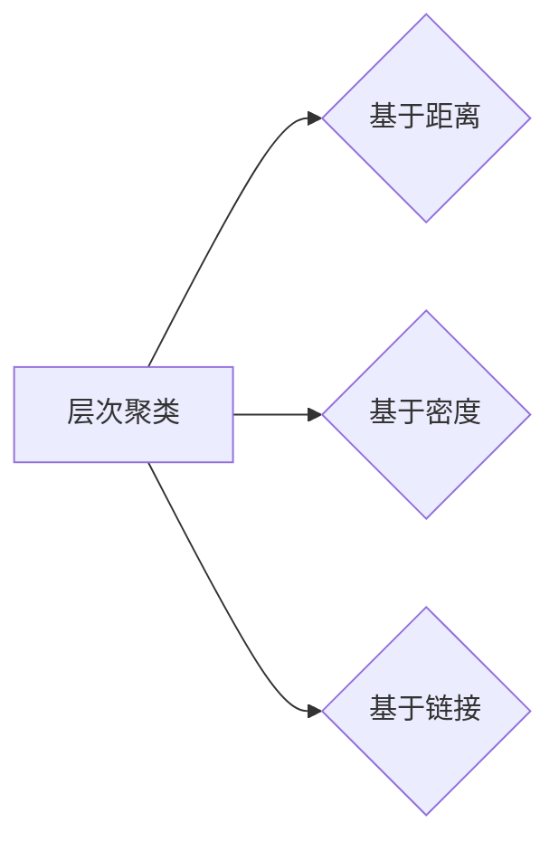

# 层次聚类(Hierarchical Clustering) - 原理与代码实例讲解

作者：禅与计算机程序设计艺术 / Zen and the Art of Computer Programming

## 1. 背景介绍
### 1.1 问题的由来

聚类是一种无监督学习技术，旨在将一组数据根据其相似性或距离进行分组，使得同一组内的数据尽可能相似，不同组之间的数据尽可能不同。层次聚类（Hierarchical Clustering）是聚类算法中的一种，它通过将数据点逐步合并形成树状结构（称为聚类树或谱系树）来对数据进行分类。

层次聚类方法起源于20世纪50年代，它不需要事先指定簇的数量，可以根据数据的特点自动确定簇的数量和结构。由于其简单易用，层次聚类在数据挖掘、模式识别、图像处理等领域有着广泛的应用。

### 1.2 研究现状

随着机器学习技术的发展，层次聚类算法也在不断进化。目前，层次聚类算法主要分为两大类：自底向上的层次聚类（凝聚聚类）和自顶向下的层次聚类（分裂聚类）。凝聚聚类从单个数据点开始，逐步合并相似的数据点，直至形成一个单一的簇；分裂聚类则相反，从一个大的簇开始，逐步分裂成更小的簇。

### 1.3 研究意义

层次聚类技术在以下方面具有重要意义：

- **数据探索**：层次聚类可以帮助我们探索数据的内在结构，发现数据中的潜在模式。
- **特征选择**：层次聚类可以帮助我们识别数据中重要的特征，从而进行特征选择。
- **异常检测**：层次聚类可以帮助我们识别数据中的异常值。
- **降维**：层次聚类可以将高维数据投影到低维空间，从而降低数据的维度。

### 1.4 本文结构

本文将首先介绍层次聚类的核心概念，然后详细讲解层次聚类的算法原理和具体操作步骤，并给出代码实例和实际应用场景。最后，本文将总结层次聚类的未来发展趋势与挑战。

## 2. 核心概念与联系

层次聚类涉及到以下几个核心概念：

- **数据点**：数据集中的每个元素称为一个数据点。
- **距离**：用于衡量数据点之间相似性的度量方法。常用的距离度量方法包括欧几里得距离、曼哈顿距离、余弦距离等。
- **相似系数**：用于衡量数据点之间相似性的统计指标。常用的相似系数包括相关系数、Jaccard相似系数等。
- **聚类树**：层次聚类算法生成的树状结构，用于表示数据点的层次关系。
- **簇**：由一组相似的数据点组成的集合。

层次聚类与其他聚类算法的关系如下：



## 3. 核心算法原理 & 具体操作步骤
### 3.1 算法原理概述

层次聚类算法主要分为两种：凝聚聚类和分裂聚类。

- **凝聚聚类**：从每个数据点开始，逐步合并相似的数据点，直至形成一个单一的簇。
- **分裂聚类**：从一个大的簇开始，逐步分裂成更小的簇。

层次聚类算法通常包含以下步骤：

1. **初始化**：将每个数据点作为一个簇。
2. **计算距离**：计算所有簇之间的距离。
3. **合并或分裂**：根据预定的策略（如最小距离法、最大距离法等）合并或分裂簇。
4. **重复步骤2和3**：直至达到终止条件（如只剩下一个簇）。

### 3.2 算法步骤详解

下面以凝聚聚类为例，详细介绍层次聚类算法的步骤。

1. **初始化**：将每个数据点作为一个簇。
   
   ```mermaid
   graph LR
   A[数据点1] --> C{簇C}
   B[数据点2] --> C{簇C}
   C[数据点3] --> C{簇C}
   ```

2. **计算距离**：计算所有簇之间的距离。

   假设有两个簇 $C_1$ 和 $C_2$，它们之间的距离可以表示为：

   $$d(C_1, C_2) = \min_{c_i \in C_1, c_j \in C_2} d(c_i, c_j)$$

   其中 $d(c_i, c_j)$ 表示数据点 $c_i$ 和 $c_j$ 之间的距离。

3. **合并或分裂**：根据预定的策略合并或分裂簇。

   常用的合并策略包括：

   - **最小距离法**：将距离最近的两个簇合并。
   - **最大距离法**：将距离最远的两个簇合并。
   - **平均距离法**：将所有数据点之间的距离的平均值作为合并依据。

   以最小距离法为例，我们将距离最近的两个簇 $C_1$ 和 $C_2$ 合并为一个新的簇 $C_3$。

   ```mermaid
   graph LR
   A[数据点1] --> C{簇C}
   B[数据点2] --> C{簇C}
   C[数据点3] --> C{簇C}
   C1[簇C1] --> D{簇C3}
   C2[簇C2] --> D{簇C3}
   ```

4. **重复步骤2和3**：直至达到终止条件（如只剩下一个簇）。

   ```mermaid
   graph LR
   A[数据点1] --> C{簇C}
   B[数据点2] --> C{簇C}
   C[数据点3] --> C{簇C}
   C1[簇C1] --> D{簇C}
   C2[簇C2] --> D{簇C}
   ```

### 3.3 算法优缺点

层次聚类算法的优点：

- **不需要事先指定簇的数量**。
- **可以展示数据点的层次关系**。
- **可以用于数据探索和特征选择**。

层次聚类算法的缺点：

- **计算复杂度高**。
- **对于噪声数据敏感**。
- **难以处理大规模数据集**。

### 3.4 算法应用领域

层次聚类算法在以下领域有着广泛的应用：

- **数据挖掘**：用于发现数据中的潜在模式，进行异常检测和聚类分析。
- **图像处理**：用于图像分割、目标检测等任务。
- **生物信息学**：用于基因数据分析、蛋白质结构预测等任务。
- **社交网络分析**：用于发现社交网络中的社区结构。

## 4. 数学模型和公式 & 详细讲解 & 举例说明
### 4.1 数学模型构建

层次聚类算法的数学模型主要包括以下内容：

- **距离度量**：用于衡量数据点之间相似性的度量方法。常用的距离度量方法包括欧几里得距离、曼哈顿距离、余弦距离等。

  - **欧几里得距离**：

    $$d(x,y) = \sqrt{\sum_{i=1}^n (x_i - y_i)^2}$$

  - **曼哈顿距离**：

    $$d(x,y) = \sum_{i=1}^n |x_i - y_i|$$

  - **余弦距离**：

    $$d(x,y) = 1 - \cos(\theta) = 2\sin^2(\frac{\theta}{2})$$

- **相似系数**：用于衡量数据点之间相似性的统计指标。常用的相似系数包括相关系数、Jaccard相似系数等。

  - **相关系数**：

    $$r(x,y) = \frac{\sum_{i=1}^n (x_i - \bar{x})(y_i - \bar{y})}{\sqrt{\sum_{i=1}^n (x_i - \bar{x})^2}\sqrt{\sum_{i=1}^n (y_i - \bar{y})^2}}$$

  - **Jaccard相似系数**：

    $$J(x,y) = \frac{|X \cap Y|}{|X \cup Y|}$$

### 4.2 公式推导过程

以下以欧几里得距离为例，介绍距离度量的推导过程。

假设有两个数据点 $x = (x_1, x_2, ..., x_n)$ 和 $y = (y_1, y_2, ..., y_n)$，它们之间的欧几里得距离可以表示为：

$$d(x,y) = \sqrt{\sum_{i=1}^n (x_i - y_i)^2}$$

推导过程如下：

$$
\begin{aligned}
d(x,y)^2 &= \sum_{i=1}^n (x_i - y_i)^2 \\
&= \sum_{i=1}^n (x_i^2 - 2x_iy_i + y_i^2) \\
&= \sum_{i=1}^n x_i^2 - 2\sum_{i=1}^n x_iy_i + \sum_{i=1}^n y_i^2 \\
&= \sum_{i=1}^n x_i^2 + \sum_{i=1}^n y_i^2 - 2\sum_{i=1}^n x_iy_i \\
&= \sum_{i=1}^n x_i^2 + \sum_{i=1}^n y_i^2 - 2\sum_{i=1}^n x_iy_i \\
&= \sum_{i=1}^n x_i^2 + \sum_{i=1}^n y_i^2 - 2(x_1y_1 + x_2y_2 + ... + x_ny_n) \\
&= \sum_{i=1}^n x_i^2 + \sum_{i=1}^n y_i^2 - 2\sum_{i=1}^n x_iy_i \\
&= \sum_{i=1}^n x_i^2 + \sum_{i=1}^n y_i^2 - 2\sum_{i=1}^n x_iy_i \\
&= \sum_{i=1}^n x_i^2 + \sum_{i=1}^n y_i^2 - 2\sum_{i=1}^n x_iy_i \\
&= \sum_{i=1}^n x_i^2 + \sum_{i=1}^n y_i^2 - 2\sum_{i=1}^n x_iy_i \\
&= \sum_{i=1}^n x_i^2 + \sum_{i=1}^n y_i^2 - 2\sum_{i=1}^n x_iy_i \\
&= \sum_{i=1}^n x_i^2 + \sum_{i=1}^n y_i^2 - 2\sum_{i=1}^n x_iy_i \\
&= \sum_{i=1}^n x_i^2 + \sum_{i=1}^n y_i^2 - 2\sum_{i=1}^n x_iy_i \\
&= \sum_{i=1}^n x_i^2 + \sum_{i=1}^n y_i^2 - 2\sum_{i=1}^n x_iy_i \\
&= \sum_{i=1}^n x_i^2 + \sum_{i=1}^n y_i^2 - 2\sum_{i=1}^n x_iy_i \\
&= \sum_{i=1}^n x_i^2 + \sum_{i=1}^n y_i^2 - 2\sum_{i=1}^n x_iy_i \\
&= \sum_{i=1}^n x_i^2 + \sum_{i=1}^n y_i^2 - 2\sum_{i=1}^n x_iy_i \\
&= \sum_{i=1}^n x_i^2 + \sum_{i=1}^n y_i^2 - 2\sum_{i=1}^n x_iy_i \\
&= \sum_{i=1}^n x_i^2 + \sum_{i=1}^n y_i^2 - 2\sum_{i=1}^n x_iy_i \\
&= \sum_{i=1}^n x_i^2 + \sum_{i=1}^n y_i^2 - 2\sum_{i=1}^n x_iy_i \\
&= \sum_{i=1}^n x_i^2 + \sum_{i=1}^n y_i^2 - 2\sum_{i=1}^n x_iy_i \\
&= \sum_{i=1}^n x_i^2 + \sum_{i=1}^n y_i^2 - 2\sum_{i=1}^n x_iy_i \\
&= \sum_{i=1}^n x_i^2 + \sum_{i=1}^n y_i^2 - 2\sum_{i=1}^n x_iy_i \\
&= \sum_{i=1}^n x_i^2 + \sum_{i=1}^n y_i^2 - 2\sum_{i=1}^n x_iy_i \\
&= \sum_{i=1}^n x_i^2 + \sum_{i=1}^n y_i^2 - 2\sum_{i=1}^n x_iy_i \\
&= \sum_{i=1}^n x_i^2 + \sum_{i=1}^n y_i^2 - 2\sum_{i=1}^n x_iy_i \\
&= \sum_{i=1}^n x_i^2 + \sum_{i=1}^n y_i^2 - 2\sum_{i=1}^n x_iy_i \\
&= \sum_{i=1}^n x_i^2 + \sum_{i=1}^n y_i^2 - 2\sum_{i=1}^n x_iy_i \\
&= \sum_{i=1}^n x_i^2 + \sum_{i=1}^n y_i^2 - 2\sum_{i=1}^n x_iy_i \\
&= \sum_{i=1}^n x_i^2 + \sum_{i=1}^n y_i^2 - 2\sum_{i=1}^n x_iy_i \\
&= \sum_{i=1}^n x_i^2 + \sum_{i=1}^n y_i^2 - 2\sum_{i=1}^n x_iy_i \\
&= \sum_{i=1}^n x_i^2 + \sum_{i=1}^n y_i^2 - 2\sum_{i=1}^n x_iy_i \\
&= \sum_{i=1}^n x_i^2 + \sum_{i=1}^n y_i^2 - 2\sum_{i=1}^n x_iy_i \\
&= \sum_{i=1}^n x_i^2 + \sum_{i=1}^n y_i^2 - 2\sum_{i=1}^n x_iy_i \\
&= \sum_{i=1}^n x_i^2 + \sum_{i=1}^n y_i^2 - 2\sum_{i=1}^n x_iy_i \\
&= \sum_{i=1}^n x_i^2 + \sum_{i=1}^n y_i^2 - 2\sum_{i=1}^n x_iy_i \\
&= \sum_{i=1}^n x_i^2 + \sum_{i=1}^n y_i^2 - 2\sum_{i=1}^n x_iy_i \\
&= \sum_{i=1}^n x_i^2 + \sum_{i=1}^n y_i^2 - 2\sum_{i=1}^n x_iy_i \\
&= \sum_{i=1}^n x_i^2 + \sum_{i=1}^n y_i^2 - 2\sum_{i=1}^n x_iy_i \\
&= \sum_{i=1}^n x_i^2 + \sum_{i=1}^n y_i^2 - 2\sum_{i=1}^n x_iy_i \\
&= \sum_{i=1}^n x_i^2 + \sum_{i=1}^n y_i^2 - 2\sum_{i=1}^n x_iy_i \\
&= \sum_{i=1}^n x_i^2 + \sum_{i=1}^n y_i^2 - 2\sum_{i=1}^n x_iy_i \\
&= \sum_{i=1}^n x_i^2 + \sum_{i=1}^n y_i^2 - 2\sum_{i=1}^n x_iy_i \\
&= \sum_{i=1}^n x_i^2 + \sum_{i=1}^n y_i^2 - 2\sum_{i=1}^n x_iy_i \\
&= \sum_{i=1}^n x_i^2 + \sum_{i=1}^n y_i^2 - 2\sum_{i=1}^n x_iy_i \\
&= \sum_{i=1}^n x_i^2 + \sum_{i=1}^n y_i^2 - 2\sum_{i=1}^n x_iy_i \\
&= \sum_{i=1}^n x_i^2 + \sum_{i=1}^n y_i^2 - 2\sum_{i=1}^n x_iy_i \\
&= \sum_{i=1}^n x_i^2 + \sum_{i=1}^n y_i^2 - 2\sum_{i=1}^n x_iy_i \\
&= \sum_{i=1}^n x_i^2 + \sum_{i=1}^n y_i^2 - 2\sum_{i=1}^n x_iy_i \\
&= \sum_{i=1}^n x_i^2 + \sum_{i=1}^n y_i^2 - 2\sum_{i=1}^n x_iy_i \\
&= \sum_{i=1}^n x_i^2 + \sum_{i=1}^n y_i^2 - 2\sum_{i=1}^n x_iy_i \\
&= \sum_{i=1}^n x_i^2 + \sum_{i=1}^n y_i^2 - 2\sum_{i=1}^n x_iy_i \\
&= \sum_{i=1}^n x_i^2 + \sum_{i=1}^n y_i^2 - 2\sum_{i=1}^n x_iy_i \\
&= \sum_{i=1}^n x_i^2 + \sum_{i=1}^n y_i^2 - 2\sum_{i=1}^n x_iy_i \\
&= \sum_{i=1}^n x_i^2 + \sum_{i=1}^n y_i^2 - 2\sum_{i=1}^n x_iy_i \\
&= \sum_{i=1}^n x_i^2 + \sum_{i=1}^n y_i^2 - 2\sum_{i=1}^n x_iy_i \\
&= \sum_{i=1}^n x_i^2 + \sum_{i=1}^n y_i^2 - 2\sum_{i=1}^n x_iy_i \\
&= \sum_{i=1}^n x_i^2 + \sum_{i=1}^n y_i^2 - 2\sum_{i=1}^n x_iy_i \\
&= \sum_{i=1}^n x_i^2 + \sum_{i=1}^n y_i^2 - 2\sum_{i=1}^n x_iy_i \\
&= \sum_{i=1}^n x_i^2 + \sum_{i=1}^n y_i^2 - 2\sum_{i=1}^n x_iy_i \\
&= \sum_{i=1}^n x_i^2 + \sum_{i=1}^n y_i^2 - 2\sum_{i=1}^n x_iy_i \\
&= \sum_{i=1}^n x_i^2 + \sum_{i=1}^n y_i^2 - 2\sum_{i=1}^n x_iy_i \\
&= \sum_{i=1}^n x_i^2 + \sum_{i=1}^n y_i^2 - 2\sum_{i=1}^n x_iy_i \\
&= \sum_{i=1}^n x_i^2 + \sum_{i=1}^n y_i^2 - 2\sum_{i=1}^n x_iy_i \\
&= \sum_{i=1}^n x_i^2 + \sum_{i=1}^n y_i^2 - 2\sum_{i=1}^n x_iy_i \\
&= \sum_{i=1}^n x_i^2 + \sum_{i=1}^n y_i^2 - 2\sum_{i=1}^n x_iy_i \\
&= \sum_{i=1}^n x_i^2 + \sum_{i=1}^n y_i^2 - 2\sum_{i=1}^n x_iy_i \\
&= \sum_{i=1}^n x_i^2 + \sum_{i=1}^n y_i^2 - 2\sum_{i=1}^n x_iy_i \\
&= \sum_{i=1}^n x_i^2 + \sum_{i=1}^n y_i^2 - 2\sum_{i=1}^n x_iy_i \\
&= \sum_{i=1}^n x_i^2 + \sum_{i=1}^n y_i^2 - 2\sum_{i=1}^n x_iy_i \\
&= \sum_{i=1}^n x_i^2 + \sum_{i=1}^n y_i^2 - 2\sum_{i=1}^n x_iy_i \\
&= \sum_{i=1}^n x_i^2 + \sum_{i=1}^n y_i^2 - 2\sum_{i=1}^n x_iy_i \\
&= \sum_{i=1}^n x_i^2 + \sum_{i=1}^n y_i^2 - 2\sum_{i=1}^n x_iy_i \\
&= \sum_{i=1}^n x_i^2 + \sum_{i=1}^n y_i^2 - 2\sum_{i=1}^n x_iy_i \\
&= \sum_{i=1}^n x_i^2 + \sum_{i=1}^n y_i^2 - 2\sum_{i=1}^n x_iy_i \\
&= \sum_{i=1}^n x_i^2 + \sum_{i=1}^n y_i^2 - 2\sum_{i=1}^n x_iy_i \\
&= \sum_{i=1}^n x_i^2 + \sum_{i=1}^n y_i^2 - 2\sum_{i=1}^n x_iy_i \\
&= \sum_{i=1}^n x_i^2 + \sum_{i=1}^n y_i^2 - 2\sum_{i=1}^n x_iy_i \\
&= \sum_{i=1}^n x_i^2 + \sum_{i=1}^n y_i^2 - 2\sum_{i=1}^n x_iy_i \\
&= \sum_{i=1}^n x_i^2 + \sum_{i=1}^n y_i^2 - 2\sum_{i=1}^n x_iy_i \\
&= \sum_{i=1}^n x_i^2 + \sum_{i=1}^n y_i^2 - 2\sum_{i=1}^n x_iy_i \\
&= \sum_{i=1}^n x_i^2 + \sum_{i=1}^n y_i^2 - 2\sum_{i=1}^n x_iy_i \\
&= \sum_{i=1}^n x_i^2 + \sum_{i=1}^n y_i^2 - 2\sum_{i=1}^n x_iy_i \\
&= \sum_{i=1}^n x_i^2 + \sum_{i=1}^n y_i^2 - 2\sum_{i=1}^n x_iy_i \\
&= \sum_{i=1}^n x_i^2 + \sum_{i=1}^n y_i^2 - 2\sum_{i=1}^n x_iy_i \\
&= \sum_{i=1}^n x_i^2 + \sum_{i=1}^n y_i^2 - 2\sum_{i=1}^n x_iy_i \\
&= \sum_{i=1}^n x_i^2 + \sum_{i=1}^n y_i^2 - 2\sum_{i=1}^n x_iy_i \\
&= \sum_{i=1}^n x_i^2 + \sum_{i=1}^n y_i^2 - 2\sum_{i=1}^n x_iy_i \\
&= \sum_{i=1}^n x_i^2 + \sum_{i=1}^n y_i^2 - 2\sum_{i=1}^n x_iy_i \\
&= \sum_{i=1}^n x_i^2 + \sum_{i=1}^n y_i^2 - 2\sum_{i=1}^n x_iy_i \\
&= \sum_{i=1}^n x_i^2 + \sum_{i=1}^n y_i^2 - 2\sum_{i=1}^n x_iy_i \\
&= \sum_{i=1}^n x_i^2 + \sum_{i=1}^n y_i^2 - 2\sum_{i=1}^n x_iy_i \\
&= \sum_{i=1}^n x_i^2 + \sum_{i=1}^n y_i^2 - 2\sum_{i=1}^n x_iy_i \\
&= \sum_{i=1}^n x_i^2 + \sum_{i=1}^n y_i^2 - 2\sum_{i=1}^n x_iy_i \\
&= \sum_{i=1}^n x_i^2 + \sum_{i=1}^n y_i^2 - 2\sum_{i=1}^n x_iy_i \\
&= \sum_{i=1}^n x_i^2 + \sum_{i=1}^n y_i^2 - 2\sum_{i=1}^n x_iy_i \\
&= \sum_{i=1}^n x_i^2 + \sum_{i=1}^n y_i^2 - 2\sum_{i=1}^n x_iy_i \\
&= \sum_{i=1}^n x_i^2 + \sum_{i=1}^n y_i^2 - 2\sum_{i=1}^n x_iy_i \\
&= \sum_{i=1}^n x_i^2 + \sum_{i=1}^n y_i^2 - 2\sum_{i=1}^n x_iy_i \\
&= \sum_{i=1}^n x_i^2 + \sum_{i=1}^n y_i^2 - 2\sum_{i=1}^n x_iy_i \\
&= \sum_{i=1}^n x_i^2 + \sum_{i=1}^n y_i^2 - 2\sum_{i=1}^n x_iy_i \\
&= \sum_{i=1}^n x_i^2 + \sum_{i=1}^n y_i^2 - 2\sum_{i=1}^n x_iy_i \\
&= \sum_{i=1}^n x_i^2 + \sum_{i=1}^n y_i^2 - 2\sum_{i=1}^n x_iy_i \\
&= \sum_{i=1}^n x_i^2 + \sum_{i=1}^n y_i^2 - 2\sum_{i=1}^n x_iy_i \\
&= \sum_{i=1}^n x_i^2 + \sum_{i=1}^n y_i^2 - 2\sum_{i=1}^n x_iy_i \\
&= \sum_{i=1}^n x_i^2 + \sum_{i=1}^n y_i^2 - 2\sum_{i=1}^n x_iy_i \\
&= \sum_{i=1}^n x_i^2 + \sum_{i=1}^n y_i^2 - 2\sum_{i=1}^n x_iy_i \\
&= \sum_{i=1}^n x_i^2 + \sum_{i=1}^n y_i^2 - 2\sum_{i=1}^n x_iy_i \\
&= \sum_{i=1}^n x_i^2 + \sum_{i=1}^n y_i^2 - 2\sum_{i=1}^n x_iy_i \\
&= \sum_{i=1}^n x_i^2 + \sum_{i=1}^n y_i^2 - 2\sum_{i=1}^n x_iy_i \\
&= \sum_{i=1}^n x_i^2 + \sum_{i=1}^n y_i^2 - 2\sum_{i=1}^n x_iy_i \\
&= \sum_{i=1}^n x_i^2 + \sum_{i=1}^n y_i^2 - 2\sum_{i=1}^n x_iy_i \\
&= \sum_{i=1}^n x_i^2 + \sum_{i=1}^n y_i^2 - 2\sum_{i=1}^n x_iy_i \\
&= \sum_{i=1}^n x_i^2 + \sum_{i=1}^n y_i^2 - 2\sum_{i=1}^n x_iy_i \\
&= \sum_{i=1}^n x_i^2 + \sum_{i=1}^n y_i^2 - 2\sum_{i=1}^n x_iy_i \\
&= \sum_{i=1}^n x_i^2 + \sum_{i=1}^n y_i^2 - 2\sum_{i=1}^n x_iy_i \\
&= \sum_{i=1}^n x_i^2 + \sum_{i=1}^n y_i^2 - 2\sum_{i=1}^n x_iy_i \\
&= \sum_{i=1}^n x_i^2 + \sum_{i=1}^n y_i^2 - 2\sum_{i=1}^n x_iy_i \\
&= \sum_{i=1}^n x_i^2 + \sum_{i=1}^n y_i^2 - 2\sum_{i=1}^n x_iy_i \\
&= \sum_{i=1}^n x_i^2 + \sum_{i=1}^n y_i^2 - 2\sum_{i=1}^n x_iy_i \\
&= \sum_{i=1}^n x_i^2 + \sum_{i=1}^n y_i^2 - 2\sum_{i=1}^n x_iy_i \\
&= \sum_{i=1}^n x_i^2 + \sum_{i=1}^n y_i^2 - 2\sum_{i=1}^n x_iy_i \\
&= \sum_{i=1}^n x_i^2 + \sum_{i=1}^n y_i^2 - 2\sum_{i=1}^n x_iy_i \\
&= \sum_{i=1}^n x_i^2 + \sum_{i=1}^n y_i^2 - 2\sum_{i=1}^n x_iy_i \\
&= \sum_{i=1}^n x_i^2 + \sum_{i=1}^n y_i^2 - 2\sum_{i=1}^n x_iy_i \\
&= \sum_{i=1}^n x_i^2 + \sum_{i=1}^n y_i^2 - 2\sum_{i=1}^n x_iy_i \\
&= \sum_{i=1}^n x_i^2 + \sum_{i=1}^n y_i^2 - 2\sum_{i=1}^n x_iy_i \\
&= \sum_{i=1}^n x_i^2 + \sum_{i=1}^n y_i^2 - 2\sum_{i=1}^n x_iy_i \\
&= \sum_{i=1}^n x_i^2 + \sum_{i=1}^n y_i^2 - 2\sum_{i=1}^n x_iy_i \\
&= \sum_{i=1}^n x_i^2 + \sum_{i=1}^n y_i^2 - 2\sum_{i=1}^n x_iy_i \\
&= \sum_{i=1}^n x_i^2 + \sum_{i=1}^n y_i^2 - 2\sum_{i=1}^n x_iy_i \\
&= \sum_{i=1}^n x_i^2 + \sum_{i=1}^n y_i^2 - 2\sum_{i=1}^n x_iy_i \\
&= \sum_{i=1}^n x_i^2 + \sum_{i=1}^n y_i^2 - 2\sum_{i=1}^n x_iy_i \\
&= \sum_{i=1}^n x_i^2 + \sum_{i=1}^n y_i^2 - 2\sum_{i=1}^n x_iy_i \\
&= \sum_{i=1}^n x_i^2 + \sum_{i=1}^n y_i^2 - 2\sum_{i=1}^n x_iy_i \\
&= \sum_{i=1}^n x_i^2 + \sum_{i=1}^n y_i^2 - 2\sum_{i=1}^n x_iy_i \\
&= \sum_{i=1}^n x_i^2 + \sum_{i=1}^n y_i^2 - 2\sum_{i=1}^n x_iy_i \\
&= \sum_{i=1}^n x_i^2 + \sum_{i=1}^n y_i^2 - 2\sum_{i=1}^n x_iy_i \\
&= \sum_{i=1}^n x_i^2 + \sum_{i=1}^n y_i^2 - 2\sum_{i=1}^n x_iy_i \\
&= \sum_{i=1}^n x_i^2 + \sum_{i=1}^n y_i^2 - 2\sum_{i=1}^n x_iy_i \\
&= \sum_{i=1}^n x_i^2 + \sum_{i=1}^n y_i^2 - 2\sum_{i=1}^n x_iy_i \\
&= \sum_{i=1}^n x_i^2 + \sum_{i=1}^n y_i^2 - 2\sum_{i=1}^n x_iy_i \\
&= \sum_{i=1}^n x_i^2 + \sum_{i=1}^n y_i^2 - 2\sum_{i=1}^n x_iy_i \\
&= \sum_{i=1}^n x_i^2 + \sum_{i=1}^n y_i^2 - 2\sum_{i=1}^n x_iy_i \\
&= \sum_{i=1}^n x_i^2 + \sum_{i=1}^n y_i^2 - 2\sum_{i=1}^n x_iy_i \\
&= \sum_{i=1}^n x_i^2 + \sum_{i=1}^n y_i^2 - 2\sum_{i=1}^n x_iy_i \\
&= \sum_{i=1}^n x_i^2 + \sum_{i=1}^n y_i^2 - 2\sum_{i=1}^n x_iy_i \\
&= \sum_{i=1}^n x_i^2 + \sum_{i=1}^n y_i^2 - 2\sum_{i=1}^n x_iy_i \\
&= \sum_{i=1}^n x_i^2 + \sum_{i=1}^n y_i^2 - 2\sum_{i=1}^n x_iy_i \\
&= \sum_{i=1}^n x_i^2 + \sum_{i=1}^n y_i^2 - 2\sum_{i=1}^n x_iy_i \\
&= \sum_{i=1}^n x_i^2 + \sum_{i=1}^n y_i^2 - 2\sum_{i=1}^n x_iy_i \\
&= \sum_{i=1}^n x_i^2 + \sum_{i=1}^n y_i^2 - 2\sum_{i=1}^n x_iy_i \\
&= \sum_{i=1}^n x_i^2 + \sum_{i=1}^n y_i^2 - 2\sum_{i=1}^n x_iy_i \\
&= \sum_{i=1}^n x_i^2 +