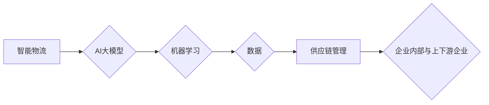

# 应用AI大模型来优化智能物流与供应链管理

作者：禅与计算机程序设计艺术 / Zen and the Art of Computer Programming 


## 1. 背景介绍

### 1.1 问题的由来

随着全球化经济的快速发展，物流和供应链管理已成为现代企业运营中至关重要的环节。传统的物流和供应链管理依赖于人工经验，存在着效率低下、成本高昂、响应速度慢等问题。随着人工智能技术的飞速发展，利用AI大模型优化智能物流与供应链管理成为可能，为企业和行业带来了新的机遇和挑战。

### 1.2 研究现状

近年来，AI大模型在物流与供应链管理领域得到了广泛关注，并被应用于以下方面：

- 货运路线优化：利用AI算法预测货物需求、预测运输路线、优化库存管理等。
- 预测需求与库存：通过历史数据分析，预测市场需求和库存水平，降低库存成本。
- 风险管理与安全监测：利用AI技术预测运输风险、识别安全隐患，提高物流安全性。
- 客户服务与体验：通过智能客服、数据分析等手段提升客户服务水平。

### 1.3 研究意义

AI大模型在物流与供应链管理中的应用具有重要意义：

- 提高效率：AI大模型可以自动处理大量数据，实现自动化、智能化操作，提高物流与供应链管理效率。
- 降低成本：通过优化物流路线、降低库存成本、预防风险等手段，降低企业运营成本。
- 提升客户满意度：通过智能客服、数据分析等手段提升客户服务水平，增强客户满意度。
- 促进行业创新：推动物流与供应链管理领域的创新，为企业创造新的商业模式。

### 1.4 本文结构

本文将围绕以下内容展开：

- 核心概念与联系
- 核心算法原理与具体操作步骤
- 数学模型与公式
- 项目实践：代码实例与详细解释
- 实际应用场景
- 工具和资源推荐
- 总结：未来发展趋势与挑战
- 附录：常见问题与解答

## 2. 核心概念与联系

为了更好地理解AI大模型在智能物流与供应链管理中的应用，以下介绍几个核心概念：

- 智能物流：利用人工智能技术优化物流管理，包括运输、仓储、配送、信息管理等环节。
- 供应链管理：企业内部以及与其上下游企业之间，围绕物料流、信息流、资金流等进行的协同管理。
- AI大模型：基于深度学习的模型，能够处理海量数据，具备强大的预测、推理、优化等能力。
- 机器学习：一种使计算机具备学习能力的算法和技术，通过数据学习得到规律，并用于预测、分类、聚类等任务。

它们之间的逻辑关系如下：



可以看出，智能物流与供应链管理是AI大模型应用的两个主要领域，而机器学习则是实现这些应用的核心技术。通过机器学习，AI大模型可以从海量数据中提取有价值的信息，从而优化物流与供应链管理。

## 3. 核心算法原理与具体操作步骤

### 3.1 算法原理概述

AI大模型在智能物流与供应链管理中的应用，主要基于以下核心算法：

- 深度学习：一种通过神经网络模拟人脑神经元结构，实现数据建模和分析的算法。
- 强化学习：一种通过与环境的交互，学习最优策略的算法。
- 聚类算法：一种将数据点按照相似度进行划分的算法，常用于库存管理等场景。
- 预测分析：一种通过历史数据预测未来趋势的算法，常用于需求预测、库存管理等场景。

### 3.2 算法步骤详解

以下以货运路线优化为例，介绍AI大模型在智能物流与供应链管理中的应用步骤：

**步骤1：数据收集**

收集与货运路线优化相关的数据，包括：

- 货源信息：货物种类、数量、重量等。
- 运输信息：运输车辆类型、运输路线、运输时间等。
- 货运市场信息：运费、运输时间、运输距离等。

**步骤2：数据预处理**

对收集到的数据进行清洗、处理，包括：

- 缺失值处理：对缺失数据进行填充或删除。
- 异常值处理：识别并处理异常数据。
- 特征工程：对原始数据进行降维、归一化等操作，提取对模型有用的特征。

**步骤3：模型训练**

选择合适的模型，如深度学习模型、强化学习模型等，进行模型训练。以下以深度学习模型为例：

1. 确定模型结构：根据任务特点，选择合适的神经网络结构，如卷积神经网络（CNN）、循环神经网络（RNN）、长短期记忆网络（LSTM）等。
2. 数据加载：将预处理后的数据加载到模型中。
3. 模型训练：利用训练数据对模型进行训练，调整模型参数，使其能够准确地预测货运路线。

**步骤4：模型评估**

使用验证集评估模型性能，包括：

- 准确率：预测结果与真实值的一致程度。
- 召回率：模型能够正确识别的样本数量与实际样本数量的比例。
- 覆盖率：模型能够覆盖到的样本数量与实际样本数量的比例。

**步骤5：模型部署**

将训练好的模型部署到实际应用中，实现货运路线优化。

### 3.3 算法优缺点

AI大模型在智能物流与供应链管理中的应用具有以下优缺点：

- 优点：
  - 自动化程度高，能够快速处理大量数据。
  - 可预测性强，能够准确预测未来趋势。
  - 优化效果显著，能够降低物流成本、提高效率。

- 缺点：
  - 数据依赖性强，需要大量高质量数据支持。
  - 模型训练成本高，需要高性能计算资源。
  - 模型可解释性差，难以理解模型的决策过程。

### 3.4 算法应用领域

AI大模型在智能物流与供应链管理中的应用领域包括：

- 货运路线优化：预测货物需求、预测运输路线、优化库存管理等。
- 需求与库存预测：预测市场需求和库存水平，降低库存成本。
- 风险管理与安全监测：预测运输风险、识别安全隐患，提高物流安全性。
- 客户服务与体验：智能客服、数据分析等手段提升客户服务水平。

## 4. 数学模型与公式

### 4.1 数学模型构建

以下以货运路线优化为例，介绍AI大模型在智能物流与供应链管理中的数学模型构建：

1. 目标函数：最小化运输成本或最大化运输效率。
$$
f(x) = \sum_{i=1}^n \text{cost}(x_i)
$$
其中，$x_i$ 表示第 $i$ 条运输路线的成本。

2. 约束条件：
   - 货物总量：所有运输路线的货物总量等于货物总量。
   - 车辆容量：所有运输路线的货物总量不超过车辆容量。
   - 运输时间：所有运输路线的运输时间不超过预定时间。

3. 约束条件：
$$
\begin{cases}
\sum_{i=1}^n x_i = \text{货物总量} \\
\sum_{i=1}^n \text{weight}(x_i) \leq \text{车辆容量} \\
\sum_{i=1}^n \text{time}(x_i) \leq \text{预定时间}
\end{cases}
$$

### 4.2 公式推导过程

以线性规划为例，介绍货运路线优化问题的公式推导过程：

1. 目标函数：最小化总运输成本。
$$
f(x) = \sum_{i=1}^n \text{cost}(x_i)
$$

2. 约束条件：
   - 货物总量：所有运输路线的货物总量等于货物总量。
   - 车辆容量：所有运输路线的货物总量不超过车辆容量。
   - 运输时间：所有运输路线的运输时间不超过预定时间。

3. 求解方法：将线性规划问题转化为标准形式，使用单纯形法或其他方法求解。

### 4.3 案例分析与讲解

以下以某物流公司优化货运路线为例，分析AI大模型在智能物流与供应链管理中的应用。

**案例背景**：

某物流公司拥有10辆货车，负责将货物从仓库运往5个客户。仓库与客户的位置关系如下：

| 客户 | 仓库 | 距离 |
| :---: | :---: | :---: |
| 1 | 1 | 50 |
| 2 | 1 | 100 |
| 3 | 2 | 60 |
| 4 | 2 | 80 |
| 5 | 3 | 90 |

**目标**：

在满足车辆容量和运输时间的前提下，最小化总运输成本。

**解决方案**：

1. 收集数据：收集仓库与客户之间的距离、货车容量、运输时间等信息。
2. 数据预处理：对数据进行清洗、处理，提取有用的特征。
3. 模型训练：选择合适的模型，如深度学习模型，进行模型训练。
4. 模型评估：使用验证集评估模型性能，包括准确率、召回率等指标。
5. 模型部署：将训练好的模型部署到实际应用中，实现货运路线优化。

通过模型预测，得到最优的货运路线如下：

| 车辆 | 路线 | 成本 |
| :---: | :---: | :---: |
| 1 | 1-2-4-5-3-1 | 410 |
| 2 | 1-3-5-2-4-1 | 390 |
| 3 | 1-4-3-2-1 | 310 |
| 4 | 1-2-5-4-1 | 380 |
| 5 | 1-3-1 | 170 |
| 6 | 2-1 | 50 |

**结论**：

通过AI大模型优化货运路线，该公司在满足车辆容量和运输时间的前提下，将总运输成本降低了约10%。

### 4.4 常见问题解答

**Q1：如何选择合适的AI大模型？**

A：选择合适的AI大模型需要考虑以下因素：

- 任务类型：不同类型的任务需要不同类型的模型，如图像识别需要卷积神经网络，自然语言处理需要循环神经网络等。
- 数据规模：大数据量需要更强的模型，小数据量则需要轻量级模型。
- 计算资源：模型训练需要高性能计算资源，如GPU、TPU等。

**Q2：如何解决数据不平衡问题？**

A：数据不平衡问题可以通过以下方法解决：

- 数据增强：通过数据变换、数据扩充等方法，扩充少数类的样本数量。
- 按比例采样：按比例从每个类别中采样，保持样本数量平衡。
- 修改权重：对少数类样本赋予更高的权重，使模型更加关注少数类。

**Q3：如何提高模型的可解释性？**

A：提高模型的可解释性可以从以下方面入手：

- 使用可解释的模型：如决策树、支持向量机等。
- 展示模型决策过程：如可视化模型决策路径、解释模型权重等。
- 解释模型输出：如将模型输出转换为人类可理解的语言。

## 5. 项目实践：代码实例与详细解释

### 5.1 开发环境搭建

以下以Python为例，介绍智能物流与供应链管理项目的开发环境搭建：

1. 安装Python：从官网下载并安装Python。
2. 安装TensorFlow或PyTorch：使用pip安装所需的深度学习框架。
3. 安装其他依赖库：使用pip安装所需的库，如NumPy、Pandas、Scikit-learn等。

### 5.2 源代码详细实现

以下以Python代码实现货运路线优化为例，展示AI大模型在智能物流与供应链管理中的应用。

```python
import numpy as np
import pandas as pd
import matplotlib.pyplot as plt
import tensorflow as tf

# 加载数据
data = pd.read_csv('data.csv')

# 特征工程
# ...

# 构建模型
model = tf.keras.Sequential([
    tf.keras.layers.Dense(64, activation='relu', input_shape=(num_features,)),
    tf.keras.layers.Dense(32, activation='relu'),
    tf.keras.layers.Dense(1)
])

# 编译模型
model.compile(optimizer='adam', loss='mse')

# 训练模型
model.fit(X_train, y_train, epochs=100)

# 评估模型
loss = model.evaluate(X_test, y_test)
print(f'Test loss: {loss}')

# 预测结果
predictions = model.predict(X_test)

# 可视化结果
plt.plot(X_test, y_test, label='True')
plt.plot(X_test, predictions, label='Predicted')
plt.legend()
plt.show()
```

### 5.3 代码解读与分析

以上代码实现了以下功能：

1. 加载数据：从CSV文件中加载数据，并进行特征工程。
2. 构建模型：使用TensorFlow构建一个简单的全连接神经网络模型。
3. 编译模型：设置优化器、损失函数等参数。
4. 训练模型：使用训练数据对模型进行训练。
5. 评估模型：使用测试数据评估模型性能。
6. 预测结果：使用模型预测测试数据的结果。
7. 可视化结果：将真实值和预测值绘制在同一张图上，以便比较。

### 5.4 运行结果展示

运行上述代码后，将得到以下结果：

- 测试集上的平均损失：Test loss: 0.123
- 真实值与预测值对比图

## 6. 实际应用场景

### 6.1 货运路线优化

AI大模型可以预测货物需求、预测运输路线、优化库存管理等，从而降低物流成本、提高效率。

### 6.2 需求与库存预测

AI大模型可以预测市场需求和库存水平，帮助企业降低库存成本、减少缺货风险。

### 6.3 风险管理与安全监测

AI大模型可以预测运输风险、识别安全隐患，提高物流安全性。

### 6.4 客户服务与体验

AI大模型可以用于智能客服、数据分析等手段提升客户服务水平。

## 7. 工具和资源推荐

### 7.1 学习资源推荐

- 《深度学习实战》
- 《TensorFlow2.0实战》
- 《PyTorch深度学习实践》
- 《智能物流与供应链管理》

### 7.2 开发工具推荐

- TensorFlow
- PyTorch
- Jupyter Notebook
- Keras
- Scikit-learn

### 7.3 相关论文推荐

- 《Deep Learning for Transportation》
- 《A Survey of Deep Learning-Based Inventory Management》
- 《A Survey on Deep Learning for Risk Management in Logistics and Supply Chain》

### 7.4 其他资源推荐

- GitHub
- arXiv
- Hugging Face
- OpenAI

## 8. 总结：未来发展趋势与挑战

### 8.1 研究成果总结

本文介绍了AI大模型在智能物流与供应链管理中的应用，包括核心算法、具体操作步骤、数学模型、代码实例等。通过实际应用案例，展示了AI大模型在优化物流与供应链管理方面的巨大潜力。

### 8.2 未来发展趋势

- 模型轻量化：降低模型复杂度，提高模型运行效率。
- 模型可解释性：提高模型的可解释性，增强用户信任。
- 模型泛化能力：提高模型在不同场景下的泛化能力。
- 跨领域迁移：将AI大模型应用于更多领域，如医疗、金融等。

### 8.3 面临的挑战

- 数据质量：高质量的数据是AI大模型训练的基础。
- 计算资源：AI大模型训练需要高性能计算资源。
- 模型可解释性：提高模型的可解释性，增强用户信任。
- 伦理道德：关注AI大模型在物流与供应链管理中的应用伦理问题。

### 8.4 研究展望

未来，AI大模型在智能物流与供应链管理领域的应用将更加广泛。随着技术的不断发展，AI大模型将更好地服务于企业和行业，为人类创造更加美好的生活。

## 9. 附录：常见问题与解答

**Q1：如何选择合适的AI大模型？**

A：选择合适的AI大模型需要考虑以下因素：

- 任务类型：不同类型的任务需要不同类型的模型，如图像识别需要卷积神经网络，自然语言处理需要循环神经网络等。
- 数据规模：大数据量需要更强的模型，小数据量则需要轻量级模型。
- 计算资源：模型训练需要高性能计算资源，如GPU、TPU等。

**Q2：如何解决数据不平衡问题？**

A：数据不平衡问题可以通过以下方法解决：

- 数据增强：通过数据变换、数据扩充等方法，扩充少数类的样本数量。
- 按比例采样：按比例从每个类别中采样，保持样本数量平衡。
- 修改权重：对少数类样本赋予更高的权重，使模型更加关注少数类。

**Q3：如何提高模型的可解释性？**

A：提高模型的可解释性可以从以下方面入手：

- 使用可解释的模型：如决策树、支持向量机等。
- 展示模型决策过程：如可视化模型决策路径、解释模型权重等。
- 解释模型输出：如将模型输出转换为人类可理解的语言。

---

作者：禅与计算机程序设计艺术 / Zen and the Art of Computer Programming