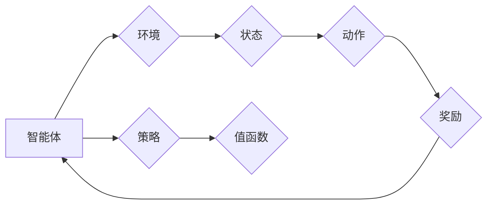

# 强化学习与自适应控制原理与代码实战案例讲解

作者：禅与计算机程序设计艺术 / Zen and the Art of Computer Programming

## 1. 背景介绍

### 1.1 问题的由来

在自动化、机器人、游戏、推荐系统等领域，自适应控制是提高系统性能和适应性的关键技术。随着人工智能技术的飞速发展，强化学习（Reinforcement Learning，RL）作为机器学习的一个重要分支，为自适应控制提供了新的思路和方法。

强化学习通过智能体（Agent）与环境的交互，不断学习并优化策略，以实现目标。与传统的监督学习和无监督学习相比，强化学习具有以下特点：

- 自主性：智能体无需人工标记数据，能够自主学习。
- 稳定性：智能体通过与环境交互不断学习，能够适应环境变化。
- 创新性：智能体在探索过程中不断尝试新的策略，具有创新性。

### 1.2 研究现状

近年来，随着深度学习技术的发展，强化学习取得了显著的成果。在游戏、机器人、推荐系统等领域，强化学习已经取得了突破性进展。主要研究方向包括：

- 值函数方法：如Q学习、SARSA等，通过学习值函数来评估状态和动作。
- 策略梯度方法：如Policy Gradient、Actor-Critic等，直接学习策略参数。
- 模型预测控制：结合了模型和控制器，提高控制精度和效率。

### 1.3 研究意义

强化学习与自适应控制在实际应用中具有重要意义：

- 提高系统性能：通过学习最优策略，提高系统性能和稳定性。
- 适应环境变化：智能体能够适应环境变化，提高系统的鲁棒性。
- 创新应用：为自动化、机器人、游戏等领域提供新的技术手段。

### 1.4 本文结构

本文将围绕强化学习与自适应控制展开，主要包括以下内容：

- 核心概念与联系
- 核心算法原理与具体操作步骤
- 数学模型和公式
- 项目实践
- 实际应用场景
- 工具和资源推荐
- 总结与展望

## 2. 核心概念与联系

为了更好地理解强化学习与自适应控制，本节将介绍几个核心概念及其相互联系。

- 智能体（Agent）：强化学习中的主体，通过与环境交互来学习最优策略。
- 环境（Environment）：强化学习中的外部世界，与智能体进行交互。
- 状态（State）：环境中的一个特定状态，由当前的环境信息组成。
- 动作（Action）：智能体可以执行的操作。
- 奖励（Reward）：环境对智能体动作的反馈，用于评估智能体的表现。
- 策略（Policy）：智能体在给定状态时选择动作的概率分布。
- 值函数（Value Function）：评估状态-动作对的期望奖励。

以下是用Mermaid流程图表示的核心概念联系：



## 3. 核心算法原理 & 具体操作步骤

### 3.1 算法原理概述

强化学习算法的核心思想是：智能体通过与环境的交互，不断学习并优化策略，以实现目标。主要算法包括：

- Q学习（Q-Learning）：通过学习值函数来评估状态-动作对，并选择最优动作。
- SARSa（State-Action-Reward-State-Action，SARSA）：与Q学习类似，但使用实际奖励来更新值函数。
- Policy Gradient：直接学习策略参数，并使用梯度下降法进行优化。
- Actor-Critic：结合了Actor和Critic两部分，Actor生成动作，Critic评估动作价值。

### 3.2 算法步骤详解

以下以Q学习为例，介绍强化学习算法的具体步骤：

1. 初始化：设置智能体、环境、策略、值函数等参数。
2. 初始化策略：选择初始策略，用于选择动作。
3. 交互过程：智能体根据策略选择动作，与环境进行交互。
4. 更新值函数：根据实际奖励和新的状态，更新值函数。
5. 重复步骤3和4，直至达到终止条件。

### 3.3 算法优缺点

- Q学习：简单易实现，但收敛速度较慢，且容易陷入局部最优。
- SARSa：收敛速度比Q学习快，但需要存储更多状态-动作对信息。
- Policy Gradient：收敛速度较快，但容易陷入噪声梯度，难以保证收敛到最优策略。
- Actor-Critic：结合了Actor和Critic的优势，收敛速度较快，但实现复杂。

### 3.4 算法应用领域

强化学习与自适应控制算法在以下领域具有广泛应用：

- 自动化控制：如机器人控制、自动驾驶、无人机控制等。
- 游戏智能：如棋类游戏、竞技游戏、在线游戏等。
- 推荐系统：如个性化推荐、商品推荐、新闻推荐等。
- 财经领域：如股票交易、期货交易、风险控制等。

## 4. 数学模型和公式 & 详细讲解 & 举例说明

### 4.1 数学模型构建

强化学习的主要数学模型包括：

- 状态-动作空间（State-Action Space）：$\mathcal{S} \times \mathcal{A}$
- 奖励函数（Reward Function）：$R: \mathcal{S} \times \mathcal{A} \rightarrow \mathbb{R}$
- 策略函数（Policy Function）：$\pi: \mathcal{S} \rightarrow \mathcal{A}$
- 值函数（Value Function）：$V: \mathcal{S} \rightarrow \mathbb{R}$ 或 $Q: \mathcal{S} \times \mathcal{A} \rightarrow \mathbb{R}$

### 4.2 公式推导过程

以下以Q学习为例，推导Q值函数的更新公式：

$$
Q(s,a) \leftarrow Q(s,a) + \alpha [R(s,a) + \gamma \max_{a'} Q(s',a') - Q(s,a)]
$$

其中：

- $Q(s,a)$：在状态s和动作a下的Q值。
- $\alpha$：学习率。
- $R(s,a)$：在状态s和动作a下获得的奖励。
- $\gamma$：折扣因子。
- $s'$：下一个状态。
- $a'$：下一个动作。

### 4.3 案例分析与讲解

以下以经典的CartPole环境为例，介绍Q学习的应用。

- 状态空间：由两个角度和角速度以及杆的长度组成。
- 动作空间：有两个动作，向上推或向下推。
- 奖励函数：每移动一步奖励1分，当杆倒下时结束游戏，奖励-100分。

使用Q学习算法，智能体通过与环境交互，不断学习并优化策略，最终实现保持杆平衡的目标。

### 4.4 常见问题解答

**Q1：如何选择合适的折扣因子？**

A：折扣因子$\gamma$的选择对Q值函数的收敛速度和稳定性有很大影响。一般建议从0.9开始尝试，并根据实际任务进行调整。

**Q2：如何避免陷入局部最优？**

A：可以尝试以下方法：

1. 使用随机策略，增加探索概率。
2. 使用多种学习率，避免陷入噪声梯度。
3. 使用动量方法，提高算法的稳定性。

**Q3：如何处理连续动作空间？**

A：对于连续动作空间，可以使用动作空间采样、动作空间离散化等方法进行处理。

## 5. 项目实践：代码实例和详细解释说明

### 5.1 开发环境搭建

以下是使用Python和PyTorch实现Q学习算法的环境搭建步骤：

1. 安装PyTorch：根据CUDA版本下载并安装PyTorch。
2. 安装 gym：`pip install gym`
3. 安装其他依赖库：`pip install numpy scipy`

### 5.2 源代码详细实现

以下是一个简单的CartPole环境Q学习算法的代码实现：

```python
import gym
import torch
import numpy as np

# 初始化参数
gamma = 0.99
alpha = 0.1
epsilon = 0.1
memory = []

# 定义神经网络
class QNetwork(torch.nn.Module):
    def __init__(self, input_size, action_size):
        super(QNetwork, self).__init__()
        self.fc1 = torch.nn.Linear(input_size, 128)
        self.fc2 = torch.nn.Linear(128, action_size)

    def forward(self, x):
        x = torch.relu(self.fc1(x))
        x = self.fc2(x)
        return x

# 定义Q学习算法
class QLearning:
    def __init__(self, state_size, action_size):
        self.state_size = state_size
        self.action_size = action_size
        self.memory = []
        self.q_network = QNetwork(state_size, action_size).to(device)
        self.optimizer = torch.optim.Adam(self.q_network.parameters(), lr=alpha)
        self.loss_fn = torch.nn.MSELoss()

    def remember(self, state, action, reward, next_state, done):
        self.memory.append((state, action, reward, next_state, done))

    def act(self, state):
        if np.random.rand() <= epsilon:
            return np.random.randint(self.action_size)
        state = torch.from_numpy(state).float().unsqueeze(0).to(device)
        actions = self.q_network(state)
        return actions.argmax().item()

    def replay(self):
        if len(self.memory) < batch_size:
            return
        samples = random.sample(self.memory, batch_size)
        states, actions, rewards, next_states, dones = zip(*samples)
        states = torch.from_numpy(np.vstack(states)).float().to(device)
        actions = torch.from_numpy(np.vstack(actions)).long().to(device)
        rewards = torch.from_numpy(np.vstack(rewards)).float().to(device)
        next_states = torch.from_numpy(np.vstack(next_states)).float().to(device)
        dones = torch.from_numpy(np.vstack(dones)).float().to(device)
        next_values = self.q_network(next_states). detach().max(1)[0].unsqueeze(1)
        expected_q_values = rewards + (1 - dones) * gamma * next_values
        q_values = self.q_network(states).gather(1, actions.unsqueeze(1))
        loss = self.loss_fn(q_values, expected_q_values)
        self.optimizer.zero_grad()
        loss.backward()
        self.optimizer.step()

# 初始化环境
env = gym.make("CartPole-v1")
state_size = env.observation_space.shape[0]
action_size = env.action_space.n
agent = QLearning(state_size, action_size)

# 训练
for episode in range(total_episodes):
    state = env.reset()
    state = normalize(state)
    for time in range(500):
        action = agent.act(state)
        next_state, reward, done, _ = env.step(action)
        next_state = normalize(next_state)
        agent.remember(state, action, reward, next_state, done)
        state = next_state
        if done:
            break
    agent.replay()

# 评估
env.close()
```

### 5.3 代码解读与分析

以上代码首先定义了神经网络和Q学习算法，然后初始化环境、训练和评估智能体。

- `QLearning`类：用于封装Q学习算法的相关参数和方法。
- `act`方法：根据当前状态和策略选择动作。
- `remember`方法：将状态-动作-奖励-下一个状态-是否结束等信息存储到记忆中。
- `replay`方法：从记忆中随机抽取样本，并使用经验回放算法更新Q值函数。

### 5.4 运行结果展示

运行上述代码，智能体在CartPole环境中能够学会保持杆平衡。通过不断的训练和优化，智能体能够在更短的时间内完成任务。

## 6. 实际应用场景

### 6.1 自动驾驶

自动驾驶是强化学习与自适应控制的一个重要应用场景。通过模拟真实交通场景，智能体可以学习并优化驾驶策略，实现自动驾驶功能。

### 6.2 机器人控制

机器人控制是另一个重要的应用场景。通过强化学习，机器人可以学习并优化运动策略，实现自主移动、抓取、搬运等功能。

### 6.3 游戏智能

强化学习可以应用于游戏智能领域，如棋类游戏、竞技游戏、在线游戏等，实现智能化的游戏角色。

### 6.4 财经领域

强化学习可以应用于财经领域，如股票交易、期货交易、风险控制等，实现智能化的投资决策。

### 6.5 能源优化

强化学习可以应用于能源优化领域，如电力系统调度、需求响应等，实现能源系统的智能化管理。

## 7. 工具和资源推荐

### 7.1 学习资源推荐

1. 《深度学习与强化学习》：全面介绍了深度学习和强化学习的基本概念、算法和原理。
2. 《强化学习及其应用》：介绍了强化学习的各种算法和应用案例。
3. 《Python机器学习》：介绍了Python在机器学习领域的应用，包括强化学习。

### 7.2 开发工具推荐

1. PyTorch：基于Python的开源深度学习框架，适合进行强化学习开发。
2. TensorFlow：基于Python的开源深度学习框架，支持多种算法和工具。
3. OpenAI Gym：开源的强化学习环境库，提供丰富的实验环境。

### 7.3 相关论文推荐

1. "Deep Q-Network"（DQN）：提出了一种基于深度学习的Q学习算法。
2. "Asynchronous Advantage Actor-Critic"（A3C）：提出了一种基于异步策略梯度的强化学习算法。
3. "Proximal Policy Optimization"（PPO）：提出了一种基于近端策略优化的强化学习算法。

### 7.4 其他资源推荐

1. 《深度学习自然语言处理》：介绍了深度学习在自然语言处理领域的应用。
2. 《深度学习推荐系统》：介绍了深度学习在推荐系统领域的应用。
3. 《深度学习在金融领域的应用》：介绍了深度学习在金融领域的应用。

## 8. 总结：未来发展趋势与挑战

### 8.1 研究成果总结

本文介绍了强化学习与自适应控制原理，并分析了其应用场景。通过代码实战案例，展示了Q学习算法在CartPole环境中的应用。同时，本文还介绍了相关工具和资源，为读者提供了进一步学习的途径。

### 8.2 未来发展趋势

随着深度学习技术的不断发展，强化学习与自适应控制将在以下方面取得进一步发展：

1. 深度强化学习：结合深度学习技术，提高强化学习算法的性能和效率。
2. 多智能体强化学习：研究多个智能体之间的协作与竞争，实现更复杂的系统控制。
3. 强化学习与物理引擎的结合：将强化学习应用于物理引擎，实现更加真实的虚拟环境。

### 8.3 面临的挑战

强化学习与自适应控制在实际应用中仍面临以下挑战：

1. 收敛速度：一些强化学习算法的收敛速度较慢，需要长时间训练。
2. 稳定性：一些强化学习算法的稳定性较差，容易受到初始参数、学习率等因素的影响。
3. 可解释性：强化学习算法的决策过程通常难以解释，难以理解其内部工作机制。

### 8.4 研究展望

为了解决上述挑战，未来需要在以下方面进行深入研究：

1. 提高收敛速度：研究更加高效的强化学习算法，降低训练时间。
2. 提高稳定性：研究更加稳定的强化学习算法，提高算法的鲁棒性。
3. 提高可解释性：研究可解释的强化学习算法，提高算法的透明度和可信度。

相信随着研究的不断深入，强化学习与自适应控制将在更多领域发挥重要作用，为人类社会带来更多福祉。

## 9. 附录：常见问题与解答

**Q1：强化学习与深度学习有何区别？**

A：强化学习是一种通过与环境交互学习策略的机器学习方法，而深度学习是一种通过学习数据特征进行预测和分类的机器学习方法。两者可以结合使用，例如深度强化学习。

**Q2：如何选择合适的强化学习算法？**

A：选择合适的强化学习算法需要考虑以下因素：

- 任务类型：不同类型的任务需要选择不同的算法。
- 环境特性：不同的环境特性对算法的选择有很大影响。
- 收敛速度和稳定性：选择收敛速度和稳定性较好的算法。

**Q3：如何解决强化学习中的收敛速度问题？**

A：解决强化学习中的收敛速度问题可以从以下方面入手：

- 使用高效的算法：选择收敛速度较快的算法。
- 使用经验回放：使用经验回放算法提高样本利用率和学习效率。
- 使用多智能体强化学习：使用多智能体强化学习可以加速学习过程。

**Q4：如何解决强化学习中的稳定性问题？**

A：解决强化学习中的稳定性问题可以从以下方面入手：

- 使用稳定的优化算法：选择稳定性较好的优化算法。
- 使用自适应学习率：使用自适应学习率可以提高算法的鲁棒性。
- 使用经验回放：使用经验回放算法可以提高算法的稳定性。