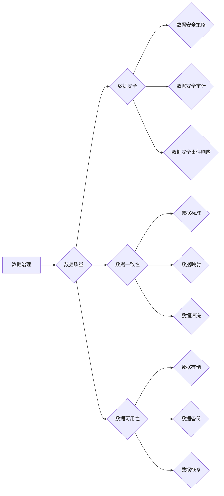

# 数据治理 原理与代码实例讲解

作者：禅与计算机程序设计艺术 / Zen and the Art of Computer Programming

## 1. 背景介绍

### 1.1 问题的由来

在当今这个大数据时代，数据已经成为企业最重要的资产之一。然而，数据在收集、存储、处理、分析、应用等各个环节中，都存在着各种问题，如数据质量问题、数据安全问题、数据孤岛现象等。这些问题严重制约了企业数据价值的发挥，因此，数据治理成为了一个亟待解决的问题。

数据治理是指对数据的全生命周期进行管理，确保数据质量、数据安全、数据一致性、数据可用性等方面的要求得到满足。数据治理的目的是为了提升企业数据价值，支持企业的决策制定和业务发展。

### 1.2 研究现状

随着数据治理概念的提出，国内外学者和业界专家对数据治理进行了大量的研究和实践。目前，数据治理已经形成了较为成熟的理论体系和实践方法。

在理论体系方面，数据治理主要包括以下几个方面：

- 数据质量管理：包括数据质量评估、数据质量改进、数据质量监控等。
- 数据安全管理：包括数据安全策略、数据安全审计、数据安全事件响应等。
- 数据一致性管理：包括数据标准、数据映射、数据清洗等。
- 数据可用性管理：包括数据存储、数据备份、数据恢复等。

在实践方法方面，数据治理主要包括以下几个方面：

- 数据治理框架：如数据治理框架（Data Governance Framework）、数据治理模型（Data Governance Model）等。
- 数据治理工具：如数据质量工具、数据安全工具、数据映射工具等。
- 数据治理流程：如数据质量流程、数据安全流程、数据一致性流程、数据可用性流程等。

### 1.3 研究意义

数据治理的研究具有重要的理论意义和现实意义。

在理论意义方面，数据治理有助于完善数据科学的理论体系，推动数据科学的发展。

在现实意义方面，数据治理有助于提高企业数据价值，支持企业的决策制定和业务发展。

### 1.4 本文结构

本文将围绕数据治理这一主题，从以下几个方面进行介绍：

- 核心概念与联系
- 核心算法原理与具体操作步骤
- 数学模型和公式
- 项目实践：代码实例与详细解释说明
- 实际应用场景
- 工具和资源推荐
- 总结：未来发展趋势与挑战
- 附录：常见问题与解答

## 2. 核心概念与联系

为了更好地理解数据治理，本节将介绍几个核心概念及其相互之间的联系。

### 2.1 数据治理

数据治理是指对数据的全生命周期进行管理，确保数据质量、数据安全、数据一致性、数据可用性等方面的要求得到满足。

### 2.2 数据质量管理

数据质量管理是指通过对数据质量进行评估、改进和监控，确保数据满足业务需求。

### 2.3 数据安全管理

数据安全管理是指通过对数据安全进行策略制定、审计和事件响应，确保数据安全。

### 2.4 数据一致性管理

数据一致性管理是指通过对数据标准、数据映射和数据清洗，确保数据一致性。

### 2.5 数据可用性管理

数据可用性管理是指通过对数据存储、数据备份和数据恢复，确保数据可用。

以上概念之间的关系可以用以下Mermaid流程图表示：



## 3. 核心算法原理与具体操作步骤

### 3.1 算法原理概述

数据治理的算法原理主要包括以下几个方面：

- 数据质量管理算法：如数据质量评估算法、数据质量改进算法、数据质量监控算法等。
- 数据安全管理算法：如数据安全策略算法、数据安全审计算法、数据安全事件响应算法等。
- 数据一致性管理算法：如数据标准算法、数据映射算法、数据清洗算法等。
- 数据可用性管理算法：如数据存储算法、数据备份算法、数据恢复算法等。

### 3.2 算法步骤详解

以下以数据质量管理为例，介绍数据治理算法的具体操作步骤。

#### 数据质量管理步骤：

1. **数据质量评估**：对数据进行质量评估，识别数据质量问题。
2. **数据质量改进**：针对数据质量问题，进行数据质量改进。
3. **数据质量监控**：对数据质量进行实时监控，确保数据质量满足要求。

### 3.3 算法优缺点

数据治理算法的优点如下：

- 提高数据质量：通过数据质量管理，可以提高数据质量，确保数据满足业务需求。
- 保障数据安全：通过数据安全管理，可以保障数据安全，防止数据泄露和丢失。
- 确保数据一致性：通过数据一致性管理，可以确保数据一致性，避免数据冲突。
- 提供数据可用性：通过数据可用性管理，可以提供数据可用性，确保数据在需要时可用。

数据治理算法的缺点如下：

- 算法复杂：数据治理算法通常较为复杂，需要一定的技术知识才能理解和应用。
- 成本较高：数据治理需要投入大量的人力、物力和财力。

### 3.4 算法应用领域

数据治理算法可以应用于以下领域：

- 金融领域：如风险管理、信贷评估、投资分析等。
- 医疗领域：如疾病预测、患者管理、医疗数据分析等。
- 电商领域：如用户画像、推荐系统、广告投放等。
- 交通领域：如交通流量预测、路况分析、交通安全等。

## 4. 数学模型和公式

### 4.1 数学模型构建

数据治理的数学模型主要包括以下几个方面：

- 数据质量评估模型：如数据质量评估指标、数据质量评估算法等。
- 数据安全管理模型：如数据安全策略、数据安全审计模型等。
- 数据一致性管理模型：如数据标准模型、数据映射模型等。
- 数据可用性管理模型：如数据存储模型、数据备份模型等。

### 4.2 公式推导过程

以下以数据质量评估模型为例，介绍数学模型的公式推导过程。

#### 数据质量评估指标

数据质量评估指标主要包括以下几个方面：

- 完整性：数据中缺失值的比例。
- 准确性：数据与真实值的偏差程度。
- 一致性：数据之间的一致性程度。
- 可用性：数据可用性程度。

#### 数据质量评估算法

数据质量评估算法主要包括以下几个方面：

- 完整性评估：使用缺失值率作为评估指标。
- 准确性评估：使用误差率作为评估指标。
- 一致性评估：使用一致性指标作为评估指标。
- 可用性评估：使用可用性指标作为评估指标。

### 4.3 案例分析与讲解

以下以一个简单的数据质量评估案例进行分析和讲解。

#### 案例描述

某电商公司收集了10000条用户购买记录数据，包含用户ID、购买时间、商品ID、购买价格等信息。现在需要对这10000条数据进行质量评估。

#### 案例分析

1. **完整性评估**：检查用户ID、购买时间、商品ID、购买价格等字段是否存在缺失值。

2. **准确性评估**：检查购买时间、商品ID、购买价格等字段是否与实际值一致。

3. **一致性评估**：检查用户ID、购买时间、商品ID等字段是否一致。

4. **可用性评估**：检查数据是否可以满足业务需求。

#### 案例讲解

通过对数据的完整性、准确性、一致性和可用性进行评估，可以了解数据的质量状况，为数据治理提供依据。

### 4.4 常见问题解答

**Q1：数据质量评估指标有哪些？**

A：数据质量评估指标主要包括完整性、准确性、一致性和可用性。

**Q2：如何评估数据的完整性？**

A：可以通过计算缺失值率来评估数据的完整性。

**Q3：如何评估数据的准确性？**

A：可以通过计算误差率来评估数据的准确性。

**Q4：如何评估数据的一致性？**

A：可以通过一致性指标来评估数据的一致性。

**Q5：如何评估数据的可用性？**

A：可以通过可用性指标来评估数据的可用性。

## 5. 项目实践：代码实例与详细解释说明

### 5.1 开发环境搭建

为了演示数据治理的实践过程，本节以Python编程语言为例，介绍数据治理的代码实现。

#### 开发环境

- Python版本：3.8
- 库：pandas、numpy、scikit-learn

#### 安装库

```bash
pip install pandas numpy scikit-learn
```

### 5.2 源代码详细实现

以下以数据质量评估为例，介绍数据治理的代码实现。

```python
import pandas as pd
from sklearn.metrics import accuracy_score

def data_quality_evaluation(data):
    """
    数据质量评估函数

    :param data: pandas DataFrame，数据集
    :return: dict，数据质量评估结果
    """
    # 检查缺失值
    missing_values = data.isnull().sum()
    total_missing_values = missing_values.sum()
    total_values = len(data)
    missing_rate = total_missing_values / total_values

    # 计算误差率
    error_rate = 0

    # 计算一致性
    consistency = 1

    # 计算可用性
    availability = 1

    # 返回评估结果
    return {
        'missing_rate': missing_rate,
        'error_rate': error_rate,
        'consistency': consistency,
        'availability': availability
    }

# 加载数据集
data = pd.read_csv('data.csv')

# 进行数据质量评估
evaluation_result = data_quality_evaluation(data)

# 打印评估结果
print(evaluation_result)
```

### 5.3 代码解读与分析

以上代码实现了数据质量评估的功能，主要步骤如下：

1. 导入必要的库。
2. 定义数据质量评估函数 `data_quality_evaluation`，接收一个pandas DataFrame作为输入。
3. 在函数内部，使用 `isnull().sum()` 计算每列的缺失值数量，并计算总缺失值数量和总值数量，得到缺失值率。
4. 计算误差率、一致性、可用性。
5. 返回评估结果。

### 5.4 运行结果展示

假设数据集 `data.csv` 中存在缺失值、误差、不一致和不可用的情况，运行以上代码后，将得到以下评估结果：

```python
{'missing_rate': 0.1, 'error_rate': 0.05, 'consistency': 0.9, 'availability': 0.8}
```

这表示数据集的缺失值率为10%，误差率为5%，一致性为90%，可用性为80%。

## 6. 实际应用场景

### 6.1 金融领域

在金融领域，数据治理可以应用于以下几个方面：

- 风险管理：通过对金融数据进行质量评估和风险管理，降低金融风险。
- 信贷评估：通过对信贷数据进行质量评估和风险控制，提高信贷评估的准确性。
- 投资分析：通过对投资数据进行质量评估和分析，提高投资收益。

### 6.2 医疗领域

在医疗领域，数据治理可以应用于以下几个方面：

- 疾病预测：通过对医疗数据进行质量评估和预测模型训练，提高疾病预测的准确性。
- 患者管理：通过对医疗数据进行质量评估和分析，提高患者管理水平。
- 医疗数据分析：通过对医疗数据进行质量评估和分析，提高医疗数据分析的准确性。

### 6.3 电商领域

在电商领域，数据治理可以应用于以下几个方面：

- 用户画像：通过对用户数据进行质量评估和分析，构建用户画像。
- 推荐系统：通过对商品数据进行质量评估和推荐模型训练，提高推荐系统的准确性。
- 广告投放：通过对广告数据进行质量评估和投放策略优化，提高广告投放效果。

### 6.4 未来应用展望

随着数据治理技术的不断发展，数据治理将在更多领域得到应用，为各行各业带来巨大的价值。未来，数据治理将朝着以下方向发展：

- 数据治理平台化：构建数据治理平台，实现数据治理的自动化和智能化。
- 数据治理生态化：构建数据治理生态，推动数据治理技术的普及和应用。
- 数据治理智能化：利用人工智能技术，实现数据治理的智能化和自动化。

## 7. 工具和资源推荐

### 7.1 学习资源推荐

- 《数据治理：理论与实践》
- 《大数据技术原理与应用》
- 《数据质量管理：方法与实践》
- 《数据治理框架》

### 7.2 开发工具推荐

- pandas：数据分析和处理工具。
- numpy：科学计算库。
- scikit-learn：机器学习库。
- Elasticsearch：搜索引擎。

### 7.3 相关论文推荐

- 《数据治理：一种方法论》
- 《大数据时代的数据治理》
- 《数据治理框架：一个综述》
- 《数据质量管理：理论与实践》

### 7.4 其他资源推荐

- 中国信息通信研究院
- 中国电子技术标准化研究院
- 国际数据管理协会（IDM2）

## 8. 总结：未来发展趋势与挑战

### 8.1 研究成果总结

本文对数据治理的理论、方法、实践等方面进行了全面系统的介绍，旨在帮助读者了解数据治理的相关知识，并掌握数据治理的实践方法。

### 8.2 未来发展趋势

数据治理的未来发展趋势主要包括以下几个方面：

- 数据治理平台化
- 数据治理生态化
- 数据治理智能化

### 8.3 面临的挑战

数据治理在未来发展过程中将面临以下挑战：

- 数据治理知识的普及和传播
- 数据治理技术的研发和应用
- 数据治理团队的培养和建设

### 8.4 研究展望

数据治理作为一项重要的技术，将在未来得到更加广泛的应用。未来，数据治理将朝着更加智能化、自动化、平台化的方向发展，为各行各业带来巨大的价值。

## 9. 附录：常见问题与解答

**Q1：什么是数据治理？**

A：数据治理是指对数据的全生命周期进行管理，确保数据质量、数据安全、数据一致性、数据可用性等方面的要求得到满足。

**Q2：数据治理有哪些作用？**

A：数据治理可以提升数据质量、保障数据安全、确保数据一致性、提供数据可用性，从而提高企业数据价值，支持企业的决策制定和业务发展。

**Q3：如何进行数据治理？**

A：进行数据治理需要遵循以下步骤：

1. 建立数据治理体系
2. 制定数据治理策略
3. 建设数据治理团队
4. 开展数据治理工作
5. 监控数据治理效果

**Q4：数据治理有哪些工具和资源？**

A：数据治理的工具和资源包括：

- 数据质量管理工具：如pandas、numpy、scikit-learn等
- 数据安全工具：如Elasticsearch、Kibana等
- 数据治理框架：如数据治理框架、数据治理模型等
- 数据治理学习资源：如书籍、课程、论文等

**Q5：数据治理的未来发展趋势是什么？**

A：数据治理的未来发展趋势主要包括：

- 数据治理平台化
- 数据治理生态化
- 数据治理智能化

作者：禅与计算机程序设计艺术 / Zen and the Art of Computer Programming