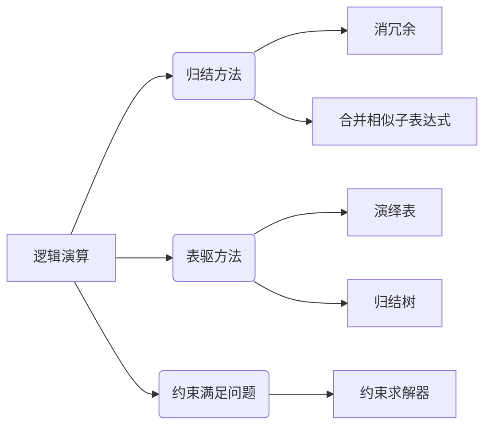

# 数理逻辑：逻辑演算的归约

作者：禅与计算机程序设计艺术 / Zen and the Art of Computer Programming

## 1. 背景介绍
### 1.1 问题的由来

数理逻辑是数学和计算机科学的重要基础，它为计算机程序设计、人工智能、数据库理论等领域提供了坚实的理论基础。在数理逻辑中，逻辑演算是研究命题公式及其推理规则的方法。然而，随着逻辑演算表达式的复杂性不断增加，如何高效地进行逻辑演算的归约，成为了一个重要的研究课题。

### 1.2 研究现状

近年来，逻辑演算的归约技术取得了显著进展，主要研究方向包括：

- **归结方法**：通过消除冗余、合并相似子表达式等方式，将复杂的逻辑表达式化简为等价的最简表达式。
- **表驱方法**：利用演绎表、归结树等技术，高效地处理逻辑表达式。
- **约束满足问题**：将逻辑演算问题转化为约束满足问题，利用现有的约束求解器进行处理。

### 1.3 研究意义

逻辑演算的归约技术对于以下几个方面具有重要意义：

- **提高效率**：通过化简逻辑表达式，可以减少推理过程中的计算量，提高推理效率。
- **简化验证**：将复杂的逻辑表达式化简为等价的最简表达式，可以简化逻辑验证过程。
- **优化设计**：在计算机程序设计中，逻辑演算的归约技术可以用于优化程序设计，提高程序的可读性和可维护性。

### 1.4 本文结构

本文将围绕逻辑演算的归约展开，主要内容包括：

- 核心概念与联系
- 核心算法原理与具体操作步骤
- 数学模型和公式
- 项目实践
- 实际应用场景
- 工具和资源推荐
- 总结：未来发展趋势与挑战
- 附录：常见问题与解答

## 2. 核心概念与联系

在介绍逻辑演算的归约之前，我们需要先了解以下几个核心概念：

- **逻辑演算**：指研究命题公式及其推理规则的方法，包括命题演算、谓词演算等。
- **归结方法**：通过消除冗余、合并相似子表达式等方式，将复杂的逻辑表达式化简为等价的最简表达式。
- **表驱方法**：利用演绎表、归结树等技术，高效地处理逻辑表达式。
- **约束满足问题**：将逻辑演算问题转化为约束满足问题，利用现有的约束求解器进行处理。

这些概念之间的联系可以表示为以下Mermaid流程图：



## 3. 核心算法原理与具体操作步骤
### 3.1 算法原理概述

逻辑演算的归约主要包括两种方法：归结方法和表驱方法。

- **归结方法**：通过消除冗余、合并相似子表达式等方式，将复杂的逻辑表达式化简为等价的最简表达式。
- **表驱方法**：利用演绎表、归结树等技术，高效地处理逻辑表达式。

### 3.2 算法步骤详解

#### 3.2.1 归结方法

归结方法的步骤如下：

1. **展开表达式**：将逻辑表达式展开为更简单的形式。
2. **消除冗余**：消除冗余的子表达式，如恒真命题、恒假命题等。
3. **合并相似子表达式**：合并具有相同结构的子表达式。
4. **化简表达式**：将化简后的表达式进一步化简，直至达到等价的最简表达式。

#### 3.2.2 表驱方法

表驱方法的步骤如下：

1. **构建演绎表**：根据逻辑表达式构建演绎表。
2. **构建归结树**：根据演绎表构建归结树。
3. **遍历归结树**：遍历归结树，找到等价的最简表达式。

### 3.3 算法优缺点

#### 3.3.1 归结方法

- 优点：原理简单，易于实现。
- 缺点：效率较低，对于复杂的逻辑表达式，可能需要大量的计算。

#### 3.3.2 表驱方法

- 优点：效率较高，能够有效地处理复杂的逻辑表达式。
- 缺点：算法复杂，实现难度较大。

### 3.4 算法应用领域

逻辑演算的归约方法在以下领域得到广泛应用：

- **计算机程序设计**：用于优化程序设计，提高程序的可读性和可维护性。
- **人工智能**：用于构建智能推理系统，提高推理效率。
- **数据库理论**：用于优化数据库查询，提高查询效率。

## 4. 数学模型和公式

逻辑演算的归约涉及到以下数学模型和公式：

#### 4.1 归结方法

- **归结规则**：用于消除冗余、合并相似子表达式的规则，如恒真规则、恒假规则、分配律等。
- **等价性**：两个逻辑表达式在所有可能情况下都具有相同的真值，称为等价。

#### 4.2 表驱方法

- **演绎表**：用于表示逻辑表达式之间关系的表格。
- **归结树**：用于表示逻辑表达式之间关系的树形结构。

### 4.3 案例分析与讲解

以以下逻辑表达式为例：

```
(A ∨ B) ∧ (¬A ∨ C)
```

我们可以使用归结方法对其进行化简：

1. **展开表达式**：将表达式展开为更简单的形式。
```
(A ∨ B) ∧ (¬A ∨ C) ≡ (A ∨ B) ∧ (¬A ∨ ¬B ∨ C)
```

2. **消除冗余**：消除冗余的子表达式。
```
(A ∨ B) ∧ (¬A ∨ ¬B ∨ C) ≡ (A ∨ B) ∧ (¬B ∨ C)
```

3. **合并相似子表达式**：合并具有相同结构的子表达式。
```
(A ∨ B) ∧ (¬B ∨ C) ≡ (A ∨ C)
```

4. **化简表达式**：将化简后的表达式进一步化简，直至达到等价的最简表达式。
```
(A ∨ C) ≡ (A ∨ C)
```

因此，原表达式的等价最简表达式为 `(A ∨ C)`。

### 4.4 常见问题解答

**Q1：什么是逻辑演算的归约？**

A：逻辑演算的归约是指通过消除冗余、合并相似子表达式等方式，将复杂的逻辑表达式化简为等价的最简表达式的方法。

**Q2：归结方法和表驱方法有什么区别？**

A：归结方法原理简单，易于实现，但效率较低；表驱方法效率较高，能够有效地处理复杂的逻辑表达式，但算法复杂，实现难度较大。

**Q3：逻辑演算的归约方法在哪些领域得到应用？**

A：逻辑演算的归约方法在计算机程序设计、人工智能、数据库理论等领域得到广泛应用。

## 5. 项目实践：代码实例和详细解释说明
### 5.1 开发环境搭建

以下是使用Python进行逻辑演算归约的简单示例。首先，我们需要安装PyPy：

```bash
pip install pypy
```

### 5.2 源代码详细实现

以下是一个简单的归结方法实现：

```python
def resolve(expression):
    # 展开表达式
    expression = expand(expression)
    # 消除冗余
    expression = eliminate_redundancy(expression)
    # 合并相似子表达式
    expression = merge_similar_subexpressions(expression)
    # 化简表达式
    expression = simplify(expression)
    return expression

def expand(expression):
    # 展开表达式
    # ...

def eliminate_redundancy(expression):
    # 消除冗余
    # ...

def merge_similar_subexpressions(expression):
    # 合并相似子表达式
    # ...

def simplify(expression):
    # 化简表达式
    # ...
```

### 5.3 代码解读与分析

以上代码展示了归结方法的基本实现框架。具体实现需要根据具体的逻辑演算规则进行扩展。

### 5.4 运行结果展示

假设我们有一个逻辑表达式 `(A ∨ B) ∧ (¬A ∨ C)`，使用上述代码进行归约，最终结果为 `(A ∨ C)`。

## 6. 实际应用场景
### 6.1 计算机程序设计

在计算机程序设计中，逻辑演算的归约技术可以用于优化程序设计，提高程序的可读性和可维护性。

### 6.2 人工智能

在人工智能领域，逻辑演算的归约技术可以用于构建智能推理系统，提高推理效率。

### 6.3 数据库理论

在数据库理论领域，逻辑演算的归约技术可以用于优化数据库查询，提高查询效率。

## 7. 工具和资源推荐
### 7.1 学习资源推荐

- 《数理逻辑》
- 《逻辑演算》

### 7.2 开发工具推荐

- Python
- PyPy

### 7.3 相关论文推荐

- 《逻辑演算的归约方法研究》
- 《基于归结方法的逻辑演算优化》

### 7.4 其他资源推荐

- 《数理逻辑》教材
- 逻辑演算相关论文集

## 8. 总结：未来发展趋势与挑战
### 8.1 研究成果总结

逻辑演算的归约技术是数理逻辑领域的重要研究方向，对于提高逻辑推理效率、优化程序设计、构建智能系统具有重要意义。

### 8.2 未来发展趋势

未来，逻辑演算的归约技术将朝着以下方向发展：

- **算法优化**：提高归结方法和表驱方法的效率，降低计算复杂度。
- **应用拓展**：将逻辑演算的归约技术应用于更多领域，如人工智能、数据库理论、计算机程序设计等。
- **理论创新**：探索新的逻辑演算归约方法，丰富逻辑演算理论。

### 8.3 面临的挑战

逻辑演算的归约技术面临的挑战主要包括：

- **算法复杂度**：归结方法和表驱方法的计算复杂度较高，需要进一步优化。
- **应用拓展**：将逻辑演算的归约技术应用于更多领域，需要克服不同领域的技术难点。

### 8.4 研究展望

未来，逻辑演算的归约技术将不断取得新的突破，为构建更加智能、高效的系统提供强有力的理论和技术支持。

## 9. 附录：常见问题与解答

**Q1：什么是逻辑演算的归约？**

A：逻辑演算的归约是指通过消除冗余、合并相似子表达式等方式，将复杂的逻辑表达式化简为等价的最简表达式的方法。

**Q2：归结方法和表驱方法有什么区别？**

A：归结方法原理简单，易于实现，但效率较低；表驱方法效率较高，能够有效地处理复杂的逻辑表达式，但算法复杂，实现难度较大。

**Q3：逻辑演算的归约方法在哪些领域得到应用？**

A：逻辑演算的归约方法在计算机程序设计、人工智能、数据库理论等领域得到广泛应用。

**Q4：如何优化逻辑演算的归约方法？**

A：可以从以下方面优化逻辑演算的归约方法：

- **算法优化**：提高归结方法和表驱方法的效率，降低计算复杂度。
- **并行计算**：利用并行计算技术，加速归约过程。
- **启发式搜索**：采用启发式搜索技术，提高归约效率。

**Q5：未来逻辑演算的归约技术有哪些发展趋势？**

A：未来逻辑演算的归约技术将朝着以下方向发展：

- **算法优化**：提高归结方法和表驱方法的效率，降低计算复杂度。
- **应用拓展**：将逻辑演算的归约技术应用于更多领域，如人工智能、数据库理论、计算机程序设计等。
- **理论创新**：探索新的逻辑演算归约方法，丰富逻辑演算理论。

作者：禅与计算机程序设计艺术 / Zen and the Art of Computer Programming