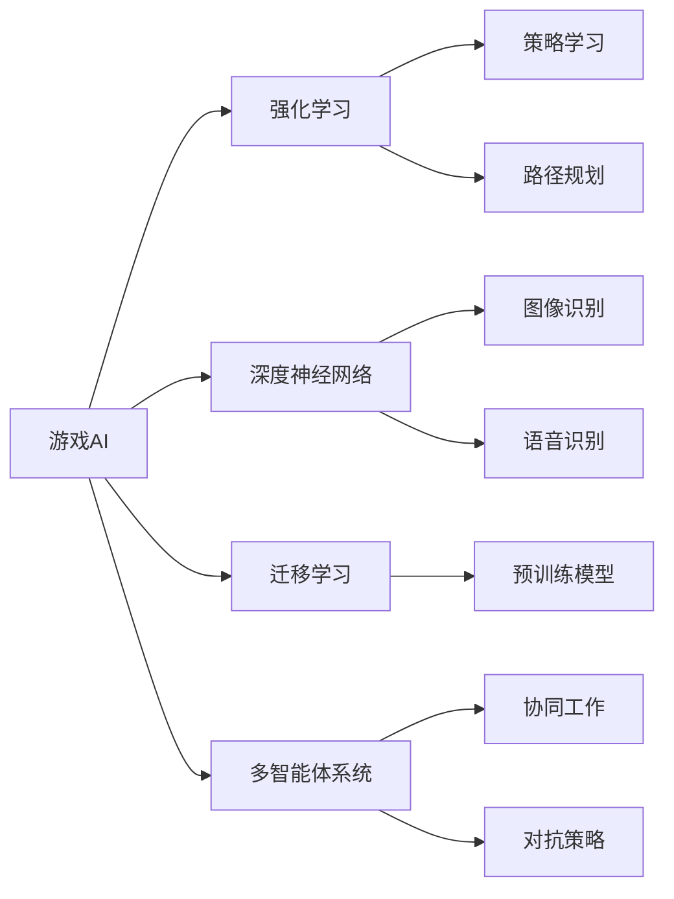

# 游戏AI：激发创新的大模型应用

作者：禅与计算机程序设计艺术 / Zen and the Art of Computer Programming


## 1. 背景介绍
### 1.1 问题的由来

随着人工智能技术的飞速发展，游戏AI已经成为人工智能应用领域的一个重要分支。从简单的走迷宫、猜数字，到复杂的棋类游戏、电子竞技，再到如今的大型开放世界游戏，游戏AI在游戏设计、开发、测试和体验等多个环节都发挥着越来越重要的作用。然而，随着游戏内容和形式的日益丰富，游戏AI的复杂性和挑战性也在不断上升。如何设计高效、智能、有趣的游戏AI，成为游戏开发者们亟待解决的问题。

### 1.2 研究现状

近年来，基于深度学习的大模型技术在游戏AI领域取得了显著的进展。以Transformer为代表的神经网络模型，在自然语言处理、计算机视觉等领域的成功应用，为游戏AI提供了新的思路和方法。以下是一些主流的游戏AI研究现状：

1. **强化学习**：强化学习是游戏AI研究中最热门的领域之一。通过让AI在与环境的交互中学习如何做出最优决策，强化学习可以训练出具有高度智能的游戏AI。目前，强化学习在游戏AI中的应用主要集中在路径规划、策略决策和对抗策略等方面。

2. **深度神经网络**：深度神经网络在图像识别、语音识别等领域的成功，使得其在游戏AI中的应用也日益广泛。例如，可以使用深度神经网络进行角色动作识别、物体识别和场景理解等。

3. **迁移学习**：迁移学习可以通过利用其他领域的知识来加速游戏AI的训练过程。例如，可以将其他领域的预训练模型应用到游戏AI中，从而减少训练时间和计算资源。

4. **多智能体系统**：多智能体系统是游戏AI研究中的一个重要方向，旨在设计出能够与人类或其他AI智能体协同工作的智能体。例如，可以使用多智能体系统来实现多人游戏的AI对抗策略。

### 1.3 研究意义

游戏AI的研究具有重要的理论意义和应用价值：

1. **推动人工智能技术的发展**：游戏AI涉及多个人工智能领域，如强化学习、深度学习、多智能体系统等，可以为这些领域的研究提供新的思路和方法。

2. **提升游戏体验**：智能的游戏AI可以提升游戏的趣味性和挑战性，为玩家带来更加丰富、真实的游戏体验。

3. **促进游戏产业发展**：游戏AI可以应用于游戏开发、测试、优化和推广等环节，提高游戏产业的效率和质量。

4. **拓展人工智能应用**：游戏AI可以拓展人工智能在娱乐、教育、医疗等领域的应用，为人类社会带来更多福祉。

### 1.4 本文结构

本文将从以下方面对游戏AI进行探讨：

- 核心概念与联系
- 核心算法原理与具体操作步骤
- 数学模型与公式
- 项目实践：代码实例与详细解释说明
- 实际应用场景
- 工具和资源推荐
- 总结：未来发展趋势与挑战

## 2. 核心概念与联系

为了更好地理解游戏AI，以下是一些核心概念及其相互之间的联系：



如图所示，游戏AI可以基于多种人工智能技术进行构建，包括强化学习、深度神经网络、迁移学习和多智能体系统等。这些技术可以相互结合，以实现更加复杂、智能的游戏AI。

## 3. 核心算法原理与具体操作步骤
### 3.1 算法原理概述

本节将介绍游戏AI中几种重要的算法原理，包括：

1. **强化学习**：强化学习是一种通过与环境交互来学习如何做出最优决策的方法。它通过奖励信号来引导AI不断优化其行为策略。

2. **深度神经网络**：深度神经网络是一种包含多层节点的神经网络模型，通过学习大量数据来提取特征并进行预测。

3. **迁移学习**：迁移学习是一种利用其他领域的知识来加速学习过程的方法。在游戏AI中，可以将其他领域的预训练模型应用到游戏AI中。

4. **多智能体系统**：多智能体系统是由多个智能体组成的系统，它们可以相互协作或竞争，以实现共同的目标。

### 3.2 算法步骤详解

以下分别介绍这些算法的具体操作步骤：

**强化学习**

1. **定义环境**：首先需要定义游戏环境，包括游戏状态、动作空间、奖励函数等。

2. **设计智能体**：设计智能体，包括决策策略、动作选择、状态更新等。

3. **训练智能体**：通过与环境交互，让智能体学习如何做出最优决策。

4. **评估智能体**：评估智能体的性能，并根据评估结果调整智能体的策略。

**深度神经网络**

1. **数据预处理**：对游戏数据进行预处理，如图像识别、语音识别等。

2. **设计网络结构**：设计合适的网络结构，如卷积神经网络、循环神经网络等。

3. **训练网络**：使用训练数据进行网络训练，优化网络参数。

4. **测试网络**：使用测试数据测试网络性能，并根据测试结果调整网络结构。

**迁移学习**

1. **选择预训练模型**：选择合适的预训练模型，如VGG、ResNet等。

2. **数据预处理**：对游戏数据进行预处理，使其与预训练模型输入格式一致。

3. **微调预训练模型**：在游戏数据上微调预训练模型，优化模型参数。

4. **评估微调模型**：评估微调模型性能，并根据评估结果调整模型参数。

**多智能体系统**

1. **设计智能体**：设计每个智能体的行为策略，包括决策规则、动作选择等。

2. **协同工作**：设计智能体之间的协同工作策略，如合作、竞争等。

3. **训练智能体**：通过与环境交互，让智能体学习如何与同伴协同工作。

4. **评估智能体**：评估智能体的协同工作能力，并根据评估结果调整策略。

### 3.3 算法优缺点

以下分别介绍这些算法的优缺点：

**强化学习**

优点：能够学习到复杂、动态的环境中的最优策略。

缺点：训练过程可能需要大量的时间和资源，且难以解释。

**深度神经网络**

优点：能够学习到丰富的特征，并能够处理复杂的数据。

缺点：需要大量的训练数据和计算资源，且难以解释。

**迁移学习**

优点：可以快速地利用其他领域的知识来加速学习过程。

缺点：可能存在知识迁移不足的问题。

**多智能体系统**

优点：可以实现复杂的行为和决策。

缺点：设计难度较大，需要考虑多个智能体之间的交互和协作。

### 3.4 算法应用领域

以下分别介绍这些算法的应用领域：

**强化学习**

- 游戏AI：如路径规划、策略决策、对抗策略等。

**深度神经网络**

- 图像识别：如角色动作识别、物体识别、场景理解等。

- 语音识别：如语音控制、语音合成等。

**迁移学习**

- 图像识别：如图像分类、目标检测等。

- 语音识别：如语音合成、语音识别等。

**多智能体系统**

- 多人游戏：如团队协作、对抗策略等。

- 自主导航：如无人驾驶、无人机编队等。

## 4. 数学模型与公式

本节将介绍游戏AI中几种重要的数学模型和公式：

### 4.1 数学模型构建

**强化学习**

- 状态空间：$S$，表示游戏当前的状态。

- 动作空间：$A$，表示游戏可执行的动作。

- 奖励函数：$R(s,a)$，表示执行动作$a$后获得的奖励。

- 状态转移函数：$P(s',s,a)$，表示在状态$s$下执行动作$a$后转移到状态$s'$的概率。

- 策略函数：$\pi(s)$，表示在状态$s$下选择动作$a$的概率。

**深度神经网络**

- 激活函数：如ReLU、Sigmoid、Tanh等。

- 神经网络结构：如卷积神经网络、循环神经网络等。

**迁移学习**

- 特征提取器：如卷积神经网络、循环神经网络等。

- 预训练模型：如VGG、ResNet等。

**多智能体系统**

- 智能体动作：$a_i$，表示第$i$个智能体的动作。

- 智能体策略：$\pi_i(s_i)$，表示第$i$个智能体在状态$s_i$下选择动作$a_i$的概率。

### 4.2 公式推导过程

以下分别介绍这些模型的公式推导过程：

**强化学习**

- Q值函数：$Q(s,a) = \sum_{s'} P(s'|s,a) \cdot [R(s,a) + \gamma \max_{a'} Q(s',a') - Q(s,a)]$

**深度神经网络**

- 神经网络输出：$y = \sigma(W^T x + b)$

**迁移学习**

- 预训练模型参数：$W_{\text{pretrain}}$

- 微调模型参数：$W_{\text{finetune}}$

**多智能体系统**

- 智能体策略更新：$\pi_i(s_i) \leftarrow \pi_i(s_i) + \alpha \nabla_{\pi_i(s_i)} J(\pi_i(s_i))$

### 4.3 案例分析与讲解

以下以强化学习为例，分析一个简单的游戏AI案例：

**案例：简单的迷宫游戏**

- 环境定义：迷宫由一系列房间组成，每个房间连接着其他房间或终点。游戏的目标是找到通往终点的路径。
- 智能体设计：智能体在迷宫中移动，可以选择向左、向右、向上、向下移动。
- 训练过程：智能体通过与环境交互，学习如何找到通往终点的路径。
- 评估指标：成功找到终点的次数。

通过强化学习，我们可以训练出一个能够高效找到迷宫终点的智能体。该案例展示了强化学习在游戏AI中的应用潜力。

### 4.4 常见问题解答

**Q1：强化学习是否适用于所有游戏AI任务？**

A1：强化学习适用于需要学习策略或决策的游戏AI任务，如路径规划、策略决策、对抗策略等。但对于需要识别、分类等任务，可能需要其他类型的AI技术。

**Q2：深度神经网络是否可以用于游戏AI？**

A2：是的，深度神经网络可以用于游戏AI。例如，可以使用深度神经网络进行图像识别、语音识别、场景理解等任务。

**Q3：迁移学习在游戏AI中的应用有哪些？**

A3：迁移学习可以用于游戏AI的多个方面，如使用预训练模型进行图像识别、语音识别、场景理解等任务。

**Q4：多智能体系统在游戏AI中的应用有哪些？**

A4：多智能体系统可以用于多人游戏、无人驾驶、无人机编队等游戏AI任务。

## 5. 项目实践：代码实例与详细解释说明
### 5.1 开发环境搭建

为了方便进行游戏AI的实践，以下介绍如何搭建开发环境：

1. **安装Python**：从Python官网下载并安装Python 3.x版本。

2. **安装PyTorch**：从PyTorch官网下载并安装PyTorch。

3. **安装其他库**：使用pip安装以下库：

   ```bash
   pip install gym stable-baselines3 torch torchvision matplotlib numpy
   ```

### 5.2 源代码详细实现

以下以使用PyTorch和stable-baselines3库实现一个简单的迷宫游戏AI为例，介绍如何进行游戏AI的实践：

```python
import gym
import torch
from stable_baselines3 import PPO

# 创建迷宫游戏环境
env = gym.make("MyMaze-v0")

# 定义策略网络
class MazePolicy(torch.nn.Module):
    def __init__(self):
        super(MazePolicy, self).__init__()
        self.fc = torch.nn.Linear(2, 4)

    def forward(self, x):
        x = self.fc(x)
        return torch.softmax(x, dim=1)

# 实例化策略网络和训练器
policy = MazePolicy()
optimizer = torch.optim.Adam(policy.parameters())
ppo = PPO("MazePolicy", policy, device="cpu", verbose=1)

# 训练策略网络
for i in range(1000):
    obs = env.reset()
    done = False
    while not done:
        action = policy(torch.tensor(obs)).argmax()
        next_obs, reward, done, _ = env.step(action)
        obs = next_obs
    loss = ppo.compute_loss()
    optimizer.zero_grad()
    loss.backward()
    optimizer.step()
```

### 5.3 代码解读与分析

上述代码展示了如何使用PyTorch和stable-baselines3库实现一个简单的迷宫游戏AI。

1. 首先，导入必要的库。

2. 创建迷宫游戏环境，并定义策略网络。策略网络是一个简单的全连接神经网络，其输入为当前迷宫的状态，输出为四个方向的概率分布。

3. 实例化策略网络和训练器。这里使用PPO算法进行策略优化。

4. 训练策略网络。通过与环境交互，让策略网络学习如何做出最优决策。

5. 训练完成后，策略网络可以用于控制迷宫游戏中的智能体，使其能够找到通往终点的路径。

### 5.4 运行结果展示

运行上述代码后，可以看到智能体在迷宫中不断尝试不同的路径，直到找到终点。

## 6. 实际应用场景
### 6.1 游戏设计

游戏AI可以用于游戏设计，例如：

1. **角色行为设计**：通过训练AI角色，使其能够模拟真实人物的行为，如走动、交谈、互动等。

2. **剧情生成**：利用AI生成游戏剧情，提高游戏的可玩性。

3. **游戏平衡性调整**：通过分析玩家行为，自动调整游戏难度和平衡性。

### 6.2 游戏开发

游戏AI可以用于游戏开发，例如：

1. **路径规划**：为游戏中的NPC、玩家或车辆提供高效的路径规划算法。

2. **动作识别**：识别玩家的动作，如跳跃、奔跑、射击等。

3. **场景理解**：理解游戏场景中的物体、人物和环境，为游戏AI提供决策依据。

### 6.3 游戏测试

游戏AI可以用于游戏测试，例如：

1. **自动测试**：自动生成测试用例，对游戏进行测试，提高测试效率。

2. **异常检测**：检测游戏中的异常行为，如崩溃、卡顿等。

3. **性能评估**：评估游戏性能，如帧率、内存占用等。

### 6.4 未来应用展望

未来，游戏AI将在以下方面得到进一步发展：

1. **多智能体系统**：实现更加复杂的多人游戏AI，如团队合作、对抗策略等。

2. **情感模拟**：模拟人类情感，使游戏AI更加具有真实感。

3. **知识推理**：利用知识库和推理引擎，使游戏AI能够进行更复杂的决策。

4. **虚拟现实(VR)和增强现实(AR)应用**：将游戏AI应用于VR和AR游戏，提供更加沉浸式的游戏体验。

## 7. 工具和资源推荐
### 7.1 学习资源推荐

以下是一些学习游戏AI的资源推荐：

1. **书籍**：

   - 《深度学习游戏AI》
   - 《强化学习》
   - 《深度学习》
   - 《人工智能：一种现代的方法》

2. **在线课程**：

   - Coursera上的《深度学习》
   - Udacity上的《强化学习工程师纳米学位》
   - edX上的《深度学习》

3. **开源库**：

   - PyTorch
   - TensorFlow
   - Stable Baselines3

### 7.2 开发工具推荐

以下是一些游戏AI开发工具推荐：

1. **游戏引擎**：

   - Unity
   - Unreal Engine
   - Godot

2. **AI框架**：

   - PyTorch
   - TensorFlow

3. **模拟环境**：

   - OpenAI Gym
   - MuJoCo

### 7.3 相关论文推荐

以下是一些游戏AI相关的论文推荐：

1. **《Deep Reinforcement Learning for Agent-based Games》**

2. **《Deep Learning for Games》**

3. **《Deep Learning and Reinforcement Learning in Games》**

### 7.4 其他资源推荐

以下是一些其他游戏AI资源推荐：

1. **GitHub上的游戏AI项目**

2. **游戏AI相关的博客和论坛**

3. **游戏AI相关的会议和研讨会**

## 8. 总结：未来发展趋势与挑战
### 8.1 研究成果总结

本文对游戏AI进行了全面系统的介绍，涵盖了核心概念、算法原理、实际应用场景等方面。通过本文的学习，读者可以了解到游戏AI的最新研究进展和应用趋势。

### 8.2 未来发展趋势

未来，游戏AI将在以下方面得到进一步发展：

1. **更加智能的行为**：游戏AI将能够更好地模拟人类行为，提供更加真实的游戏体验。

2. **更加丰富的情感**：游戏AI将能够模拟人类情感，使游戏更加具有情感共鸣。

3. **更加智能的决策**：游戏AI将能够做出更加智能的决策，提供更加有趣的挑战。

4. **更加广泛的领域应用**：游戏AI将在更多领域得到应用，如教育、医疗、工业等。

### 8.3 面临的挑战

尽管游戏AI取得了显著的进展，但在实际应用过程中仍面临以下挑战：

1. **数据获取**：游戏AI需要大量数据来训练模型，但获取高质量的游戏数据可能存在困难。

2. **模型可解释性**：游戏AI的决策过程往往难以解释，这可能会对游戏的公平性和安全性产生影响。

3. **计算资源**：训练和运行游戏AI模型需要大量的计算资源，这可能会限制其在实际应用中的推广。

4. **伦理和社会影响**：游戏AI可能会对游戏产业和社会产生一些负面影响，如游戏成瘾、价值观扭曲等。

### 8.4 研究展望

为了克服以上挑战，未来的游戏AI研究需要关注以下方向：

1. **数据增强**：开发新的数据增强技术，以缓解数据获取困难的问题。

2. **模型可解释性**：研究模型可解释性方法，提高游戏AI的透明度和可信度。

3. **计算优化**：优化游戏AI模型的结构和算法，降低计算资源需求。

4. **伦理和社会影响**：关注游戏AI的伦理和社会影响，确保其在实际应用中的可持续发展。

相信通过不断的努力，游戏AI技术必将迎来更加美好的未来。

## 9. 附录：常见问题与解答

以下是一些关于游戏AI的常见问题及解答：

**Q1：游戏AI与人类玩家相比，有哪些优势？**

A1：游戏AI在计算速度、精度和可重复性方面具有优势，但可能在创造性和情感共鸣方面不如人类玩家。

**Q2：游戏AI在游戏设计中的作用有哪些？**

A2：游戏AI可以用于角色行为设计、剧情生成、游戏平衡性调整等。

**Q3：游戏AI在游戏开发中的作用有哪些？**

A3：游戏AI可以用于路径规划、动作识别、场景理解等。

**Q4：游戏AI在游戏测试中的作用有哪些？**

A4：游戏AI可以用于自动测试、异常检测、性能评估等。

**Q5：游戏AI的未来发展趋势是什么？**

A5：游戏AI将朝着更加智能、情感丰富、可解释、可持续发展的方向发展。

**Q6：游戏AI在伦理和社会方面有哪些挑战？**

A6：游戏AI可能会对游戏产业和社会产生一些负面影响，如游戏成瘾、价值观扭曲等。

**Q7：如何学习游戏AI技术？**

A7：可以通过学习相关的书籍、课程、开源库和实践项目来学习游戏AI技术。

**Q8：游戏AI在哪些领域有潜在的应用？**

A8：游戏AI在游戏设计、开发、测试、教育、医疗、工业等领域有潜在的应用。