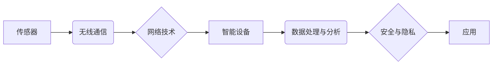

# 物联网 (Internet of Things)

作者：禅与计算机程序设计艺术 / Zen and the Art of Computer Programming

## 1. 背景介绍
### 1.1 问题的由来

随着信息技术的飞速发展，人类社会正逐渐进入一个万物互联的时代。物联网（Internet of Things，简称IoT）作为新一代信息技术的核心驱动力，将广泛应用于工业、交通、医疗、家居、农业等各个领域，为人们的生活和工作带来巨大的变革。

物联网的核心理念是通过传感器、网络和智能设备等技术，将现实世界中的物理设备连接到互联网，实现设备与设备之间、设备与人类之间的信息交互和智能控制。这种连接和交互将极大提高资源利用效率，降低人力成本，提升生产生活品质。

### 1.2 研究现状

近年来，物联网技术取得了显著的进展。从硬件层面，传感器、无线通信技术等取得了突破性进展，使得设备连接变得更加容易和高效；从软件层面，云计算、大数据、人工智能等技术为物联网应用提供了强大的数据分析和处理能力。

当前，物联网研究主要集中在以下几个方面：

- **传感器技术**：发展高精度、低功耗、低成本、小型化的传感器，提高传感器在复杂环境下的适应性。
- **无线通信技术**：研究新型无线通信协议和标准，提高网络传输速率和覆盖范围，降低能耗。
- **数据处理与分析**：利用大数据和人工智能技术，对物联网数据进行深度挖掘和分析，实现智能决策和优化。
- **安全与隐私**：加强物联网设备的安全防护，保护用户隐私和数据安全。
- **标准化与互联互通**：推动物联网技术标准化，实现不同厂商、不同平台之间的互联互通。

### 1.3 研究意义

物联网技术的研究具有重要意义：

- **提高资源利用效率**：通过智能调度和优化，实现能源、水资源、土地等资源的合理利用。
- **降低人力成本**：自动化、智能化的设备和服务，可以替代部分人力工作，降低人力成本。
- **提升生产生活品质**：为人们提供更加便捷、舒适、安全的生活和工作环境。
- **推动产业升级**：促进传统产业向智能化、绿色化、服务化方向发展，推动产业结构调整和转型升级。

### 1.4 本文结构

本文将从物联网的核心概念、关键技术、应用场景、未来发展趋势等方面进行探讨，旨在为读者全面了解物联网技术提供参考。

## 2. 核心概念与联系

### 2.1 物联网的基本概念

物联网是指通过传感器、网络和智能设备等技术，将现实世界中的物理设备连接到互联网，实现设备与设备之间、设备与人类之间的信息交互和智能控制。

### 2.2 物联网的关键技术

物联网的关键技术包括：

- **传感器技术**：用于感知和采集环境信息，如温度、湿度、光照、声音等。
- **无线通信技术**：用于设备之间的数据传输，如Wi-Fi、蓝牙、ZigBee、LoRa等。
- **网络技术**：用于连接设备和互联网，如移动通信网络、局域网、广域网等。
- **智能设备**：具备处理和执行任务的能力，如智能家电、工业机器人、无人驾驶汽车等。
- **数据处理与分析**：对物联网数据进行收集、存储、处理和分析，实现智能决策和优化。
- **安全与隐私**：保障物联网设备、网络和数据的安全，保护用户隐私。

### 2.3 物联网的技术关系

物联网的技术关系可以用以下Mermaid流程图表示：



其中，A表示传感器采集环境信息，通过B进行无线通信，C表示网络技术将设备连接到互联网，D表示智能设备对数据进行处理和执行任务，E表示数据处理与分析，F表示安全与隐私，G表示物联网应用。

## 3. 核心算法原理 & 具体操作步骤
### 3.1 算法原理概述

物联网的核心算法包括数据采集、数据传输、数据处理与分析、智能决策等。

- **数据采集**：传感器采集环境信息，如温度、湿度、光照、声音等。
- **数据传输**：通过无线通信技术将数据传输到服务器或终端设备。
- **数据处理与分析**：对数据进行存储、清洗、转换、分析和挖掘，提取有价值的信息。
- **智能决策**：根据分析结果，智能设备或系统做出决策，控制设备或优化资源。

### 3.2 算法步骤详解

以下以智能家居场景为例，介绍物联网算法的具体操作步骤：

1. **数据采集**：使用温度传感器、湿度传感器、光照传感器等设备采集家居环境信息。
2. **数据传输**：将采集到的数据通过Wi-Fi、蓝牙等无线通信技术传输到智能家居控制中心。
3. **数据处理与分析**：在智能家居控制中心，对传输来的数据进行存储、清洗、转换和分析，提取出室温、湿度、光照等关键信息。
4. **智能决策**：根据分析结果，智能家居控制中心自动调节空调、加湿器、窗帘等设备，实现恒温恒湿、自动调节光照等。

### 3.3 算法优缺点

物联网算法具有以下优点：

- **实时性**：能够实时采集、传输和处理数据，快速响应环境变化。
- **高效性**：能够高效地处理大量数据，快速做出决策。
- **智能化**：能够根据分析结果自动调节设备或优化资源，提高生活品质。

物联网算法也存在以下缺点：

- **数据安全**：需要保障数据在采集、传输、存储和处理过程中的安全，防止数据泄露和恶意攻击。
- **隐私保护**：需要保护用户隐私，避免用户信息泄露。
- **能耗**：物联网设备需要消耗大量能源，需要降低能耗，提高能源利用效率。

### 3.4 算法应用领域

物联网算法在以下领域得到广泛应用：

- **智能家居**：实现家居环境的智能控制，提高生活品质。
- **智能交通**：优化交通流量，提高交通效率，降低交通事故率。
- **智能医疗**：实现远程医疗、健康管理等功能，提高医疗服务水平。
- **智能工业**：实现生产过程的自动化、智能化，提高生产效率，降低生产成本。
- **智慧城市**：实现城市基础设施的智能化管理，提高城市运行效率。

## 4. 数学模型和公式 & 详细讲解 & 举例说明
### 4.1 数学模型构建

物联网的数学模型主要包括：

- **传感器模型**：描述传感器输出与物理量之间的关系，如线性模型、非线性模型等。
- **通信模型**：描述无线通信系统中信号传输、信道模型、信号处理等。
- **数据处理模型**：描述数据处理过程，如数据清洗、数据转换、数据分析等。
- **智能决策模型**：描述智能决策过程，如决策树、神经网络等。

### 4.2 公式推导过程

以下以传感器模型为例，介绍数学公式的推导过程。

假设传感器输出为 $y$，物理量为 $x$，则线性传感器模型可以表示为：

$$
y = ax + b
$$

其中，$a$ 为比例系数，$b$ 为偏移量。

### 4.3 案例分析与讲解

以下以智能家居场景为例，分析物联网算法的实际应用。

**案例背景**：用户希望实现家居环境的恒温恒湿、自动调节光照等功能。

**数据采集**：使用温度传感器、湿度传感器、光照传感器等设备采集家居环境信息。

**数据传输**：将采集到的数据通过Wi-Fi、蓝牙等无线通信技术传输到智能家居控制中心。

**数据处理与分析**：在智能家居控制中心，对传输来的数据进行存储、清洗、转换和分析，提取出室温、湿度、光照等关键信息。

**智能决策**：根据分析结果，智能家居控制中心自动调节空调、加湿器、窗帘等设备，实现恒温恒湿、自动调节光照等。

### 4.4 常见问题解答

**Q1：物联网数据安全如何保障？**

A：保障物联网数据安全需要从以下几个方面入手：
- 采用加密技术对数据进行加密传输和存储。
- 建立完善的安全认证体系，防止未授权访问。
- 制定数据访问策略，限制对敏感数据的访问。
- 定期对系统进行安全检查和漏洞修复。

**Q2：物联网设备如何节能？**

A：物联网设备节能可以从以下几个方面入手：
- 选择低功耗的硬件设备。
- 采用节能的通信协议和算法。
- 对设备进行智能管理，如根据设备使用情况调整工作模式。

**Q3：物联网设备如何保证互联互通？**

A：为了保证物联网设备的互联互通，需要：
- 推动物联网技术标准化。
- 采用通用的通信协议和数据格式。
- 建立设备认证和授权机制。

## 5. 项目实践：代码实例和详细解释说明
### 5.1 开发环境搭建

以下是使用Python进行物联网项目开发的开发环境搭建步骤：

1. 安装Python开发环境：从官网下载并安装Python，选择合适的版本。
2. 安装PyTorch：使用pip安装PyTorch，根据CUDA版本选择合适的版本。
3. 安装其他库：安装常用的Python库，如NumPy、Pandas、Matplotlib等。
4. 安装物联网开发板：根据项目需求选择合适的物联网开发板，如树莓派、ESP32等。

### 5.2 源代码详细实现

以下以使用树莓派开发智能家居为例，介绍物联网项目的代码实现。

**代码1：环境配置**

```python
import RPi.GPIO as GPIO
from sensehat import SenseHat

# 初始化树莓派GPIO
GPIO.setmode(GPIO.BCM)

# 初始化Sense HAT
hat = SenseHat()

# 设置LED灯为蓝色
hat.set_pixels([[0, 0, 255] for _ in range(8*8)])
```

**代码2：传感器数据采集**

```python
import time

def read_temperature():
    # 读取温度传感器数据
    temp = hat.get_temperature()
    return temp

def read_humidity():
    # 读取湿度传感器数据
    humidity = hat.get_humidity()
    return humidity

def read_light():
    # 读取光照传感器数据
    light = hat.get_light()
    return light
```

**代码3：智能决策**

```python
def control_air_conditioner(temp):
    # 控制空调
    if temp > 30:
        print("开启空调")
    else:
        print("关闭空调")

def control_humidifier(humidity):
    # 控制加湿器
    if humidity < 30:
        print("开启加湿器")
    else:
        print("关闭加湿器")

def control_curtains(light):
    # 控制窗帘
    if light > 100:
        print("关闭窗帘")
    else:
        print("打开窗帘")
```

### 5.3 代码解读与分析

**代码1**：初始化树莓派GPIO和Sense HAT。

**代码2**：定义读取温度、湿度、光照等传感器数据的函数。

**代码3**：根据采集到的数据，控制空调、加湿器、窗帘等设备。

### 5.4 运行结果展示

运行上述代码后，树莓派将读取温度、湿度、光照等传感器数据，并根据数据自动控制空调、加湿器、窗帘等设备，实现智能家居功能。

## 6. 实际应用场景
### 6.1 智能家居

智能家居是物联网应用最典型的场景之一。通过将家电设备连接到互联网，实现远程控制、自动调节等功能，提高生活品质。

### 6.2 智能交通

智能交通系统通过物联网技术，实现交通流量监控、信号控制、停车管理等功能，提高交通效率，降低交通事故率。

### 6.3 智能医疗

物联网技术在医疗领域的应用包括远程医疗、健康管理、智能诊断等，提高医疗服务水平，改善患者生活质量。

### 6.4 智能工业

物联网技术在工业领域的应用包括设备监控、生产管理、能源管理等功能，提高生产效率，降低生产成本。

### 6.5 智慧城市

智慧城市通过物联网技术，实现城市基础设施的智能化管理，提高城市运行效率，提升市民生活质量。

## 7. 工具和资源推荐
### 7.1 学习资源推荐

1. **《物联网技术基础》**：介绍了物联网的基本概念、关键技术、应用场景等。
2. **《Python编程：从入门到实践》**：介绍了Python编程语言，适合初学者学习。
3. **《树莓派从入门到实践》**：介绍了树莓派的开发和应用。

### 7.2 开发工具推荐

1. **树莓派**：一款低成本、低功耗的微型计算机，适合物联网项目开发。
2. **ESP32**：一款高性能的物联网开发板，具备Wi-Fi、蓝牙等功能。
3. **Arduino**：一款开源的硬件平台，适合初学者入门。

### 7.3 相关论文推荐

1. **《Internet of Things: A Survey》**：对物联网技术进行了全面的综述。
2. **《The Internet of Things: A Survey of Enabling Technologies》**：介绍了物联网的使能技术。
3. **《A Survey on the Internet of Things: Architecture, Enabling Technologies, Security, and Privacy》**：对物联网的架构、使能技术、安全和隐私进行了研究。

### 7.4 其他资源推荐

1. **Arduino官网**：提供了Arduino开发板和配套软件。
2. **树莓派官网**：提供了树莓派开发板和配套软件。
3. **ESP32官网**：提供了ESP32开发板和配套软件。

## 8. 总结：未来发展趋势与挑战
### 8.1 研究成果总结

物联网技术经过多年的发展，取得了显著的成果。从硬件、软件到应用，物联网技术已经渗透到各个领域，为人们的生活和工作带来了巨大的变革。

### 8.2 未来发展趋势

物联网技术未来将呈现以下发展趋势：

- **更广泛的连接**：物联网设备将更加丰富多样，连接范围将更加广泛。
- **更智能的设备**：设备将具备更强的处理和决策能力，实现更加智能化的应用。
- **更安全、可靠**：加强物联网设备的安全性和可靠性，保障用户数据安全和隐私。
- **更高效、节能**：采用节能技术，降低物联网设备的能耗。
- **更开放、标准化**：推动物联网技术标准化，促进不同厂商、不同平台之间的互联互通。

### 8.3 面临的挑战

物联网技术在实际应用中仍面临以下挑战：

- **安全性**：物联网设备、网络和数据的安全问题需要得到有效解决。
- **隐私保护**：用户隐私保护问题需要得到重视。
- **标准化**：推动物联网技术标准化，促进不同厂商、不同平台之间的互联互通。
- **能耗**：物联网设备的能耗问题需要得到有效控制。
- **人才**：物联网技术人才短缺，需要加强人才培养。

### 8.4 研究展望

物联网技术的研究需要从以下几个方面进行：

- **安全性**：加强物联网设备的安全防护，保护用户数据安全。
- **隐私保护**：研究用户隐私保护技术，保护用户隐私。
- **标准化**：推动物联网技术标准化，促进不同厂商、不同平台之间的互联互通。
- **节能**：研究节能技术，降低物联网设备的能耗。
- **人才培养**：加强物联网技术人才培养，为物联网发展提供人才保障。

相信通过不断的技术创新和产业应用，物联网技术必将在未来发挥更加重要的作用，推动人类社会向更加智能化、高效化、绿色化的方向发展。