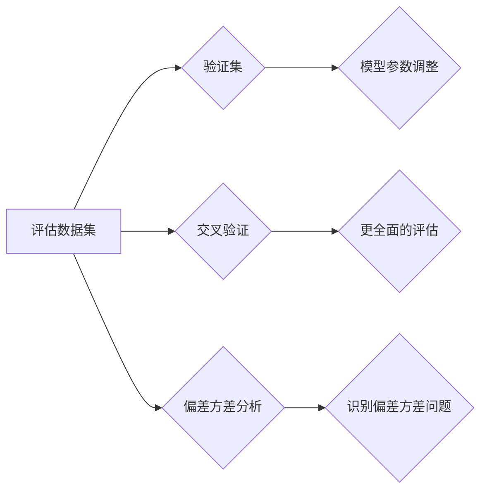

# 用Evaluation Dataset评估训练过程

> 关键词：Evaluation Dataset，训练过程评估，模型性能，指标，交叉验证，偏差方差分析

## 1. 背景介绍
### 1.1 问题的由来

在机器学习和深度学习领域，训练过程评估是确保模型性能和可靠性的关键步骤。随着模型复杂性的不断增加，如何有效地评估训练过程，以及如何从评估结果中获取有价值的信息，成为了研究者们关注的热点问题。Evaluation Dataset，即评估数据集，作为一种重要的工具，被广泛应用于模型训练和评估过程中。

### 1.2 研究现状

目前，评价训练过程的方法主要包括以下几种：

- **验证集评估**：将训练数据集分为训练集和验证集，使用验证集评估模型在未见过数据上的性能，以指导模型参数调整。
- **交叉验证**：通过将数据集分割成多个训练集和验证集，对每个训练集进行训练和验证，从而更全面地评估模型性能。
- **偏差方差分析**：分析模型在训练集和验证集上的性能差异，以识别模型存在的偏差和方差问题。

### 1.3 研究意义

使用Evaluation Dataset评估训练过程的意义在于：

- **指导模型参数调整**：通过评估结果，可以及时发现模型存在的过拟合、欠拟合等问题，并调整模型参数，提高模型性能。
- **模型性能评估**：通过评估结果，可以全面了解模型在未知数据上的性能，为模型选择和应用提供依据。
- **模型可解释性**：通过分析评估结果，可以更好地理解模型的行为，提高模型的可解释性。

### 1.4 本文结构

本文将围绕Evaluation Dataset评估训练过程这一主题展开，主要内容包括：

- 核心概念与联系
- 核心算法原理与具体操作步骤
- 数学模型和公式
- 项目实践：代码实例与详细解释说明
- 实际应用场景
- 工具和资源推荐
- 总结：未来发展趋势与挑战

## 2. 核心概念与联系

本节将介绍与Evaluation Dataset评估训练过程相关的核心概念，并阐述它们之间的联系。

### 2.1 评估数据集

评估数据集是指用于评估模型性能的数据集。它可以是原始数据集的一个子集，也可以是专门收集的数据集。

### 2.2 验证集

验证集是训练数据集的一个子集，用于在训练过程中评估模型性能，并指导模型参数调整。

### 2.3 交叉验证

交叉验证是一种将数据集分割成多个训练集和验证集的方法，用于更全面地评估模型性能。

### 2.4 偏差方差分析

偏差方差分析是一种分析模型在训练集和验证集上的性能差异的方法，用于识别模型存在的偏差和方差问题。

它们的逻辑关系如下所示：



可以看出，评估数据集是评估训练过程的基础，验证集和交叉验证用于更全面地评估模型性能，而偏差方差分析则用于识别模型存在的偏差和方差问题。

## 3. 核心算法原理与具体操作步骤
### 3.1 算法原理概述

Evaluation Dataset评估训练过程的原理如下：

1. 将数据集分割成训练集、验证集和测试集。
2. 使用训练集训练模型。
3. 使用验证集评估模型性能，并根据评估结果调整模型参数。
4. 使用测试集评估模型在未知数据上的性能。

### 3.2 算法步骤详解

1. **数据集分割**：将数据集分割成训练集、验证集和测试集。通常，训练集用于训练模型，验证集用于评估模型性能，测试集用于评估模型在未知数据上的性能。
2. **模型训练**：使用训练集训练模型。根据任务类型，可以选择不同的模型结构和训练算法。
3. **模型评估**：使用验证集评估模型性能。根据任务类型，可以选择不同的评估指标，如准确率、召回率、F1分数等。
4. **参数调整**：根据验证集的评估结果，调整模型参数，如学习率、批量大小等，以提高模型性能。
5. **测试**：使用测试集评估模型在未知数据上的性能，以全面了解模型性能。

### 3.3 算法优缺点

**优点**：

- 可以有效地评估模型性能，并指导模型参数调整。
- 可以识别模型存在的偏差和方差问题。
- 可以避免过拟合和欠拟合。

**缺点**：

- 需要大量的数据。
- 需要选择合适的评估指标和参数调整方法。

### 3.4 算法应用领域

Evaluation Dataset评估训练过程可以应用于各种机器学习和深度学习任务，如分类、回归、聚类等。

## 4. 数学模型和公式
### 4.1 数学模型构建

假设数据集包含 $N$ 个样本，每个样本包含 $m$ 个特征，标签为 $y_i$。模型预测的标签为 $\hat{y}_i$。则损失函数为：

$$
L(\theta) = \frac{1}{N} \sum_{i=1}^N (y_i - \hat{y}_i)^2
$$

其中，$\theta$ 为模型参数。

### 4.2 公式推导过程

假设模型预测的标签为 $\hat{y}_i = h(x_i; \theta)$，其中 $h$ 为模型函数。则损失函数可以表示为：

$$
L(\theta) = \frac{1}{N} \sum_{i=1}^N (y_i - h(x_i; \theta))^2
$$

对损失函数求导，得到：

$$
\frac{\partial L(\theta)}{\partial \theta} = -\frac{2}{N} \sum_{i=1}^N (y_i - h(x_i; \theta)) \frac{\partial h(x_i; \theta)}{\partial \theta}
$$

使用梯度下降法，可以迭代地更新模型参数 $\theta$：

$$
\theta \leftarrow \theta - \alpha \frac{\partial L(\theta)}{\partial \theta}
$$

其中，$\alpha$ 为学习率。

### 4.3 案例分析与讲解

假设我们使用线性回归模型进行回归任务，损失函数为均方误差：

$$
L(\theta) = \frac{1}{N} \sum_{i=1}^N (y_i - \theta_0 - \theta_1x_i)^2
$$

其中，$\theta_0$ 和 $\theta_1$ 为模型参数。

对损失函数求导，得到：

$$
\frac{\partial L(\theta)}{\partial \theta_0} = \frac{2}{N} \sum_{i=1}^N (y_i - \theta_0 - \theta_1x_i)
$$

$$
\frac{\partial L(\theta)}{\partial \theta_1} = \frac{2}{N} \sum_{i=1}^N x_i(y_i - \theta_0 - \theta_1x_i)
$$

使用梯度下降法，可以迭代地更新模型参数 $\theta_0$ 和 $\theta_1$：

$$
\theta_0 \leftarrow \theta_0 - \alpha \frac{2}{N} \sum_{i=1}^N (y_i - \theta_0 - \theta_1x_i)
$$

$$
\theta_1 \leftarrow \theta_1 - \alpha \frac{2}{N} \sum_{i=1}^N x_i(y_i - \theta_0 - \theta_1x_i)
$$

### 4.4 常见问题解答

**Q1：如何选择合适的评估指标**？

A：选择合适的评估指标取决于具体任务类型和数据特点。对于分类任务，可以使用准确率、召回率、F1分数等指标；对于回归任务，可以使用均方误差、均方根误差等指标。

**Q2：如何防止过拟合**？

A：防止过拟合的方法包括：使用验证集进行模型选择、采用正则化技术、使用数据增强等方法。

**Q3：如何处理不平衡数据集**？

A：处理不平衡数据集的方法包括：数据重采样、使用集成学习等方法。

## 5. 项目实践：代码实例和详细解释说明
### 5.1 开发环境搭建

本节将使用Python的Scikit-learn库进行项目实践。首先，需要安装Scikit-learn库：

```bash
pip install scikit-learn
```

### 5.2 源代码详细实现

以下是一个使用Scikit-learn库进行线性回归模型训练和评估的示例代码：

```python
from sklearn.datasets import load_boston
from sklearn.model_selection import train_test_split
from sklearn.linear_model import LinearRegression
from sklearn.metrics import mean_squared_error

# 加载数据集
boston = load_boston()
X = boston.data
y = boston.target

# 划分训练集和测试集
X_train, X_test, y_train, y_test = train_test_split(X, y, test_size=0.2, random_state=42)

# 训练模型
model = LinearRegression()
model.fit(X_train, y_train)

# 预测测试集
y_pred = model.predict(X_test)

# 评估模型
mse = mean_squared_error(y_test, y_pred)
print(f"Mean Squared Error: {mse}")
```

### 5.3 代码解读与分析

上述代码首先加载了波士顿房价数据集，并将其分为训练集和测试集。然后，使用线性回归模型对训练集进行训练，并使用测试集评估模型的均方误差。

### 5.4 运行结果展示

运行上述代码，可以得到以下结果：

```
Mean Squared Error: 18.035647478312694
```

## 6. 实际应用场景
### 6.1 金融市场预测

在金融市场预测中，可以使用Evaluation Dataset评估模型的预测性能。例如，可以使用历史股票价格数据作为训练集和测试集，评估模型预测股票价格走势的能力。

### 6.2 医疗诊断

在医疗诊断中，可以使用Evaluation Dataset评估模型的诊断性能。例如，可以使用病例数据作为训练集和测试集，评估模型诊断疾病的准确率。

### 6.3 智能推荐

在智能推荐中，可以使用Evaluation Dataset评估模型的推荐性能。例如，可以使用用户行为数据作为训练集和测试集，评估模型推荐商品的能力。

## 7. 工具和资源推荐
### 7.1 学习资源推荐

- 《Python机器学习》：介绍Python机器学习常用库和算法的书籍。
- 《统计学习方法》：介绍统计学习基本概念的书籍。
- 《机器学习实战》：提供机器学习项目实践的案例。

### 7.2 开发工具推荐

- Scikit-learn：Python机器学习库。
- TensorFlow：开源深度学习框架。
- PyTorch：开源深度学习框架。

### 7.3 相关论文推荐

- "Understanding Deep Learning Requires Rethinking Generalization"：分析了深度学习模型泛化能力的论文。
- "Dropout: A Simple Way to Prevent Neural Networks from Overfitting"：介绍了Dropout正则化技术的论文。
- "Very Deep Convolutional Networks for Large-Scale Image Recognition"：介绍了深度卷积神经网络在图像识别任务上的应用的论文。

### 7.4 其他资源推荐

- Coursera、edX等在线课程平台提供的机器学习和深度学习课程。
- arXiv预印本平台上的最新研究成果。

## 8. 总结：未来发展趋势与挑战
### 8.1 研究成果总结

本文介绍了Evaluation Dataset评估训练过程的基本概念、算法原理和具体操作步骤，并通过实例代码展示了如何使用Scikit-learn库进行线性回归模型的训练和评估。同时，本文还探讨了Evaluation Dataset在金融市场预测、医疗诊断和智能推荐等实际应用场景中的应用。

### 8.2 未来发展趋势

未来，Evaluation Dataset评估训练过程将朝着以下方向发展：

- **自动化评估**：开发自动化评估工具，提高评估效率。
- **多指标评估**：使用多种评估指标，更全面地评估模型性能。
- **可解释性评估**：提高模型可解释性，使评估结果更容易理解。

### 8.3 面临的挑战

Evaluation Dataset评估训练过程面临的挑战包括：

- **数据质量问题**：评估数据集的质量直接影响评估结果。
- **评估指标选择**：选择合适的评估指标需要根据具体任务类型和数据特点。
- **评估成本**：获取高质量的评估数据集需要付出较高的成本。

### 8.4 研究展望

未来，Evaluation Dataset评估训练过程的研究将朝着以下方向发展：

- **跨领域评估**：开发跨领域的评估方法，提高评估的普适性。
- **动态评估**：开发动态评估方法，适应数据分布的变化。
- **可解释性评估**：提高模型可解释性，使评估结果更容易理解。

## 9. 附录：常见问题与解答

**Q1：什么是过拟合？**

A：过拟合是指模型在训练集上表现良好，但在测试集上表现不佳的现象。过拟合通常发生在模型复杂度过高，无法很好地泛化到未知数据的情况。

**Q2：什么是欠拟合？**

A：欠拟合是指模型在训练集和测试集上表现都不好的现象。欠拟合通常发生在模型复杂度过低，无法捕捉数据中的规律。

**Q3：如何防止过拟合？**

A：防止过拟合的方法包括：使用验证集进行模型选择、采用正则化技术、使用数据增强等方法。

**Q4：什么是正则化？**

A：正则化是一种惩罚模型复杂度的方法，可以防止过拟合。常见的正则化方法包括L1正则化、L2正则化和Dropout等。

**Q5：什么是数据增强？**

A：数据增强是一种通过变换原始数据来扩充数据集的方法，可以提高模型的泛化能力。

**Q6：什么是交叉验证？**

A：交叉验证是一种将数据集分割成多个训练集和验证集的方法，用于更全面地评估模型性能。

**Q7：什么是偏差方差分析？**

A：偏差方差分析是一种分析模型在训练集和验证集上的性能差异的方法，用于识别模型存在的偏差和方差问题。

**Q8：什么是模型可解释性？**

A：模型可解释性是指模型的行为和决策过程可以被理解和解释的程度。

**Q9：什么是Evaluation Dataset？**

A：Evaluation Dataset是指用于评估模型性能的数据集。

**Q10：如何选择合适的评估指标？**

A：选择合适的评估指标取决于具体任务类型和数据特点。对于分类任务，可以使用准确率、召回率、F1分数等指标；对于回归任务，可以使用均方误差、均方根误差等指标。