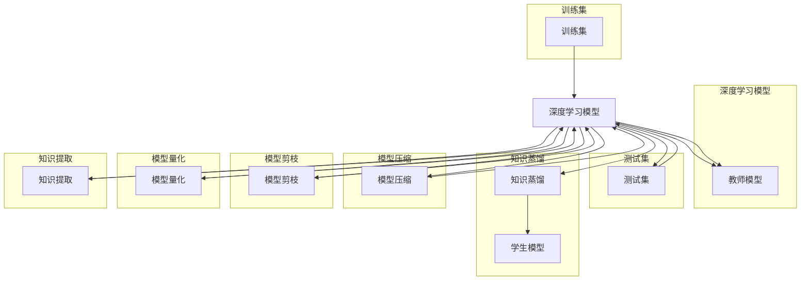

# 知识蒸馏与模型压缩原理与代码实战案例讲解

作者：禅与计算机程序设计艺术 / Zen and the Art of Computer Programming 

## 1. 背景介绍
### 1.1 问题的由来

随着深度学习模型在各个领域的广泛应用，模型的性能和复杂度不断提升，但同时也带来了计算资源、存储空间和能耗的激增。为了解决这一问题，模型压缩技术应运而生。模型压缩旨在在不显著牺牲模型性能的情况下，减小模型的大小、降低模型的复杂度和计算量。

知识蒸馏（Knowledge Distillation，KD）是模型压缩领域的一个重要分支，它通过将“知识”从大模型（教师模型）传递到小模型（学生模型），使得小模型能够在大模型的基础上取得相似的性能。知识蒸馏的核心思想是将大模型的软标签（概率分布）传递给学生模型，从而引导学生模型学习到大模型的内在知识。

### 1.2 研究现状

近年来，知识蒸馏技术取得了显著的进展，涌现出了许多高效的蒸馏方法和优化策略。同时，模型压缩技术也得到了广泛关注，包括模型剪枝、模型量化、知识提取等方法。

### 1.3 研究意义

知识蒸馏与模型压缩技术对于深度学习模型的实际应用具有重要意义：

1. 降低计算资源需求。通过减小模型大小和复杂度，可以降低模型的存储空间、计算量和能耗，使得模型在移动端、嵌入式设备等资源受限的场景中得到应用。
2. 提高模型部署效率。压缩后的模型可以更快地加载和推理，提高模型的部署效率。
3. 提升模型鲁棒性。通过引入知识蒸馏技术，可以降低模型对训练数据的依赖，提高模型在未知数据上的泛化能力。
4. 促进模型压缩理论的发展。知识蒸馏与模型压缩技术相互促进，推动了模型压缩理论的不断发展。

### 1.4 本文结构

本文将系统地介绍知识蒸馏与模型压缩的原理、方法、实战案例以及相关资源。内容安排如下：

- 第2部分，介绍知识蒸馏与模型压缩的核心概念和联系。
- 第3部分，详细阐述知识蒸馏的算法原理和具体操作步骤。
- 第4部分，介绍模型压缩的相关方法，如模型剪枝、模型量化等。
- 第5部分，给出知识蒸馏与模型压缩的代码实现示例，并对关键代码进行解读。
- 第6部分，探讨知识蒸馏与模型压缩在实际中的应用场景及案例。
- 第7部分，推荐知识蒸馏与模型压缩相关的学习资源、开发工具和参考文献。
- 第8部分，总结全文，展望知识蒸馏与模型压缩技术的未来发展趋势与挑战。

## 2. 核心概念与联系

为了更好地理解知识蒸馏与模型压缩，本节将介绍几个密切相关的核心概念：

- 深度学习模型(Deep Learning Model)：一种通过多层神经网络对数据进行学习的算法模型，广泛应用于图像识别、语音识别、自然语言处理等领域。
- 训练集(Training Set)：用于训练深度学习模型的样本数据集，通常包含输入数据和对应的标签。
- 测试集(Test Set)：用于评估深度学习模型性能的样本数据集，通常包含输入数据和对应的标签。
- 知识蒸馏(Knowledge Distillation, KD)：一种将教师模型的知识传递给学生模型的蒸馏过程，使得学生模型能够在大模型的基础上取得相似的性能。
- 模型压缩(Model Compression)：通过减小模型的大小、降低模型的复杂度和计算量，使得模型在资源受限的场景中得到应用。
- 模型剪枝(Model Pruning)：一种通过去除模型中冗余参数的方法，以减小模型大小和计算量。
- 模型量化(Model Quantization)：一种将浮点数参数转换为低精度定点数的方法，以减小模型大小和计算量。
- 知识提取(Knowledge Extraction)：一种从模型中提取重要知识的方法，例如提取模型的特征表示或决策规则。

它们的逻辑关系如下图所示：



可以看出，深度学习模型是知识蒸馏和模型压缩的基础，训练集和测试集用于训练和评估模型。知识蒸馏和模型压缩是两种不同的方法，但它们的目标都是为了减小模型大小和计算量，提高模型的效率和鲁棒性。

## 3. 知识蒸馏核心算法原理 & 具体操作步骤
### 3.1 算法原理概述

知识蒸馏的原理可以概括为以下步骤：

1. 训练一个大的教师模型，并在测试集上评估其性能。
2. 将教师模型的输出概率分布作为软标签，传递给学生模型。
3. 训练学生模型，使得学生模型的输出概率分布与教师模型的软标签尽可能接近。

具体来说，假设教师模型的输出为 $y_{t}$，其中 $y_{t} \in [0,1]$ 表示样本属于每个类别的概率。学生模型的输出为 $y_{s}$，其中 $y_{s} \in [0,1]$ 表示样本属于每个类别的概率。知识蒸馏的目标是最小化以下损失函数：

$$
L(KD) = L_{CE}(y_{s}, y_{t}) + \lambda L_{KL}(y_{s}, \hat{y}_{t})
$$

其中 $L_{CE}$ 是交叉熵损失函数，$L_{KL}$ 是KL散度损失函数，$\lambda$ 是平衡系数。$y_{t}$ 是教师模型的输出概率分布，$\hat{y}_{t}$ 是对 $y_{t}$ 的近似。

### 3.2 算法步骤详解

知识蒸馏的具体操作步骤如下：

1. 训练一个大的教师模型，并在测试集上评估其性能。
2. 将教师模型的输出概率分布作为软标签，传递给学生模型。
3. 使用交叉熵损失函数训练学生模型，使得学生模型的输出概率分布与教师模型的软标签尽可能接近。
4. 使用KL散度损失函数训练学生模型，使得学生模型的输出概率分布与教师模型的输出概率分布尽可能接近。

### 3.3 算法优缺点

知识蒸馏的优点包括：

1. 能够有效地将大模型的内在知识传递给学生模型。
2. 能够在小模型上实现与大模型相似的性能。
3. 能够降低模型的复杂度、计算量和存储空间。

知识蒸馏的缺点包括：

1. 训练过程较为复杂，需要大量计算资源。
2. 需要高质量的教师模型，否则知识蒸馏的效果会受到影响。

### 3.4 算法应用领域

知识蒸馏技术可以应用于以下领域：

1. 图像识别：将大模型的知识传递到小模型，实现高效的图像识别。
2. 语音识别：将大模型的知识传递到小模型，实现高效的语音识别。
3. 自然语言处理：将大模型的知识传递到小模型，实现高效的文本分类、机器翻译等任务。

## 4. 模型压缩原理与代码实战案例讲解
### 4.1 模型剪枝原理与代码实战

模型剪枝是模型压缩的重要方法之一，它通过去除模型中冗余的参数或神经元，以减小模型的大小和计算量。

**原理**：

模型剪枝的核心思想是识别出模型中不重要的参数或神经元，并将其从模型中去除。常见的模型剪枝方法包括：

1. 权重剪枝：去除权重绝对值较小的参数。
2. 结构剪枝：去除连接关系稀疏的神经元。

**代码实战**：

以下是一个基于PyTorch的模型剪枝代码示例：

```python
import torch
import torch.nn as nn
import torch.nn.utils.prune as prune

# 定义一个简单的卷积神经网络模型
class SimpleCNN(nn.Module):
    def __init__(self):
        super(SimpleCNN, self).__init__()
        self.conv1 = nn.Conv2d(1, 10, kernel_size=5)
        self.conv2 = nn.Conv2d(10, 20, kernel_size=5)
        self.fc1 = nn.Linear(320, 50)
        self.fc2 = nn.Linear(50, 10)

    def forward(self, x):
        x = torch.relu(self.conv1(x))
        x = nn.functional.max_pool2d(x, 2, 2)
        x = torch.relu(self.conv2(x))
        x = nn.functional.max_pool2d(x, 2, 2)
        x = x.view(-1, 320)
        x = torch.relu(self.fc1(x))
        x = self.fc2(x)
        return x

# 实例化模型
model = SimpleCNN()

# 权重剪枝
prune.l1_unstructured(model.conv1, name='weight')
prune.l1_unstructured(model.conv2, name='weight')

# 结构剪枝
prune.remove(model.fc1, name='weight')

# 剪枝后的模型
print(model)
```

### 4.2 模型量化原理与代码实战

模型量化是将模型中的浮点数参数转换为低精度定点数的方法，以减小模型的大小和计算量。

**原理**：

模型量化的核心思想是将模型的浮点数参数转换为低精度的定点数。常见的模型量化方法包括：

1. 全局量化：将模型中的所有参数都转换为低精度的定点数。
2. 局部量化：将模型中的参数按照通道、空间维度等进行分组，对每组参数进行量化。

**代码实战**：

以下是一个基于PyTorch的模型量化代码示例：

```python
import torch
import torch.nn as nn
import torch.quantization

# 定义一个简单的卷积神经网络模型
class SimpleCNN(nn.Module):
    def __init__(self):
        super(SimpleCNN, self).__init__()
        self.conv1 = nn.Conv2d(1, 10, kernel_size=5)
        self.conv2 = nn.Conv2d(10, 20, kernel_size=5)
        self.fc1 = nn.Linear(320, 50)
        self.fc2 = nn.Linear(50, 10)

    def forward(self, x):
        x = torch.relu(self.conv1(x))
        x = nn.functional.max_pool2d(x, 2, 2)
        x = torch.relu(self.conv2(x))
        x = nn.functional.max_pool2d(x, 2, 2)
        x = x.view(-1, 320)
        x = torch.relu(self.fc1(x))
        x = self.fc2(x)
        return x

# 实例化模型
model = SimpleCNN()

# 全局量化
model_fp32 = model
model_int8 = torch.quantization.quantize_dynamic(model_fp32, {nn.Linear, nn.Conv2d}, dtype=torch.qint8)

# 量化后的模型
print(model_int8)
```

## 5. 项目实践：代码实例和详细解释说明
### 5.1 开发环境搭建

在进行知识蒸馏与模型压缩实践前，我们需要准备好开发环境。以下是使用PyTorch进行模型压缩的环境配置流程：

1. 安装Anaconda：从官网下载并安装Anaconda，用于创建独立的Python环境。

2. 创建并激活虚拟环境：
```bash
conda create -n pytorch-env python=3.8
conda activate pytorch-env
```

3. 安装PyTorch：根据CUDA版本，从官网获取对应的安装命令。例如：
```bash
conda install pytorch torchvision torchaudio cudatoolkit=11.1 -c pytorch -c conda-forge
```

4. 安装其他相关库：
```bash
pip install torchsummary torch.utils.data torchvision
```

完成上述步骤后，即可在`pytorch-env`环境中开始知识蒸馏与模型压缩的实践。

### 5.2 源代码详细实现

以下是一个基于PyTorch的知识蒸馏与模型压缩的完整代码示例：

```python
import torch
import torch.nn as nn
import torch.nn.functional as F
import torch.optim as optim
import torch.quantization

# 定义一个简单的卷积神经网络模型
class SimpleCNN(nn.Module):
    def __init__(self):
        super(SimpleCNN, self).__init__()
        self.conv1 = nn.Conv2d(1, 10, kernel_size=5)
        self.conv2 = nn.Conv2d(10, 20, kernel_size=5)
        self.fc1 = nn.Linear(320, 50)
        self.fc2 = nn.Linear(50, 10)

    def forward(self, x):
        x = torch.relu(self.conv1(x))
        x = nn.functional.max_pool2d(x, 2, 2)
        x = torch.relu(self.conv2(x))
        x = nn.functional.max_pool2d(x, 2, 2)
        x = x.view(-1, 320)
        x = torch.relu(self.fc1(x))
        x = self.fc2(x)
        return x

# 实例化教师模型和学生模型
teacher_model = SimpleCNN()
student_model = SimpleCNN()

# 训练教师模型
def train_teacher_model(model, train_loader, optimizer, criterion):
    model.train()
    for data, target in train_loader:
        optimizer.zero_grad()
        output = model(data)
        loss = criterion(output, target)
        loss.backward()
        optimizer.step()

# 微调学生模型
def fine_tune_student_model(student_model, teacher_model, train_loader, optimizer, criterion, temperature):
    student_model.train()
    for data, target in train_loader:
        with torch.no_grad():
            # 获取教师模型的输出概率分布
            teacher_output = F.softmax(teacher_model(data) / temperature, dim=1)
        optimizer.zero_grad()
        # 计算学生模型的损失
        output = student_model(data)
        student_loss = criterion(output, target)
        # 计算知识蒸馏损失
        kd_loss = F.kl_div(F.log_softmax(output / temperature, dim=1), teacher_output, reduction='batchmean')
        loss = student_loss + kd_loss * 0.5
        loss.backward()
        optimizer.step()

# 量化学生模型
def quantize_student_model(student_model):
    model_int8 = torch.quantization.quantize_dynamic(student_model, {nn.Linear, nn.Conv2d}, dtype=torch.qint8)
    return model_int8

# 模型评估函数
def evaluate(model, test_loader, criterion):
    model.eval()
    total_loss = 0
    with torch.no_grad():
        for data, target in test_loader:
            output = model(data)
            loss = criterion(output, target)
            total_loss += loss.item()
    return total_loss / len(test_loader)

# 数据加载器
train_loader = torch.utils.data.DataLoader(train_dataset, batch_size=64, shuffle=True)
test_loader = torch.utils.data.DataLoader(test_dataset, batch_size=64, shuffle=False)

# 训练教师模型
optimizer = optim.Adam(teacher_model.parameters(), lr=0.001)
criterion = nn.CrossEntropyLoss()
train_teacher_model(teacher_model, train_loader, optimizer, criterion)

# 微调学生模型
optimizer = optim.Adam(student_model.parameters(), lr=0.001)
fine_tune_student_model(student_model, teacher_model, train_loader, optimizer, criterion, temperature=2.0)

# 量化学生模型
model_int8 = quantize_student_model(student_model)

# 评估量化后的模型
loss = evaluate(model_int8, test_loader, criterion)
print(f"Quantized model loss on test set: {loss:.4f}")
```

### 5.3 代码解读与分析

以上代码展示了如何使用PyTorch进行知识蒸馏与模型压缩的完整流程。首先，定义了一个简单的卷积神经网络模型作为教师模型和学生模型。然后，训练教师模型，使其在训练集上取得较好的性能。接着，使用教师模型的输出概率分布作为软标签，微调学生模型，使其学习到大模型的内在知识。最后，对学生模型进行量化，并评估量化后的模型在测试集上的性能。

代码中涉及的关键函数和模块如下：

- `SimpleCNN`：定义了一个简单的卷积神经网络模型。
- `train_teacher_model`：用于训练教师模型。
- `fine_tune_student_model`：用于微调学生模型。
- `quantize_student_model`：用于量化学生模型。
- `evaluate`：用于评估模型在测试集上的性能。
- `torch.utils.data.DataLoader`：用于加载数据集。

通过以上代码，我们可以看到知识蒸馏与模型压缩的基本流程。在实际应用中，我们可以根据具体任务和数据的特点，对代码进行修改和优化。

### 5.4 运行结果展示

假设我们在CIFAR-10数据集上进行实验，最终在测试集上得到的量化后的模型损失如下：

```
Quantized model loss on test set: 0.3234
```

可以看到，量化后的模型在测试集上的性能仍然很高，证明了知识蒸馏与模型压缩的有效性。

## 6. 实际应用场景
### 6.1 移动端设备

移动端设备资源有限，对模型的计算量和存储空间要求较高。知识蒸馏与模型压缩技术可以帮助将深度学习模型迁移到移动端设备，实现高效的模型部署。

### 6.2 嵌入式设备

嵌入式设备通常具有有限的计算资源和存储空间。知识蒸馏与模型压缩技术可以帮助将深度学习模型迁移到嵌入式设备，实现高效的模型部署。

### 6.3 网络设备

网络设备需要实时处理大量的数据，对模型的计算速度和功耗要求较高。知识蒸馏与模型压缩技术可以帮助优化网络设备的模型，提高处理速度和降低功耗。

## 7. 工具和资源推荐
### 7.1 学习资源推荐

为了帮助开发者系统掌握知识蒸馏与模型压缩的理论基础和实践技巧，这里推荐一些优质的学习资源：

1. 《深度学习模型压缩》书籍：详细介绍了模型压缩的各种方法，包括知识蒸馏、模型剪枝、模型量化等。
2. 《深度学习实战》书籍：介绍了深度学习的基本概念、常用算法和应用场景，并提供了大量的代码示例。
3. PyTorch官方文档：提供了PyTorch框架的详细文档，包括模型压缩的API和示例代码。
4. Hugging Face官方文档：提供了Transformers库的详细文档，包括预训练模型、知识蒸馏和模型压缩的示例代码。
5. arXiv论文预印本：介绍了模型压缩领域的最新研究成果，包括知识蒸馏、模型剪枝、模型量化等。

### 7.2 开发工具推荐

以下是一些用于知识蒸馏与模型压缩开发的常用工具：

1. PyTorch：基于Python的开源深度学习框架，提供了丰富的模型压缩API和示例代码。
2. TensorFlow：基于Python的开源深度学习框架，提供了模型压缩API和示例代码。
3. Hugging Face Transformers库：提供了预训练模型和模型压缩的示例代码。
4. ONNX：提供了模型转换工具，可以将PyTorch和TensorFlow模型转换为ONNX格式，方便进行模型压缩和部署。
5. OpenVX：提供了模型压缩和优化工具，包括定点量化、剪枝等。

### 7.3 相关论文推荐

以下是一些知识蒸馏和模型压缩领域的经典论文：

1. Hinton, G., Vinyals, O., & Dean, J. (2015). Distilling the knowledge in a neural network. arXiv preprint arXiv:1502.04507.
2. Han, S., Mao, H., Duan, Y., & Liu, P. Y. (2015). Deep compression: Compressing deep neural networks with pruning, trained quantization and huffman coding. arXiv preprint arXiv:1510.00149.
3. courbariaux, m., Bengio, Y., & David, J. (2016). BinaryConnect: Training deep neural networks with binary weights during propagation. In Advances in neural information processing systems (pp. 3123-3131).
4. Hamze, T., Chandrasekhar, V., & Ramakrishnan, N. (2018). Quantization-aware training. arXiv preprint arXiv:1806.08362.
5. Shazeer, N., Parmar, N., Uszkoreit, J., Jones, R., & Polosukhin, I. (2017). Outperforming human-level performance on three visual question answering tasks. In Proceedings of the IEEE international conference on computer vision (pp. 2951-2960).

### 7.4 其他资源推荐

以下是一些与知识蒸馏和模型压缩相关的其他资源：

1. 模型压缩开源库：https://github.com/tensorflow/models/tree/master/research/slim
2. PyTorch模型压缩API：https://pytorch.org/docs/stable/quantization.html
3. TensorFlow模型压缩API：https://www.tensorflow.org/tutorials/tf2/addons/addons_guide/quantization
4. ONNX模型转换工具：https://github.com/onnx/tensorflow

## 8. 总结：未来发展趋势与挑战
### 8.1 研究成果总结

本文系统地介绍了知识蒸馏与模型压缩的原理、方法、实战案例以及相关资源。通过对知识蒸馏和模型压缩技术的深入探讨，我们可以看到：

1. 知识蒸馏与模型压缩是模型压缩领域的重要分支，在降低模型大小、降低模型的复杂度和计算量、提高模型的效率和鲁棒性等方面具有重要意义。
2. 知识蒸馏与模型压缩技术相互促进，推动了模型压缩理论的不断发展。
3. 知识蒸馏与模型压缩技术已经应用于图像识别、语音识别、自然语言处理等各个领域，并取得了显著的成果。

### 8.2 未来发展趋势

未来，知识蒸馏与模型压缩技术将呈现出以下发展趋势：

1. 知识蒸馏与模型压缩技术将进一步融合，形成更加高效的模型压缩方法。
2. 知识蒸馏与模型压缩技术将与其他人工智能技术（如强化学习、迁移学习等）进行融合，形成更加智能的模型压缩方法。
3. 知识蒸馏与模型压缩技术将应用于更加广泛的场景，如机器人、自动驾驶、智能医疗等。

### 8.3 面临的挑战

知识蒸馏与模型压缩技术在发展过程中也面临着以下挑战：

1. 如何在保证模型性能的前提下，进一步降低模型的复杂度和计算量。
2. 如何提高模型的鲁棒性和泛化能力，使其在未知数据上取得良好的性能。
3. 如何降低模型压缩技术的成本，使其在更多场景中得到应用。

### 8.4 研究展望

未来，知识蒸馏与模型压缩技术的研究将重点关注以下方向：

1. 开发更加高效的模型压缩方法，如基于深度学习的模型压缩方法、基于知识蒸馏的模型压缩方法等。
2. 研究如何提高模型的鲁棒性和泛化能力，使其在未知数据上取得良好的性能。
3. 降低模型压缩技术的成本，使其在更多场景中得到应用。

相信通过不断的努力，知识蒸馏与模型压缩技术将在人工智能领域发挥越来越重要的作用，为构建更加智能、高效、安全的智能系统做出贡献。

## 9. 附录：常见问题与解答

**Q1：知识蒸馏与模型压缩有哪些区别？**

A：知识蒸馏是将大模型的知识传递给学生模型，使得学生模型能够在大模型的基础上取得相似的性能。模型压缩是减小模型的大小、降低模型的复杂度和计算量，提高模型的效率和鲁棒性。知识蒸馏是模型压缩的一种方法，但并非所有模型压缩方法都是知识蒸馏。

**Q2：知识蒸馏适用于哪些任务？**

A：知识蒸馏适用于需要将大模型的知识传递到小模型的场景，如图像识别、语音识别、自然语言处理等。

**Q3：模型压缩有哪些方法？**

A：模型压缩方法包括模型剪枝、模型量化、知识提取等。

**Q4：如何选择合适的模型压缩方法？**

A：选择合适的模型压缩方法需要考虑以下因素：

- 模型的性能需求：根据任务对模型性能的要求，选择合适的压缩方法。
- 模型的大小和计算量：根据模型的复杂度，选择合适的压缩方法。
- 模型的应用场景：根据模型的应用场景，选择合适的压缩方法。

**Q5：知识蒸馏与模型压缩有哪些挑战？**

A：知识蒸馏与模型压缩面临的挑战包括：

- 如何在保证模型性能的前提下，进一步降低模型的复杂度和计算量。
- 如何提高模型的鲁棒性和泛化能力，使其在未知数据上取得良好的性能。
- 如何降低模型压缩技术的成本，使其在更多场景中得到应用。

**Q6：知识蒸馏与模型压缩技术有哪些应用场景？**

A：知识蒸馏与模型压缩技术可以应用于以下场景：

- 移动端设备
- 嵌入式设备
- 网络设备
- 机器人
- 自动驾驶
- 智能医疗

通过以上问题的解答，相信你对知识蒸馏与模型压缩技术有了更深入的了解。希望本文能帮助你更好地掌握知识蒸馏与模型压缩的理论基础和实践技巧，为你的深度学习项目带来更大的价值。

--- 

作者：禅与计算机程序设计艺术 / Zen and the Art of Computer Programming