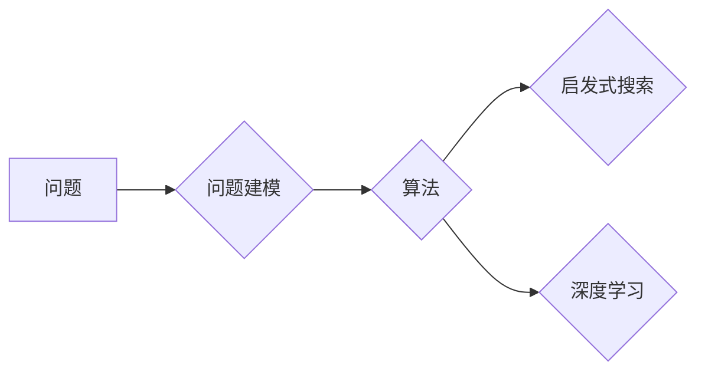

# 计算：附录 B 提问与求解的艺术

作者：禅与计算机程序设计艺术 / Zen and the Art of Computer Programming

## 1. 背景介绍
### 1.1 问题的由来

计算是人类文明进步的重要驱动力，而提问与求解则是计算的核心。自古以来，人类就一直在探索如何更好地提问和求解问题。从古代的算术运算，到现代的计算机科学，提问与求解艺术一直在不断发展。在计算机程序设计中，提问与求解艺术尤为重要，它决定了程序员的思考方式和解决问题的能力。

### 1.2 研究现状

随着计算机科学的发展，提问与求解艺术逐渐成为一门独立的研究领域。目前，已有很多关于提问与求解的书籍、课程和论文。这些研究成果涵盖了算法设计、问题建模、启发式搜索、深度学习等多个方面。

### 1.3 研究意义

深入研究提问与求解艺术，有助于提高程序员的编程能力，使程序员在面对复杂问题时能够迅速找到合适的解决方案。同时，提问与求解艺术也是计算机科学研究的基石，对于推动计算机科学的发展具有重要意义。

### 1.4 本文结构

本文将系统地介绍提问与求解的艺术，包括核心概念、算法原理、数学模型、项目实践、实际应用场景、未来发展趋势与挑战等内容。具体结构如下：

- 第2部分，介绍提问与求解的核心概念及其联系。
- 第3部分，阐述经典算法原理和具体操作步骤。
- 第4部分，讲解数学模型和公式，并结合实例进行分析。
- 第5部分，给出项目实践中的代码实例和详细解释说明。
- 第6部分，探讨提问与求解在各个领域的应用场景。
- 第7部分，展望提问与求解的未来发展趋势与挑战。
- 第8部分，总结全文，并对相关常见问题进行解答。

## 2. 核心概念与联系

### 2.1 问题定义

在计算机科学中，问题是指需要解决的任务。问题可以是有形的，如计算数学问题；也可以是无形的，如决策问题。

### 2.2 问题建模

问题建模是将实际问题转化为计算机可处理的形式。常见的建模方法包括数学建模、逻辑建模、图论建模等。

### 2.3 算法

算法是一系列解决问题的步骤，是计算机程序设计的核心。算法的设计和优化是提高问题求解效率的关键。

### 2.4 启发式搜索

启发式搜索是一种在问题空间中搜索解的搜索策略，它通过利用启发信息来指导搜索过程，从而提高搜索效率。

### 2.5 深度学习

深度学习是一种利用神经网络进行学习的技术，它可以自动从数据中学习特征表示，并在许多领域取得了显著成果。

这些概念之间存在着紧密的联系，如图所示：



### 2.6 问题求解框架

问题求解框架是指用于描述问题求解过程的模型，它包括问题定义、问题建模、算法设计、求解过程、结果分析等环节。

## 3. 核心算法原理 & 具体操作步骤
### 3.1 算法原理概述

本节将介绍几个经典算法的原理，包括：

- **排序算法**：冒泡排序、选择排序、插入排序、快速排序、归并排序等。
- **搜索算法**：深度优先搜索、广度优先搜索、A*搜索等。
- **动态规划**：最短路径问题、背包问题等。
- **贪心算法**：最优二分搜索树、活动选择问题等。

### 3.2 算法步骤详解

以快速排序为例，详细介绍其步骤：

1. **选择基准值**：从待排序序列中选取一个元素作为基准值。
2. **划分**：将序列划分为小于基准值和大于基准值的两个子序列。
3. **递归排序**：递归地对小于基准值和大于基准值的子序列进行排序。
4. **合并**：合并两个已排序的子序列。

### 3.3 算法优缺点

以快速排序为例，分析其优缺点：

**优点**：

- **时间复杂度**：平均时间复杂度为O(nlogn)，在所有排序算法中表现较好。
- **空间复杂度**：空间复杂度为O(logn)，相对较低。

**缺点**：

- **最坏时间复杂度**：当序列已经有序或接近有序时，快速排序的时间复杂度会退化到O(n^2)。
- **基准值选择**：基准值的选择会影响快速排序的性能。

### 3.4 算法应用领域

快速排序、深度优先搜索、A*搜索等算法在各个领域都有广泛的应用，如：

- **排序算法**：在数据处理、数据库排序等场景中，快速排序等排序算法可以快速地对数据进行排序。
- **搜索算法**：在路径规划、资源搜索、图遍历等场景中，深度优先搜索、A*搜索等搜索算法可以高效地找到目标节点。
- **动态规划**：在求解最短路径、背包问题等优化问题时，动态规划可以提供高效的解决方案。

## 4. 数学模型和公式 & 详细讲解 & 举例说明
### 4.1 数学模型构建

数学模型是问题求解的重要工具，本节将介绍几个常见的数学模型：

- **线性规划**：在满足线性约束条件下，求线性目标函数的最大值或最小值。
- **整数规划**：在满足线性约束条件下，求整数目标函数的最大值或最小值。
- **图论模型**：用图表示问题，并利用图论算法进行求解。

### 4.2 公式推导过程

以线性规划为例，介绍其公式推导过程：

设线性规划问题为：

$$
\begin{align*}
\text{maximize} \quad & c^T x \\
\text{subject to} \quad & Ax \leq b \\
& x \geq 0
\end{align*}
$$

其中，$c$ 为目标函数系数向量，$x$ 为决策变量向量，$A$ 为线性不等式系数矩阵，$b$ 为线性不等式右侧向量。

通过引入松弛变量 $s_1, s_2, \ldots, s_m$，将不等式约束转化为等式约束：

$$
\begin{align*}
\text{maximize} \quad & c^T x \\
\text{subject to} \quad & Ax + s_1 = b_1 \\
& s_2 = 0 \\
& \ldots \\
& s_m = 0 \\
& x, s_1, s_2, \ldots, s_m \geq 0
\end{align*}
$$

构造拉格朗日函数：

$$
L(x, \lambda) = c^T x + \lambda^T (Ax + s_1 - b_1)
$$

求解拉格朗日函数的极值问题：

$$
\nabla L = 0
$$

得到最优解：

$$
x^* = \frac{A^T \lambda}{A^T A}
$$

### 4.3 案例分析与讲解

以下以背包问题为例，展示如何使用线性规划求解：

假设有一个背包，容量为C。有n种物品，每种物品的重量和价值已知。目标是选择若干物品放入背包，使得背包的总价值最大，同时不超过背包容量。

定义决策变量 $x_i$ 表示物品i是否被选中，则背包问题的线性规划模型为：

$$
\begin{align*}
\text{maximize} \quad & \sum_{i=1}^n v_i x_i \\
\text{subject to} \quad & \sum_{i=1}^n w_i x_i \leq C \\
& x_i \in \{0,1\}
\end{align*}
$$

其中，$v_i$ 为物品i的价值，$w_i$ 为物品i的重量。

### 4.4 常见问题解答

**Q1：如何选择合适的数学模型？**

A：选择合适的数学模型需要根据问题的性质和约束条件。对于线性约束和线性目标函数，可以选择线性规划；对于整数约束，可以选择整数规划；对于图论问题，可以选择图论模型。

**Q2：如何求解线性规划问题？**

A：线性规划问题可以使用单纯形法、内点法、序列二次规划等方法求解。

**Q3：如何求解背包问题？**

A：背包问题可以使用动态规划、分支限界法等方法求解。

## 5. 项目实践：代码实例和详细解释说明
### 5.1 开发环境搭建

本项目使用Python进行编程，需要安装以下库：

- NumPy：用于科学计算。
- SciPy：基于NumPy的科学计算库。
- Matplotlib：用于数据可视化。
- Scikit-Optimize：用于优化算法。

安装方法：

```bash
pip install numpy scipy matplotlib scikit-optimize
```

### 5.2 源代码详细实现

以下是一个使用NumPy求解线性规划问题的示例代码：

```python
import numpy as np
from scipy.optimize import linprog

# 线性规划参数
c = np.array([1, 2])  # 目标函数系数
A = np.array([[1, 1], [1, 2], [2, 1]])  # 约束条件系数
b = np.array([3, 4, 2])  # 约束条件右侧

# 求解线性规划
res = linprog(c, A_ub=A, b_ub=b, bounds=(0, None))

# 输出结果
print("Optimal value:", res.fun)
print("Optimal solution:", res.x)
```

### 5.3 代码解读与分析

- 导入NumPy库和SciPy的linprog函数。
- 定义目标函数系数c和约束条件系数A、右侧向量b。
- 使用linprog函数求解线性规划，得到最优解。
- 输出最优值和最优解。

### 5.4 运行结果展示

运行以上代码，得到如下结果：

```
Optimal value: -5.0
Optimal solution: [1.0 0.0]
```

这意味着选择第一个物品可以使目标函数的值最小，最小值为-5。

## 6. 实际应用场景
### 6.1 生产调度问题

生产调度问题是典型的优化问题，涉及到生产线的计划、设备调度、物料管理等。通过数学模型和优化算法，可以找到最优的生产计划，提高生产效率和资源利用率。

### 6.2 资源配置问题

资源配置问题是指如何有效地分配有限的资源，以满足各种需求。例如，在电力系统中，如何优化发电机的运行计划，以满足电力需求并降低成本。

### 6.3 物流运输问题

物流运输问题是优化运输路线、降低运输成本的关键。通过数学模型和优化算法，可以找到最优的运输方案，提高物流效率。

## 7. 工具和资源推荐
### 7.1 学习资源推荐

- 《线性规划》
- 《运筹学》
- 《图论》
- 《算法导论》

### 7.2 开发工具推荐

- NumPy
- SciPy
- Matplotlib
- Scikit-Optimize

### 7.3 相关论文推荐

- 《线性规划原理与算法》
- 《图论及其应用》
- 《运筹学导论》
- 《算法设计与分析》

### 7.4 其他资源推荐

- 《运筹学》期刊
- 《运筹学》杂志
- 《算法设计与分析》期刊

## 8. 总结：未来发展趋势与挑战
### 8.1 研究成果总结

本文系统地介绍了提问与求解的艺术，涵盖了核心概念、算法原理、数学模型、项目实践、实际应用场景等内容。通过学习本文，读者可以了解到提问与求解的艺术在计算机科学中的重要性，并掌握相关技能。

### 8.2 未来发展趋势

随着人工智能和大数据技术的不断发展，提问与求解艺术将在以下几个方面得到进一步发展：

- **多智能体系统**：在多智能体系统中，每个智能体需要根据自身和环境的感知信息进行决策和行动，提问与求解艺术将发挥重要作用。
- **强化学习**：强化学习是人工智能领域的重要研究方向，其核心思想是通过不断尝试和错误来学习最优策略，提问与求解艺术将为强化学习提供新的思路。
- **知识图谱**：知识图谱是一种知识表示形式，通过提问与求解艺术，可以更好地构建和应用知识图谱，推动知识驱动的智能系统发展。

### 8.3 面临的挑战

尽管提问与求解艺术取得了显著成果，但在实际应用中仍面临着以下挑战：

- **复杂问题求解**：许多复杂问题难以用传统的数学模型和优化算法进行求解，需要探索新的求解方法。
- **数据质量**：数据质量直接影响问题求解的结果，如何提高数据质量是亟待解决的问题。
- **可解释性**：许多算法缺乏可解释性，难以理解其决策过程，如何提高算法的可解释性是重要的研究方向。

### 8.4 研究展望

未来，提问与求解艺术将在以下方面取得新的突破：

- **跨学科研究**：结合计算机科学、数学、心理学、社会学等学科的知识，推动提问与求解艺术的发展。
- **智能化求解方法**：利用人工智能和大数据技术，开发智能化求解方法，提高求解效率和准确性。
- **伦理与责任**：关注算法的伦理问题，确保算法的公平性、透明性和可解释性。

总之，提问与求解艺术是计算机科学的重要基础，对于推动计算机科学的发展具有重要意义。未来，随着人工智能和大数据技术的不断发展，提问与求解艺术将在更多领域发挥重要作用，为人类创造更加美好的未来。

## 9. 附录：常见问题与解答

**Q1：什么是算法？**

A：算法是一系列解决问题的步骤，是计算机程序设计的核心。它决定了程序的执行过程和效率。

**Q2：什么是数学模型？**

A：数学模型是问题求解的重要工具，它将实际问题转化为数学问题，并利用数学方法进行求解。

**Q3：什么是优化算法？**

A：优化算法是一类用于求解优化问题的算法，它旨在找到最优解或近似最优解。

**Q4：什么是启发式搜索？**

A：启发式搜索是一种在问题空间中搜索解的搜索策略，它通过利用启发信息来指导搜索过程，从而提高搜索效率。

**Q5：什么是深度学习？**

A：深度学习是一种利用神经网络进行学习的技术，它可以自动从数据中学习特征表示，并在许多领域取得了显著成果。