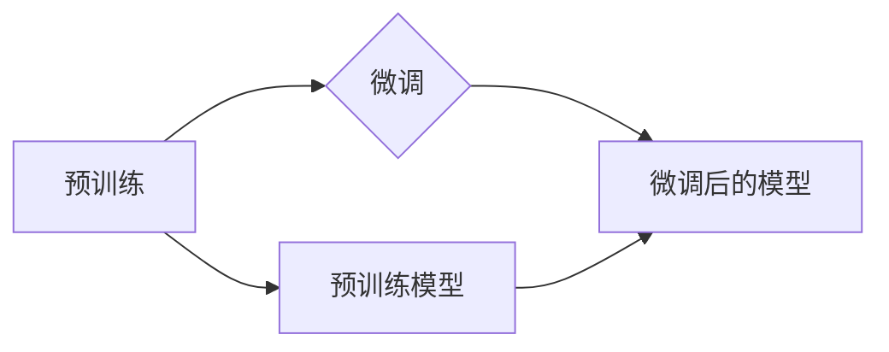

# “预训练+微调大模型”的模式

作者：禅与计算机程序设计艺术 / Zen and the Art of Computer Programming

## 1. 背景介绍
### 1.1 问题的由来

近年来，自然语言处理（NLP）领域取得了飞速发展，深度学习模型的性能也取得了显著的提升。然而，传统的NLP任务往往需要大量的标注数据来训练模型，这给NLP应用的开发带来了巨大的挑战。为了解决这个问题，研究者们提出了“预训练+微调大模型”的模式，通过在大量无标注语料上进行预训练，使模型学习到通用的语言知识，再利用少量标注数据进行微调，从而在多个NLP任务上取得了优异的性能。

### 1.2 研究现状

预训练+微调大模型模式的核心思想可以概括为以下步骤：

1. 预训练：在大量无标注语料上进行预训练，使模型学习到通用的语言知识。
2. 微调：在少量标注数据上对预训练模型进行微调，使其适应特定的任务。

目前，预训练+微调大模型模式已经在多个NLP任务上取得了显著的成果，如文本分类、情感分析、机器翻译、问答系统等。其中，BERT、GPT-3等大模型被认为是该模式的代表。

### 1.3 研究意义

预训练+微调大模型模式具有以下意义：

1. **降低数据需求**：预训练阶段使用无标注语料，大大降低了数据标注的成本。
2. **提高性能**：预训练模型学习到通用的语言知识，微调阶段能够快速适应特定任务，提高模型在多个任务上的性能。
3. **加速开发**：预训练+微调大模型模式简化了模型开发流程，缩短了开发周期。

### 1.4 本文结构

本文将围绕“预训练+微调大模型”的模式展开，具体内容如下：

- 第二部分：介绍预训练+微调大模型模式涉及的核心概念。
- 第三部分：详细介绍预训练+微调大模型的算法原理和具体操作步骤。
- 第四部分：讲解预训练+微调大模型的数学模型、公式、案例分析与常见问题解答。
- 第五部分：提供预训练+微调大模型的代码实例和详细解释说明。
- 第六部分：探讨预训练+微调大模型在实际应用场景中的应用。
- 第七部分：推荐预训练+微调大模型相关的学习资源、开发工具和参考文献。
- 第八部分：总结预训练+微调大模型模式的研究成果、未来发展趋势、面临的挑战和研究展望。
- 第九部分：附录，包含常见问题与解答。

## 2. 核心概念与联系

### 2.1 预训练

预训练是指在大量无标注语料上进行模型训练，使模型学习到通用的语言知识。预训练的过程通常包括以下步骤：

1. 数据准备：收集大量的无标注语料，如文本、新闻、社交媒体等。
2. 预训练任务：设计合适的预训练任务，如语言建模、掩码语言模型等，使模型学习到通用的语言知识。
3. 模型训练：使用无标注语料对模型进行训练，使模型优化预训练任务。

### 2.2 微调

微调是指在少量标注数据上对预训练模型进行训练，使模型适应特定的任务。微调的过程通常包括以下步骤：

1. 数据准备：收集少量标注数据，如文本分类、情感分析等。
2. 模型微调：使用标注数据对预训练模型进行训练，使模型优化特定任务。
3. 模型评估：在测试集上评估微调后的模型性能。

### 2.3 预训练+微调大模型

预训练+微调大模型是指将预训练和微调相结合，利用大量无标注语料进行预训练，再利用少量标注数据进行微调，从而在多个NLP任务上取得优异的性能。



## 3. 核心算法原理 & 具体操作步骤

### 3.1 算法原理概述

预训练+微调大模型模式的原理可以概括为以下步骤：

1. 在大量无标注语料上进行预训练，使模型学习到通用的语言知识。
2. 在少量标注数据上对预训练模型进行微调，使其适应特定的任务。
3. 在测试集上评估微调后的模型性能。

### 3.2 算法步骤详解

预训练+微调大模型模式的具体操作步骤如下：

1. **预训练阶段**：
    1. 数据准备：收集大量的无标注语料，如文本、新闻、社交媒体等。
    2. 预训练任务：设计合适的预训练任务，如语言建模、掩码语言模型等，使模型学习到通用的语言知识。
    3. 模型训练：使用无标注语料对模型进行训练，使模型优化预训练任务。
2. **微调阶段**：
    1. 数据准备：收集少量标注数据，如文本分类、情感分析等。
    2. 模型微调：使用标注数据对预训练模型进行训练，使模型优化特定任务。
    3. 模型评估：在测试集上评估微调后的模型性能。

### 3.3 算法优缺点

预训练+微调大模型模式的优点如下：

- 降低数据需求：预训练阶段使用无标注语料，大大降低了数据标注的成本。
- 提高性能：预训练模型学习到通用的语言知识，微调阶段能够快速适应特定任务，提高模型在多个任务上的性能。
- 加速开发：预训练+微调大模型模式简化了模型开发流程，缩短了开发周期。

预训练+微调大模型模式的缺点如下：

- 计算资源消耗大：预训练和微调阶段都需要大量的计算资源。
- 对预训练数据质量要求高：预训练数据质量直接影响预训练模型的性能。

### 3.4 算法应用领域

预训练+微调大模型模式可以应用于以下NLP任务：

- 文本分类：如情感分析、主题分类、意图识别等。
- 命名实体识别：识别文本中的人名、地名、机构名等特定实体。
- 关系抽取：从文本中抽取实体之间的语义关系。
- 问答系统：对自然语言问题给出答案。
- 机器翻译：将源语言文本翻译成目标语言。
- 文本摘要：将长文本压缩成简短摘要。
- 对话系统：使机器能够与人自然对话。

## 4. 数学模型和公式 & 详细讲解 & 举例说明

### 4.1 数学模型构建

预训练+微调大模型的数学模型可以概括为以下步骤：

1. 预训练阶段：在大量无标注语料上进行预训练，使模型学习到通用的语言知识。
2. 微调阶段：在少量标注数据上对预训练模型进行微调，使其适应特定的任务。
3. 评估阶段：在测试集上评估微调后的模型性能。

### 4.2 公式推导过程

预训练+微调大模型的公式推导过程如下：

1. 预训练阶段：
    - 预训练任务：语言建模或掩码语言模型
    - 损失函数：交叉熵损失
    - 梯度下降：优化模型参数
2. 微调阶段：
    - 特定任务：文本分类、命名实体识别等
    - 损失函数：交叉熵损失
    - 梯度下降：优化模型参数
3. 评估阶段：
    - 损失函数：交叉熵损失
    - 指标：准确率、召回率、F1值等

### 4.3 案例分析与讲解

以下以BERT模型为例，讲解预训练+微调大模型的案例。

BERT模型是一种基于Transformer的预训练语言模型，它可以用于文本分类、命名实体识别、关系抽取等多种NLP任务。

1. 预训练阶段：
    - 预训练任务：掩码语言模型（Masked Language Model, MLM）
    - 损失函数：交叉熵损失
    - 梯度下降：优化模型参数
2. 微调阶段：
    - 特定任务：文本分类
    - 损失函数：交叉熵损失
    - 梯度下降：优化模型参数

### 4.4 常见问题解答

**Q1：预训练和微调的区别是什么？**

A：预训练是指在大量无标注语料上进行模型训练，使模型学习到通用的语言知识；微调是指在少量标注数据上对预训练模型进行训练，使其适应特定的任务。

**Q2：预训练模型如何进行微调？**

A：在少量标注数据上，对预训练模型进行适当的调整，使其适应特定任务。

**Q3：预训练+微调大模型模式的优缺点是什么？**

A：优点是降低数据需求、提高性能、加速开发；缺点是计算资源消耗大、对预训练数据质量要求高。

## 5. 项目实践：代码实例和详细解释说明

### 5.1 开发环境搭建

以下以BERT模型为例，讲解预训练+微调大模型的代码实例。

1. 安装必要的库：

```bash
pip install transformers torch
```

2. 加载预训练模型和分词器：

```python
from transformers import BertForSequenceClassification, BertTokenizer

model = BertForSequenceClassification.from_pretrained('bert-base-uncased')
tokenizer = BertTokenizer.from_pretrained('bert-base-uncased')
```

3. 将数据转换为模型输入：

```python
def encode_data(texts, labels, tokenizer, max_length=128):
    encodings = tokenizer(texts, truncation=True, padding=True, max_length=max_length)
    input_ids = torch.tensor(encodings['input_ids'])
    attention_mask = torch.tensor(encodings['attention_mask'])
    labels = torch.tensor(labels)
    return input_ids, attention_mask, labels

train_data = encode_data(train_texts, train_labels, tokenizer)
test_data = encode_data(test_texts, test_labels, tokenizer)
```

4. 训练模型：

```python
from transformers import AdamW

optimizer = AdamW(model.parameters(), lr=5e-5)

for epoch in range(3):
    model.train()
    for inputs, labels in tqdm(train_data):
        optimizer.zero_grad()
        outputs = model(inputs, labels=labels)
        loss = outputs.loss
        loss.backward()
        optimizer.step()
```

5. 评估模型：

```python
from sklearn.metrics import accuracy_score

model.eval()
with torch.no_grad():
    for inputs, labels in test_data:
        outputs = model(inputs, labels=labels)
        preds = outputs.logits.argmax(dim=-1)
        acc = accuracy_score(labels, preds)
        print(f"Test accuracy: {acc}")
```

## 6. 实际应用场景

预训练+微调大模型模式在多个NLP任务上取得了显著的成果，以下列举一些实际应用场景：

- **智能客服**：利用预训练+微调大模型模式构建智能客服系统，实现自动回答用户问题、处理投诉等功能。
- **金融风控**：利用预训练+微调大模型模式进行文本分类、情感分析等任务，用于金融欺诈检测、用户行为分析等。
- **内容审核**：利用预训练+微调大模型模式进行文本分类、命名实体识别等任务，用于识别违规内容、垃圾邮件过滤等。
- **推荐系统**：利用预训练+微调大模型模式进行文本分类、情感分析等任务，用于商品推荐、新闻推荐等。

## 7. 工具和资源推荐

### 7.1 学习资源推荐

- 《BERT: Pre-training of Deep Bidirectional Transformers for Language Understanding》
- 《Transformers: State-of-the-art General Language Modeling with Transformer》
- 《自然语言处理入门：基于Python》

### 7.2 开发工具推荐

- Hugging Face Transformers库
- PyTorch
- TensorFlow

### 7.3 相关论文推荐

- **预训练模型**：
    - BERT: Pre-training of Deep Bidirectional Transformers for Language Understanding
    - RoBERTa: A Pretrained Language Model for Language Understanding
    - GPT-3: Language Models are Few-Shot Learners

- **微调方法**：
    - Efficient Language Modeling with Denoising Autoencoders
    - Prompt-based Learning for Text Classification
    - Prompt-based Instruction Tuning for Few-shot Learning

### 7.4 其他资源推荐

- Hugging Face官网
- GitHub
- PyTorch官网
- TensorFlow官网

## 8. 总结：未来发展趋势与挑战

### 8.1 研究成果总结

预训练+微调大模型模式在NLP领域取得了显著的成果，为多个NLP任务提供了高效的解决方案。然而，该模式仍面临以下挑战：

- 计算资源消耗大
- 对预训练数据质量要求高
- 难以适应特定领域的任务

### 8.2 未来发展趋势

未来，预训练+微调大模型模式将朝着以下方向发展：

- **更高效的预训练模型**：探索更高效的预训练方法，降低计算资源消耗，提高模型性能。
- **更轻量级的微调模型**：设计更轻量级的微调模型，降低模型复杂度，提高模型效率。
- **跨领域迁移学习**：探索跨领域迁移学习技术，使模型能够更好地适应不同领域的任务。

### 8.3 面临的挑战

预训练+微调大模型模式面临以下挑战：

- **数据标注成本高**：大量高质量标注数据的获取需要高昂的成本。
- **模型可解释性低**：预训练+微调大模型的内部工作机制难以解释。
- **模型安全性和隐私保护**：如何避免模型被恶意利用，保护用户隐私是一个重要问题。

### 8.4 研究展望

未来，预训练+微调大模型模式将与其他人工智能技术（如知识图谱、强化学习等）相结合，为构建更加智能、高效、安全的NLP应用提供更多可能性。

## 9. 附录：常见问题与解答

**Q1：预训练+微调大模型模式与传统NLP方法的区别是什么？**

A：传统NLP方法需要大量标注数据进行训练，而预训练+微调大模型模式只需要少量标注数据进行微调，大大降低了数据标注成本。

**Q2：预训练+微调大模型模式的优势是什么？**

A：预训练+微调大模型模式具有以下优势：
- 降低数据需求
- 提高性能
- 加速开发

**Q3：预训练+微调大模型模式面临哪些挑战？**

A：预训练+微调大模型模式面临以下挑战：
- 计算资源消耗大
- 对预训练数据质量要求高
- 难以适应特定领域的任务

**Q4：预训练+微调大模型模式的应用前景如何？**

A：预训练+微调大模型模式在NLP领域具有广泛的应用前景，可以应用于智能客服、金融风控、内容审核、推荐系统等多个领域。

**Q5：如何解决预训练+微调大模型模式面临的数据标注成本高的问题？**

A：可以探索以下方法来解决数据标注成本高的问题：
- 使用自监督学习技术，降低对标注数据的依赖
- 使用半监督学习技术，利用少量标注数据和大量无标注数据
- 使用迁移学习技术，利用其他领域的数据进行迁移学习

作者：禅与计算机程序设计艺术 / Zen and the Art of Computer Programming