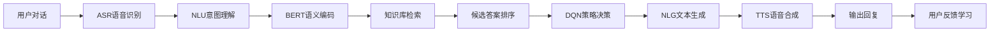

# AI Agent: AI的下一个风口 从ChatGPT到智能体

关键词：人工智能, AI Agent, ChatGPT, 智能体, 自然语言处理, 强化学习, 多模态交互, 自主决策

## 1. 背景介绍

### 1.1 问题的由来

近年来，人工智能(Artificial Intelligence, AI)技术的飞速发展正在深刻影响和改变着我们的生活。从智能语音助手到自动驾驶汽车，AI已经渗透到各行各业。而在AI领域，大语言模型(Large Language Model, LLM)的出现，尤其是以ChatGPT为代表的对话式AI系统的问世，更是引发了新一轮的AI热潮和探讨。人们开始思考：AI的下一个风口在哪里？未来AI将走向何方？

### 1.2 研究现状

目前，学术界和工业界普遍认为，AI正从单一任务导向的"狭义AI"阶段，逐步迈向具备更强自主性、适应性和多模态交互能力的"广义AI"阶段。这种新型AI系统被称为"AI Agent"或"智能体"。与传统的任务专一型AI不同，AI Agent能够在复杂多变的环境中自主感知、思考、学习、决策和执行任务，表现出接近人类的智能。

以ChatGPT为例，它作为一个大型语言模型，已经展现出惊人的自然语言理解和生成能力，可以与人进行流畅的对话交流，完成问答、写作、编程等多种任务。这预示着未来AI Agent将拥有更强大的认知和交互能力，有望成为人类得力的智能助手和伙伴。

### 1.3 研究意义

研究AI Agent，对于推动人工智能从理论走向应用，打造真正意义上的"通用人工智能"(Artificial General Intelligence, AGI)具有重要意义。一方面，AI Agent的发展将极大拓展AI的应用场景和服务边界，为教育、医疗、金融、制造等领域带来革命性变化；另一方面，通过对AI Agent的持续研究，有望加速人工智能在认知、推理、决策等方面的理论突破，最终实现人机协同、互补和共生。

### 1.4 本文结构

本文将重点探讨AI Agent的发展现状、关键技术、应用场景以及未来趋势，内容安排如下：

第2部分介绍AI Agent的核心概念和内涵，梳理其与其他AI技术的联系；
第3部分重点阐述AI Agent的核心算法原理，包括其在感知、认知、决策等方面的关键技术；
第4部分通过数学模型和公式，对AI Agent的工作机制进行理论分析和案例讲解；
第5部分给出AI Agent的代码实例，并对其实现过程进行详细解读；
第6部分展望AI Agent在智能助理、无人驾驶、智慧城市等领域的实际应用前景；
第7部分推荐AI Agent领域的学习资源、开发工具和研究文献；
第8部分对全文进行总结，并对AI Agent的未来发展趋势和挑战进行展望。

## 2. 核心概念与联系

AI Agent，也称智能体或智能代理，是一种能够感知环境、自主思考决策并采取行动的人工智能系统。它集成了多种AI技术，如机器学习、自然语言处理、计算机视觉、知识图谱等，具备多模态信息交互和任务处理能力。

从功能角度看，AI Agent可以理解为一个"AI操作系统"，对内优化调度各类AI模型，对外为人类用户提供智能化的交互和服务。从结构上看，一个典型的AI Agent通常包含以下关键模块：

- 感知模块：负责接收和理解外界的语音、图像、视频等多模态信息输入；
- 认知模块：基于机器学习算法和知识库，对输入信息进行分析、推理，形成对世界的认知；
- 决策模块：根据已有知识和分析结果，进行任务规划、决策，产生行动方案；
- 执行模块：根据决策结果，采取相应动作，如自然语言回复、控制机器人运动等；
- 学习模块：通过持续的数据积累和算法优化，不断提升系统性能，实现从数据到知识再到智慧的跃迁。

从发展脉络看，AI Agent技术的兴起得益于以下几方面的理论和工程突破：

1. 大数据和算力的持续增长，为AI模型训练提供了海量数据和高性能计算支持；
2. 深度学习等算法的创新，使得计算机在语音识别、图像理解等感知智能任务上达到甚至超越人类水平；
3. 知识图谱、因果推理等认知智能技术的成熟，赋予了AI更强的知识表达和逻辑分析能力；
4. 强化学习、自主学习等前沿理论的发展，为AI Agent的自主决策和持续进化提供了有力工具。

可以预见，随着多模态大模型、认知推理、自主学习等前沿技术的持续突破，AI Agent将向着更高的感知智能、认知智能、自主智能和群体智能方向发展，最终有望成长为人类社会的得力助手和伙伴。

## 3. 核心算法原理 & 具体操作步骤

### 3.1 算法原理概述

AI Agent的核心算法涉及机器学习、自然语言处理、计算机视觉等多个AI分支领域，总体可分为感知层、认知层和决策层三大类：

- 感知层算法：主要负责对外界信息的识别和理解，如语音识别(ASR)、图像分类、目标检测等，常用的模型包括CNN、RNN、Transformer等；

- 认知层算法：主要负责对感知信息的分析、推理，构建知识表示，如知识图谱嵌入(KGE)、因果推理(Causal Reasoning)等，代表性方法有TransE、BERT、PCL等；

- 决策层算法：主要负责根据认知结果进行任务规划和决策，生成执行动作，如强化学习(RL)、对抗学习(AL)等，经典算法包括Q-Learning、PPO、GAN等。

此外，AI Agent还涉及多模态信息融合、跨模态对齐、持续学习等前沿课题。

### 3.2 算法步骤详解

以下以一个智能客服AI Agent为例，简要说明其核心算法的工作流程：

输入：用户多轮对话文本、知识库

1. 使用ASR和NLU模型，将用户语音转换为文本，提取对话意图和关键信息；
2. 利用预训练的BERT等模型，结合上下文信息，对本轮对话文本进行语义编码；
3. 使用知识图谱嵌入技术，将对话文本表示映射到知识库概念语义空间；
4. 通过因果推理和逻辑规则，检索知识库，获取候选回答；
5. 结合问答对训练的匹配模型，如DSSM等，对候选答案进行相关性打分和排序；
6. 使用强化学习模型，如DQN等，根据上下文状态和业务目标，决策出最优回复策略；
7. 调用预训练的NLG模型，根据策略生成自然语言回复文本；
8. 通过TTS技术，将回复文本转换为语音，输出给用户，完成一轮对话；
9. 收集用户反馈，更新知识库和模型参数，实现持续学习优化。



### 3.3 算法优缺点

上述AI Agent核心算法的优点包括：

- 融合了语音、图像、文本等多模态信息处理能力，具备较强的感知智能；
- 利用知识图谱、因果推理等认知智能技术，具备一定的逻辑分析和领域理解能力；
- 采用强化学习进行策略优化，可根据反馈动态调整，具备一定的自主学习能力。

但同时也存在一些局限和不足：

- 在应对开放域对话、常识推理等更高层次AI任务时，表现还不够理想；
- 缺乏对模型推理过程的可解释性，存在一定的决策"黑盒"风险；
- 在小样本学习、持续学习、知识迁移等方面还有待进一步研究突破。

### 3.4 算法应用领域

AI Agent核心算法已在智能客服、虚拟助手、智能音箱、自动驾驶、智慧医疗等领域得到广泛应用，极大提升了服务效率和智能化水平。未来有望在更多行业场景发挥重要作用。

## 4. 数学模型和公式 & 详细讲解 & 举例说明

### 4.1 数学模型构建

以下以知识图谱嵌入(KGE)技术为例，介绍AI Agent中的典型数学模型。

知识图谱通常表示为一个三元组集合$\mathcal{G}=\{(h,r,t)\} \subseteq \mathcal{E} \times \mathcal{R} \times \mathcal{E}$，其中$\mathcal{E}$表示实体集，$\mathcal{R}$表示关系集，$(h,r,t)$表示头实体$h$经关系$r$到尾实体$t$。KGE的目标是学习一个映射函数$f:\mathcal{E} \times \mathcal{R} \rightarrow \mathbb{R}^d$，将图谱中的实体和关系映射到一个低维连续向量空间，使得在该空间中语义相似的实体和关系在几何上更加接近。

以经典的TransE模型为例，其核心思想可表示为：

$$
\boldsymbol{h} + \boldsymbol{r} \approx \boldsymbol{t}, \forall(h,r,t) \in \mathcal{G}
$$

其中$\boldsymbol{h}, \boldsymbol{r}, \boldsymbol{t} \in \mathbb{R}^d$分别表示头实体、关系、尾实体的嵌入向量。TransE假设一个三元组中头实体嵌入向量$\boldsymbol{h}$经关系$\boldsymbol{r}$平移后应该接近尾实体向量$\boldsymbol{t}$。

### 4.2 公式推导过程

基于上述思想，TransE的目标是最小化所有三元组的平移误差，其损失函数定义为：

$$
\mathcal{L} = \sum_{(h,r,t) \in \mathcal{G}} \sum_{(h',r,t') \in \mathcal{G}'} [\gamma + d(\boldsymbol{h}+\boldsymbol{r}, \boldsymbol{t}) - d(\boldsymbol{h'}+\boldsymbol{r}, \boldsymbol{t'})]_+
$$

其中$\gamma > 0$为超参数，$\mathcal{G}'$为负采样生成的错误三元组集合，$[x]_+ = max(0, x)$表示合页损失函数，$d(\cdot)$表示$L_1$或$L_2$距离度量。直观上看，TransE希望正确三元组的平移误差比错误三元组小$\gamma$。

模型训练时，通过随机梯度下降等优化算法，不断更新实体和关系嵌入向量，最小化损失函数，直至收敛。

### 4.3 案例分析与讲解

以一个简单的知识图谱为例：

```
(周杰伦, 职业, 歌手)
(周杰伦, 作品, 七里香) 
(周杰伦, 作品, 夜曲)
(周杰伦, 妻子, 昆凌)
(昆凌, 职业, 演员)
(昆凌, 作品, 命中注定)
```

在TransE模型训练后，相关实体如"周杰伦"、"昆凌"，关系如"职业"、"作品"等将被映射到一个语义向量空间。模型可根据嵌入向量的相似度进行实体关系的链接预测，即给定头实体和关系，预测可能的尾实体，如：

$$
(周杰伦, 作品, ?) \rightarrow 七里香、夜曲
$$

$$
(昆凌, 职业, ?) \rightarrow 演员
$$

这种知识推理和补全能力，增强了AI Agent的认知智能和领