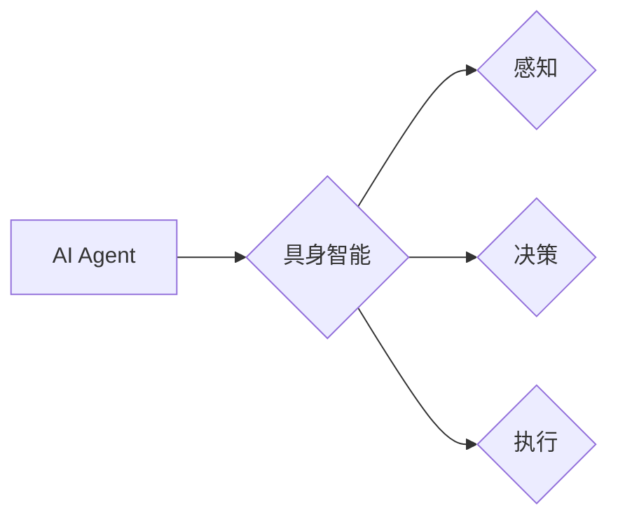

# AI Agent: AI的下一个风口 具身机器人在工业领域的应用

## 1. 背景介绍
### 1.1 问题的由来

随着人工智能技术的快速发展，AI已经渗透到我们生活的方方面面。从智能家居到自动驾驶，从医疗诊断到金融服务，AI技术正在改变着我们的生活方式。然而，在工业领域，AI的应用却相对滞后。这主要是因为工业环境复杂多变，对AI系统的实时性、鲁棒性、安全性等要求极高，而传统的AI技术难以满足这些要求。

### 1.2 研究现状

近年来，具身智能(AI Agent)的概念逐渐受到关注。具身智能是指能够感知环境、自主决策、执行动作的智能体，它结合了认知智能和感知智能，能够更好地适应复杂多变的环境。在工业领域，具身智能的应用有望解决传统AI技术难以克服的难题，推动工业自动化和智能化水平的提升。

### 1.3 研究意义

具身智能在工业领域的应用具有以下重要意义：

- 提高生产效率：通过自动化、智能化操作，减少人工干预，提高生产效率。
- 降低生产成本：减少人力成本，降低生产过程中的浪费。
- 提升产品质量：通过精准控制，提高产品质量，降低次品率。
- 提高安全性：减少人为操作失误，降低安全事故发生率。
- 促进产业升级：推动工业自动化和智能化水平的提升，促进产业升级。

### 1.4 本文结构

本文将从以下方面对具身智能在工业领域的应用进行探讨：

- 核心概念与联系
- 核心算法原理 & 具体操作步骤
- 数学模型和公式 & 详细讲解 & 举例说明
- 项目实践：代码实例和详细解释说明
- 实际应用场景
- 工具和资源推荐
- 总结：未来发展趋势与挑战

## 2. 核心概念与联系

### 2.1  AI Agent

AI Agent是指能够感知环境、自主决策、执行动作的智能体。它通常由以下几部分组成：

- 环境感知：通过传感器获取环境信息，如摄像头、激光雷达、传感器等。
- 状态表示：将环境信息转换为内部表示，如图、向量等。
- 决策控制：根据状态表示和目标，选择合适的动作。
- 动作执行：根据决策控制的结果，执行相应的动作。

### 2.2  具身智能

具身智能是指能够通过与环境交互来学习、适应和解决问题的智能。它强调在物理世界中实现智能体的感知、决策和执行能力。

### 2.3  关系图

AI Agent与具身智能的关系图如下：



从图中可以看出，具身智能是AI Agent在物理世界中的具体实现，它通过感知、决策和执行三个环节与环境交互，实现智能体的自主行为。

## 3. 核心算法原理 & 具体操作步骤
### 3.1  算法原理概述

具身智能在工业领域的应用主要涉及以下算法：

- 环境感知算法：如视觉识别、激光雷达点云处理等。
- 状态表示算法：如图神经网络、向量表示等。
- 决策控制算法：如强化学习、规划等。
- 动作执行算法：如机器人控制、机械臂控制等。

### 3.2  算法步骤详解

以下是一个简单的具身智能在工业领域的应用实例，涉及以下步骤：

1. **环境感知**：通过摄像头、激光雷达等传感器获取工业环境信息。
2. **状态表示**：将环境信息转换为内部表示，如图、向量等。
3. **决策控制**：根据状态表示和目标，使用强化学习等算法选择合适的动作。
4. **动作执行**：根据决策控制的结果，执行相应的动作，如机器人移动、机械臂抓取等。
5. **反馈学习**：根据动作执行的结果，调整模型参数，提高模型性能。

### 3.3  算法优缺点

以下是几种常用算法的优缺点：

- **视觉识别**：优点是通用性强，适用于各种场景；缺点是对光照、角度、遮挡等因素敏感。
- **激光雷达点云处理**：优点是能够获取精确的三维信息，不受光照、角度等因素影响；缺点是数据处理复杂，计算量大。
- **图神经网络**：优点是能够有效地表示复杂关系；缺点是训练过程复杂，参数量大。
- **向量表示**：优点是计算简单，易于处理；缺点是难以表示复杂关系。

### 3.4  算法应用领域

以上算法在工业领域的应用领域包括：

- **机器人控制**：如焊接机器人、装配机器人、搬运机器人等。
- **自动化设备控制**：如流水线自动化设备、数控机床等。
- **工业巡检**：如设备巡检、管道巡检等。

## 4. 数学模型和公式 & 详细讲解 & 举例说明
### 4.1  数学模型构建

以下是一个简单的具身智能数学模型：

- **状态表示**：用状态向量 $s$ 表示环境状态，如传感器数据、机器人位置等。
- **动作空间**：用动作向量 $a$ 表示机器人动作，如移动、抓取等。
- **奖励函数**：用 $R(s,a)$ 表示动作 $a$ 在状态 $s$ 下的奖励值。

### 4.2  公式推导过程

以下是一个简单的强化学习公式：

- **Q值**：$Q(s,a) = \sum_{s'} \gamma R(s,a) + \max_{a'} Q(s',a')$

其中 $\gamma$ 为折扣因子，用于表示未来奖励的重要性。

### 4.3  案例分析与讲解

以下是一个简单的机器人搬运案例：

- **环境**：一个仓库，仓库中有多个箱子，机器人需要将箱子从A位置搬运到B位置。
- **状态**：机器人的位置、目标位置、箱子位置等。
- **动作**：移动、抓取、放下等。
- **奖励函数**：将箱子成功搬运到目标位置的奖励值为正，否则为负。

### 4.4  常见问题解答

**Q1：如何选择合适的算法？**

A：选择合适的算法需要考虑以下因素：

- **任务类型**：不同任务需要不同的算法，如视觉识别需要使用视觉识别算法。
- **环境复杂度**：复杂环境需要更复杂的算法，如激光雷达点云处理。
- **计算资源**：算法的复杂度和计算资源有关，需要根据实际条件选择合适的算法。

**Q2：如何处理数据不足的问题？**

A：数据不足时，可以采用以下方法：

- **数据增强**：通过变换、旋转、缩放等方式扩充数据集。
- **迁移学习**：使用预训练模型，在少量数据上微调模型。
- **主动学习**：选择最有代表性的样本进行标注，提高标注效率。

## 5. 项目实践：代码实例和详细解释说明
### 5.1  开发环境搭建

以下是一个基于Python的机器人搬运案例的开发环境搭建步骤：

1. 安装Python：从Python官网下载并安装Python 3.x版本。
2. 安装PyTorch：使用pip安装PyTorch库，并选择合适的CUDA版本。
3. 安装其他依赖库：安装NumPy、TensorFlow、matplotlib等库。

### 5.2  源代码详细实现

以下是一个简单的机器人搬运案例的代码实现：

```python
import torch
import torch.nn as nn

class RobotEnv(nn.Module):
    def __init__(self):
        super(RobotEnv, self).__init__()
        self.action_space = 4  # 移动、抓取、放下等
        self.observation_space = 9  # 机器人和箱子位置

    def step(self, action):
        # 根据动作执行操作，计算奖励和下一个状态
        # ...

    def reset(self):
        # 重置环境，初始化状态
        # ...

    def render(self):
        # 绘制环境
        # ...

class QNetwork(nn.Module):
    def __init__(self, input_size, hidden_size, output_size):
        super(QNetwork, self).__init__()
        self.fc1 = nn.Linear(input_size, hidden_size)
        self.fc2 = nn.Linear(hidden_size, output_size)

    def forward(self, x):
        x = torch.relu(self.fc1(x))
        x = self.fc2(x)
        return x

# 创建环境、Q网络和优化器
env = RobotEnv()
q_network = QNetwork(env.observation_space, 64, env.action_space)
optimizer = torch.optim.Adam(q_network.parameters(), lr=0.001)

# 训练过程
for episode in range(1000):
    state = env.reset()
    done = False
    while not done:
        action = q_network(state).argmax().item()
        next_state, reward, done, _ = env.step(action)
        optimizer.zero_grad()
        target = reward + 0.99 * torch.max(q_network(next_state))
        loss = F.mse_loss(q_network(state), target.unsqueeze(0))
        loss.backward()
        optimizer.step()
        state = next_state
```

### 5.3  代码解读与分析

以上代码实现了一个简单的机器人搬运案例：

- `RobotEnv`类：定义了环境类，包括状态空间、动作空间、step、reset和render方法。
- `QNetwork`类：定义了Q网络，包括输入层、隐藏层和输出层。
- 训练过程：使用强化学习算法训练Q网络，通过更新Q值来学习最优策略。

### 5.4  运行结果展示

通过训练，Q网络学习到最优策略，机器人能够成功地搬运箱子到目标位置。

## 6. 实际应用场景
### 6.1  机器人搬运

机器人搬运是具身智能在工业领域的典型应用之一。通过使用视觉识别、激光雷达点云处理等技术，机器人能够准确地识别和跟踪物体，并选择合适的动作进行搬运。

### 6.2  自动化设备控制

具身智能可以用于控制自动化设备，如流水线自动化设备、数控机床等。通过感知设备状态和执行动作，实现设备的自动化运行。

### 6.3  工业巡检

具身智能可以用于工业巡检，如设备巡检、管道巡检等。通过视觉识别、激光雷达点云处理等技术，及时发现设备故障和安全隐患。

### 6.4  未来应用展望

随着具身智能技术的不断发展，其在工业领域的应用将更加广泛，如：

- **智能仓库**：实现智能拣选、分拣、配送等功能。
- **智能工厂**：实现生产过程的自动化、智能化管理。
- **智能农业**：实现农业生产过程的自动化、智能化控制。

## 7. 工具和资源推荐
### 7.1  学习资源推荐

以下是一些学习具身智能在工业领域应用的资源：

- **书籍**：《深度学习》、《强化学习》
- **在线课程**：Coursera、Udacity、网易云课堂等平台上的机器学习、深度学习、强化学习等课程
- **论文**：arXiv、NeurIPS、ICML、ACL等会议的论文

### 7.2  开发工具推荐

以下是一些开发具身智能在工业领域应用所需的工具：

- **编程语言**：Python、C++
- **深度学习框架**：PyTorch、TensorFlow
- **机器人控制库**：ROS、URDF
- **仿真平台**：Gazebo、Simulink

### 7.3  相关论文推荐

以下是一些与具身智能在工业领域应用相关的论文：

- **《Deep Reinforcement Learning for Robotic Manipulation》**
- **《Sim-to-real Transfer of Robotic Manipulation with Dynamic Normalization》**
- **《A Survey of Reinforcement Learning for Robotics》**

### 7.4  其他资源推荐

以下是一些其他资源：

- **GitHub**：许多开源项目和代码
- **技术社区**：Stack Overflow、GitHub
- **技术博客**：CSDN、博客园

## 8. 总结：未来发展趋势与挑战
### 8.1  研究成果总结

本文对具身智能在工业领域的应用进行了探讨，介绍了具身智能的核心概念、算法原理、具体操作步骤和实际应用场景。通过分析，我们可以看到，具身智能在工业领域的应用前景广阔，具有巨大的发展潜力。

### 8.2  未来发展趋势

以下是一些具身智能在工业领域的未来发展趋势：

- **多模态感知**：结合视觉、听觉、触觉等多种传感器，实现更全面的环境感知。
- **强化学习**：利用强化学习技术，实现更灵活、高效的决策控制。
- **知识图谱**：将知识图谱与具身智能结合，实现更智能的推理和决策。
- **边缘计算**：将计算任务部署到边缘设备，实现实时、高效的决策控制。

### 8.3  面临的挑战

尽管具身智能在工业领域的应用前景广阔，但仍然面临着以下挑战：

- **数据收集和标注**：需要收集大量的真实工业场景数据，并进行标注。
- **算法复杂度**：一些算法的复杂度较高，需要高性能计算资源。
- **安全性和可靠性**：需要保证系统的安全性和可靠性，避免出现安全事故。
- **成本**：具身智能系统的成本较高，需要降低成本以促进推广应用。

### 8.4  研究展望

为了推动具身智能在工业领域的应用，需要从以下几个方面进行研究和探索：

- **数据收集和标注**：建立大规模、高质量的工业场景数据集，并开发高效的标注工具。
- **算法优化**：研究更高效、更鲁棒的算法，降低计算复杂度。
- **安全性和可靠性**：研究安全性和可靠性保障技术，确保系统的安全性和可靠性。
- **成本降低**：研究低成本、高性能的硬件设备，降低具身智能系统的成本。

相信随着技术的不断发展，具身智能在工业领域的应用将会越来越广泛，为工业自动化和智能化水平的提升做出贡献。

## 9. 附录：常见问题与解答

**Q1：具身智能与工业机器人有什么区别？**

A：具身智能是一种更为广义的概念，它包括工业机器人。工业机器人是具身智能的一种具体实现形式，而具身智能还包括其他与机器人相关的技术，如感知、决策、控制等。

**Q2：如何选择合适的机器人？**

A：选择合适的机器人需要考虑以下因素：

- **应用场景**：不同场景需要不同类型的机器人，如搬运机器人、焊接机器人等。
- **负载能力**：根据搬运或操作的物体重量选择合适的负载能力。
- **精度要求**：根据精度要求选择合适的机器人，如高精度机器人、低速机器人等。
- **环境适应性**：根据环境条件选择合适的机器人，如防水、防尘、防爆等。

**Q3：如何解决机器人碰撞问题？**

A：解决机器人碰撞问题可以采用以下方法：

- **碰撞检测**：在机器人控制系统中加入碰撞检测模块，及时发现潜在碰撞并采取措施。
- **路径规划**：使用路径规划算法，为机器人规划安全的运动路径。
- **紧急停止**：在机器人上设置紧急停止按钮，一旦发生碰撞，可以立即停止机器人的运动。

**Q4：如何保证机器人的安全性？**

A：保证机器人安全性可以采用以下措施：

- **物理安全**：为机器人配备安全防护装置，如安全栅栏、光电传感器等。
- **软件安全**：开发安全的控制系统，防止黑客攻击和误操作。
- **人员培训**：对操作人员进行培训，提高他们的安全意识。

**Q5：如何降低机器人成本？**

A：降低机器人成本可以采用以下方法：

- **模块化设计**：采用模块化设计，降低设计和制造成本。
- **标准化**：采用标准化组件，降低采购成本。
- **开源**：采用开源技术和开源硬件，降低研发成本。

作者：禅与计算机程序设计艺术 / Zen and the Art of Computer Programming