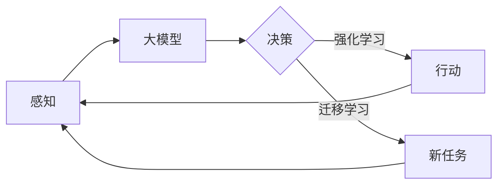

# AI Agent: AI的下一个风口 大模型时代的AI

## 1. 背景介绍

### 1.1 问题的由来

人工智能(Artificial Intelligence，简称AI)自1956年诞生以来，经历了几次起起伏伏的发展历程。近年来，随着深度学习等技术的突破，AI再次进入高速发展期，并开始在众多领域得到广泛应用。然而，传统的AI系统大多是针对特定任务开发的，缺乏通用性和灵活性，难以适应快速变化的现实世界。为了解决这一问题，业界开始探索更加先进的AI范式，AI Agent(智能代理)应运而生。

### 1.2 研究现状 

AI Agent是一种能够自主感知环境、做出决策并采取行动的智能系统，代表了AI技术的新发展方向。目前，国内外学术界和工业界都在积极开展AI Agent相关研究。DeepMind、OpenAI等知名机构相继推出了AlphaGo、GPT-3等具有里程碑意义的Agent系统，展现了AI Agent在复杂任务中的卓越能力。国内的华为、百度、阿里巴巴等科技巨头也纷纷布局AI Agent领域，力图在未来的AI竞争中抢占先机。

### 1.3 研究意义

AI Agent代表了AI进化的新阶段，有望突破传统AI的局限性，实现更加通用、灵活、高效的智能。深入研究AI Agent，对于推动AI从感知智能走向认知智能、从专用智能走向通用智能具有重要意义。同时，AI Agent在智能助理、无人驾驶、智慧城市等诸多领域都有广阔的应用前景，有望催生新的产业形态，为经济社会发展注入新动力。

### 1.4 本文结构

本文将围绕AI Agent展开深入探讨。首先，介绍AI Agent的核心概念及其与传统AI的联系和区别。然后，重点阐述AI Agent的关键技术，包括大模型、强化学习、迁移学习等，并给出详细的算法原理和数学模型。接着，通过代码实例和项目实践，演示如何构建AI Agent系统。最后，分析AI Agent的应用场景和未来趋势，并提出AI Agent研究面临的挑战和发展方向。

## 2. 核心概念与联系

AI Agent是一种能够感知环境状态，根据目标自主做出决策并采取行动的智能系统。与传统的AI系统相比，AI Agent具有更强的自主性、适应性和通用性。传统AI往往是针对特定任务设计开发的，采用预定义的规则或模型，只能在指定范围内工作。而AI Agent能够在动态变化的开放环境中持续学习和进化，根据不断积累的知识和经验，自主应对各种复杂任务。

从技术架构看，AI Agent融合了多种前沿AI技术，包括大模型、强化学习、迁移学习等。其中，大模型是AI Agent的核心，负责知识表示、存储、推理等关键能力。大模型经过海量数据的预训练，能够建立起庞大的知识图谱，具备广泛的常识性知识和语言理解能力。在此基础上，AI Agent可以利用强化学习，在与环境的交互中不断优化策略，提升决策能力。同时，AI Agent还可以通过迁移学习，将已有知识迁移到新任务中，实现快速适应。

下图展示了AI Agent的技术架构和工作流程：

可以看出，AI Agent通过感知、决策、行动三个环节与环境进行持续交互，并利用大模型、强化学习、迁移学习等技术不断优化和进化，以适应开放环境中的各种任务需求。这种端到端的闭环学习范式，使得AI Agent能够在复杂多变的现实世界中展现出色的智能。

## 3. 核心算法原理 & 具体操作步骤

### 3.1 算法原理概述

AI Agent的核心算法主要包括大模型、强化学习和迁移学习三大类。

大模型是AI Agent的基石，负责知识表示和存储。当前主流的大模型以Transformer为基础架构，采用自注意力机制和前馈神经网络，通过海量数据的预训练建立起庞大的语义网络。预训练阶段通常采用自监督学习，让模型在大规模无标注语料上学习通用语言知识。GPT、BERT、T5等都是代表性的大模型。

强化学习使AI Agent具备自主决策能力。Agent通过与环境的交互，在获得奖励或惩罚的反馈中学习优化策略。深度强化学习将深度神经网络引入强化学习，以端到端的方式直接从高维观测数据中学习最优策略。DQN、DDPG、PPO等是常用的深度强化学习算法。

迁移学习赋予AI Agent快速适应新任务的能力。它利用已学习的知识，在新任务上实现少样本或零样本学习。常见的迁移学习方法有微调、元学习、对比学习等。微调在预训练模型的基础上，用新任务的少量数据重新训练部分网络层。元学习通过两级优化，学习一个适应不同任务的通用优化器。对比学习利用数据间的相似性，学习一个任务无关的特征提取器。

### 3.2 算法步骤详解

以下详细介绍几种典型算法的关键步骤。

1. **GPT预训练**

GPT(Generative Pre-trained Transformer)是一种基于Transformer的语言模型，通过自监督预训练掌握海量语言知识。其预训练步骤如下：

(1) 数据准备：收集大规模无标注文本语料，进行清洗、分词等预处理。  
(2) 模型构建：搭建Transformer编码器结构，设置模型参数如层数、隐藏层维度等。  
(3) 目标函数：采用语言建模目标，最大化下一个词的概率。损失函数为交叉熵损失。
$$L(θ)=−\sum_{i}logP(w_i|w_{<i};θ)$$
其中$w_i$为目标词，$w_{<i}$为上文，$θ$为模型参数。

(4) 训练优化：使用Adam优化器，对损失函数进行梯度下降优化，更新模型参数。
$$θ←θ−η\nabla_{θ}L(θ)$$
$η$为学习率，$\nabla_{θ}L(θ)$为损失函数对参数的梯度。

2. **DQN强化学习**

DQN(Deep Q Network)将深度学习与Q学习相结合，实现端到端的策略学习。其主要步骤包括：

(1) 状态表示：将环境观测编码为神经网络的输入状态。  
(2) Q网络：搭建评估网络(Q网络)和目标网络(Q'网络)，输入状态输出每个动作的Q值。  
(3) 经验回放：构建经验回放池，存储状态转移样本$(s,a,r,s')$。  
(4) 贪婪策略：根据Q值选择动作，以$ε$的概率随机探索，$1-ε$的概率选择Q值最大的动作。  
(5) 网络更新：从经验回放池采样小批量数据，计算TD误差并更新评估网络。
$$L(θ_Q)=\mathbb{E}_{(s,a,r,s')}[(r+γ\max_{a'}Q'(s',a';θ_{Q'})-Q(s,a;θ_Q))^2]$$
$θ_Q$为评估网络参数，$θ_{Q'}$为目标网络参数，$γ$为折扣因子。

(6) 目标网络同步：每隔一定步数将评估网络参数复制给目标网络。

3. **MAML元学习**

MAML(Model-Agnostic Meta-Learning)是一种基于优化的元学习方法，学习一个适应不同任务的初始化参数。算法步骤如下：

(1) 任务采样：从任务分布中采样一批小样本任务$\{T_i\}$。  
(2) 任务内更新：对每个任务$T_i$，计算损失函数并进行梯度下降，得到任务专属参数$θ_i'$。
$$θ_i'=θ−α\nabla_{θ}L_{T_i}(f_{θ})$$
$α$为内循环学习率，$L_{T_i}$为任务$T_i$的损失函数，$f_{θ}$为参数为$θ$的模型。

(3) 任务间更新：在任务专属参数$θ_i'$上，计算每个任务的损失函数，并对所有任务求平均，得到元目标函数。
$$L(θ)=\sum_{T_i}\mathcal{L}_{T_i}(f_{θ_i'})$$
然后对元目标函数进行梯度下降，更新初始参数$θ$。
$$θ←θ−β\nabla_{θ}L(θ)$$
$β$为外循环学习率。

(4) 测试阶段：对新任务，用学习到的初始参数$θ$进行少次梯度下降即可快速适应。

### 3.3 算法优缺点

1. 大模型

优点：
- 通过预训练掌握广泛的语言知识，具备强大的语义理解和生成能力
- 可以应用于各种自然语言处理任务，展现出良好的迁移性

缺点：
- 训练需要海量数据和算力，成本高昂  
- 模型参数量巨大，推理效率较低
- 可解释性不足，容易产生偏见和伦理风险

2. 强化学习

优点：
- 通过环境交互学习，不需要人工标注数据
- 能够在复杂环境中学习到最优策略
- 具备探索和利用的平衡能力，可以发现创新策略

缺点：
- 样本效率低，需要大量的环境交互
- 对奖励函数设计敏感，容易陷入次优策略
- 难以适应非平稳环境，泛化能力有限

3. 迁移学习

优点：
- 利用已学知识，减少新任务所需数据和训练量  
- 通过知识迁移，实现Few-shot甚至Zero-shot学习
- 提高模型的泛化和适应能力

缺点：
- 任务相似性假设并不总是成立，负迁移问题难以避免
- 缺乏理论指导，如何度量和利用任务相关性仍是难题
- 现有方法多是针对特定场景，通用的迁移学习框架尚未成熟

### 3.4 算法应用领域

大模型、强化学习、迁移学习等AI Agent核心算法已在多个领域得到应用，展现出广阔的应用前景。

大模型在智能问答、机器翻译、文本摘要、信息抽取等自然语言处理任务上取得了突破性进展。例如，GPT-3能够根据简单的指令生成连贯的长文本，在应用层面实现了"自然语言编程"。

强化学习在智能游戏、无人驾驶、机器人控制等领域大放异彩。以AlphaGo为代表的强化学习系统，在围棋、星际争霸、Dota2等复杂博弈中击败人类高手，刷新了AI的认知。

迁移学习在计算机视觉、语音识别、推荐系统等方向得到广泛应用。预训练模型+微调的范式已成为业界标配，极大降低了模型开发门槛。元学习、对比学习等新兴迁移学习方法，进一步提升了模型的泛化和适应能力。

此外，大模型、强化学习、迁移学习的结合，催生出更加强大的AI Agent范式。以GPT-3、Megatron、PALM等为代表的大语言模型，融合了大规模预训练、多任务学习、强化学习等技术，展现出接近人类的语言理解和执行能力，有望成为未来AI Agent的主流范式。

## 4. 数学模型和公式 & 详细讲解 & 举例说明

### 4.1 数学模型构建

AI Agent涉及的数学模型主要包括Transformer、MDP、优化理论等。

1. **Transformer**

Transformer是大模型的主流架构，基于自注意力机制和前馈神经网络。其核心是将输入序列$X=(x_1,…,x_n)$通过自注意力层和前馈层进行变换，得到输出表示$Z=(z_1,…,z_n)$。

自注